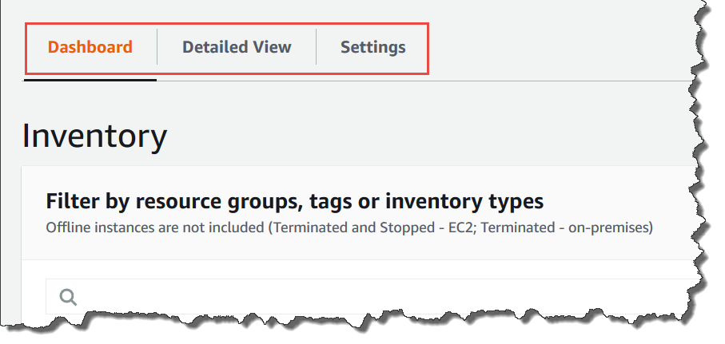

• AWS Systems Manager Change Manager is no longer open to new customers. Existing customers can continue to use the service as normal. For more information, see
[AWS Systems Manager Change Manager availability change](change-manager-availability-change.md "change-manager-availability-change.md").

 

• The AWS Systems Manager CloudWatch Dashboard will no longer be available after April 30, 2026. Customers can continue to use Amazon CloudWatch console to view, create, and manage their Amazon CloudWatch dashboards, just as they do today. For more information, see
[Amazon CloudWatch Dashboard documentation](../../../AmazonCloudWatch/latest/monitoring/CloudWatch_Dashboards.md "../../../AmazonCloudWatch/latest/monitoring/CloudWatch_Dashboards.md").

# Troubleshooting problems with Systems Manager

Inventory

This topic includes information about how to troubleshoot common errors or problems
with AWS Systems Manager Inventory. If you're having trouble viewing your nodes in Systems Manager, see
[Troubleshooting managed
node availability](fleet-manager-troubleshooting-managed-nodes.md "fleet-manager-troubleshooting-managed-nodes.md").

###### Topics

- [Multiple apply
  all associations with document 'AWS-GatherSoftwareInventory' are
  not supported](#systems-manager-inventory-troubleshooting-multiple "#systems-manager-inventory-troubleshooting-multiple")
- [Inventory execution status never
  exits pending](#inventory-troubleshooting-pending "#inventory-troubleshooting-pending")
- [The
  AWS-ListWindowsInventory document fails to run](#inventory-troubleshooting-ListWindowsInventory "#inventory-troubleshooting-ListWindowsInventory")
- [Console doesn't display Inventory
  Dashboard | Detailed View | Settings tabs](#inventory-troubleshooting-tabs "#inventory-troubleshooting-tabs")
- [UnsupportedAgent](#inventory-troubleshooting-unsupported-agent "#inventory-troubleshooting-unsupported-agent")
- [Skipped](#inventory-troubleshooting-skipped "#inventory-troubleshooting-skipped")
- [Failed](#inventory-troubleshooting-failed "#inventory-troubleshooting-failed")
- [Inventory compliance
  failed for an Amazon EC2 instance](#inventory-troubleshooting-ec2-compliance "#inventory-troubleshooting-ec2-compliance")
- [S3 bucket object
  contains old data](#systems-manager-inventory-troubleshooting-s3 "#systems-manager-inventory-troubleshooting-s3")

## Multiple apply

all associations with document '`AWS-GatherSoftwareInventory`' are
not supported

An error that `Multiple apply all associations with document
 'AWS-GatherSoftwareInventory' are not supported` means that one or more
AWS Regions where you're trying to configure an Inventory association
_for all nodes_ are already configured with an inventory
association for all nodes. If necessary, you can delete the existing inventory
association for all nodes and then create a new one. To view existing inventory
associations, choose **State Manager** in the Systems Manager console and then
locate associations that use the `AWS-GatherSoftwareInventory` SSM
document. If the existing inventory association for all nodes was created across
multiple Regions, and you want to create a new one, you must delete the existing
association from each Region where it exists.

## Inventory execution status never

exits pending

There are two reasons why inventory collection never exits the
`Pending` status:

- No nodes in the selected AWS Region:

If you create a global inventory association by using Systems Manager Quick Setup, the
status of the inventory association
(`AWS-GatherSoftwareInventory` document) shows
`Pending` if there are no nodes available in the selected
Region.

- Insufficient permissions:

An inventory association shows `Pending` if one or more nodes
don't have permission to run Systems Manager Inventory. Verify that the AWS Identity and Access Management
(IAM) instance profile includes the
**AmazonSSMManagedInstanceCore** managed policy. For
information about how to add this policy to an instance profile, see [Alternative configuration for EC2
instance permissions](setup-instance-permissions.md#instance-profile-add-permissions "setup-instance-permissions.md#instance-profile-add-permissions").

At a minimum, the instance profile must have the following IAM
permissions.

JSON

```
`{
 "Version":"2012-10-17",
 "Statement": [
 {
 "Effect": "Allow",
 "Action": [
 "ssm:DescribeAssociation",
 "ssm:ListAssociations",
 "ssm:ListInstanceAssociations",
 "ssm:PutInventory",
 "ssm:PutComplianceItems",
 "ssm:UpdateAssociationStatus",
 "ssm:UpdateInstanceAssociationStatus",
 "ssm:UpdateInstanceInformation",
 "ssm:GetDocument",
 "ssm:DescribeDocument"
 ],
 "Resource": "*"
 }
 ]
}`

```

## The

`AWS-ListWindowsInventory` document fails to run

The `AWS-ListWindowsInventory` document is deprecated. Don't use this
document to collect inventory. Instead, use one of the processes described in [Configuring inventory collection](inventory-collection.md "inventory-collection.md").

## Console doesn't display Inventory

Dashboard | Detailed View | Settings tabs

The Inventory **Detailed View** page is only available in
AWS Regions that offer Amazon Athena. If the following tabs aren't displayed on the
Inventory page, it means Athena isn't available in the Region and you can't use the
**Detailed View** to query data.



## UnsupportedAgent

If the detailed status of an inventory association shows
**UnsupportedAgent**, and the **Association
status** shows **Failed**, then the version of
AWS Systems Manager SSM Agent on the managed node isn't correct. To create a global inventory
association (to inventory all nodes in your AWS account) for example, you must use
SSM Agent version 2.0.790.0 or later. You can view the agent version running on each
of your nodes on the **Managed Instances** page in the
**Agent version** column. For information about how to update
SSM Agent on your nodes, see [Updating the SSM Agent using
Run Command](run-command-tutorial-update-software.md#rc-console-agentexample "run-command-tutorial-update-software.md#rc-console-agentexample").

## Skipped

If the status of the inventory association for a node shows **Skipped**, this means that a higher-priority inventory association is
already running on that node. Systems Manager follows a specific priority order when multiple
inventory associations could apply to the same managed node.

### Inventory association

priority order

Systems Manager applies inventory associations in the following priority order:

1. **Quick Setup inventory associations** -
   Associations created using Quick Setup and the unified console. These
   associations have names that start with
   `AWS-QuickSetup-SSM-CollectInventory-` and target
   all managed nodes.
2. **Explicit inventory associations** -
   Associations that target specific managed nodes using:
   - Instance IDs
   - Tag key-value pairs
   - AWS resource groups

3. **Global inventory associations** -
   Associations that target all managed nodes (using `--targets
"Key=InstanceIds,Values=*"`) but were **not** created through Quick Setup.

### Common scenarios

**Scenario 1: Quick Setup association overrides explicit
association**

- You have a Quick Setup inventory association targeting all
  instances
- You create a manual association targeting specific managed nodes by
  tag
- Result: The manual association shows `Skipped` with
  detailed status
  `OverriddenByExplicitInventoryAssociation`
- The Quick Setup association continues to collect inventory from all
  instances

**Scenario 2: Explicit association overrides global
association**

- You have a global inventory association targeting all instances (not
  created by Quick Setup)
- You create an association targeting specific instances
- Result: The global association shows `Skipped` for the
  specifically targeted instances
- The explicit association runs on the targeted instances

### Resolution steps

**If you want to use your own inventory association
instead of Quick Setup:**

1. **Identify Quick Setup associations**: In
   the Systems Manager console, go to State Manager and look for associations with names
   starting with `AWS-QuickSetup-SSM-CollectInventory-`.
2. **Remove Quick Setup configuration**:
   - Go to Quick Setup in the Systems Manager console.
   - Find your inventory collection configuration.
   - Delete the Quick Setup configuration (this removes the associated
     inventory association).

   ###### Note

   You don't need to manually delete the association created
   by Quick Setup.

3. **Verify your association runs**: After
   removing the Quick Setup configuration, your explicit inventory association
   should start running successfully.

**If you want to modify existing
behavior:**

- To view all existing inventory associations, choose
  **State Manager** in the Systems Manager console and locate
  associations that use the
  `AWS-GatherSoftwareInventory` SSM
  document.
- Remember that each managed node can only have one active inventory
  association at a time.

###### Important

- Inventory data is still collected from skipped nodes when their
  assigned (higher-priority) inventory association runs.
- Quick Setup inventory associations take precedence over all other types,
  even those with explicit targeting.
- The detailed status message
  `OverriddenByExplicitInventoryAssociation` appears when
  any association is overridden by a higher-priority one, regardless of
  the association type.

## Failed

If the status of the inventory association for a node shows
**Failed**, this could mean that the node has multiple
inventory associations assigned to it. A node can only have one inventory
association assigned at a time. An inventory association uses the
`AWS-GatherSoftwareInventory` AWS Systems Manager document (SSM document).
You can run the following command by using the AWS Command Line Interface (AWS CLI) to view a list of
associations for a node.

```
aws ssm describe-instance-associations-status --instance-id `instance-ID`
```

## Inventory compliance

failed for an Amazon EC2 instance

Inventory compliance for an Amazon Elastic Compute Cloud (Amazon EC2) instance can fail if you assign
multiple inventory associations to the instance.

To resolve this issue, delete one or more inventory associations assigned to the
instance. For more information, see [Deleting an association](systems-manager-state-manager-delete-association.md "systems-manager-state-manager-delete-association.md").

###### Note

Be aware of the following behavior if you create multiple inventory associations for a
managed node:

- Each node can be assigned an inventory association that targets
  _all_ nodes (--targets
  "Key=InstanceIds,Values=\*").
- Each node can also be assigned a specific association that uses either tag
  key-value pairs or an AWS resource group.
- If a node is assigned multiple inventory associations, the status shows
  _Skipped_ for the association that hasn't run. The
  association that ran most recently displays the actual status of the inventory
  association.
- If a node is assigned multiple inventory associations and each uses a tag
  key-value pair, then those inventory associations fail to run on the node
  because of the tag conflict. The association still runs on nodes that don't
  have the tag key-value conflict.

## S3 bucket object

contains old data

Data inside the Amazon S3 bucket object is updated when the inventory association is
successful and new data is discovered. The Amazon S3 bucket object is updated for each
node when the association runs and fails, but the data inside the object is not
updated in this case. Data inside the Amazon S3 bucket object will update only when the
association runs successfully. When the inventory association fails, you will see
old data in the Amazon S3 bucket object.
