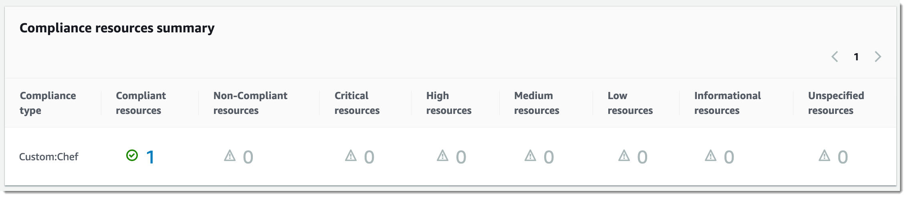
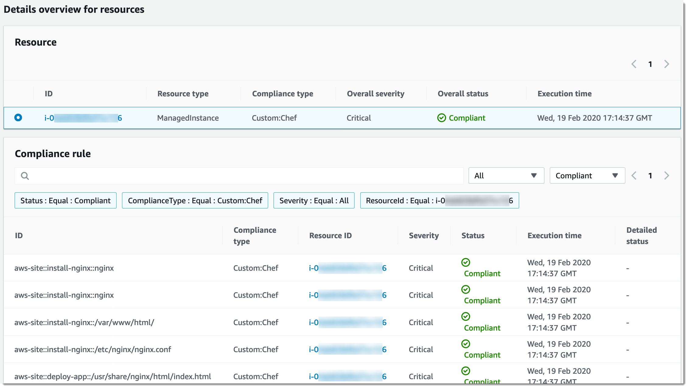

# Creating associations that run

Chef recipes

You can create State Manager associations that run Chef recipes by using the
`AWS-ApplyChefRecipes` SSM document. State Manager is a tool in AWS Systems Manager.
You can target Linux-based Systems Manager managed nodes with the
`AWS-ApplyChefRecipes` SSM document. This document offers the following
benefits for running Chef recipes:

- Supports multiple releases of Chef (Chef 11
  through Chef 18).
- Automatically installs the Chef client software on target
  nodes.
- Optionally runs [Systems Manager compliance
  checks](systems-manager-compliance.md "systems-manager-compliance.md") on target nodes, and stores the results of compliance checks
  in an Amazon Simple Storage Service (Amazon S3) bucket.
- Runs multiple cookbooks and recipes in a single run of the document.
- Optionally runs recipes in `why-run` mode, to show which recipes
  change on target nodes without making changes.
- Optionally applies custom JSON attributes to `chef-client`
  runs.
- Optionally applies custom JSON attributes from a source file that is stored at
  a location that you specify.
  You can use [Git](#state-manager-chef-git "#state-manager-chef-git"), [GitHub](#state-manager-chef-github "#state-manager-chef-github"), [HTTP](#state-manager-chef-http "#state-manager-chef-http"), or [Amazon S3](#state-manager-chef-s3 "#state-manager-chef-s3") buckets as download sources for
  Chef cookbooks and recipes that you specify in an
  `AWS-ApplyChefRecipes` document.

###### Note

Associations that run Chef recipes aren't supported on
macOS.

## Getting started

Before you create an `AWS-ApplyChefRecipes` document, prepare your
Chef cookbooks and cookbook repository. If you don't already have
a Chef cookbook that you want to use, you can get started by using a
test `HelloWorld` cookbook that AWS has prepared for you. The
`AWS-ApplyChefRecipes` document already points to this cookbook by
default. Your cookbooks should be set up similarly to the following directory
structure. In the following example, `jenkins` and `nginx` are
examples of Chef cookbooks that are available in the [Chef Supermarket](https://supermarket.chef.io/ "https://supermarket.chef.io/") on
the Chef website.

Though AWS can't officially support cookbooks on the [Chef Supermarket](https://supermarket.chef.io/ "https://supermarket.chef.io/")
website, many of them work with the `AWS-ApplyChefRecipes` document. The
following are examples of criteria to determine when you're testing a community
cookbook:

- The cookbook should support the Linux-based operating systems of the Systems Manager
  managed nodes that you're targeting.
- The cookbook should be valid for the Chef client version
  (Chef 11 through Chef 18) that you
  use.
- The cookbook is compatible with Chef Infra Client, and,
  doesn't require a Chef server.

Verify that you can reach the `Chef.io` website, so that any
cookbooks you specify in your run list can be installed when the Systems Manager document
(SSM document) runs. Using a nested `cookbooks` folder is supported,
but not required; you can store cookbooks directly under the root level.

```
<Top-level directory, or the top level of the archive file (ZIP or tgz or tar.gz)>
    └── cookbooks (optional level)
        ├── jenkins
        │   ├── metadata.rb
        │   └── recipes
        └── nginx
            ├── metadata.rb
            └── recipes
```

###### Important

Before you create a State Manager association that runs Chef
recipes, be aware that the document run installs the Chef client
software on your Systems Manager managed nodes, unless you set the value of
**Chef client version** to
`None`. This operation uses an installation script from
Chef to install Chef components on your
behalf. Before you run an `AWS-ApplyChefRecipes` document, be sure
your enterprise can comply with any applicable legal requirements, including
license terms applicable to the use of Chef software. For more
information, see the [Chef
website](https://www.chef.io/ "https://www.chef.io/").

Systems Manager can deliver compliance reports to an S3 bucket, the Systems Manager console, or make
compliance results available in response to Systems Manager API commands. To run Systems Manager
compliance reports, the instance profile attached to Systems Manager managed nodes must have
permissions to write to the S3 bucket. The instance profile must have permissions to
use the Systems Manager `PutComplianceItem` API. For more information about Systems Manager
compliance, see [AWS Systems Manager Compliance](systems-manager-compliance.md "systems-manager-compliance.md").

### Logging the document run

When you run a Systems Manager document (SSM document) by using a State Manager
association, you can configure the association to choose the output of the
document run, and you can send the output to Amazon S3 or Amazon CloudWatch Logs (CloudWatch Logs). To help
ease troubleshooting when an association has finished running, verify that the
association is configured to write command output to either an Amazon S3 bucket or
CloudWatch Logs. For more information, see [Working with associations in Systems Manager](state-manager-associations.md "state-manager-associations.md").

## Applying JSON attributes to targets

when running a recipe

You can specify JSON attributes for your Chef client to apply to
target nodes during an association run. When setting up the association, you can
provide raw JSON or provide the path to a JSON file stored in Amazon S3.

Use JSON attributes when you want to customize how the recipe is run without
having to modify the recipe itself, for example:

- **Overriding a small number of
  attributes**

Use custom JSON to avoid having to maintain multiple versions of a recipe
to accommodate minor differences.

- **Providing variable values**

Use custom JSON to specify values that may change from run-to-run. For
example, if your Chef cookbooks configure a third-party
application that accepts payments, you might use custom JSON to specify the
payment endpoint URL.

**Specifying attributes in raw JSON**

The following is an example of the format you can use to specify custom JSON
attributes for your Chef recipe.

```
{"filepath":"`/tmp/example.txt`", "content":"`Hello, World!`"}
```

###### Specifying a path to a JSON file

The following is an example of the format you can use to specify the path to
custom JSON attributes for your Chef recipe.

```
{"sourceType":"s3", "sourceInfo":"`someS3URL1`"}, {"sourceType":"s3", "sourceInfo":"`someS3URL2`"}
```

## Use Git as a cookbook source

The `AWS-ApplyChefRecipes` document uses the [aws:downloadContent](documents-command-ssm-plugin-reference.md#aws-downloadContent "documents-command-ssm-plugin-reference.md#aws-downloadContent") plugin to download
Chef cookbooks. To download content from Git, specify information
about your Git repository in JSON format as in the following example. Replace each
`example-resource-placeholder` with your own
information.

```
{
   "repository":"`GitCookbookRepository`",
   "privateSSHKey":"{{ssm-secure:`ssh-key-secure-string-parameter`}}",
   "skipHostKeyChecking":"`false`",
   "getOptions":"branch:refs/head/`main`",
   "username":"{{ssm-secure:`username-secure-string-parameter`}}",
   "password":"{{ssm-secure:`password-secure-string-parameter`}}"
}
```

## Use GitHub as a cookbook

source

The `AWS-ApplyChefRecipes` document uses the [aws:downloadContent](documents-command-ssm-plugin-reference.md#aws-downloadContent "documents-command-ssm-plugin-reference.md#aws-downloadContent") plugin to download
cookbooks. To download content from GitHub, specify information about
your GitHub repository in JSON format as in the following example.
Replace each `example-resource-placeholder` with your own
information.

```
{
   "owner":"`TestUser`",
   "repository":"`GitHubCookbookRepository`",
   "path":"`cookbooks/HelloWorld`",
   "getOptions":"branch:refs/head/`main`",
   "tokenInfo":"{{ssm-secure:`token-secure-string-parameter`}}"
}
```

## Use HTTP as a cookbook source

You can store Chef cookbooks at a custom HTTP location as either a
single `.zip` or `tar.gz` file, or a directory
structure. To download content from HTTP, specify the path to the file or directory
in JSON format as in the following example. Replace each
`example-resource-placeholder` with your own
information.

```
{
   "url":"https:`//my.website.com/chef-cookbooks/HelloWorld.zip`",
   "allowInsecureDownload":"false",
   "authMethod":"Basic",
   "username":"{{ssm-secure:`username-secure-string-parameter`}}",
   "password":"{{ssm-secure:`password-secure-string-parameter`}}"
}
```

## Use Amazon S3 as a cookbook source

You can also store and download Chef cookbooks in Amazon S3 as either a
single `.zip` or `tar.gz` file, or a directory
structure. To download content from Amazon S3, specify the path to the file in JSON
format as in the following examples. Replace each
`example-resource-placeholder` with your own
information.

**Example 1: Download a specific cookbook**

```
{
   "path":"https://s3.amazonaws.com/`chef-cookbooks/HelloWorld.zip`"
}
```

**Example 2: Download the contents of a
directory**

```
{
   "path":"https://s3.amazonaws.com/`chef-cookbooks-test/HelloWorld`"
}
```

###### Important

If you specify Amazon S3, the AWS Identity and Access Management (IAM) instance profile on your managed
nodes must be configured with the `AmazonS3ReadOnlyAccess` policy.
For more information, see [Configure instance permissions required for Systems Manager](setup-instance-permissions.md "setup-instance-permissions.md").

## Create an association that runs

Chef recipes (console)

The following procedure describes how to use the Systems Manager console to create a
State Manager association that runs Chef cookbooks by using the
`AWS-ApplyChefRecipes` document.

1. Open the AWS Systems Manager console at [https://console.aws.amazon.com/systems-manager/](https://console.aws.amazon.com/systems-manager/ "https://console.aws.amazon.com/systems-manager/").
2. In the navigation pane, choose **State Manager**.
3. Choose **State Manager**, and then choose **Create
   association**.
4. For **Name**, enter a name that helps you remember the
   purpose of the association.
5. In the **Document** list, choose
   **`AWS-ApplyChefRecipes`**.
6. In **Parameters**, for **Source Type**,
   select either **Git**,
   **GitHub**, **HTTP**, or **S3**.
7. For **Source info**, enter cookbook source information
   using the appropriate format for the **Source
   Type** that you selected in step 6. For more information, see
   the following topics:
   - [Use Git as a cookbook source](#state-manager-chef-git "#state-manager-chef-git")
   - [Use GitHub as a cookbook
     source](#state-manager-chef-github "#state-manager-chef-github")
   - [Use HTTP as a cookbook source](#state-manager-chef-http "#state-manager-chef-http")
   - [Use Amazon S3 as a cookbook source](#state-manager-chef-s3 "#state-manager-chef-s3")

8. In **Run list**, list the recipes that you want to run in
   the following format, separating each recipe with a comma as shown. Don't
   include a space after the comma. Replace each
   `example-resource-placeholder` with your own
   information.

```
recipe[`cookbook-name1`::`recipe-name`],recipe[`cookbook-name2`::`recipe-name`]
```

9. (Optional) Specify custom JSON attributes that you want the
   Chef client to pass to your target nodes.
   1. In **JSON attributes content**, add any
      attributes that you want the Chef client to pass to
      your target nodes.
   2. In **JSON attributes sources**, add the paths to
      any attributes that you want the Chef client to pass
      to your target nodes.For more information, see [Applying JSON attributes to targets
      when running a recipe](#apply-custom-json-attributes "#apply-custom-json-attributes").

10. For **Chef client version**, specify a
    Chef version. Valid values are `11` through
    `18`, or `None`. If you specify a number between
    `11`
    `18` (inclusive), Systems Manager installs the correct Chef
    client version on your target nodes. If you specify `None`, Systems Manager
    doesn't install the Chef client on target nodes before
    running the document's recipes.
11. (Optional) For **Chef client arguments**,
    specify additional arguments that are supported for the version of
    Chef you're using. To learn more about supported
    arguments, run `chef-client -h` on a node that is running the
    Chef client.
12. (Optional) Turn on **Why-run** to show changes made to
    target nodes if the recipes are run, without actually changing target
    nodes.
13. For **Compliance severity**, choose the severity of Systems Manager
    Compliance results that you want reported. Compliance reporting indicates
    whether the association state is compliant or noncompliant, along with the
    severity level you specify. Compliance reports are stored in an S3 bucket
    that you specify as the value of the **Compliance report
    bucket** parameter (step 14). For more information about
    Compliance, see [Learn details about Compliance](compliance-about.md "compliance-about.md") in this guide.

Compliance scans measure drift between configuration that is specified in
your Chef recipes and node resources. Valid values are
`Critical`, `High`, `Medium`,
`Low`, `Informational`, `Unspecified`,
or `None`. To skip compliance reporting, choose
`None`. 14. For **Compliance type**, specify the compliance type for
which you want results reported. Valid values are `Association`
for State Manager associations, or
`Custom:``custom-type`. The default
value is `Custom:Chef`. 15. For **Compliance report bucket**, enter the name of an S3
bucket in which to store information about every Chef run
performed by this document, including resource configuration and Compliance
results. 16. In **Rate control**, configure options to run State Manager
associations across a fleet of managed nodes. For information about using
rate controls, see [Understanding targets and rate controls in State Manager associations](systems-manager-state-manager-targets-and-rate-controls.md "systems-manager-state-manager-targets-and-rate-controls.md").

In **Concurrency**, choose an option:

    * Choose **targets** to enter an absolute number of
     targets that can run the association simultaneously.
    * Choose **percentage** to enter a percentage of
     the target set that can run the association simultaneously.

In **Error threshold**, choose an option:

    * Choose **errors** to enter an absolute number of
     errors that are allowed before State Manager stops running associations
     on additional targets.
    * Choose **percentage** to enter a percentage of
     errors that are allowed before State Manager stops running associations
     on additional targets.

17. (Optional) For **Output options**, to save the command output to a file,
    select the **Enable writing output to S3** box. Enter the bucket and prefix
    (folder) names in the boxes.

###### Note

The S3 permissions that grant the ability to write the data to an S3 bucket are those
of the instance profile assigned to the managed node, not those of the IAM user
performing this task. For more information, see [Configure instance permissions required for Systems Manager](setup-instance-permissions.md "setup-instance-permissions.md")
or [Create an IAM service role for a
hybrid environment](hybrid-multicloud-service-role.md "hybrid-multicloud-service-role.md"). In addition, if the specified S3 bucket is in a different
AWS account, verify that the instance profile or IAM service role associated with
the managed node has the necessary permissions to write to that bucket. 18. Choose **Create Association**.

## Create an association that runs

Chef recipes (CLI)

The following procedure describes how to use the AWS Command Line Interface (AWS CLI) to create a
State Manager association that runs Chef cookbooks by using the
`AWS-ApplyChefRecipes` document.

1. Install and configure the AWS Command Line Interface (AWS CLI), if you haven't already.

For information, see [Installing or updating the
latest version of the AWS CLI](../../../cli/latest/userguide/getting-started-install.md "../../../cli/latest/userguide/getting-started-install.md"). 2. Run one of the following commands to create an association that runs
Chef cookbooks on target nodes that have the specified
tags. Use the command that is appropriate for your cookbook source type and
operating system. Replace each
`example-resource-placeholder` with your own
information.

    1. **Git source**


    Linux & macOS

    ```
    aws ssm create-association --name "AWS-ApplyChefRecipes" \
        --targets Key=tag:`TagKey`,Values=`TagValue` \
        --parameters '{"SourceType":["Git"],"SourceInfo":["{\"repository\":\"`repository-name`\", \"getOptions\": \"branch:`branch-name`\", \"username\": \"{{ ssm-secure:`username-secure-string-parameter` }}\", \"password\": \"{{ ssm-secure:`password-secure-string-parameter` }}\"}"], "RunList":["{\"recipe[`cookbook-name-1`::`recipe-name`]\", \"recipe[`cookbook-name-2`::`recipe-name`]\"}"], "JsonAttributesContent": ["{`custom-json-content`}"], "JsonAttributesSources": "{\"sourceType\":\"s3\", \"sourceInfo\":\"`s3-bucket-endpoint-1`\"}, {\"sourceType\":\"s3\", \"sourceInfo\":\"`s3-bucket-endpoint-2`\"}", "ChefClientVersion": ["`version-number`"], "ChefClientArguments":["{`chef-client-arguments`}"], "WhyRun": `boolean`, "ComplianceSeverity": ["`severity-value`"], "ComplianceType": ["Custom:Chef"], "ComplianceReportBucket": ["`s3-bucket-name`"]}' \
        --association-name "`name`" \
        --schedule-expression "`cron-or-rate-expression`"
    ```


    Windows

    ```
    aws ssm create-association --name "AWS-ApplyChefRecipes" ^
        --targets Key=tag:`TagKey`,Values=`TagValue` ^
        --parameters '{"SourceType":["Git"],"SourceInfo":["{\"repository\":\"`repository-name`\", \"getOptions\": \"branch:`branch-name`\", \"username\": \"{{ ssm-secure:`username-secure-string-parameter` }}\", \"password\": \"{{ ssm-secure:`password-secure-string-parameter` }}\"}"], "RunList":["{\"recipe[`cookbook-name-1`::`recipe-name`]\", \"recipe[`cookbook-name-2`::`recipe-name`]\"}"], "JsonAttributesContent": ["{`custom-json`}"], "JsonAttributesSources": "{\"sourceType\":\"s3\", \"sourceInfo\":\"`s3-bucket-endpoint-1`\"}, {\"sourceType\":\"s3\", \"sourceInfo\":\"`s3-bucket-endpoint-2`\"}", "ChefClientVersion": ["`version-number`"], "ChefClientArguments":["{`chef-client-arguments`}"], "WhyRun": `boolean`, "ComplianceSeverity": ["`severity-value`"], "ComplianceType": ["Custom:Chef"], "ComplianceReportBucket": ["`s3-bucket-name`"]}' ^
        --association-name "`name`" ^
        --schedule-expression "`cron-or-rate-expression`"
    ```
    2. **GitHub source**


    Linux & macOS

    ```
    aws ssm create-association --name "AWS-ApplyChefRecipes" \
        --targets Key=tag:`TagKey`,Values=`TagValue` \
        --parameters '{"SourceType":["GitHub"],"SourceInfo":["{\"owner\":\"`owner-name`\", \"repository\": \"`name`\", \"path\": \"`path-to-directory-or-cookbook-to-download`\", \"getOptions\": \"branch:`branch-name`\"}"], "RunList":["{\"recipe[`cookbook-name-1`::`recipe-name`]\", \"recipe[`cookbook-name-2`::`recipe-name`]\"}"], "JsonAttributesContent": ["{`custom-json`}"], "ChefClientVersion": ["`version-number`"], "ChefClientArguments":["{`chef-client-arguments`}"], "WhyRun": `boolean`, "ComplianceSeverity": ["`severity-value`"], "ComplianceType": ["Custom:Chef"], "ComplianceReportBucket": ["`s3-bucket-name`"]}' \
        --association-name "`name`" \
        --schedule-expression "`cron-or-rate-expression`"
    ```


    Windows

    ```
    aws ssm create-association --name "AWS-ApplyChefRecipes" ^
        --targets Key=tag:`TagKey`,Values=`TagValue` \
        --parameters '{"SourceType":["GitHub"],"SourceInfo":["{\"owner\":\"`owner-name`\", \"repository\": \"`name`\", \"path\": \"`path-to-directory-or-cookbook-to-download`\", \"getOptions\": \"branch:`branch-name`\"}"], "RunList":["{\"recipe[`cookbook-name-1`::`recipe-name`]\", \"recipe[`cookbook-name-2`::`recipe-name`]\"}"], "JsonAttributesContent": ["{`custom-json`}"], "ChefClientVersion": ["`version-number`"], "ChefClientArguments":["{`chef-client-arguments`}"], "WhyRun": `boolean`, "ComplianceSeverity": ["`severity-value`"], "ComplianceType": ["Custom:Chef"], "ComplianceReportBucket": ["`s3-bucket-name`"]}' ^
        --association-name "`name`" ^
        --schedule-expression "`cron-or-rate-expression`"
    ```


    Here is an example.


    Linux & macOS

    ```
    aws ssm create-association --name "AWS-ApplyChefRecipes" \
        --targets Key=tag:OS,Values=Linux \
        --parameters '{"SourceType":["GitHub"],"SourceInfo":["{\"owner\":\"ChefRecipeTest\", \"repository\": \"ChefCookbooks\", \"path\": \"cookbooks/HelloWorld\", \"getOptions\": \"branch:master\"}"], "RunList":["{\"recipe[HelloWorld::HelloWorldRecipe]\", \"recipe[HelloWorld::InstallApp]\"}"], "JsonAttributesContent": ["{\"state\": \"visible\",\"colors\": {\"foreground\": \"light-blue\",\"background\": \"dark-gray\"}}"], "ChefClientVersion": ["14"], "ChefClientArguments":["{--fips}"], "WhyRun": false, "ComplianceSeverity": ["Medium"], "ComplianceType": ["Custom:Chef"], "ComplianceReportBucket": ["ChefComplianceResultsBucket"]}' \
        --association-name "MyChefAssociation" \
        --schedule-expression "cron(0 2 ? * SUN *)"
    ```


    Windows

    ```
    aws ssm create-association --name "AWS-ApplyChefRecipes" ^
        --targets Key=tag:OS,Values=Linux ^
        --parameters '{"SourceType":["GitHub"],"SourceInfo":["{\"owner\":\"ChefRecipeTest\", \"repository\": \"ChefCookbooks\", \"path\": \"cookbooks/HelloWorld\", \"getOptions\": \"branch:master\"}"], "RunList":["{\"recipe[HelloWorld::HelloWorldRecipe]\", \"recipe[HelloWorld::InstallApp]\"}"], "JsonAttributesContent": ["{\"state\": \"visible\",\"colors\": {\"foreground\": \"light-blue\",\"background\": \"dark-gray\"}}"], "ChefClientVersion": ["14"], "ChefClientArguments":["{--fips}"], "WhyRun": false, "ComplianceSeverity": ["Medium"], "ComplianceType": ["Custom:Chef"], "ComplianceReportBucket": ["ChefComplianceResultsBucket"]}' ^
        --association-name "MyChefAssociation" ^
        --schedule-expression "cron(0 2 ? * SUN *)"
    ```
    3. **HTTP source**


    Linux & macOS

    ```
    aws ssm create-association --name "AWS-ApplyChefRecipes" \
        --targets Key=tag:`TagKey`,Values=`TagValue` \
        --parameters '{"SourceType":["HTTP"],"SourceInfo":["{\"url\":\"`url-to-zip-file|directory|cookbook`\", \"authMethod\": \"`auth-method`\", \"username\": \"{{ ssm-secure:`username-secure-string-parameter` }}\", \"password\": \"{{ ssm-secure:`password-secure-string-parameter` }}\"}"], "RunList":["{\"recipe[`cookbook-name-1`::`recipe-name`]\", \"recipe[`cookbook-name-2`::`recipe-name`]\"}"], "JsonAttributesContent": ["{`custom-json-content`}"], "JsonAttributesSources": "{\"sourceType\":\"s3\", \"sourceInfo\":\"`s3-bucket-endpoint-1`\"}, {\"sourceType\":\"s3\", \"sourceInfo\":\"`s3-bucket-endpoint-2`\"}", "ChefClientVersion": ["`version-number`"], "ChefClientArguments":["{`chef-client-arguments`}"], "WhyRun": `boolean`, "ComplianceSeverity": ["`severity-value`"], "ComplianceType": ["Custom:Chef"], "ComplianceReportBucket": ["`s3-bucket-name`"]}' \
        --association-name "`name`" \
        --schedule-expression "`cron-or-rate-expression`"
    ```


    Windows

    ```
    aws ssm create-association --name "AWS-ApplyChefRecipes" ^
        --targets Key=tag:`TagKey`,Values=`TagValue` ^
        --parameters '{"SourceType":["HTTP"],"SourceInfo":["{\"url\":\"`url-to-zip-file|directory|cookbook`\", \"authMethod\": \"`auth-method`\", \"username\": \"{{ ssm-secure:`username-secure-string-parameter` }}\", \"password\": \"{{ ssm-secure:`password-secure-string-parameter` }}\"}"], "RunList":["{\"recipe[`cookbook-name-1`::`recipe-name`]\", \"recipe[`cookbook-name-2`::`recipe-name`]\"}"], "JsonAttributesContent": ["{`custom-json-content`}"], "JsonAttributesSources": "{\"sourceType\":\"s3\", \"sourceInfo\":\"`s3-bucket-endpoint-1`\"}, {\"sourceType\":\"s3\", \"sourceInfo\":\"`s3-bucket-endpoint-2`\"}", "ChefClientVersion": ["`version-number`"], "ChefClientArguments":["{`chef-client-arguments`}"], "WhyRun": `boolean`, "ComplianceSeverity": ["`severity-value`"], "ComplianceType": ["Custom:Chef"], "ComplianceReportBucket": ["`s3-bucket-name`"]}' \
        --association-name "`name`" ^
        --schedule-expression "`cron-or-rate-expression`"
    ```
    4. **Amazon S3 source**


    Linux & macOS

    ```
    aws ssm create-association --name "AWS-ApplyChefRecipes" \
        --targets Key=tag:`TagKey`,Values=`TagValue` \
        --parameters '{"SourceType":["S3"],"SourceInfo":["{\"path\":\"https://s3.amazonaws.com/`path_to_Zip_file,_directory,_or_cookbook_to_download`\"}"], "RunList":["{\"recipe[`cookbook_name1`::`recipe_name`]\", \"recipe[`cookbook_name2`::`recipe_name`]\"}"], "JsonAttributesContent": ["{`Custom_JSON`}"], "ChefClientVersion": ["`version_number`"], "ChefClientArguments":["{`chef_client_arguments`}"], "WhyRun": `true_or_false`, "ComplianceSeverity": ["`severity_value`"], "ComplianceType": ["Custom:Chef"], "ComplianceReportBucket": ["amzn-s3-demo-bucket"]}' \
        --association-name "`name`" \
        --schedule-expression "`cron_or_rate_expression`"
    ```


    Windows

    ```
    aws ssm create-association --name "AWS-ApplyChefRecipes" ^
        --targets Key=tag:`TagKey`,Values=`TagValue` ^
        --parameters '{"SourceType":["S3"],"SourceInfo":["{\"path\":\"https://s3.amazonaws.com/`path_to_Zip_file,_directory,_or_cookbook_to_download`\"}"], "RunList":["{\"recipe[`cookbook_name1`::`recipe_name`]\", \"recipe[`cookbook_name2`::`recipe_name`]\"}"], "JsonAttributesContent": ["{`Custom_JSON`}"], "ChefClientVersion": ["`version_number`"], "ChefClientArguments":["{`chef_client_arguments`}"], "WhyRun": `true_or_false`, "ComplianceSeverity": ["`severity_value`"], "ComplianceType": ["Custom:Chef"], "ComplianceReportBucket": ["amzn-s3-demo-bucket"]}' ^
        --association-name "`name`" ^
        --schedule-expression "`cron_or_rate_expression`"
    ```


    Here is an example.


    Linux & macOS

    ```
    aws ssm create-association --name "AWS-ApplyChefRecipes" \
        --targets "Key=tag:OS,Values= Linux" \
        --parameters '{"SourceType":["S3"],"SourceInfo":["{\"path\":\"https://s3.amazonaws.com/amzn-s3-demo-bucket/HelloWorld\"}"], "RunList":["{\"recipe[HelloWorld::HelloWorldRecipe]\", \"recipe[HelloWorld::InstallApp]\"}"], "JsonAttributesContent": ["{\"state\": \"visible\",\"colors\": {\"foreground\": \"light-blue\",\"background\": \"dark-gray\"}}"], "ChefClientVersion": ["14"], "ChefClientArguments":["{--fips}"], "WhyRun": false, "ComplianceSeverity": ["Medium"], "ComplianceType": ["Custom:Chef"], "ComplianceReportBucket": ["ChefComplianceResultsBucket"]}' \
        --association-name "`name`" \
        --schedule-expression "cron(0 2 ? * SUN *)"
    ```


    Windows

    ```
    aws ssm create-association --name "AWS-ApplyChefRecipes" ^
        --targets "Key=tag:OS,Values= Linux" ^
        --parameters '{"SourceType":["S3"],"SourceInfo":["{\"path\":\"https://s3.amazonaws.com/amzn-s3-demo-bucket/HelloWorld\"}"], "RunList":["{\"recipe[HelloWorld::HelloWorldRecipe]\", \"recipe[HelloWorld::InstallApp]\"}"], "JsonAttributesContent": ["{\"state\": \"visible\",\"colors\": {\"foreground\": \"light-blue\",\"background\": \"dark-gray\"}}"], "ChefClientVersion": ["14"], "ChefClientArguments":["{--fips}"], "WhyRun": false, "ComplianceSeverity": ["Medium"], "ComplianceType": ["Custom:Chef"], "ComplianceReportBucket": ["ChefComplianceResultsBucket"]}' ^
        --association-name "`name`" ^
        --schedule-expression "cron(0 2 ? * SUN *)"
    ```


    The system creates the association, and unless your specified cron
     or rate expression prevents it, the system runs the association on
     the target nodes.


    ###### Note

    State Manager associations don't support all cron and rate
     expressions. For more information about creating cron and rate
     expressions for associations, see [Reference: Cron and rate expressions
     for Systems Manager](reference-cron-and-rate-expressions.md "reference-cron-and-rate-expressions.md").

3. Run the following command to view the status of the association you just
   created.

```
aws ssm describe-association --association-id "`ID`"
```

## Viewing Chef resource compliance

details

Systems Manager captures compliance information about Chef-managed resources
in the Amazon S3 **Compliance report bucket** value that you specified
when you ran the `AWS-ApplyChefRecipes` document. Searching for
information about Chef resource failures in an S3 bucket can be time
consuming. Instead, you can view this information on the Systems Manager
**Compliance** page.

A Systems Manager Compliance scan collects information about resources on your managed nodes
that were created or checked in the most recent Chef run. The
resources can include files, directories, `systemd` services,
`yum` packages, templated files, `gem` packages, and
dependent cookbooks, among others.

The **Compliance resources summary** section displays a count of
resources that failed. In the following example, the
**ComplianceType** is
**Custom:Chef** and one resource is
noncompliant.

###### Note

`Custom:Chef` is the default **ComplianceType**
value in the `AWS-ApplyChefRecipes` document. This value is
customizable.



The **Details overview for resources** section shows information
about the AWS resource that isn't in compliance. This section also includes the
Chef resource type against which compliance was run, severity of
issue, compliance status, and links to more information when applicable.



**View output** shows the last 4,000 characters of the detailed
status. Systems Manager starts with the exception as the first element, finds verbose
messages, and shows them until it reaches the 4,000 character quota. This process
displays the log messages that were output before the exception was thrown, which
are the most relevant messages for troubleshooting.

For information about how to view compliance information, see [AWS Systems Manager Compliance](systems-manager-compliance.md "systems-manager-compliance.md").

###### Important

If the State Manager association fails, no compliance data is reported. For
example, if Systems Manager attempts to download a Chef cookbook from an S3
bucket that the node doesn't have permission to access, the association fails,
and Systems Manager reports no compliance data.
