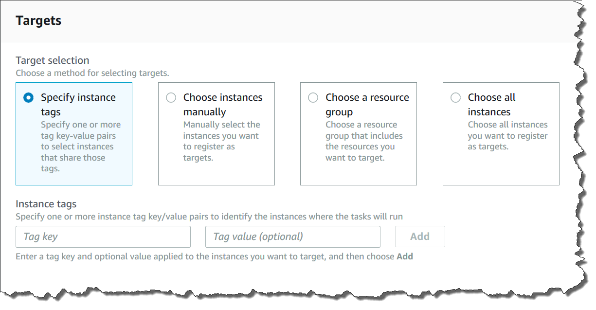
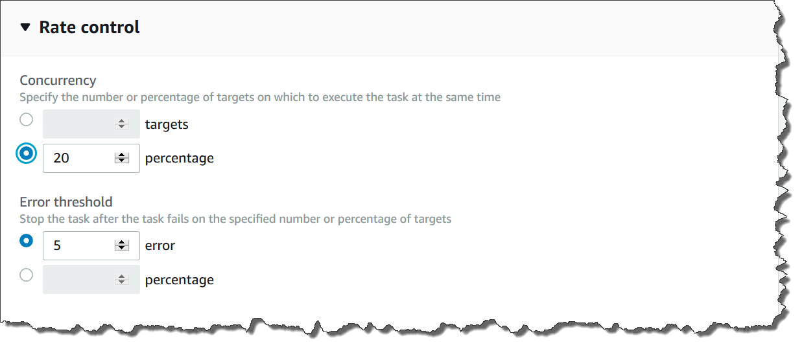

AWS Systems Manager Change Manager is no longer open to new customers. Existing customers can continue to use the service as normal. For more information, see
[AWS Systems Manager Change Manager availability change](change-manager-availability-change.md "change-manager-availability-change.md").

# Understanding targets and rate controls in State Manager associations

This topic describes State Manager features that help you deploy an association to
dozens or hundreds of nodes while controlling the number of nodes that run the
association at the scheduled time. State Manager is a tool in AWS Systems Manager.

## Using targets

When you create a State Manager association, you choose which nodes to configure
with the association in the **Targets** section of the Systems Manager
console, as shown here.

If you create an association by using a command line tool such as the
AWS Command Line Interface (AWS CLI), then you specify the `targets` parameter.
Targeting nodes allows you to configure tens, hundreds, or thousands of nodes
with an association without having to specify or choose individual node IDs.

Each managed node can be targeted by a maximum of 20 associations.

State Manager includes the following target options when creating an
association.

###### Specify tags

Use this option to specify a tag key and (optionally) a tag value assigned
to your nodes. When you run the request, the system locates and attempts to
create the association on all nodes that match the specified tag key and
value. If you specified multiple tag values, the association targets any
node with at least one of those tag values. When the system initially
creates the association, it runs the association. After this initial run,
the system runs the association according to the schedule you
specified.

If you create new nodes and assign the specified tag key and value to those
nodes, the system automatically applies the association, runs it immediately,
and then runs it according to the schedule. This applies when the association
uses a Command or Policy document and doesn't apply if the association uses an
Automation runbook. If you delete the specified tags from a node, the system no
longer runs the association on those nodes.

###### Note

If you use Automation runbooks with State Manager and the tagging limitation
prevents you from achieving a specific goal, consider using Automation
runbooks with Amazon EventBridge. For more information, see [Run automations based on EventBridge
events](running-automations-event-bridge.md "running-automations-event-bridge.md"). For more information
about using runbooks with State Manager, see [Scheduling
automations with State Manager associations](scheduling-automations-state-manager-associations.md "scheduling-automations-state-manager-associations.md").

As a best practice, we recommend using tags when creating associations that
use a Command or Policy document. We also recommend using tags when creating
associations to run Auto Scaling groups. For more information, see [Running Auto Scaling groups with
associations](systems-manager-state-manager-asg.md "systems-manager-state-manager-asg.md").

###### Note

Note the following information.

- When creating an association in the AWS Management Console that targets nodes
  by using tags, you can specify only one tag key for an automation
  association and five tag keys for a command association.
  _All_ tag keys specified in the association
  must be currently assigned to the node. If they aren't, State Manager
  fails to target the node for an association.
- If you want to use the console _and_ you want
  to target your nodes by using more than one tag key for an
  automation association and five tag keys for a command association,
  assign the tag keys to an AWS Resource Groups group and add the nodes to it.
  You can then choose the **Resource Group** option
  in the **Targets** list when you create the
  State Manager association.
- You can specify a maximum of five tag keys by using the AWS CLI. If
  you use the AWS CLI, _all_ tag keys specified in
  the `create-association` command must be currently
  assigned to the node. If they aren't, State Manager fails to target the
  node for an association.

###### Choose nodes manually

Use this option to manually select the nodes where you want to create the
association. The **Instances** pane displays all Systems Manager
managed nodes in the current AWS account and AWS Region. You can
manually select as many nodes as you want. When the system initially creates
the association, it runs the association. After this initial run, the system
runs the association according to the schedule you specified.

###### Note

If a managed node you expect to see isn't listed, see [Troubleshooting managed
node availability](fleet-manager-troubleshooting-managed-nodes.md "fleet-manager-troubleshooting-managed-nodes.md") for troubleshooting
tips.

###### Choose a resource group

Use this option to create an association on all nodes returned by an
AWS Resource Groups tag-based or AWS CloudFormation stack-based query.

Below are details about targeting resource groups for an association.

- If you add new nodes to a group, the system automatically maps the
  nodes to the association that targets the resource group. The system
  applies the association to the nodes when it discovers the change. After
  this initial run, the system runs the association according to the
  schedule you specified.
- If you create an association that targets a resource group and the
  `AWS::SSM::ManagedInstance` resource type was specified
  for that group, then by design, the association runs on both Amazon Elastic Compute Cloud
  (Amazon EC2) instances and non-EC2 nodes in a [hybrid and multicloud](operating-systems-and-machine-types.md#supported-machine-types "operating-systems-and-machine-types.md#supported-machine-types") environment.

The converse is also true. If you create an association that targets a
resource group and the `AWS::EC2::Instance` resource type was
specified for that group, then by design, the association runs on both
non-EC2 nodes in a [hybrid and multicloud](operating-systems-and-machine-types.md#supported-machine-types "operating-systems-and-machine-types.md#supported-machine-types") environment and (Amazon EC2) instances.

- If you create an association that targets a resource group, the
  resource group must not have more than five tag keys assigned to it or
  more than five values specified for any one tag key. If either of these
  conditions applies to the tags and keys assigned to your resource group,
  the association fails to run and returns an `InvalidTarget`
  error.
- If you create an association that targets a resource group using tags,
  you can't choose the **(empty value)** option for the
  tag value.
- If you delete a resource group, all instances in that group no longer
  run the association. As a best practice, delete associations targeting
  the group.
- At most you can target a single resource group for an association.
  Multiple or nested groups aren't supported.
- After you create an association, State Manager periodically updates the
  association with information about resources in the Resource Group. If
  you add new resources to a Resource Group, the schedule for when the
  system applies the association to the new resources depends on several
  factors. You can determine the status of the association in the State Manager
  page of the Systems Manager console.

###### Warning

An AWS Identity and Access Management (IAM) user, group, or role with permission to create an
association that targets a resource group of Amazon EC2 instances automatically
has root-level control of all instances in the group. Only trusted
administrators should be permitted to create associations.

For more information about Resource Groups, see [What Is
AWS Resource Groups?](../../../ARG/latest/userguide.md "../../../ARG/latest/userguide.md") in the _AWS Resource Groups User Guide_.

###### Choose all nodes

Use this option to target all nodes in the current AWS account and
AWS Region. When you run the request, the system locates and attempts to
create the association on all nodes in the current AWS account and
AWS Region. When the system initially creates the association, it runs the
association. After this initial run, the system runs the association
according to the schedule you specified. If you create new nodes, the system
automatically applies the association, runs it immediately, and then runs it
according to the schedule.

## Using rate controls

You can control the execution of an association on your nodes by specifying a
concurrency value and an error threshold. The concurrency value specifies how
many nodes can run the association simultaneously. An error threshold specifies
how many association executions can fail before Systems Manager sends a command to each
node configured with that association to stop running the association. The
command stops the association from running until the next scheduled execution.
The concurrency and error threshold features are collectively called
_rate controls_.

###### Concurrency

Concurrency helps to limit the impact on your nodes by allowing you to
specify that only a certain number of nodes can process an association at
one time. You can specify either an absolute number of nodes, for example
20, or a percentage of the target set of nodes, for example 10%.

State Manager concurrency has the following restrictions and limitations:

- If you choose to create an association by using targets, but you don't
  specify a concurrency value, then State Manager automatically enforces a
  maximum concurrency of 50 nodes.
- If new nodes that match the target criteria come online while an
  association that uses concurrency is running, then the new nodes run the
  association if the concurrency value isn't exceeded. If the concurrency
  value is exceeded, then the nodes are ignored during the current
  association execution interval. The nodes run the association during the
  next scheduled interval while conforming to the concurrency
  requirements.
- If you update an association that uses concurrency, and one or more
  nodes are processing that association when it's updated, then any node
  that is running the association is allowed to complete. Those
  associations that haven't started are stopped. After running
  associations complete, all target nodes immediately run the association
  again because it was updated. When the association runs again, the
  concurrency value is enforced.

###### Error thresholds

An error threshold specifies how many association executions are allowed
to fail before Systems Manager sends a command to each node configured with that
association. The command stops the association from running until the next
scheduled execution. You can specify either an absolute number of errors,
for example 10, or a percentage of the target set, for example 10%.

If you specify an absolute number of three errors, for example, State Manager sends
the stop command when the fourth error is returned. If you specify 0, then
State Manager sends the stop command after the first error result is returned.

If you specify an error threshold of 10% for 50 associations, then State Manager
sends the stop command when the sixth error is returned. Associations that are
already running when an error threshold is reached are allowed to complete, but
some of these associations might fail. To ensure that there aren't more errors
than the number specified for the error threshold, set the
**Concurrency** value to 1 so that associations proceed one
at a time.

State Manager error thresholds have the following restrictions and
limitations:

- Error thresholds are enforced for the current interval.
- Information about each error, including step-level details, is
  recorded in the association history.
- If you choose to create an association by using targets, but you don't
  specify an error threshold, then State Manager automatically enforces a
  threshold of 100% failures.
