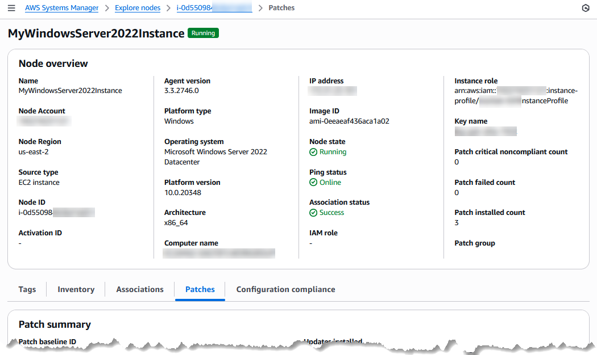

# What is the unified console?

The unified Systems Manager console is a consolidated experience that combines various tools to
help you complete common node tasks across multiple AWS accounts and AWS Regions in
an AWS Organizations organization, or a single account and Region. Nodes can be EC2 instances,
hybrid servers, or servers running in a multicloud environment. In the unified console,
you're provided with detailed insights to your nodes. You can generate reports for your
nodes, diagnose and remediate common issues that prevent nodes from reporting as managed
by Systems Manager, like connectivity issues.

In addition to summaries about your nodes on the **Review node
insights** page, you can view specific details about a node from the
**Explore nodes** page.

###### Node details tabs

When you select a node on the **Explore nodes** page, the node
detail page provides a comprehensive overview of node details and additional
information on a series of tabs:

\***\*Tags\*\***

(Optional) Manage resource tags to group and filter the managed node with
other resources. Tags consist of a case-senstive key-value pair and are used
to categorize resources in different ways, such as by purpose, owner, or
environment.

\***\*Inventory\*\***

Displays metadata about the managed node, which you can view according to
over 10 different inventory types. For example, when you select the type
`AWS:Application`, the inventory filter results provide
details about applications installed on the node, such as
**Name**, **Version**,
**Architecture**, and more. For more information about
Inventory, see [AWS Systems Manager Inventory](systems-manager-inventory.md "systems-manager-inventory.md").

\***\*Associations\*\***

An association is a resource type in State Manager that defines the target
state for a managed node and maintains all managed nodes in your account in
a consistent state. The association can define the commands, scripts, or
policies to apply to which managed instances, and how often the association
should run to ensure the nodes are match the defined configuration for the
node. An association can drive compliance reporting of required states for
resources in your account. For more information about State Manager and
assocations, see [AWS Systems Manager State Manager](systems-manager-state.md "systems-manager-state.md").

\***\*Patches\*\***

Displays metadata about the managed node, such as which patch baseline is
assigned to the node and the total number of updates for packages that have
been updated successfully, failed, or still required for installation. The
**Patches** tab also reports details about patches
available for the node based on the configuration requirements in the patch
baseline, including the package **Name**, such as
`libblockdev-crypto.x86_64`;
**Classification** (such as `Bugfix` or
`Security`); **Description** (showing the
full patch title, such as
`coreutils.x86_64:0:8.32-36.el9` and
`java-11-amazon-corretto-headless-1:11.0.15+9-1.amzn2.x86_64`;
and **Patch State**, such as `Installed`,
`Installed_Pending_Reboot`, `Missing`, and
`Failed`.

###### Note

Patch _states_ do not indicate
whether or not a managed node is _compliant_. Patch compliance is not innately tied to
patch states, nor is it defined by AWS, by operating system (OS)
vendors, or by third parties such as security consulting firms. Instead,
you define what patch compliance means for managed nodes in your
organization or account in a _patch
baseline_. For more information, see [What is compliance in
Patch Manager?](patch-manager.md#patch-manager-definition-of-compliance "patch-manager.md#patch-manager-definition-of-compliance") and [Predefined and
custom patch baselines](patch-manager-predefined-and-custom-patch-baselines.md "patch-manager-predefined-and-custom-patch-baselines.md").

\***\*Configuration compliance\*\***

Reports patch compliance and configuration inconsistencies on the node
(whether the state of a package on the managed node is
`Compliant` or `Non-compliant` according to the
definition of Compliant as defined in either a State Manager association or a
Patch Manager patch baseline). You can filter configuration compliance results
according to a package **ID**, **Compliance
status**, **Compliance type**
(`Association` or `Patch`), `Severity`,
and different execution details. For related information, see [AWS Systems Manager Compliance](systems-manager-compliance.md "systems-manager-compliance.md").

Whether you have nodes in multiple accounts and Regions in an organization, or nodes
in a single account and Region, we recommend using the unified console. To learn about
the node tasks you can perform now using the unified console, see [Performing node management tasks with
AWS Systems Manager](systems-manager-node-tasks.md "systems-manager-node-tasks.md").

For more information about setting up your nodes for Systems Manager, see [Setting up managed nodes for
AWS Systems Manager](systems-manager-setting-up-nodes.md "systems-manager-setting-up-nodes.md"). After you've set up your nodes,
you can set up Systems Manager and the unified console. To learn more about setting up Systems Manager, see
[Setting up AWS Systems Manager](systems-manager-setting-up-console.md "systems-manager-setting-up-console.md").
