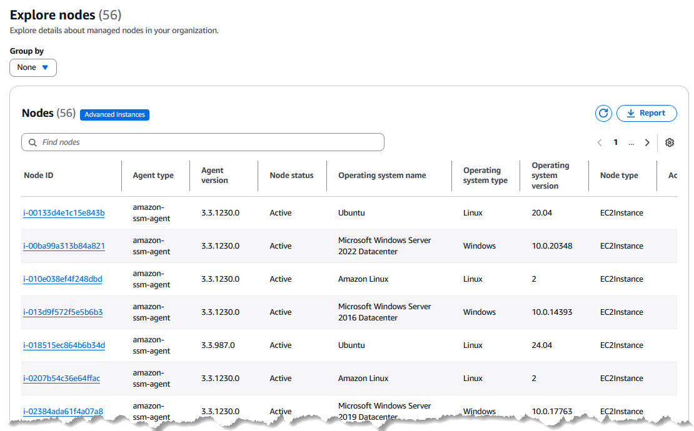
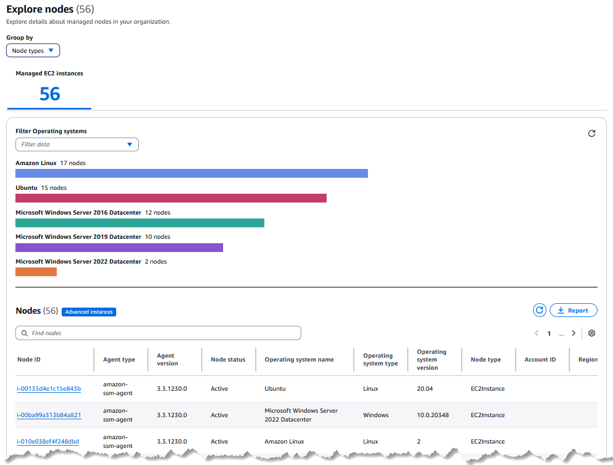
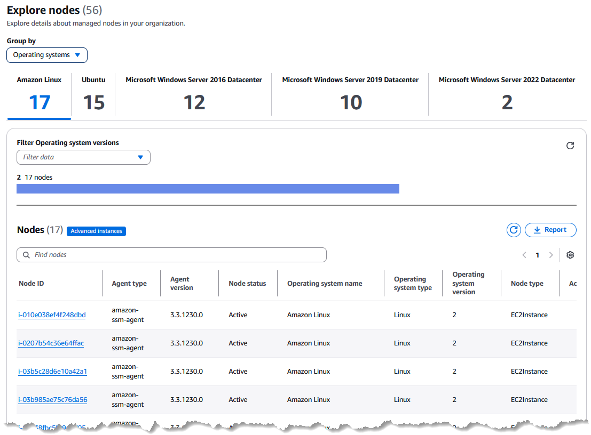
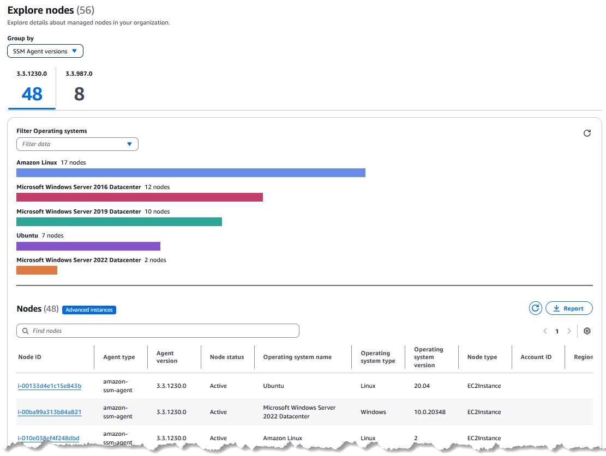

• AWS Systems Manager Change Manager is no longer open to new customers. Existing customers can continue to use the service as normal. For more information, see
[AWS Systems Manager Change Manager availability change](change-manager-availability-change.md "change-manager-availability-change.md").

 

• The AWS Systems Manager CloudWatch Dashboard will no longer be available after April 30, 2026. Customers can continue to use Amazon CloudWatch console to view, create, and manage their Amazon CloudWatch dashboards, just as they do today. For more information, see
[Amazon CloudWatch Dashboard documentation](../../../AmazonCloudWatch/latest/monitoring/CloudWatch_Dashboards.md "../../../AmazonCloudWatch/latest/monitoring/CloudWatch_Dashboards.md").

# Exploring nodes using console

filters

In the Systems Manager console, you can then group your managed nodes according to the following
views:

All nodes (No filter)
Lists all managed nodes in your organization or account.

Node types
Provides tabs for viewing data separately for Amazon Elastic Compute Cloud (Amazon EC2) instances
and other machine types, including servers on your own premises (on-premises
servers), AWS IoT Greengrass core devices, AWS IoT and non-AWS edge devices, and
virtual machines (VMs), including VMs in other cloud environments.

Operating systems
Provides a tab for each operating system type in your organization or
account, such as **Amazon Linux** and **Microsoft Windows
Server 2022 Datacenter**. On each tab, you can further filter
the list by selecting only specific versions of the operating systems, such
as _Amazon Linux 2_ and _Amazon Linux 2023_.

SSM Agent versions
Provides a tab for each version of SSM Agent installed on managed nodes in
your fleet. On each tab, you can further filter the list by selecting only
specific operating systems, such as **Amazon Linux** and
**Microsoft Windows Server 2022 Datacenter**.

In addition, for each of these views, you can further refine the list of nodes
reported by choosing to view only nodes for a certain property, such as node status,
AWS account ID, organization unit ID, and more.

You can customize the report display by choosing which of the available data columns
are displayed in the **Explore nodes** page. You can also download
reports in `CSV` or `JSON` formats, or export
reports to Amazon S3 in `CSV` format.

###### Topics

- [Choosing a filter view for managed node
  summaries](explore-nodes-filter-view.md "explore-nodes-filter-view.md")
