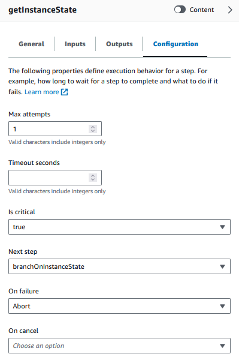
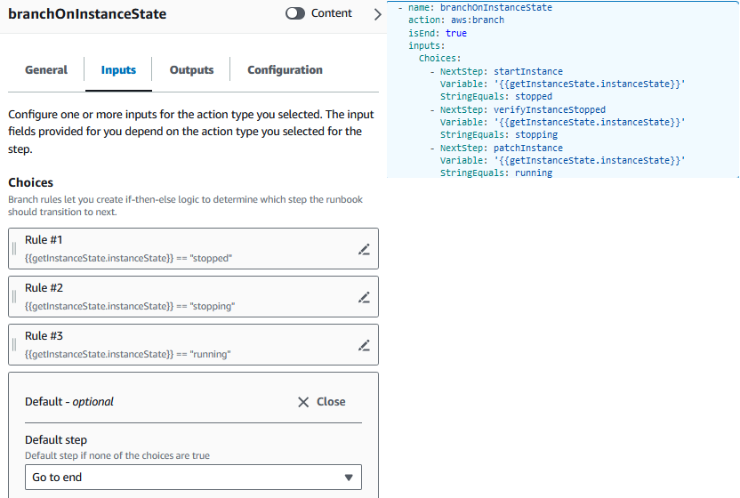

AWS Systems Manager Change Manager is no longer open to new customers. Existing customers can continue to use the service as normal. For more information, see
[AWS Systems Manager Change Manager availability change](change-manager-availability-change.md "change-manager-availability-change.md").

# Error handling with the visual design

experience

By default, when an action reports an error, Automation stops the runbook's workflow
entirely. This is because the default value for the `onFailure` property on all
actions is `Abort`. You can configure how Automation handles errors in your
runbook's workflow. Even if you have configured error handling, some errors might still cause
an automation to fail. For more information, see [Troubleshooting Systems Manager Automation](automation-troubleshooting.md "automation-troubleshooting.md"). In the visual design experience, you configure error
handling in the **Configuration** panel.

## Retry action on error

To retry an action in case of an error, specify a value for the **Max
attempts** property. The default value is 1. If you specify a value greater than
1, the action isn't considered to have failed until all of the retry attempts have
failed.

## Timeouts

You can configure a timeout for actions to set the maximum number of seconds your action
can run before it fails. To configure a timeout, enter the number of seconds that your
action should wait before the action fails in the **Timeout seconds**
property. If the timeout is reached and the action has a value of `Max attempts`
that is greater than 1, the step isn't considered to have timed out until the retries
complete.

## Failed actions

By default, when an action fails, Automation stops the runbook's workflow entirely. You
can modify this behavior by specifying an alternative value for the **On
failure** property of the actions in your runbook. If you want the workflow to
continue to the next step in the runbook, choose **Continue**. If you want
the workflow to jump to a different subsequent step in the runbook, choose
**Step** and then enter the name of the step.

## Canceled actions

By default, when an action is canceled by a user, Automation stops the runbook's
workflow entirely. You can modify this behavior by specifying an alternative value for the
**On cancel** property of the actions in your runbook. If you want the
workflow to jump to a different subsequent step in the runbook, choose
**Step** and then enter the name of the step.

## Critical actions

You can designate an action as _critical_, meaning it determines the
overall reporting status of your automation. If a step with this designation fails,
Automation reports the final status as `Failed` regardless of the success of
other actions. To configure an action as critical, leave the default value as
**True** for the **Is critical** property.

## Ending actions

The **Is end** property stops an automation at the end of the specified
action. The default value for this property is `false`. If you configure this
property for an action, the automation stops whether the action succeeds or fails. This
property is most often used with `aws:branch` actions to handle unexpected or
undefined input values. The following example shows a runbook that is expecting an instance
state of either `running`, `stopping`, or `stopped`. If an
instance is in a different state, the automation ends.

