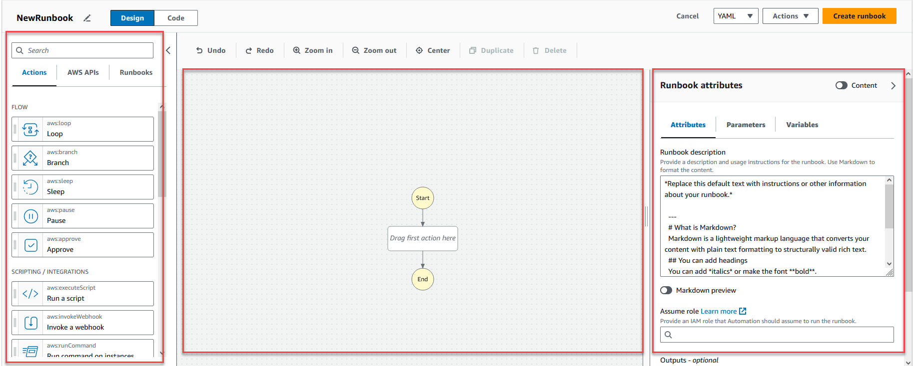
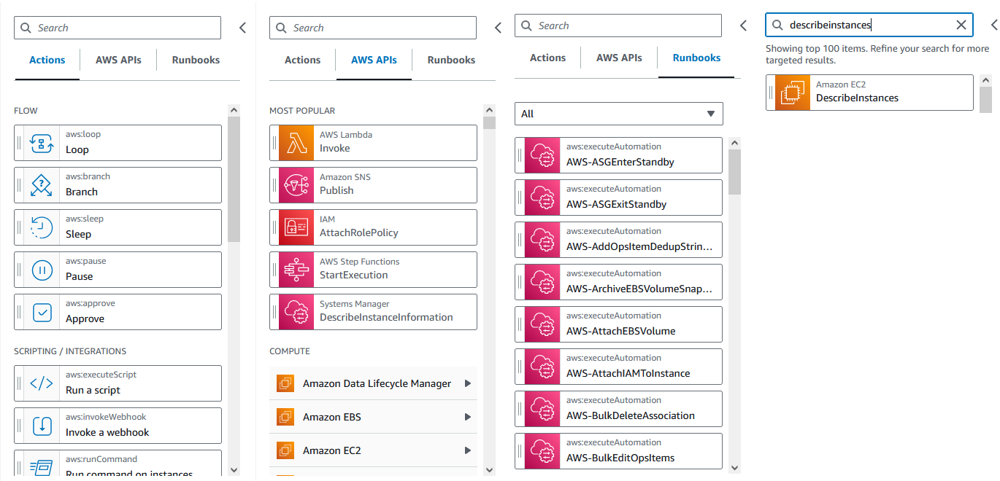
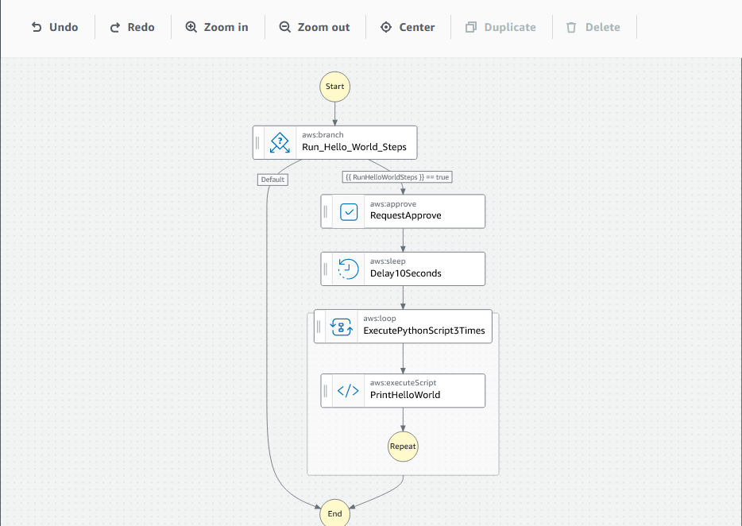
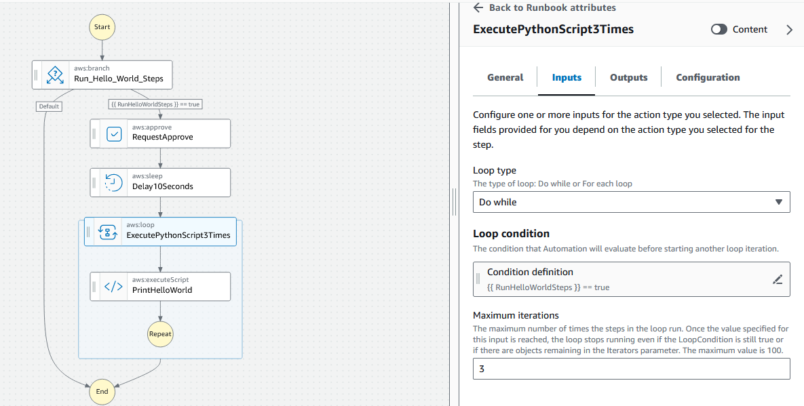
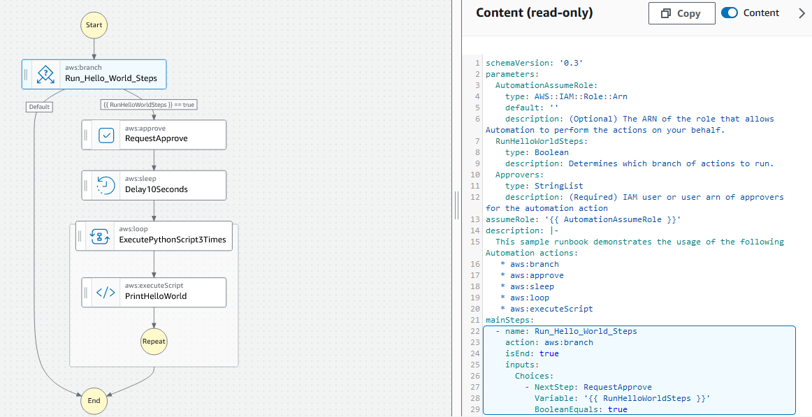

AWS Systems Manager Change Manager is no longer open to new customers. Existing customers can continue to use the service as normal. For more information, see
[AWS Systems Manager Change Manager availability change](change-manager-availability-change.md "change-manager-availability-change.md").

# Overview of the visual design experience

interface

The visual design experience for Systems Manager Automation is a low-code visual workflow designer that helps you
create automation runbooks.

Get to know the visual design experience with an overview of the interface components:

- The **Actions** browser contains the **Actions**,
  **AWS APIs**, and **Runbooks** tabs.
- The _canvas_ is where you drag and drop actions into your workflow
  graph, change the order of actions, and select actions to configure or view.
- The **Form** panel is where you can view and edit the properties of
  any action that you selected on the canvas. Select the **Content** toggle
  to view the YAML or JSON for your runbook, with the currently selected action highlighted.
  **Info** links open a panel with contextual information when you need
  help. These panels also include links to related topics in the Systems Manager Automation documentation.

## Actions browser

From the **Actions** browser, you can select actions to drag and drop
into your workflow graph. You can search all actions using the search field at the top of
the **Actions** browser. The **Actions** browser contains
the following tabs:

- The **Actions** tab provides a list of automation actions that you
  can drag and drop into your runbook's workflow graph in the canvas.
- The **AWS APIs** tab provides a list of AWS APIs that you can
  drag and drop into your runbook's workflow graph in the canvas.
- The **Runbooks** tab provides several ready-to-use, reusable
  runbooks as building blocks that you can use for a variety of use cases. For example,
  you can use runbooks to perform common remediation tasks on Amazon EC2 instances in your
  workflow without having to re-create the same actions.

## Canvas

After you choose an action to add to your automation, drag it to the canvas and drop it
into your workflow graph. You can also drag and drop actions to move them to different
places in your runbook's workflow. If your workflow is complex, you might not be able to
view all of it in the canvas panel. Use the controls at the top of the canvas to zoom in or
out. To view different parts of a workflow, you can drag the workflow graph in the canvas.

Drag an action from the **Actions** browser, and drop it into your
runbook's workflow graph. A line shows where it will be placed in your workflow. To change
the order of an action, you can drag it to a different place in your workflow. The new
action has been added to your workflow, and its code is auto-generated.

## Form

After you add an action to your runbook workflow, you can configure it to meet your use
case. Choose the action that you want to configure, and you will see its parameters and
options in the **Form** panel. You can also see the YAML or JSON code by
choosing the **Content** toggle. The code associated with the action you
have selected is highlighted.

## Keyboard shortcuts

The visual design experience supports the keyboard shortcuts shown in the following table.

| Keyboard shortcut | Function                           |
| ----------------- | ---------------------------------- |
| Ctrl+Z            | Undo the last operation.           |
| Ctrl+Shift+Z      | Redo the last operation.           |
| Alt+C             | Center the workflow in the canvas. |
| Backspace         | Remove all selected states.        |
| Delete            | Remove all selected states.        |
| Ctrl+D            | Duplicate the selected state.      |
