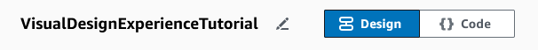
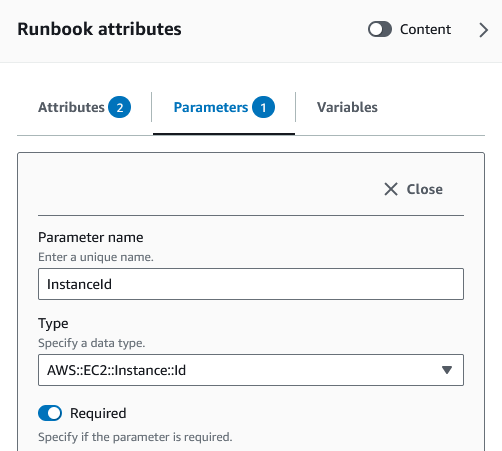
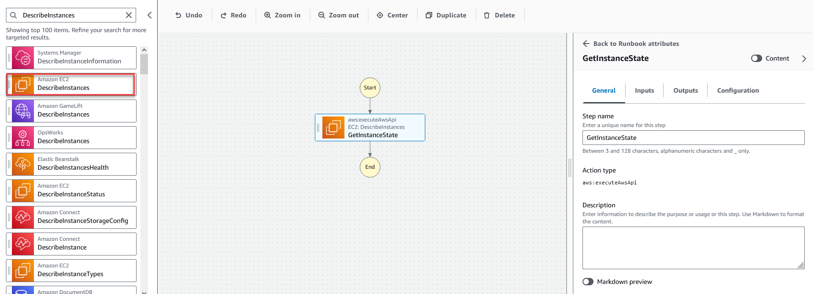
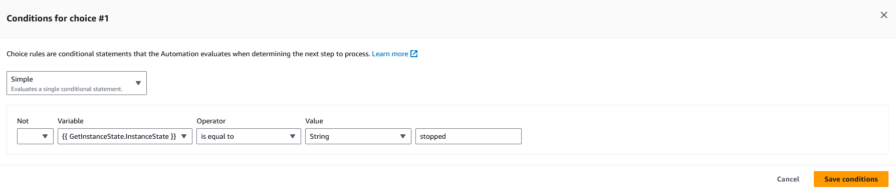
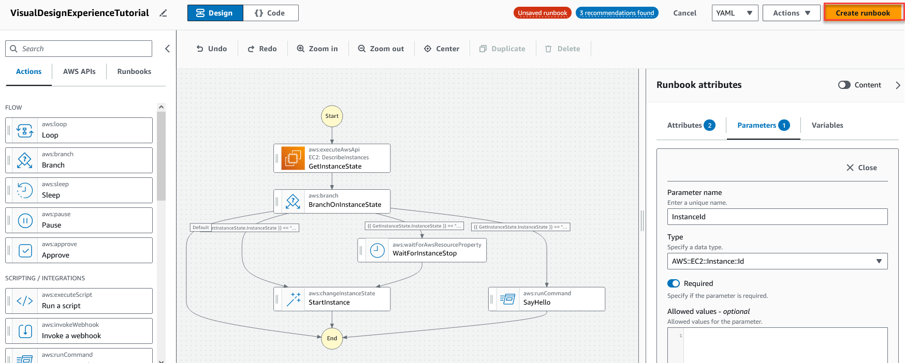

AWS Systems Manager Change Manager is no longer open to new customers. Existing customers can continue to use the service as normal. For more information, see
[AWS Systems Manager Change Manager availability change](change-manager-availability-change.md "change-manager-availability-change.md").

# Tutorial: Create a runbook using the

visual design experience

In this tutorial, you will learn the basics of working with the visual design experience provided by
Systems Manager Automation. In the visual design experience, you can create a runbook that uses multiple actions. You
use the drag and drop feature to arrange actions on the canvas. You also search for, select,
and configure these actions. Then, you can view the auto-generated YAML code for your
runbook's workflow, exit the visual design experience, run the runbook, and review the execution
details.

This tutorial also shows you how to update the runbook and view the new version. At the
end of the tutorial, you perform a clean-up step and delete your runbook.

After you complete this tutorial, you'll know how to use the visual design experience to create a
runbook. You'll also know how to update, run, and delete your runbook.

###### Note

Before you start this tutorial, make sure to complete [Setting up Automation](automation-setup.md "automation-setup.md").

###### Topics

- [Step 1: Navigate to the visual design experience](#navigate-console "#navigate-console")
- [Step 2: Create a workflow](#create-workflow "#create-workflow")
- [Step 3: Review the auto-generated code](#view-generated-code "#view-generated-code")
- [Step 4: Run your new runbook](#use-tutorial-runbook "#use-tutorial-runbook")
- [Step 5: Clean up](#cleanup-tutorial-runbook "#cleanup-tutorial-runbook")

## Step 1: Navigate to the visual design experience

1. Sign in to the [Systems Manager Automation console](https://console.aws.amazon.com/systems-manager/automation/home?region=us-east-1#/ "https://console.aws.amazon.com/systems-manager/automation/home?region=us-east-1#/").
2. Choose **Create automation runbook**.

## Step 2: Create a workflow

In the visual design experience, a workflow is a graphical representation of your runbook on the
canvas. You can use the visual design experience to define, configure, and examine the individual actions
of your runbook.

###### To create a workflow

1. Next to the **Design** and **Code** toggle, select
   the pencil icon and enter a name for your runbook. For this tutorial, enter
   `VisualDesignExperienceTutorial`.

 2. In the **Document attributes** section of the
**Form** panel, expand the **Input parameters**
dropdown, and select **Add a parameter**.

    1. In the **Parameter name** field, enter
     `InstanceId`.
    2. In the **Type** dropdown, choose
     **AWS::EC2::Instance**.
    3. Select the **Required** toggle.

 3. In the **AWS APIs** browser, enter
`DescribeInstances` in the search bar. 4. Drag an **Amazon EC2 – DescribeInstances** action to the empty
canvas. 5. For **Step name**, enter a value. For this tutorial, you can use
the name `GetInstanceState`.

    1. Expand the **Additional inputs** dropdown, and in the
     **Input name** field, enter
     `InstanceIds`.
    2. Choose the **Inputs** tab.
    3. In the **Input value** field, choose the
     `InstanceId` document input. This references the value of the
     input parameter that you created at the beginning of the procedure. Since the
     **InstanceIds** input for the `DescribeInstances`
     action accepts `StringList` values, you must wrap the
     **InstanceId** input in square brackets. The YAML for the
     **Input value** should match the following: `['{{
     InstanceId }}']`.
    4. In the **Outputs** tab, select **Add an
     output** and enter `InstanceState` in the
     **Name** field.
    5. In the **Selector** field, enter
     `$.Reservations[0].Instances[0].State.Name`.
    6. In the **Type** dropdown, choose
     **String**.

6. Drag a **Branch** action from the **Actions**
   browser, and drop it below the **`GetInstanceState`** step.
7. For **Step name**, enter a value. For this tutorial, use the name
   `BranchOnInstanceState`.

To define the branching logic, do the following:

    1. Choose the **`Branch`** state on the canvas. Then,
     under **Inputs** and **Choices**, select the
     pencil icon to edit **Rule #1**.
    2. Choose **Add conditions**.
    3. In the **Conditions for rule #1** dialog box, choose the
     `GetInstanceState.InstanceState` step output from the
     **Variable** dropdown.
    4. For **Operator**, choose **is equal
     to**.
    5. For **Value**, choose **String** from the
     dropdown list. Enter `stopped`.

    
    6. Select **Save conditions**.
    7. Choose **Add new choice rule**.
    8. Choose **Add conditions** for **Rule
     #2**.
    9. In the **Conditions for rule #2** dialog box, choose the
     `GetInstanceState.InstanceState` step output from the
     **Variable** dropdown.
    10. For **Operator**, choose **is equal
     to**.
    11. For **Value**, choose **String** from the
     dropdown list. Enter `stopping`.
    12. Select **Save conditions**.
    13. Choose **Add new choice rule**.
    14. For **Rule #3**, choose **Add
     conditions**.
    15. In the **Conditions for rule #3** dialog box, choose the
     `GetInstanceState.InstanceState` step output from the
     **Variable** dropdown.
    16. For **Operator**, choose **is equal
     to**.
    17. For **Value**, choose **String** from the
     dropdown list. Enter `running`.
    18. Select **Save conditions**.
    19. In the **Default rule**, choose **Go to end**
     for the **Default step**.

8. Drag a **Change an instance state** action to the empty
   **Drag action here** box under the **{{
   GetInstanceState.InstanceState }} == "stopped"** condition.
   1. For the **Step name**, enter
      `StartInstance`.
   2. In the **Inputs** tab, under **Instance IDs**,
      choose the **InstanceId** document input value from the
      dropdown.
   3. For the **Desired state**, specify
      **`running`**.

9. Drag a **Wait on AWS resource** action to the empty
   **Drag action here** box under the **{{
   GetInstanceState.InstanceState }} == "stopping"** condition.
10. For **Step name**, enter a value. For this tutorial, use the name
    `WaitForInstanceStop`.
    1. For the **Service** field, choose
       **Amazon EC2**.
    2. For the **API** field, choose
       **DescribeInstances**.
    3. For the **Property selector** field, enter
       `$.Reservations[0].Instances[0].State.Name`.
    4. For the **Desired values** parameter, enter
       `["stopped"]`.
    5. In the **Configuration** tab of the
       **WaitForInstanceStop** action, choose
       **StartInstance** from the **Next step**
       dropdown.

11. Drag a **Run command on instances** action to the empty
    **Drag action here** box under the **{{
    GetInstanceState.InstanceState }} == "running"** condition.
12. For the **Step name**, enter
    `SayHello`.
    1. In the **Inputs** tab, enter
       `AWS-RunShellScript` for the **Document
       name** parameter.
    2. For **InstanceIds**, choose the **InstanceId**
       document input value from the dropdown.
    3. Expand the **Additional inputs** dropdown, and in the
       **Input name** dropdown, choose
       **Parameters**.
    4. In the **Input value** field, enter
       `{"commands": "echo 'Hello World'"}`.

13. Review the completed runbook in the canvas and select **Create
    runbook** to save the tutorial runbook.

## Step 3: Review the auto-generated code

As you drag and drop actions from the **Actions** browser onto the
canvas, the visual design experience automatically composes the YAML or JSON content of your runbook in
real-time. You can view and edit this code. To view the auto-generated code, select
**Code** for the **Design** and
**Code** toggle.

## Step 4: Run your new runbook

After creating your runbook, you can run the automation.

###### To run your new automation runbook

1. Open the AWS Systems Manager console at [https://console.aws.amazon.com/systems-manager/](https://console.aws.amazon.com/systems-manager/ "https://console.aws.amazon.com/systems-manager/").
2. In the navigation pane, choose **Automation**, and then choose
   **Execute automation**.
3. In the **Automation document** list, choose a runbook. Choose one or
   more options in the **Document categories** pane to filter SSM
   documents according to their purpose. To view a runbook that you own, choose the
   **Owned by me** tab. To view a runbook that is shared with your
   account, choose the **Shared with me** tab. To view all runbooks,
   choose the **All documents** tab.

###### Note

You can view information about a runbook by choosing the runbook name. 4. In the **Document details** section, verify that **Document
version** is set to the version that you want to run. The system includes
the following version options:

    * **Default version at runtime** – Choose this option if
     the Automation runbook is updated periodically and a new default version is
     assigned.
    * **Latest version at runtime** – Choose this option if
     the Automation runbook is updated periodically, and you want to run the version
     that was most recently updated.
    * **1 (Default)** – Choose this option to run the first
     version of the document, which is the default.

5. Choose **Next**.
6. In the **Execute automation runbook** section, choose
   **Simple execution**.
7. In the **Input parameters** section, specify the required inputs.
   Optionally, you can choose an IAM service role from the
   **AutomationAssumeRole** list.
8. (Optional) Choose an Amazon CloudWatch alarm to apply to your automation for monitoring. To
   attach a CloudWatch alarm to your automation, the IAM principal that starts the automation
   must have permission for the `iam:createServiceLinkedRole` action. For more
   information about CloudWatch alarms, see [Using Amazon CloudWatch
   alarms](../../../AmazonCloudWatch/latest/monitoring/AlarmThatSendsEmail.md "../../../AmazonCloudWatch/latest/monitoring/AlarmThatSendsEmail.md"). If your alarm activates, the automation is stopped. If you use
   AWS CloudTrail, you will see the API call in your trail.
9. Choose **Execute**.

## Step 5: Clean up

###### To delete your runbook

1. Open the AWS Systems Manager console at [https://console.aws.amazon.com/systems-manager/](https://console.aws.amazon.com/systems-manager/ "https://console.aws.amazon.com/systems-manager/").
2. In the navigation pane, choose **Documents**.
3. Select the **Owned by me** tab.
4. Locate the **VisualDesignExperienceTutorial** runbook.
5. Select the button on the document card page, and then choose **Delete
   document** from the **Actions** dropdown.
