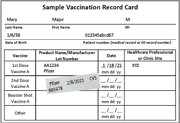
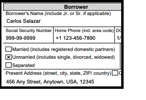

# Best Practices for Queries

## Example Queries

Download the [Example Queries document](samples/Example%20Queries.md "samples/Example%20Queries.md") to see examples of queries for common document
types across mortgage, insurance, healthcare and tax industries.

## General Best Practices for Queries

## Extracting Cells from Tables

Construct a query that contains words from both row header and column header.

Examples, for the image below

Query 1: What date was the 2nd dose administered?

Answer 1: 2/8/2021

Query 2: Who is the manufacturer of the 1st dose?

Answer 2: Pfizer

## Extracting Tables using Queries

Extraction of entire tables or whole rows or columns of information using queries is not supported.

## Long Answers

Long answers increase response latency and can lead to timeouts. Try to ask questions that respond
with answers to less than 100 words.

## Passing Only Hints

Passing only the the key name as the question will work when trying to extract standard key-value
pairs from a form. We recommend framing full questions for all other extraction use cases.

Examples, for the image below

Query 1: Borrower's Name.

Answer 1: Carlos Salazar

Query 2: Social Security Number.

Answer 2: 999-99-9999

## General Phrasing of Questions

Where possible, use words from the document to construct the query.

- While Queries tries to do acronym / synonym matching for some common industry terms
  (SSN vs Tax ID vs Social Security Number), using language directly from the document
  will in general improve results.
- Example: If the document says “job progress”, try to avoid calling it using other
  variations like “ project progress” or “program progress” or “job status”

In general, ask a natural language question that starts with "What is / Where is / Who is..". The
exception to this rule is when trying to extract standard key-value pairs in which case you can pass
the key name as a query.

Avoid ill-formed or grammatically incorrect questions since these could result in unexpected answers.

- Example of ill-formed Query: When?
- Example of well formed Query: When was the first vaccine dose administered?

Be as specific as possible. Some examples follow.

- When the document contains multiple sections (e. g. “Borrower” and “Co-Borrower”)
  and both sections have a field called SSN, ask: “What is the SSN for Borrower?” and
  “What is the SSN for Co-Borrower?”
- When the document has multiple date related fields, be specific in the query language
  and ask “what is the date the document was signed on? or ”what is the the date of birth
  of the application“. Avoid asking ambiguous questions like ”What is the date?“

If you know the layout of the document beforehand, giving location hints improve accuracy of results.
For example “What is the date at the top?” or ask “What is the date on the left?”, “What is the date at the bottom?

## Setting up Pages for Queries

When working with queries for multipage documents, you can use the `Page`
parameter to specify which pages to look for the query answer on. What follows is a list
of best practices for setting up Pages

- If a page is not specified, it is set to `["1"]` by default.
- The following characters are allowed in the parameter's string:
  `0 1 2 3 4 5 6 7 8 9 - *`. No whitespace is allowed.
- When using \* to indicate all pages, it must be the only element in the list.
- You can use page intervals, such as `[“1-3”, “1-1”, “4-*”]`. Where `*` indicates last page of
  document.
- Specified pages must be greater than 0 and less than or equal to the number of pages in the document.
