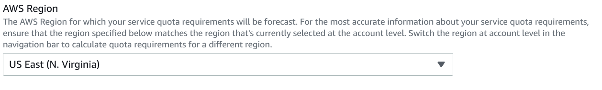
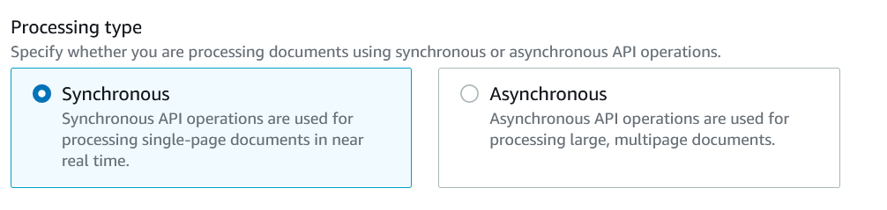
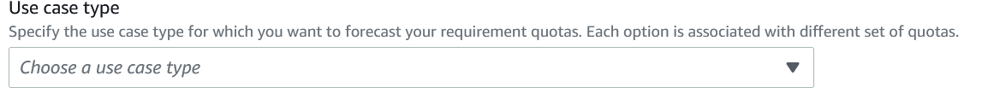
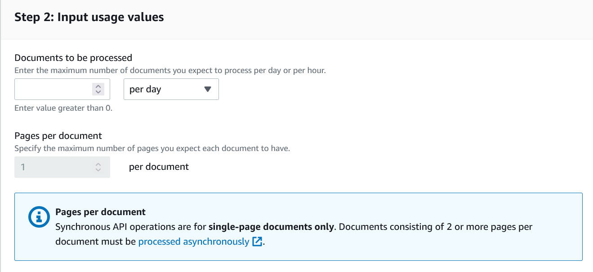
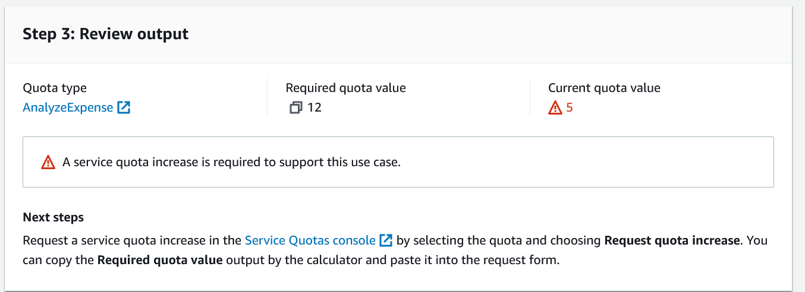

# Modifying Default Quotas in Amazon Textract

Your
console account has default quotas
for Amazon Textract operations. These are a set of Region-specific quotas that you can
modify. Default quotas can be viewed or changed via the Service Quotas console. You can also
view the current Amazon Textract default quotas on the [Amazon Textract endpoints and service
quotas](../../../general/latest/gr/textract.md "../../../general/latest/gr/textract.md").

## Types of Quotas

There are two types of quotas for Amazon Textract.

- Transactions Per Second (TPS) (Synchronous and Asynchronous)
- Concurrent Jobs (Asynchronous Only)
- Adapters

### TPS

TPS quotas determine how often you can request that Textract process a new
document. TPS quotas are unique to API, Synchronous or Asynchronous operations,
and Region.

#### Synchronous TPS

Synchronous operations are used for processing single-page documents and
receiving near real-time responses for Textract include AnalyzeDocument,
DetectDocumentText, AnalyzeExpense, and AnalyzeID. For more information, see
[Processing Documents Synchronously](sync.md "sync.md").

For the following Synchronous APIs, Maximum Transactions Per Second (TPS)
describes the maximum number of transactions (API calls) you can perform
with your account in a given region:

- AnalyzeDocument
- DetectDocumentText
- AnalyzeExpense
- AnalyzeID

#### Asynchronous TPS

Amazon Textract provides non-real time, asynchronous operations for the
processing of larger, multipage documents. There are two types of
asynchronous processing operations: Start operations and Get operations.
Start operations are used to request that Textract process a document, while
Get operations are used to obtain the status and results of document
processing. Quotas for both Start and Get operations are measured in TPS.
For more information about asynchronous processing, see [Processing Documents Asynchronously](async.md "async.md").

For the following, Start and Get APIs, Maximum Transactions Per Second
(TPS) describes the maximum number of transactions (API calls) you can
perform with your account in a given region:

##### Start

- StartDocumentAnalysis
- StartDocumentTextDetection
- StartExpenseAnalysis

##### Get

- GetDocumentAnalysis
- GetDocumentTextDetection
- GetExpenseAnalysis

### Concurrent Jobs

Concurrent job limit defines how many jobs can be run in parallel at a given time.
The Concurrent Job limits apply only to asynchronous operations, and is unique to individual operations.

The following APIs have quotas defining the Maximum Number of Concurrent Jobs
that your account can create in a given region:

- AnalyzeDocument
- DetectDocumentText
- DetectDocumentExpense

### Adapters

The Adapter Quotas define the following limits for
adapter training. Use the Service Quotas console to raise a service
quota increase request.

- Maximum number of adapters - Total number of
  adapters allowed. You can have a several adapter versions under a single
  adapter
- Maximum AdapterVersions created per month - Number of
  successful adapter versions that can be created per AWS account per
  month. This will be reset at the start of every month.
- Maximum
  in-progress AdapterVersions (analogous to adapter training) per
  account.

## Calculate quota increase

Amazon Textract has a product specific [Service Quotas Calculator](https://console.aws.amazon.com/textract/home#/quotaCalculator "https://console.aws.amazon.com/textract/home#/quotaCalculator") to estimate your quota needs.
You can use the Textract Service Quotas Calculator to estimate the quota values
that will satisfy your use case. It is accessible from the Amazon Textract console. This
section will outline the process of calculating a quota to suit your needs with the
Quotas Calculator.

###### To use the Textract Service Quotas Calculator

1. **Selecting Regions**

Select your account's region

The service calculator can estimate quotas in any region, and different
regions have different default quotas. As such, make sure you match your
account's region to the region you're calculating for. If you want to
calculate a quota for a different region, change your account's region in
the console first. 2. **Processing type**

Select _Synchronous_ or _Asynchronous_.

Synchronous and Asynchronous operations have different limits in Amazon
Textract. Determine which type of operation that you intend to use the most,
and select that operation type for calculations. Generally, synchronous
operations are used for single page document processing, where asynchronous
processing covers multipage documents.

For example, if your use case is processing single page customer receipts, you'll select Synchronous 3. **Use case type**

Select the operation best suited for your use
case.

Different operations extract different kinds of data, so select the operation
most suited to your use case. For more information on the data extracted by
different operations, see [Identifying Your Amazon Textract Use Case](how-it-works.md "how-it-works.md").

For example, if your use case is primarily related to processing receipts,
you'll select _Expense Analysis_ from the list of operations. 4. **Usage values**

Specify your usage values.

When determining requirements, keep in mind whether your type of
operation. For Synchronous operations, specify the maximum number of pages
you want to process in a given timeframe, either hours or days.

###### Note

For asynchronous operations you
also can enter the expected number of hours processing will require, and the
average number of pages in the processed documents.

For example, if you process an average of a million receipts a day, you'll
enter 1,000,000 into the _Documents to be processed tab_ to estimate the quota value needed. 5. **Review results**

Check step 3 of the calculator page and review the calculator's output. The calculator
pulls your current quotas information and compares them to the quotas required for your use case. This will tell you
if your current quotas are too low for your processing needs. If this is the case, you can click on the link
provided by the calculator which will directly link you to a quota increase request for the operation you estimated for
in the region you selected in Service quotas.

###### Note

If you are calculating for asynchronous, you will see multiple quotas estimated. You will need to click the link
for each quota to request an increase for each one, if an increase is required.

Following with our example throughout these steps, you would require a TPS
of 12 to process all one million receipts in a day.
As
such, you'll need to request an increase from the default
TPS of 5.

## Best Practices for Service Quota Increase Requests

When requesting an increase to a default quota, there are several recommended best
practices to follow. These include smooth spiky traffic, configuring retries, and
configuring exponential backoff and jitters.

- Estimate your optimal quota values using the Textract Service Quota Calculator.
- Smoothening spiky traffic. Spiky traffic affects throughput. To get maximum throughput for the
  allotted transactions per second (TPS), use a queueing serverless architecture or another mechanism
  to “smooth” traffic so it is more consistent.
- Configure retries. Follow the guidelines at [Error handling](handling-errors.md "handling-errors.md") to configure retries for the errors that allow them
- Configure exponential backoff and jitter. By configuring exponential
  backoff and jitter for retries, you can improve throughput. See [Error
  retries and exponential backoff in AWS.](../../../general/latest/gr/api-retries.md "../../../general/latest/gr/api-retries.md")
- Start with samples that apply best practices, like the [IDP CDK Samples](https://github.com/aws-samples/amazon-textract-idp-cdk-stack-samples "https://github.com/aws-samples/amazon-textract-idp-cdk-stack-samples")
  using [CDK Constructs](https://github.com/aws-samples/amazon-textract-idp-cdk-constructs "https://github.com/aws-samples/amazon-textract-idp-cdk-constructs").

## Change Default Quota

As an alternative to raising a request directly from the calculator, you can also
use the Service quotas console. This can be done from the [Service quotas console](https://console.aws.amazon.com/servicequotas "https://console.aws.amazon.com/servicequotas"), and may be
processed automatically. Under some circumstances, such as a particularly large
increase, the request will be processed manually and additional information may be
required.

###### To raise a service quota increase request

1. Log in to Management Console and navigate to the [Service quotas console](https://console.aws.amazon.com/servicequotas "https://console.aws.amazon.com/servicequotas") and select
   “Textract” under services
2. Select the desired quota and click “Request Quota Increase” on the subsequent page
3. Enter in the desired quota value and click “Request”. If you used the Service Quotas Calculator,
   you can copy the quota value from your calculations into the request.
4. After requesting a quota increase, refresh the page to see the quota status update.

###### Note

Some increases in quota values may need manual review.

## Quota Modification Effects

The following table lists the different types of quotas and the effects
modifying them will have.

| Quota Value to Increase          | Effect of Increase                                                                                                                                      |
| -------------------------------- | ------------------------------------------------------------------------------------------------------------------------------------------------------- |
| Synchronous operation TPS        | Increases how often you can request that Textract process a new document using a given synchronous operation, measured in transactions per second |
| Asynchronous Start operation TPS | Increases how often you can request that Textract begin the asynchronous processing of an input document, measured in transactions per second     |
| Asynchronous Get operation TPS   | Increases how often you can request that Textract return the results of a given asynchronous analysis job, measured in transactions per second    |
| Asynchronous Concurrent jobs     | Increases the total number of documents that you can have processing in parallel.                                                                    |
