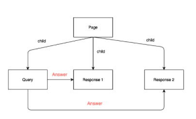

# Queries

When provided a query, Amazon Textract provides a specialized response object. This
object repeats the question back to the user along with the alias for the
question. It then provides the confidence Amazon Textract has with the answer, a
location of the answer on the page, and the text answer to the question. If no
answer is found, this response element is kept blank.

Detected queries are returned as Block objects in the responses from
AnalyzeDocument and GetDocumentAnalysis. You can use the FeatureTypes input
parameter to retrieve information about key-value pairs, tables, or Queries. For
general information about how a document is represented by Block objects, see
[Text Detection and Document Analysis
Response Objects](how-it-works-document-layout.md "how-it-works-document-layout.md").

The following shows a diagram of how a query response is represented in
`Block` objects.


Following is an example for a query response as part of a full response of
document analysis.

```

                        {
                            "BlockType": "QUERY",
                            "Id": "77cfbd28-168a-40fc-9c8a-863ba3066bd2",
                            "Relationships": [
                            {
                                "Type": "ANSWER",
                                "Ids": [
                                "21396475-27ee-4da7-965b-f7631ef60fcc"
                                ]
                            }
                            ],
                            "Query": {
                                "Text": "What is the patient first name?",
                                "Alias": "PATIENT_FIRST_NAME"
                            }
                            },
                        {
                            "BlockType": "QUERY_RESULT",
                            "Confidence": 1.0,
                            "Text": "ALEJANDRO",
                            "Id": "21396475-27ee-4da7-965b-f7631ef60fcc"
                        }

```

We have compiled a list of example queries for common documents in the [Example Queries document](samples/Example%20Queries.md "samples/Example%20Queries.md").
