# Custom Queries tutorial

This tutorial shows you how to create, train, evaluate, use, and manage adapters.

With adapters, you can improve the accuracy of the Amazon Textract API operations,
customizing the model’s behavior to fit your own needs and use cases. After you create
an adapter with this tutorial, you can use it when analyzing your own documents with the
[AnalyzeDocument](API_AnalyzeDocument.md "API_AnalyzeDocument.md")API
operation, and also retrain the adapter for future improvements.

In this tutorial you’ll learn how to:

- Create an adapter using the AWS Management Console.
- Create a dataset for training your adapter.
- Annotate your training data.
- Train your adapter on your training dataset.
- Review your adapter’s performance.
- Retrain your adapter.
- Use your adapter for document analysis.
- Delete your adapter.

## Prerequisites

Before you begin, we recommend that you read [Creating adapters](textract-creating-using-adapters.md "textract-creating-using-adapters.md").

You must also set up your AWS account and install and configure an AWS SDK.
For the SDK setup instructions, see [Step 2: Set Up the AWS CLI and AWS SDKs](setup-awscli-sdk.md "setup-awscli-sdk.md").

## Create an adapter

Before you can train or use an adapter you must create one. To create an adapter:

1. Sign in to the AWS Management Console and open the [Amazon Textract console](https://console.aws.amazon.com/textract/ "https://console.aws.amazon.com/textract/").
2. In the left pane, choose Custom Queries. The Amazon Textract Custom Queries
   landing page is shown.

 3. The Custom Queries landing page show you a list of all your adapters, and
there is also a button to create an adapter. Choose **Create adapter** to create your adapter. The number of successful trainings
that can be performed per month is limited per AWS account. Refer to [Set Quotas in Amazon Textract](limits-quotas-explained.md "limits-quotas-explained.md") for more information regarding limits.

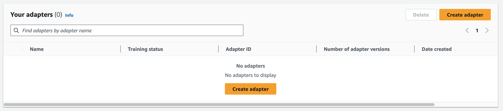 4. On the following page, enter the adapter name, choose whether to
automatically update your adapter, and optionally add tags to it. Then,
select **Create adapter**.
When you choose 'auto-update' Amazon Textract will automatically update your adapter when the pretrained Queries feature is updated.

After you create your adapter, you will be able to see the details for that
adapter, including adapter name and the Adapter ID. The presence of these details
verifies that the adapter has successfully been created.

You can now create the datasets that will be used to train and test your adapter.

## Dataset creation

In this step, you create a training dataset and a test dataset by uploading images
from your local computer or from an Amazon S3 bucket. For more information about
datasets, see [Detecting Text](how-it-works-detecting.md "how-it-works-detecting.md")
[Preparing training and testing
datasets](textract-preparing-training-testing.md "textract-preparing-training-testing.md")

When uploading images from your local computer, you can upload up to 30 images at
one time. If you have a large number of images to upload, consider creating the
datasets by importing the images from an Amazon S3 bucket.

1. To start creating your dataset, choose your adapter from the list of
   adapters, and then choose **Create
   dataset**.

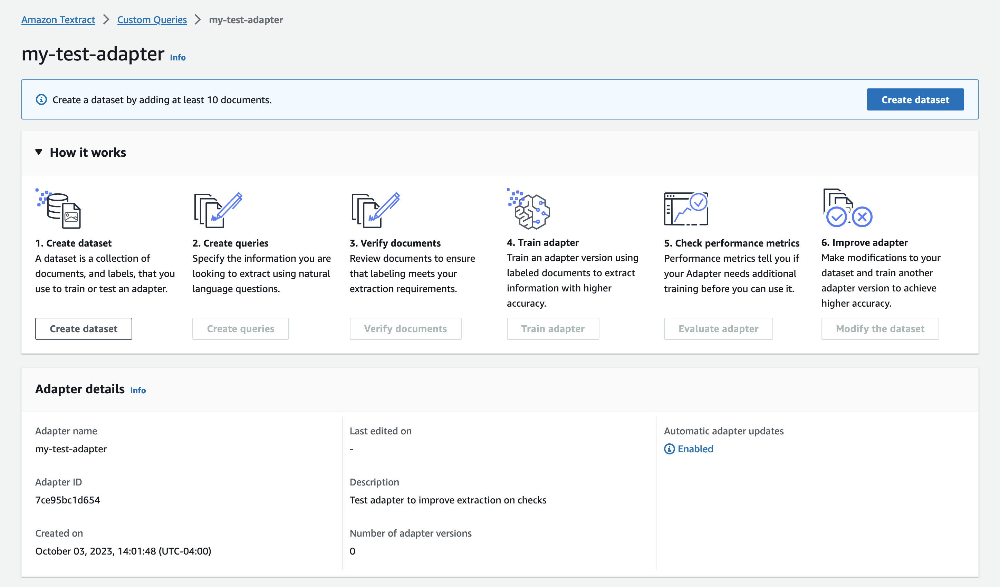 2. In the **Dataset configuration** section,
choose either **Manual split** or **Autosplit**. With manual split, you can specify
individual images as part of your training and testing datasets. If you
choose Autosplit, it will define your training and testing sets
automatically when you upload all of your images. Manual split is
recommended for people who are training adapters for the first time. For
now, choose **Autosplit**.

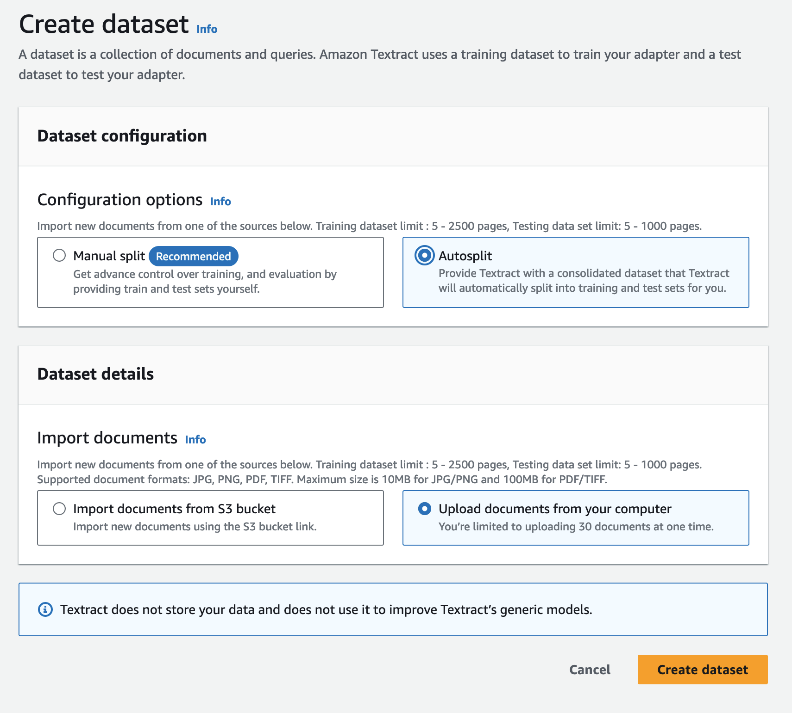 3. In the Training dataset details section, you can choose **Upload documents from your computer** or **Import documents from S3 bucket**. If you choose to
import your documents from an Amazon S3 bucket, provide the path to the bucket
and folder that contains your training images. If you upload your documents
directly from your computer, note that you can only upload 30 documents at
one time. For the purposes of this tutorial, choose Upload documents from
your computer. 4. In the Test dataset details section, you can choose **Upload documents from your computer** or **Import documents from S3 bucket**. For the purposes of this
tutorial, choose **Upload documents from your
computer**. 5. Choose **Create dataset**. 6. After creating the dataset, you will be taken to a Dataset details page.
The dataset details page shows you a list of all the documents in your
entire dataset, and which part of the dataset (train or test) your document
has been assigned to. View this under the **Dataset assigned
to** column. You can also view the following:

    * Document name
    * Document status
    * Number of pages in the document
    * Document type
    * Document size
    * If the document is part of the training set or the testing
     set

7. Select **Add documents to dataset** and add
   at least five documents to both your training and testing datasets. If you
   previously selected Autosplit, you can add all the documents at once.
8. If you want to add more documents to your dataset, use the **Add documents** menu to do so.

Before you can start training your adapter, you need to annotate your training
documents with Queries. This is required to create the "annotations-ref" entries of
your manifest file. After you add all your documents to the training or testing set,
you can start the annotation process.

## Annotation and

verification

In this step, you assign Queries and labels to each document you uploaded to
your training and test datasets. You link a Query to the relevant answers on a
document page with the AWS Management Console annotation tool.

To assign queries and answers to your documents:

1. Select Create queries from the Adapter landing page.

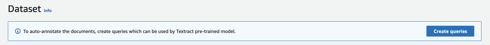 2. Add a query by entering it in the text box.

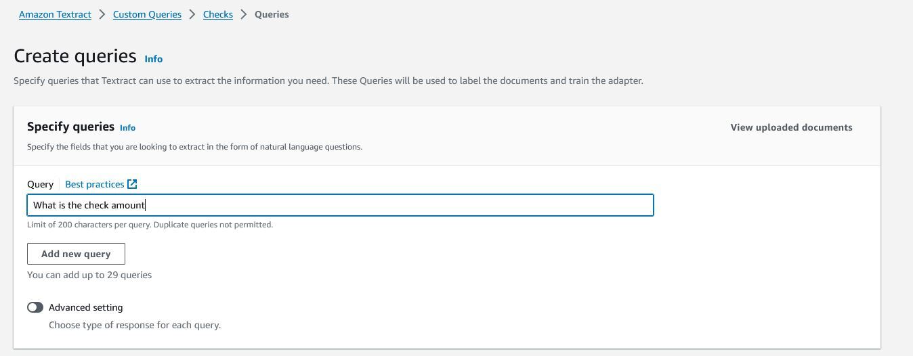 3. To add more queries, choose Add new query.
Queries can have a 'raw text' response or a 'binary - Yes/No' response.
To created a query with a binary response use the advanced setting.

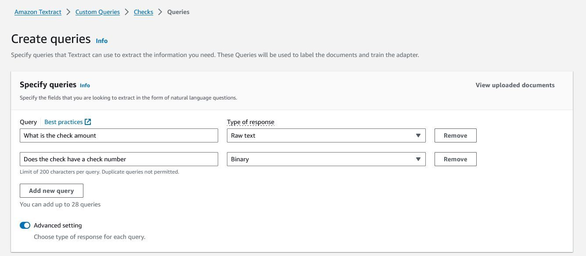 4. After creating your queries, you must assign labels to your documents. To
set labels for your documents, select **Auto-labeling** or **Manual
labeling**. Auto-labeling is recommended for your first time
training the adapter. Select the **Auto-labelling** option, and then choose Start auto-labeling.

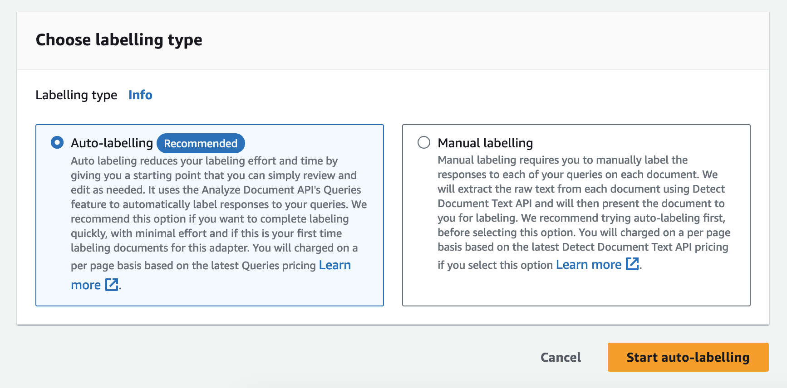 5. The auto-labeling process will take some time to complete. When it's done,
you're notified that “Auto-labeling is now completed.” After the labeling
process is complete, you must verify the accuracy of the labeling. Select
**Verify documents** in the Adapter details
panel on the Details page, and then choose **Start
reviewing** from the Dataset page.

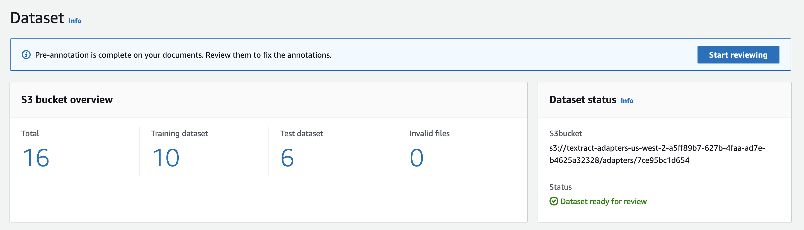 6. In the annotation tool, you can select individual documents and view
individual pages within those documents. Under the “Review responses”
section, select a query that was assigned to your document page. If the
answer to the query is incorrect, you can edit the response by clicking the
**Edit** button for the query.

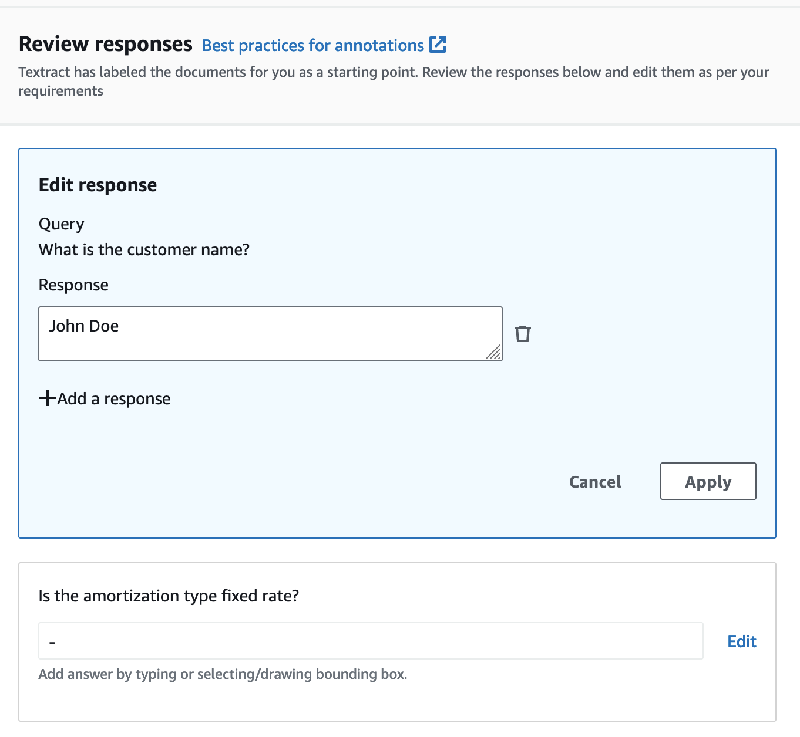

For queries with Yes/No answers, select Yes, No, or Empty. Then, choose
**Apply**.

When editing the OCR for the label assigned to a query, choose the
provided response and then draw a bounding box around part of the document
image. To do so, use the “B” shortcut key or the bounding box tool on the
tool bar at the bottom of the annotation tool. Then, choose **Apply**.

If a query should have more than one response element (answer), you can
add additional responses. To do so, select the query and then choose
**Add a response**. You are then prompted
to draw a bounding box on the area of the document that has the answer.
Confirm that the label for your bounding box is correct.

To add a new query for the document page, choose **Add
query**. If you add a query, you must specify the query you
want to add and then draw a bounding box for the query label.

When you're done, choose **Submit and next**
to proceed to the next document and the next set of queries and responses.
Repeat until you review all of your queries and responses.

After you review and evaluate all your queries and responses, select
**Submit and close**.

## Training

After you add all of your documents to the training set or the testing set and
review the generated responses for your queries, you can train the adapter.

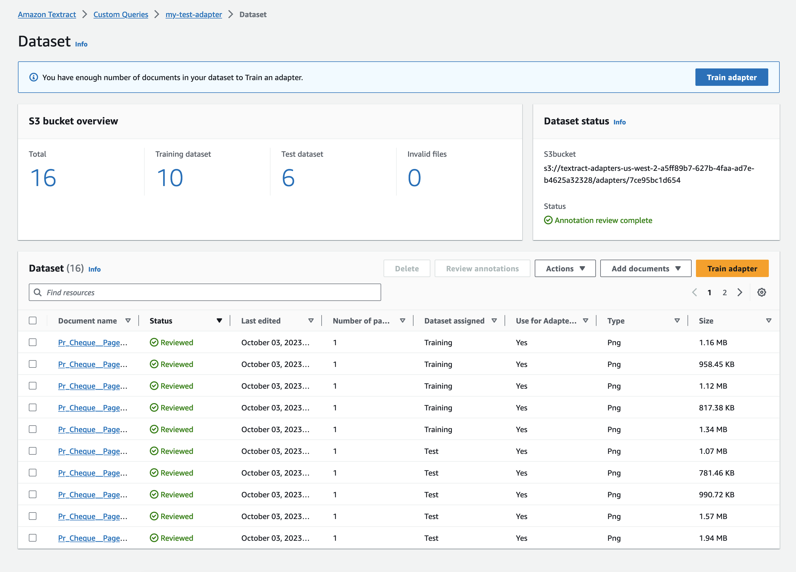

To train the adapter:

1. Start by clicking **Train adapter** on the
   Dataset management page.

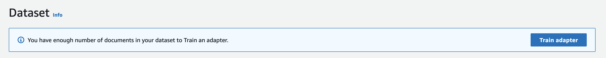 2. While initiating the training process, you can specify an Amazon S3 bucket that
will contain the output of your adapter training job. If you specify an Amazon S3
bucket location that doesn’t exist yet, the bucket path will be created for
you. You can also add tags to your adapter to track it, and customize your
encryption settings. Customize the adapter training to fit your needs and
then choose **Train Adapter**. 3. On the following page, choose **Train
Adapter** to confirm that you want to start the training
process. This will create your first version of your adapter.

After the training process starts, you can monitor the training process status on
the Adapter landing page.

You're notified when the training process completes. Then, you can evaluate the
adapter’s performance by inspecting metrics.

## Evaluating adapter performance

To evaluate model performance, use the left navigation pane to select the
adapter version to evaluate.

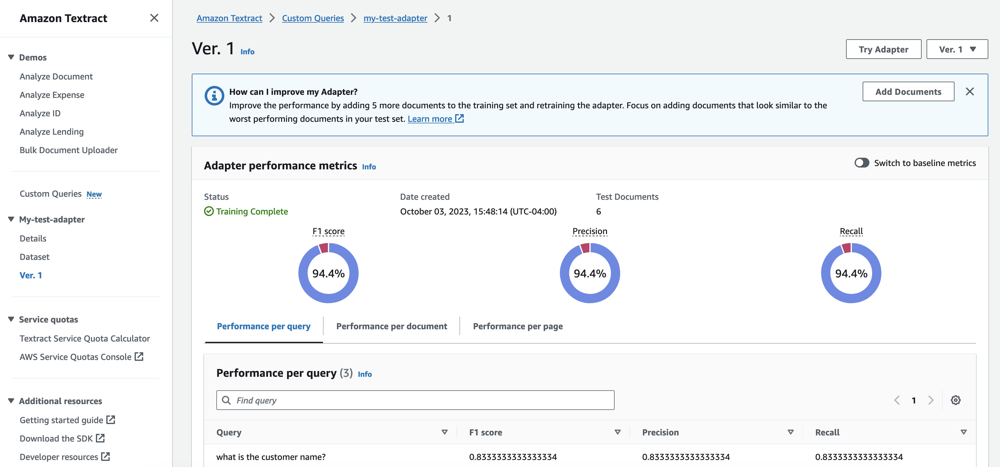

By examining your adapter’s metrics, you can determine how your adapter is
performing on the documents in your dataset and the queries you have defined. You
can see the F1 Score, Precision, and Recall for your adapter across different
elements of the training data: queries, documents, and pages. To switch between
performance for these elements, choose the different tabs below the metrics display
pane.

You can also view baseline metrics at any time by toggling the **Switch to baseline metrics** switch.

The summary of your adapter version’s performance also contains some tips on
how to improve your adapter’s performance. You can review these tips at any time to
improve your adapter. For more information about how to manage and improve your
adapter, see [Evaluating and improving your
adapters](textract-evaluating-improving-adapters.md "textract-evaluating-improving-adapters.md").

To demo your adapter and see its performance on a document:

1. Choose **Try Adapter**.

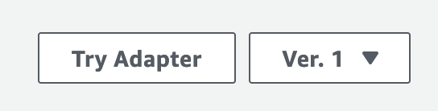 2. On the **Try adapter** page, you can choose a
document to analyze with your adapter. Select the **Choose document** button and browse to the document’s location
on your device. Alternatively, drag and drop the document into the **Upload a document** pane.

After uploading a document, the Try Adapter page will update to display the
results of the adapter’s analysis, including queries, query answers, and confidence
levels. If you are satisfied with your adapter’s performance you can proceed to
inference, using your adapter in a call to [AnalyzeDocument](API_AnalyzeDocument.md "API_AnalyzeDocument.md") or [StartDocumentAnalysis](API_StartDocumentAnalysis.md "API_StartDocumentAnalysis.md")
. Otherwise, you can improve your adapter’s performance by retraining your adapter
with additional documents.

## Improving an

adapter

To improve your adapter’s performance:

1. Choose **Modify the dataset** on the Adapter
   details page.

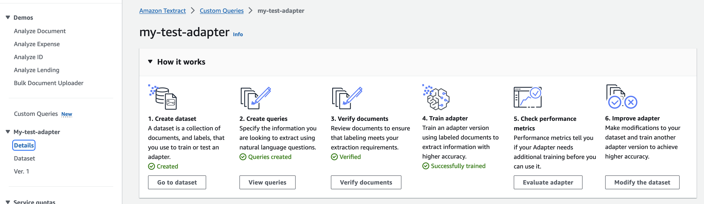 2. On the Dataset overview page, select **Add
documents**. To retrain your adapter, add at least five more
documents to the training dataset. 3. You are notified that the documents are added to the dataset. Select **Start reviewing** to review the results of the auto-labeling
process. 4. Review the queries and responses. After you review and approve all the annotations for the
documents you added, choose **Submit and
close**. 5. On the dataset management page, choose **Train adapter** to start
training your adapter on all of the data in your training dataset, including
the new training documents.

Every training job you run creates a new version of the adapter. Note the name
of the new adapter version to be sure that you're evaluating the performance of the
proper adapter version.

## Inference

After creating an adapter, you are provided with an ID for your custom adapter.
You can provide this ID to the [AnalyzeDocument](API_AnalyzeDocument.md "API_AnalyzeDocument.md") operation for synchronous document
analysis, or the [StartDocumentAnalysis](API_StartDocumentAnalysis.md "API_StartDocumentAnalysis.md") operation for asynchronous analysis.

Providing the Adapter ID automatically integrates the adapter into the analysis
process and uses it to enhance predictions for your documents. This way, you can
leverage the capabilities of AnalyzeDocument while customizing it to fit your needs.

For an example of how to run inference using your adapter and the AnalyzeDocument
API operation, see [Analyzing Document Text with Amazon Textract](analyzing-document-text.md "analyzing-document-text.md").

When multiple adapters must be applied to different pages in
the same document, you can specify one or more adapter(s) and their respective
adapter versions as part of the API request. You can use the Page parameter to
specify which pages to apply an adapter to.

Note the following:

This is similar to how the `Page` parameter for Queries works. Note the
following:

- If a page is not specified, it is set to `["1"]` by
  default.
- The following characters are valid in the parameter string: `1 2 3 4
5 6 7 8 9 - *`. Blank spaces are not valid.
- When using \* to indicate all pages, it must be the only element in the
  list.
- The `Page` parameter does not overlap across adapters. A page
  can only have one adapter applied to it.

## Adapter management

The following steps are repeated iteratively (after initial training of your adapter):

- Choose **Modify the dataset** on the Adapter details page of the
  Amazon Textract console.
- Select **Add documents**.
- Add at least five more documents to the training dataset to retrain your adapter.
- You're notified that the documents have been added to the dataset. Select **Start reviewing** to review the results of the
  auto-labeling process.
- Review the queries and responses. After you review and approve all the annotations for the new
  documents, select **Train adapter**.
- Wait for the adapter to complete the new round of training, then
  check performance metrics for your new adapter version.

After you train your model to your target performance level, you can use your
adapter for inference in your application.

Be sure to delete adapter versions that you no longer need. To delete an adapter:

- Go to the Adapters landing page, select the adapter, and choose
  **Delete**.
- Type **Delete** into the text box, and then choose
  **Delete**.
