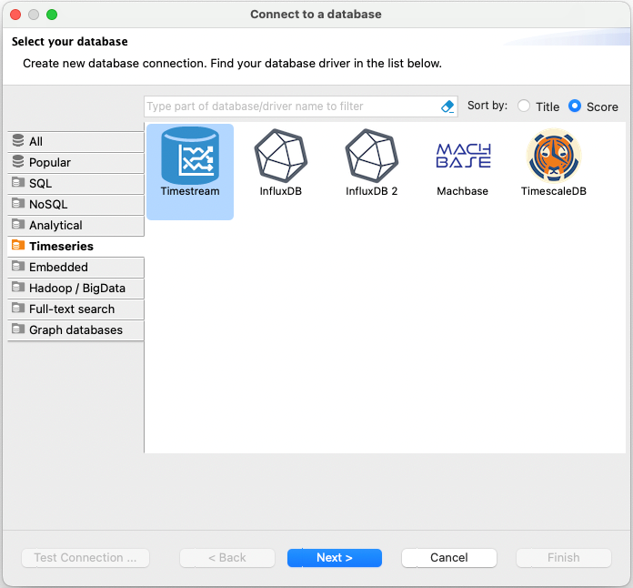
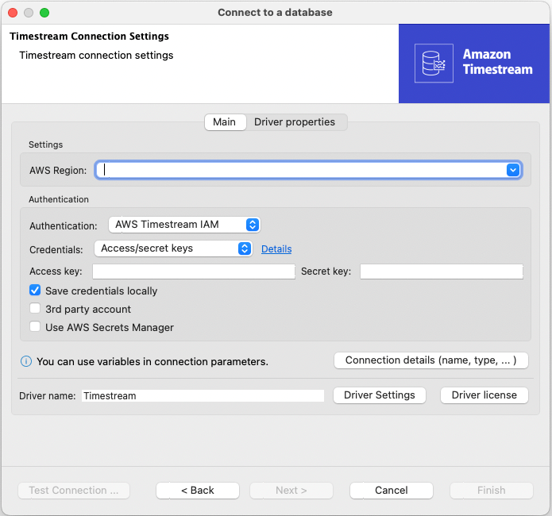
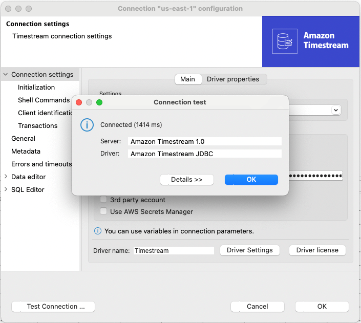
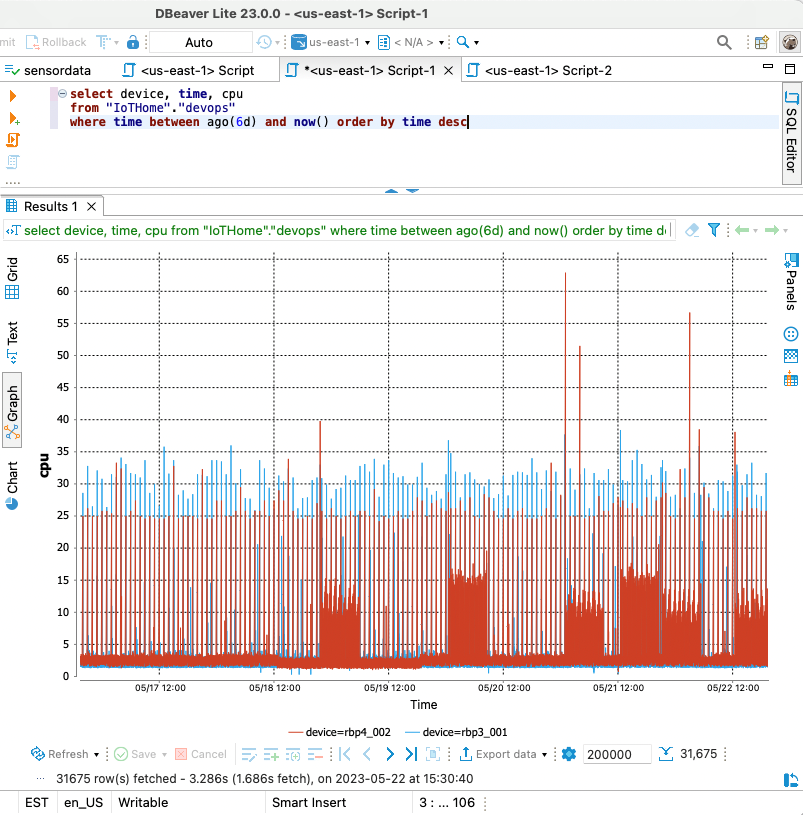

For similar capabilities to Amazon Timestream for LiveAnalytics, consider Amazon Timestream for InfluxDB. It offers simplified
data ingestion and single-digit millisecond query response times for real-time analytics. Learn more [here](timestream-for-influxdb.md "timestream-for-influxdb.md").

# Using DBeaver to work with Amazon Timestream

[DBeaver](https://dbeaver.io/ "https://dbeaver.io/") is a free universal SQL client
that can be used to manage any database that has a JDBC driver. It is widely used among
developers and database administrators because of its robust data viewing, editing,
and management capabilities.

Using DBeaver's cloud connectivity options, you can connect DBeaver to
Amazon Timestream natively. DBeaver provides a comprehensive and intuitive interface to work with
time series data directly from within a DBeaver application. Using your credentials,
it also gives you full access to any queries that you could execute from another
query interface. It even lets you create graphs for better understanding and
visualization of query results.

## Setting up DBeaver to work with Timestream

Take the following steps to set up DBeaver to work with Timestream:

1. [Download and install DBeaver](https://dbeaver.io/download/ "https://dbeaver.io/download/")
   on your local machine.
2. Launch DBeaver, navigate to the database selection area, choose
   **Timeseries** in the left pane, and then select the
   **Timestream** icon in the right pane:

 3. In the **Timestream Connection Settings** window,
enter all the information necessary to connect to your Amazon Timestream database.
Please ensure that the user keys you enter have the permissions necessary
to access your Timestream database. Also, be sure to keep the information and keys
you input into DBeaver safe and private, as with any sensitive information.

 4. Test the connection to ensure that everything is set up correctly:

 5. If the connection test is successful, you can now interact with your
Amazon Timestream database just as you would with any other database in DBeaver.
For example, you can navigate to the SQL editor or to the ER Diagram view
to run queries:

 6. DBeaver also provides powerful data visualization tools. To use them,
run your query, then select the graph icon to visualize the result set.
The graphing tool can help you better understand data trends over time.

Pairing Amazon Timestream with DBeaver creates an effective environment for
managing time series data. You can integrate it seamlessly into your
existing workflow to enhance productivity and efficiency.
