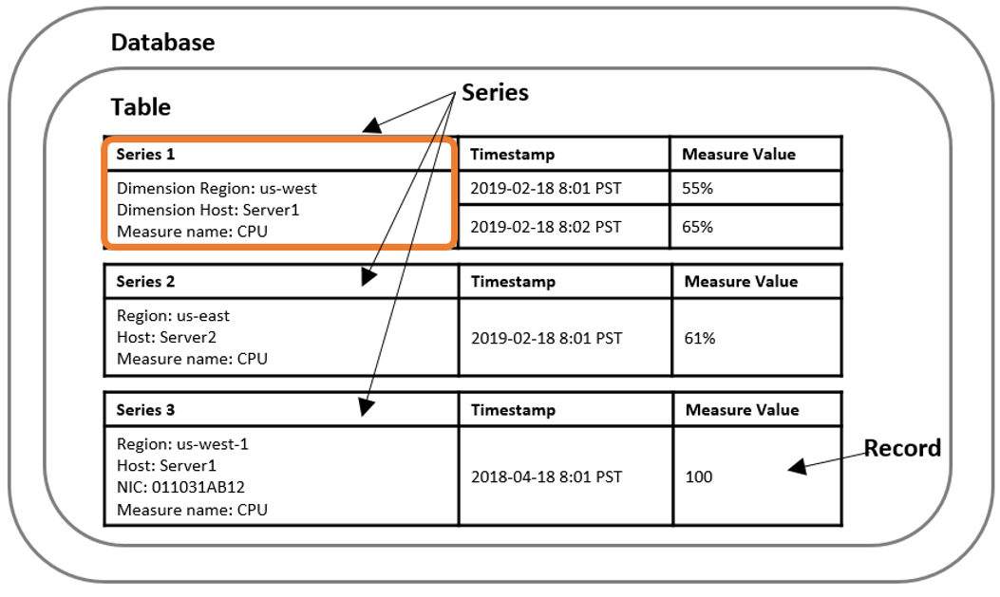

For similar capabilities to Amazon Timestream for LiveAnalytics, consider Amazon Timestream for InfluxDB. It offers simplified
data ingestion and single-digit millisecond query response times for real-time analytics. Learn more [here](timestream-for-influxdb.md "timestream-for-influxdb.md").

# Amazon Timestream for LiveAnalytics concepts

Time series data is a sequence of data points recorded over a time interval. This type of
data is used for measuring events that change over time. Examples include the
following.

- Stock prices over time
- Temperature measurements over time
- CPU utilization of an EC2 instance over time
  With time series data, each data point consists of a timestamp, one or more attributes,
  and the event that changes over time. This data can be used to derive insights into the
  performance and health of an application, detect anomalies, and identify optimization
  opportunities. For example, DevOps engineers might want to view data that measures changes
  in infrastructure performance metrics. Manufacturers might want to track IoT sensor data
  that measures changes in equipment across a facility. Online marketers might want to analyze
  clickstream data that captures how a user navigates a website over time. Because time series
  data is generated from multiple sources in extremely high volumes, it needs to be
  cost-effectively collected in near real time, and therefore requires efficient storage that
  helps organize and analyze the data.

Following are the key concepts of Timestream for LiveAnalytics.

- **Time series** - _A sequence of one or more
  data points (or records) recorded over a time interval._ Examples are
  the price of a stock over time, the CPU or memory utilization of an EC2 instance
  over time, and the temperature/pressure reading of an IoT sensor over time.
- **Record** - _A single data point in a time
  series._
- **Dimension** - _An attribute that describes
  the meta-data of a time series._ A dimension consists of a dimension
  name and a dimension value. Consider the following examples:
  - When considering a stock exchange as a dimension, the dimension name is
    "stock exchange" and the dimension value is "NYSE"
  - When considering an AWS Region as a dimension, the dimension name is
    "region" and the dimension value is "us-east-1"
  - For an IoT sensor, the dimension name is "device ID" and the dimension
    value is "12345"

- **Measure** - _The actual value being
  measured by the record._ Examples are the stock price, the CPU or
  memory utilization, and the temperature or humidity reading. Measures consist of
  measure names and measure values. Consider the following examples:

      + For a stock price, the measure name is "stock price" and the measure value
       is the actual stock price at a point in time.
      + For CPU utilization, the measure name is "CPU utilization" and the measure
       value is the actual CPU utilization.

  Measures can be modeled in Timestream for LiveAnalytics as multi-measure or single-measure records. For
  more information, see [Multi-measure records vs.
  single-measure records](data-modeling.md#data-modeling-multiVsinglerecords "data-modeling.md#data-modeling-multiVsinglerecords").

- **Timestamp** - _Indicates when a measure
  was collected for a given record._ Timestream for LiveAnalytics supports timestamps with
  nanosecond granularity.
- **Table** - _A container for a set of
  related time series._
- **Database** - _A top level container for
  tables._

## A summary of Timestream for LiveAnalytics concepts

A **database** contains 0 or more **tables**. Each
**table** contains 0 or more **time series**. Each
**time series** consists of a sequence of
**records** over a given time interval at a specified
**granularity**. Each **time series** can be
described using its meta-data or **dimensions**, its data or
**measures**, and its **timestamps**.

