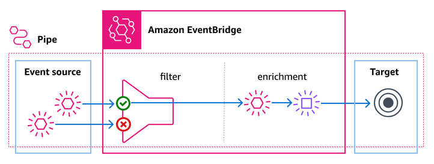

For similar capabilities to Amazon Timestream for LiveAnalytics, consider Amazon Timestream for InfluxDB. It offers simplified
data ingestion and single-digit millisecond query response times for real-time analytics. Learn more [here](timestream-for-influxdb.md "timestream-for-influxdb.md").

# Amazon DynamoDB

## Using EventBridge Pipes to send DynamoDB data to Timestream

You can use EventBridge Pipes to send data from a DynamoDB stream to a Amazon Timestream for LiveAnalytics table.

Pipes are intended for point-to-point
integrations between supported sources and targets, with support for advanced transformations and
enrichment. Pipes reduce the need for specialized
knowledge and integration code when developing event-driven architectures. To set up a pipe, you choose the source, add optional
filtering, define optional enrichment, and choose the target for the event data.

For more information on EventBridge Pipes, see [EventBridge Pipes](../../../eventbridge/latest/userguide/eb-pipes.md "../../../eventbridge/latest/userguide/eb-pipes.md")
in the _EventBridge User Guide_. For information on configuring a pipe to deliver events to a Amazon Timestream for LiveAnalytics table, see
[EventBridge Pipes target specifics](../../../eventbridge/latest/userguide/pipes-targets-specifics.md#pipes-targets-specifics-timestream "../../../eventbridge/latest/userguide/pipes-targets-specifics.md#pipes-targets-specifics-timestream").
