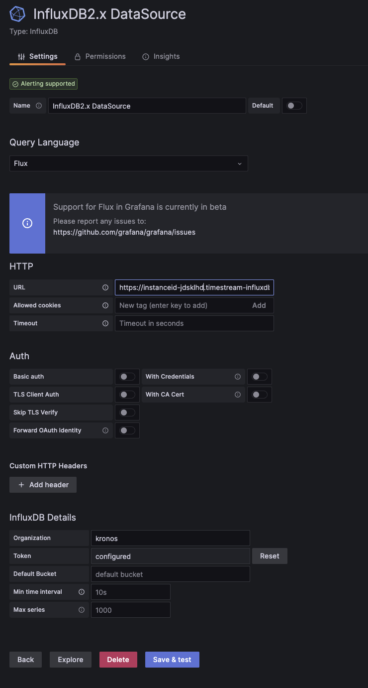
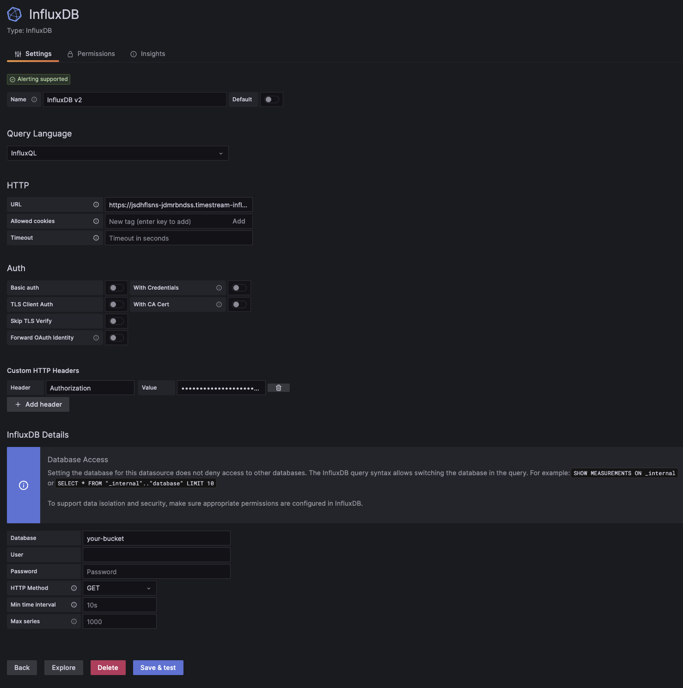

For similar capabilities to Amazon Timestream for LiveAnalytics, consider Amazon Timestream for InfluxDB. It offers simplified
data ingestion and single-digit millisecond query response times for real-time analytics. Learn more [here](timestream-for-influxdb.md "timestream-for-influxdb.md").

# Grafana

Use [Amazon Managed Grafana](https://aws.amazon.com/grafana/ "https://aws.amazon.com/grafana/"), Grafana, or Grafana Cloud to visualize data from your Timestream for InfluxDB instance.

## Connect to Grafana

###### Important

The instructions in this guide require Grafana Cloud or Grafana 10.3+.

1. Create your [Timestream for InfluxDB
   DB instance](timestream-for-influx-getting-started-creating-db-instance.md "timestream-for-influx-getting-started-creating-db-instance.md") or [Timestream for InfluxDB
   DB cluster](timestream-for-influx-create-rr-cluster.md "timestream-for-influx-create-rr-cluster.md").
2. Create an [Amazon Managed Grafana workspace](https://console.aws.amazon.com/grafana "https://console.aws.amazon.com/grafana"), sign up for [Grafana Cloud](https://grafana.com/products/cloud/ "https://grafana.com/products/cloud/"), or
   download and install [Grafana](https://grafana.com/grafana/download "https://grafana.com/grafana/download").
3. Visit your Amazon Managed Grafana, Grafana Cloud user interface (UI) or, if running Grafana locally, start Grafana and visit http://localhost:3000 in your browser.
4. In the left navigation of the Grafana UI, open the
   **Connections** section and select **Add new
   connection**.
5. Select **InfluxDB** from the list of available data sources
   and click **Add new data source**.
6. On the Data Source configuration page, enter a name for your InfluxDB data source.
7. In the **Query Language** dropdown list, select one of the
   query languages supported by InfluxDB 2.7 (**Flux** or
   **InfluxQL**).

###### Important

SQL is only supported in InfluxDB 3.

### Configure Grafana to use

Flux

With Flux selected as the query language in your InfluxDB data source, configure your InfluxDB connection:

1. In the **HTTP** section, enter your InfluxDB URL in the
   **URL** field.

```
https://`your-timestream-for-influxdb-endpoint`:8086
```

2. In the **InfluxDB Details** section, enter the
   following:
   - In **Organization**: Your InfluxDB [organization
     name or ID](https://docs.influxdata.com/influxdb/v2/admin/organizations/view-orgs/ "https://docs.influxdata.com/influxdb/v2/admin/organizations/view-orgs/").
   - In **Token**: Your [InfluxDB
     API token](https://docs.influxdata.com/influxdb/v2/admin/tokens/ "https://docs.influxdata.com/influxdb/v2/admin/tokens/").
   - In **Default Bucket**: The default [bucket](https://docs.influxdata.com/influxdb/v2/admin/buckets/ "https://docs.influxdata.com/influxdb/v2/admin/buckets/")
     to use in Flux queries.
   - In **Min time interval**: The Grafana minimum
     time interval. The default is 10 seconds.
   - In **Max series**: The maximum number of series
     or tables Grafana will process. The default is 1,000.

 3. Click **Save & test**. Grafana attempts to
connect to the InfluxDB 2.7 data source and returns the results of the test.

### Configure Grafana to use

InfluxQL

To query InfluxDB 2.7 with InfluxQL, find your use case below and then complete
the instructions to configure Grafana.

#### New

install of InfluxDB 2.7:

To configure Grafana to use InfluxQL with a new install of InfluxDB 2.7, do
the following:

1. Authenticate with [InfluxDB
   2.7 tokens](https://docs.influxdata.com/influxdb/v2/admin/tokens/ "https://docs.influxdata.com/influxdb/v2/admin/tokens/").
2. Manually create [DBRP
   mappings](https://docs.influxdata.com/influxdb/v2/tools/grafana/?t=InfluxQL#view-and-create-influxdb-dbrp-mappings "https://docs.influxdata.com/influxdb/v2/tools/grafana/?t=InfluxQL#view-and-create-influxdb-dbrp-mappings").

#### Manual

migration from InfluxDB 1.x to 2.7:

To configure Grafana to use InfluxQL when you have manually migrated from
InfluxDB 1.x to InfluxDB 2.7, do the following:

1. If your InfluxDB 1.x instance required authentication, [create
   v1-compatible authentication credentials](https://docs.influxdata.com/influxdb/v2/tools/grafana/?t=InfluxQL#view-and-create-influxdb-v1-authorizations "https://docs.influxdata.com/influxdb/v2/tools/grafana/?t=InfluxQL#view-and-create-influxdb-v1-authorizations") to match your
   previous 1.x username and password. Otherwise, use [InfluxDB
   v2 token authentication](https://docs.influxdata.com/influxdb/v2/admin/tokens/ "https://docs.influxdata.com/influxdb/v2/admin/tokens/").
2. Manually create [DBRP
   mappings](https://docs.influxdata.com/influxdb/v2/tools/grafana/?t=InfluxQL#view-and-create-influxdb-dbrp-mappings "https://docs.influxdata.com/influxdb/v2/tools/grafana/?t=InfluxQL#view-and-create-influxdb-dbrp-mappings").

With InfluxQL selected as the query language in your InfluxDB data source, configure your InfluxDB connection:

1. In the **HTTP** section, enter your InfluxDB URL in the
   **URL** field.

```
https://`your-timestream-for-influxdb-endpoint`:8086
```

2. In the **Custom HTTP Headers** section, enter the
   following:
   - Select **Add header**. Provide your
     InfluxDB API token:
     - In **Header**, enter
       **Authorization**.
     - In **Value**, use the
       `Token` schema and provide your InfluxDB
       API token. For example, `Token
y0uR5uP3rSecr3tT0k3n`.

3. In the **InfluxDB Details** section, enter the
   following:
   - In **Database**: The database name
     [mapped
     to your InfluxDB 2.7 bucket](https://docs.influxdata.com/influxdb/v2/tools/grafana/?t=InfluxQL#view-and-create-influxdb-dbrp-mappings "https://docs.influxdata.com/influxdb/v2/tools/grafana/?t=InfluxQL#view-and-create-influxdb-dbrp-mappings").
   - In **User** and
     **Password**: The username and password associated with
     your [InfluxDB
     1.x compatibility authorization](https://docs.influxdata.com/influxdb/v2/tools/grafana/?t=InfluxQL#view-and-create-influxdb-v1-authorizations "https://docs.influxdata.com/influxdb/v2/tools/grafana/?t=InfluxQL#view-and-create-influxdb-v1-authorizations").
   - In **HTTP Method**: Select
     **GET**.

 4. Click **Save & test**. Grafana attempts to
connect to the InfluxDB 2.7 data source and returns the results of the test.

### Query and

visualize data

After configuring your InfluxDB connection, you can use Grafana and Flux to query and
visualize time series data stored in your InfluxDB instance.

For more information about using Grafana, see the Grafana [technical documentation](https://grafana.com/docs/ "https://grafana.com/docs/"). If
you are just learning Flux, see [Get started with
Flux](https://docs.influxdata.com/flux/v0/get-started/ "https://docs.influxdata.com/flux/v0/get-started/").
