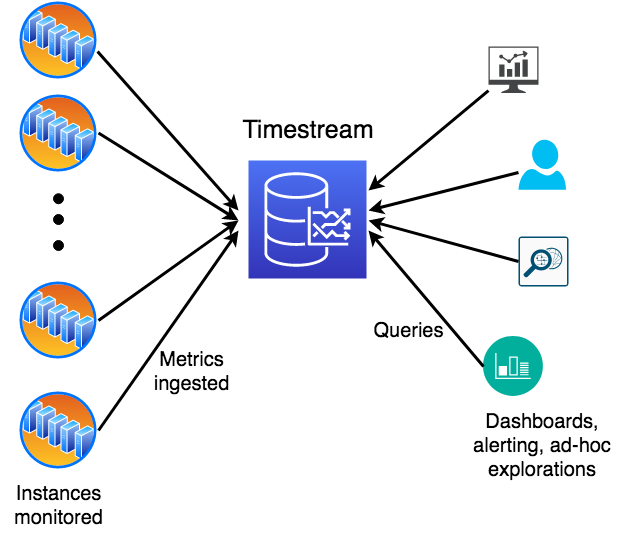

For similar capabilities to Amazon Timestream for LiveAnalytics, consider Amazon Timestream for InfluxDB. It offers simplified
data ingestion and single-digit millisecond query response times for real-time analytics. Learn more [here](timestream-for-influxdb.md "timestream-for-influxdb.md").

# Scheduled queries sample

schema

In this example we will use a sample application mimicking a DevOps scenario
monitoring metrics from a large fleet of servers. Users want to alert on anomalous
resource usage, create dashboards on aggregate fleet behavior and utilization, and
perform sophisticated analysis on recent and historical data to find correlations. The
following diagram provides an illustration of the setup where a set of monitored
instances emit metrics to Timestream for LiveAnalytics. Another set of concurrent users issues queries for
alerts, dashboards, or ad-hoc analysis, where queries and ingestion run in parallel.


The application being monitored is modeled as a highly scaled-out service that is
deployed in several regions across the globe. Each region is further subdivided into a
number of scaling units called cells that have a level of isolation in terms of
infrastructure within the region. Each cell is further subdivided into silos, which
represent a level of software isolation. Each silo has five microservices that comprise
one isolated instance of the service. Each microservice has several servers with
different instance types and OS versions, which are deployed across three availability
zones. These attributes that identify the servers emitting the metrics are modeled as
[dimensions](concepts.md "concepts.md") in Timestream for LiveAnalytics. In this architecture, we have a hierarchy of dimensions
(such as region, cell, silo, and microservice_name) and other dimensions that cut across
the hierarchy (such as instance_type and availability_zone).

The application emits a variety of metrics (such as cpu_user and memory_free) and
events (such as task_completed and gc_reclaimed). Each metric or event is associated
with eight dimensions (such as region or cell) that uniquely identify the server
emitting it. Data is written with the 20 metrics stored together in a multi-measure
record with measure name metrics and all the 5 events are stored together in another
multi-measure record with measure name events. The data model, schema, and data
generation can be found in the [open-sourced data generator](https://github.com/awslabs/amazon-timestream-tools/tree/mainline/tools/python/perf-scale-workload "https://github.com/awslabs/amazon-timestream-tools/tree/mainline/tools/python/perf-scale-workload"). In addition to the schema and data
distributions, the data generator provides an example of using multiple writers to
ingest data in parallel, using the ingestion scaling of Timestream for LiveAnalytics to ingest millions of
measurements per second. Below we show the schema (table and measure schema) and some
sample data from the data set.

###### Topics

- [Multi-measure
  records](#scheduledqueries-common-schema-example-mmr "#scheduledqueries-common-schema-example-mmr")
- [Single-measure
  records](#scheduledqueries-common-schema-example-smr "#scheduledqueries-common-schema-example-smr")

## Multi-measure

records

**Table Schema**

Below is the table schema once the data is ingested using multi-measure records.
It is the output of DESCRIBE query. Assuming the data is ingested into a database
raw_data and table devops, below is the query.

```
DESCRIBE "raw_data"."devops"
```

| Column                  | Type      | Timestream for LiveAnalytics attribute type |
| ----------------------- | --------- | ------------------------------------------- |
| availability_zone       | varchar   | DIMENSION                                   |
| microservice_name       | varchar   | DIMENSION                                   |
| instance_name           | varchar   | DIMENSION                                   |
| process_name            | varchar   | DIMENSION                                   |
| os_version              | varchar   | DIMENSION                                   |
| jdk_version             | varchar   | DIMENSION                                   |
| cell                    | varchar   | DIMENSION                                   |
| region                  | varchar   | DIMENSION                                   |
| silo                    | varchar   | DIMENSION                                   |
| instance_type           | varchar   | DIMENSION                                   |
| measure_name            | varchar   | MEASURE_NAME                                |
| time                    | timestamp | TIMESTAMP                                   |
| memory_free             | double    | MULTI                                       |
| cpu_steal               | double    | MULTI                                       |
| cpu_iowait              | double    | MULTI                                       |
| cpu_user                | double    | MULTI                                       |
| memory_cached           | double    | MULTI                                       |
| disk_io_reads           | double    | MULTI                                       |
| cpu_hi                  | double    | MULTI                                       |
| latency_per_read        | double    | MULTI                                       |
| network_bytes_out       | double    | MULTI                                       |
| cpu_idle                | double    | MULTI                                       |
| disk_free               | double    | MULTI                                       |
| memory_used             | double    | MULTI                                       |
| cpu_system              | double    | MULTI                                       |
| file_descriptors_in_use | double    | MULTI                                       |
| disk_used               | double    | MULTI                                       |
| cpu_nice                | double    | MULTI                                       |
| disk_io_writes          | double    | MULTI                                       |
| cpu_si                  | double    | MULTI                                       |
| latency_per_write       | double    | MULTI                                       |
| network_bytes_in        | double    | MULTI                                       |
| task_end_state          | varchar   | MULTI                                       |
| gc_pause                | double    | MULTI                                       |
| task_completed          | bigint    | MULTI                                       |
| gc_reclaimed            | double    | MULTI                                       |

**Measure Schema**

Below is the measure schema returned by the SHOW MEASURES query.

```
SHOW MEASURES FROM "raw_data"."devops"
```

| measure_name | data_type | Dimensions                                                                                                                                                                                                                                                                                                                                                                                                                                                                 |
| ------------ | --------- | -------------------------------------------------------------------------------------------------------------------------------------------------------------------------------------------------------------------------------------------------------------------------------------------------------------------------------------------------------------------------------------------------------------------------------------------------------------------------- |
| events       | multi     | [{"data\_type":"varchar","dimension\_name":"availability\_zone"},{"data\_type":"varchar","dimension\_name":"microservice\_name"},{"data\_type":"varchar","dimension\_name":"instance\_name"},{"data\_type":"varchar","dimension\_name":"process\_name"},{"data\_type":"varchar","dimension\_name":"jdk\_version"},{"data\_type":"varchar","dimension\_name":"cell"},{"data\_type":"varchar","dimension\_name":"region"},{"data\_type":"varchar","dimension\_name":"silo"}] |
| metrics      | multi     | [{"data\_type":"varchar","dimension\_name":"availability\_zone"},{"data\_type":"varchar","dimension\_name":"microservice\_name"},{"data\_type":"varchar","dimension\_name":"instance\_name"},{"data\_type":"varchar","dimension\_name":"os\_version"},{"data\_type":"varchar","dimension\_name":"cell"},{"data\_type":"varchar","dimension\_name":"region"},{"data\_type":"varchar","dimension\_name":"silo"},{"data\_type":"varchar","dimension\_name":"instance\_type"}] |

**Example Data**

| region    | Cell             | Silo                    | availability_zone | microservice_name | instance_name                                                    | instance_type | os_version | process_name | jdk_version | measure_name | Time             | cpu_user | cpu_system | cpu_idle | cpu_steal | cpu_iowait | cpu_nice | cpu_hi | cpu_si | memory_used | memory_cached | disk_io_reads | latency_per_read | disk_io_writes | latency_per_write | disk_used | disk_free | network_bytes_in | network_bytes_out | file_descriptors_in_use | memory_free | task_end_state         | gc_pause | task_completed | gc_reclaimed |
| --------- | ---------------- | ----------------------- | ----------------- | ----------------- | ---------------------------------------------------------------- | ------------- | ---------- | ------------ | ----------- | ------------ | ---------------- | -------- | ---------- | -------- | --------- | ---------- | -------- | ------ | ------ | ----------- | ------------- | ------------- | ---------------- | -------------- | ----------------- | --------- | --------- | ---------------- | ----------------- | ----------------------- | ----------- | ---------------------- | -------- | -------------- | ------------ |
| us-east-2 | us-east-2-cell-1 | us-east-2-cell-1-silo-2 | us-east-2-1       | athena            | i-zaZswmJk-athena-us-east-2-cell-1-silo-2-00000216.amazonaws.com | m5.8xlarge    | AL2012     |              |             | metrics      | 11/12/2021 12:43 | 62.8     | 0.408      | 34.2     | 0.972     | 0.0877     | 0.103    | 0.567  | 0.844  | 57.6        | 88.9          | 52.6          | 91.9             | 31.7           | 2.25              | 63.5      | 29.2      | 85.3             | 49.8              | 32.3                    | 57.6        |                        |          |                |              |
| us-east-2 | us-east-2-cell-1 | us-east-2-cell-1-silo-2 | us-east-2-1       | athena            | i-zaZswmJk-athena-us-east-2-cell-1-silo-2-00000216.amazonaws.com | m5.8xlarge    | AL2012     |              |             | metrics      | 11/12/2021 12:41 | 56       | 0.923      | 39.9     | 0.799     | 0.532      | 0.655    | 0.851  | 0.317  | 90.5        | 31.9          | 56.6          | 37.1             | 25             | 93.3              | 52.2      | 33.1      | 7.14             | 53.7              | 65.9                    | 20.4        |                        |          |                |              |
| us-east-2 | us-east-2-cell-1 | us-east-2-cell-1-silo-2 | us-east-2-1       | athena            | i-zaZswmJk-athena-us-east-2-cell-1-silo-2-00000216.amazonaws.com | m5.8xlarge    | AL2012     |              |             | metrics      | 11/12/2021 12:39 | 48.5     | 0.801      | 48.2     | 0.18      | 0.943      | 0.0316   | 0.844  | 0.54   | 97.4        | 41.4          | 55.1          | 32.7             | 86.2           | 33.7              | 72.7      | 61.5      | 80.8             | 5.15              | 44.3                    | 8.5         |                        |          |                |              |
| us-east-2 | us-east-2-cell-1 | us-east-2-cell-1-silo-2 | us-east-2-1       | athena            | i-zaZswmJk-athena-us-east-2-cell-1-silo-2-00000216.amazonaws.com | m5.8xlarge    | AL2012     |              |             | metrics      | 11/12/2021 12:38 | 37.5     | 0.723      | 58.8     | 0.317     | 0.608      | 0.859    | 0.791  | 0.393  | 4.84        | 78.9          | 20.3          | 41.4             | 46.8           | 3.87              | 84.6      | 60.6      | 21.1             | 11.8              | 2.76                    | 10          |                        |          |                |              |
| us-east-2 | us-east-2-cell-1 | us-east-2-cell-1-silo-2 | us-east-2-1       | athena            | i-zaZswmJk-athena-us-east-2-cell-1-silo-2-00000216.amazonaws.com | m5.8xlarge    | AL2012     |              |             | metrics      | 11/12/2021 12:36 | 58       | 0.786      | 38.7     | 0.219     | 0.436      | 0.829    | 0.331  | 0.734  | 51          | 36.8          | 81.8          | 50.5             | 77.9           | 17.8              | 82.3      | 64        | 7.69             | 66.5              | 56.2                    | 31.3        |                        |          |                |              |
| us-east-2 | us-east-2-cell-1 | us-east-2-cell-1-silo-2 | us-east-2-1       | athena            | i-zaZswmJk-athena-us-east-2-cell-1-silo-2-00000216.amazonaws.com |               |            | host_manager | JDK_8       | events       | 11/12/2021 12:43 |          |            |          |           |            |          |        |        |             |               |               |                  |                |                   |           |           |                  |                   |                         | 75.8        | SUCCESS_WITH_NO_RESULT | 85.5     | 348            | 64.8         |
| us-east-2 | us-east-2-cell-1 | us-east-2-cell-1-silo-2 | us-east-2-1       | athena            | i-zaZswmJk-athena-us-east-2-cell-1-silo-2-00000216.amazonaws.com |               |            | host_manager | JDK_8       | events       | 11/12/2021 12:41 |          |            |          |           |            |          |        |        |             |               |               |                  |                |                   |           |           |                  |                   |                         | 7.47        | SUCCESS_WITH_RESULT    | 22.8     | 42             | 7.45         |
| us-east-2 | us-east-2-cell-1 | us-east-2-cell-1-silo-2 | us-east-2-1       | athena            | i-zaZswmJk-athena-us-east-2-cell-1-silo-2-00000216.amazonaws.com |               |            | host_manager | JDK_8       | events       | 11/12/2021 12:39 |          |            |          |           |            |          |        |        |             |               |               |                  |                |                   |           |           |                  |                   |                         | 64.1        | SUCCESS_WITH_RESULT    | 6.77     | 249            | 72.3         |
| us-east-2 | us-east-2-cell-1 | us-east-2-cell-1-silo-2 | us-east-2-1       | athena            | i-zaZswmJk-athena-us-east-2-cell-1-silo-2-00000216.amazonaws.com |               |            | host_manager | JDK_8       | events       | 11/12/2021 12:38 |          |            |          |           |            |          |        |        |             |               |               |                  |                |                   |           |           |                  |                   |                         | 23          | SUCCESS_WITH_RESULT    | 53.3     | 138            | 99           |
| us-east-2 | us-east-2-cell-1 | us-east-2-cell-1-silo-2 | us-east-2-1       | athena            | i-zaZswmJk-athena-us-east-2-cell-1-silo-2-00000216.amazonaws.com |               |            | host_manager | JDK_8       | events       | 11/12/2021 12:36 |          |            |          |           |            |          |        |        |             |               |               |                  |                |                   |           |           |                  |                   |                         | 39.4        | SUCCESS_WITH_NO_RESULT | 79.6     | 254            | 82.9         |

## Single-measure

records

Timestream for LiveAnalytics also allows you to ingest the data with one measure per time series record.
Below are the schema details when ingested using single measure records.

**Table Schema**

Below is the table schema once the data is ingested using multi-measure records.
It is the output of DESCRIBE query. Assuming the data is ingested into a database
raw_data and table devops, below is the query.

```
DESCRIBE "raw_data"."devops_single"
```

| Column                 | Type      | Timestream for LiveAnalytics attribute type |
| ---------------------- | --------- | ------------------------------------------- |
| availability_zone      | varchar   | DIMENSION                                   |
| microservice_name      | varchar   | DIMENSION                                   |
| instance_name          | varchar   | DIMENSION                                   |
| process_name           | varchar   | DIMENSION                                   |
| os_version             | varchar   | DIMENSION                                   |
| jdk_version            | varchar   | DIMENSION                                   |
| cell                   | varchar   | DIMENSION                                   |
| region                 | varchar   | DIMENSION                                   |
| silo                   | varchar   | DIMENSION                                   |
| instance_type          | varchar   | DIMENSION                                   |
| measure_name           | varchar   | MEASURE_NAME                                |
| time                   | timestamp | TIMESTAMP                                   |
| measure_value::double  | double    | MEASURE_VALUE                               |
| measure_value::bigint  | bigint    | MEASURE_VALUE                               |
| measure_value::varchar | varchar   | MEASURE_VALUE                               |

**Measure Schema**

Below is the measure schema returned by the SHOW MEASURES query.

```
SHOW MEASURES FROM "raw_data"."devops_single"
```

| measure_name            | data_type | Dimensions                                                                                                                                                                                                                                                                                                                                                                                                                                                                                                                                                                                                                                                        |
| ----------------------- | --------- | ----------------------------------------------------------------------------------------------------------------------------------------------------------------------------------------------------------------------------------------------------------------------------------------------------------------------------------------------------------------------------------------------------------------------------------------------------------------------------------------------------------------------------------------------------------------------------------------------------------------------------------------------------------------- |
| cpu_hi                  | double    | [{'dimension\_name': 'availability\_zone', 'data\_type': 'varchar'},<br>{'dimension\_name': 'microservice\_name', 'data\_type': 'varchar'},<br>{'dimension\_name': 'instance\_name', 'data\_type': 'varchar'},<br>{'dimension\_name': 'os\_version', 'data\_type': 'varchar'},<br>{'dimension\_name': 'cell', 'data\_type': 'varchar'},<br>{'dimension\_name': 'region', 'data\_type': 'varchar'},<br>{'dimension\_name': 'silo', 'data\_type': 'varchar'},<br>{'dimension\_name': 'instance\_type', 'data\_type': 'varchar'}]                                                                                                                                    |
| cpu_idle                | double    | [{'dimension\_name': 'availability\_zone', 'data\_type': 'varchar'},<br>{'dimension\_name': 'microservice\_name', 'data\_type': 'varchar'},<br>{'dimension\_name': 'instance\_name', 'data\_type': 'varchar'},<br>{'dimension\_name': 'os\_version', 'data\_type': 'varchar'},<br>{'dimension\_name': 'cell', 'data\_type': 'varchar'},<br>{'dimension\_name': 'region', 'data\_type': 'varchar'},<br>{'dimension\_name': 'silo', 'data\_type': 'varchar'},<br>{'dimension\_name': 'instance\_type', 'data\_type': 'varchar'}]                                                                                                                                    |
| cpu_iowait              | double    | [{'dimension\_name': 'availability\_zone', 'data\_type': 'varchar'},<br>{'dimension\_name': 'microservice\_name', 'data\_type': 'varchar'},<br>{'dimension\_name': 'instance\_name', 'data\_type': 'varchar'},<br>{'dimension\_name': 'os\_version', 'data\_type': 'varchar'},<br>{'dimension\_name': 'cell', 'data\_type': 'varchar'},<br>{'dimension\_name': 'region', 'data\_type': 'varchar'},<br>{'dimension\_name': 'silo', 'data\_type': 'varchar'},<br>{'dimension\_name': 'instance\_type', 'data\_type': 'varchar'}]                                                                                                                                    |
| cpu_nice                | double    | [{'dimension\_name': 'availability\_zone', 'data\_type': 'varchar'},<br>{'dimension\_name': 'microservice\_name', 'data\_type': 'varchar'},<br>{'dimension\_name': 'instance\_name', 'data\_type': 'varchar'},<br>{'dimension\_name': 'os\_version', 'data\_type': 'varchar'},<br>{'dimension\_name': 'cell', 'data\_type': 'varchar'},<br>{'dimension\_name': 'region', 'data\_type': 'varchar'},<br>{'dimension\_name': 'silo', 'data\_type': 'varchar'},<br>{'dimension\_name': 'instance\_type', 'data\_type': 'varchar'}]                                                                                                                                    |
| cpu_si                  | double    | [{'dimension\_name': 'availability\_zone', 'data\_type': 'varchar'},<br>{'dimension\_name': 'microservice\_name', 'data\_type': 'varchar'},<br>{'dimension\_name': 'instance\_name', 'data\_type': 'varchar'},<br>{'dimension\_name': 'os\_version', 'data\_type': 'varchar'},<br>{'dimension\_name': 'cell', 'data\_type': 'varchar'},<br>{'dimension\_name': 'region', 'data\_type': 'varchar'},<br>{'dimension\_name': 'silo', 'data\_type': 'varchar'},<br>{'dimension\_name': 'instance\_type', 'data\_type': 'varchar'}]                                                                                                                                    |
| cpu_steal               | double    | [{'dimension\_name': 'availability\_zone', 'data\_type': 'varchar'},<br>{'dimension\_name': 'microservice\_name', 'data\_type': 'varchar'},<br>{'dimension\_name': 'instance\_name', 'data\_type': 'varchar'},<br>{'dimension\_name': 'os\_version', 'data\_type': 'varchar'},<br>{'dimension\_name': 'cell', 'data\_type': 'varchar'},<br>{'dimension\_name': 'region', 'data\_type': 'varchar'},<br>{'dimension\_name': 'silo', 'data\_type': 'varchar'},<br>{'dimension\_name': 'instance\_type', 'data\_type': 'varchar'}]                                                                                                                                    |
| cpu_system              | double    | [{'dimension\_name': 'availability\_zone', 'data\_type': 'varchar'},<br>{'dimension\_name': 'microservice\_name', 'data\_type': 'varchar'},<br>{'dimension\_name': 'instance\_name', 'data\_type': 'varchar'},<br>{'dimension\_name': 'os\_version', 'data\_type': 'varchar'},<br>{'dimension\_name': 'cell', 'data\_type': 'varchar'},<br>{'dimension\_name': 'region', 'data\_type': 'varchar'},<br>{'dimension\_name': 'silo', 'data\_type': 'varchar'},<br>{'dimension\_name': 'instance\_type', 'data\_type': 'varchar'}]                                                                                                                                    |
| cpu_user                | double    | [{'dimension\_name': 'availability\_zone', 'data\_type': 'varchar'},<br>{'dimension\_name': 'microservice\_name', 'data\_type': 'varchar'},<br>{'dimension\_name': 'instance\_name', 'data\_type': 'varchar'},<br>{'dimension\_name': 'os\_version', 'data\_type': 'varchar'},<br>{'dimension\_name': 'cell', 'data\_type': 'varchar'},<br>{'dimension\_name': 'region', 'data\_type': 'varchar'},<br>{'dimension\_name': 'silo', 'data\_type': 'varchar'},<br>{'dimension\_name': 'instance\_type', 'data\_type': 'varchar'}]                                                                                                                                    |
| disk_free               | double    | [{'dimension\_name': 'availability\_zone', 'data\_type': 'varchar'},<br>{'dimension\_name': 'microservice\_name', 'data\_type': 'varchar'},<br>{'dimension\_name': 'instance\_name', 'data\_type': 'varchar'},<br>{'dimension\_name': 'os\_version', 'data\_type': 'varchar'},<br>{'dimension\_name': 'cell', 'data\_type': 'varchar'},<br>{'dimension\_name': 'region', 'data\_type': 'varchar'},<br>{'dimension\_name': 'silo', 'data\_type': 'varchar'},<br>{'dimension\_name': 'instance\_type', 'data\_type': 'varchar'}]                                                                                                                                    |
| disk_io_reads           | double    | [{'dimension\_name': 'availability\_zone', 'data\_type': 'varchar'},<br>{'dimension\_name': 'microservice\_name', 'data\_type': 'varchar'},<br>{'dimension\_name': 'instance\_name', 'data\_type': 'varchar'},<br>{'dimension\_name': 'os\_version', 'data\_type': 'varchar'},<br>{'dimension\_name': 'cell', 'data\_type': 'varchar'},<br>{'dimension\_name': 'region', 'data\_type': 'varchar'},<br>{'dimension\_name': 'silo', 'data\_type': 'varchar'},<br>{'dimension\_name': 'instance\_type', 'data\_type': 'varchar'}]                                                                                                                                    |
| disk_io_writes          | double    | [{'dimension\_name': 'availability\_zone', 'data\_type': 'varchar'},<br>{'dimension\_name': 'microservice\_name', 'data\_type': 'varchar'},<br>{'dimension\_name': 'instance\_name', 'data\_type': 'varchar'},<br>{'dimension\_name': 'os\_version', 'data\_type': 'varchar'},<br>{'dimension\_name': 'cell', 'data\_type': 'varchar'},<br>{'dimension\_name': 'region', 'data\_type': 'varchar'},<br>{'dimension\_name': 'silo', 'data\_type': 'varchar'},<br>{'dimension\_name': 'instance\_type', 'data\_type': 'varchar'}]                                                                                                                                    |
| disk_used               | double    | [{'dimension\_name': 'availability\_zone', 'data\_type': 'varchar'},<br>{'dimension\_name': 'microservice\_name', 'data\_type': 'varchar'},<br>{'dimension\_name': 'instance\_name', 'data\_type': 'varchar'},<br>{'dimension\_name': 'os\_version', 'data\_type': 'varchar'},<br>{'dimension\_name': 'cell', 'data\_type': 'varchar'},<br>{'dimension\_name': 'region', 'data\_type': 'varchar'},<br>{'dimension\_name': 'silo', 'data\_type': 'varchar'},<br>{'dimension\_name': 'instance\_type', 'data\_type': 'varchar'}]                                                                                                                                    |
| file_descriptors_in_use | double    | [{'dimension\_name': 'availability\_zone', 'data\_type': 'varchar'},<br>{'dimension\_name': 'microservice\_name', 'data\_type': 'varchar'},<br>{'dimension\_name': 'instance\_name', 'data\_type': 'varchar'},<br>{'dimension\_name': 'os\_version', 'data\_type': 'varchar'},<br>{'dimension\_name': 'cell', 'data\_type': 'varchar'},<br>{'dimension\_name': 'region', 'data\_type': 'varchar'},<br>{'dimension\_name': 'silo', 'data\_type': 'varchar'},<br>{'dimension\_name': 'instance\_type', 'data\_type': 'varchar'}]                                                                                                                                    |
| gc_pause                | double    | [{'dimension\_name': 'availability\_zone', 'data\_type': 'varchar'},<br>{'dimension\_name': 'microservice\_name', 'data\_type': 'varchar'},<br>{'dimension\_name': 'instance\_name', 'data\_type': 'varchar'},<br>{'dimension\_name': 'process\_name', 'data\_type': 'varchar'},<br>{'dimension\_name': 'jdk\_version', 'data\_type': 'varchar'},<br>{'dimension\_name': 'cell', 'data\_type': 'varchar'},<br>{'dimension\_name': 'region', 'data\_type': 'varchar'},<br>{'dimension\_name': 'silo', 'data\_type': 'varchar'}]                                                                                                                                    |
| gc_reclaimed            | double    | [{'dimension\_name': 'availability\_zone', 'data\_type': 'varchar'},<br>{'dimension\_name': 'microservice\_name', 'data\_type': 'varchar'},<br>{'dimension\_name': 'instance\_name', 'data\_type': 'varchar'},<br>{'dimension\_name': 'process\_name', 'data\_type': 'varchar'},<br>{'dimension\_name': 'jdk\_version', 'data\_type': 'varchar'},<br>{'dimension\_name': 'cell', 'data\_type': 'varchar'},<br>{'dimension\_name': 'region', 'data\_type': 'varchar'},<br>{'dimension\_name': 'silo', 'data\_type': 'varchar'}]                                                                                                                                    |
| latency_per_read        | double    | [{'dimension\_name': 'availability\_zone', 'data\_type': 'varchar'},<br>{'dimension\_name': 'microservice\_name', 'data\_type': 'varchar'},<br>{'dimension\_name': 'instance\_name', 'data\_type': 'varchar'},<br>{'dimension\_name': 'os\_version', 'data\_type': 'varchar'},<br>{'dimension\_name': 'cell', 'data\_type': 'varchar'},<br>{'dimension\_name': 'region', 'data\_type': 'varchar'},<br>{'dimension\_name': 'silo', 'data\_type': 'varchar'},<br>{'dimension\_name': 'instance\_type', 'data\_type': 'varchar'}]                                                                                                                                    |
| latency_per_write       | double    | [{'dimension\_name': 'availability\_zone', 'data\_type': 'varchar'},<br>{'dimension\_name': 'microservice\_name', 'data\_type': 'varchar'},<br>{'dimension\_name': 'instance\_name', 'data\_type': 'varchar'},<br>{'dimension\_name': 'os\_version', 'data\_type': 'varchar'},<br>{'dimension\_name': 'cell', 'data\_type': 'varchar'},<br>{'dimension\_name': 'region', 'data\_type': 'varchar'},<br>{'dimension\_name': 'silo', 'data\_type': 'varchar'},<br>{'dimension\_name': 'instance\_type', 'data\_type': 'varchar'}]                                                                                                                                    |
| memory_cached           | double    | [{'dimension\_name': 'availability\_zone', 'data\_type': 'varchar'},<br>{'dimension\_name': 'microservice\_name', 'data\_type': 'varchar'},<br>{'dimension\_name': 'instance\_name', 'data\_type': 'varchar'},<br>{'dimension\_name': 'os\_version', 'data\_type': 'varchar'},<br>{'dimension\_name': 'cell', 'data\_type': 'varchar'},<br>{'dimension\_name': 'region', 'data\_type': 'varchar'},<br>{'dimension\_name': 'silo', 'data\_type': 'varchar'},<br>{'dimension\_name': 'instance\_type', 'data\_type': 'varchar'}]                                                                                                                                    |
| memory_free             | double    | [{'dimension\_name': 'availability\_zone', 'data\_type': 'varchar'},<br>{'dimension\_name': 'microservice\_name', 'data\_type': 'varchar'},<br>{'dimension\_name': 'instance\_name', 'data\_type': 'varchar'},<br>{'dimension\_name': 'process\_name', 'data\_type': 'varchar'},<br>{'dimension\_name': 'os\_version', 'data\_type': 'varchar'},<br>{'dimension\_name': 'jdk\_version', 'data\_type': 'varchar'},<br>{'dimension\_name': 'cell', 'data\_type': 'varchar'},<br>{'dimension\_name': 'region', 'data\_type': 'varchar'},<br>{'dimension\_name': 'silo', 'data\_type': 'varchar'},<br>{'dimension\_name': 'instance\_type', 'data\_type': 'varchar'}] |
| memory_used             | double    | [{'dimension\_name': 'availability\_zone', 'data\_type': 'varchar'},<br>{'dimension\_name': 'microservice\_name', 'data\_type': 'varchar'},<br>{'dimension\_name': 'instance\_name', 'data\_type': 'varchar'},<br>{'dimension\_name': 'os\_version', 'data\_type': 'varchar'},<br>{'dimension\_name': 'cell', 'data\_type': 'varchar'},<br>{'dimension\_name': 'region', 'data\_type': 'varchar'},<br>{'dimension\_name': 'silo', 'data\_type': 'varchar'},<br>{'dimension\_name': 'instance\_type', 'data\_type': 'varchar'}]                                                                                                                                    |
| network_bytes_in        | double    | [{'dimension\_name': 'availability\_zone', 'data\_type': 'varchar'},<br>{'dimension\_name': 'microservice\_name', 'data\_type': 'varchar'},<br>{'dimension\_name': 'instance\_name', 'data\_type': 'varchar'},<br>{'dimension\_name': 'os\_version', 'data\_type': 'varchar'},<br>{'dimension\_name': 'cell', 'data\_type': 'varchar'},<br>{'dimension\_name': 'region', 'data\_type': 'varchar'},<br>{'dimension\_name': 'silo', 'data\_type': 'varchar'},<br>{'dimension\_name': 'instance\_type', 'data\_type': 'varchar'}]                                                                                                                                    |
| network_bytes_out       | double    | [{'dimension\_name': 'availability\_zone', 'data\_type': 'varchar'},<br>{'dimension\_name': 'microservice\_name', 'data\_type': 'varchar'},<br>{'dimension\_name': 'instance\_name', 'data\_type': 'varchar'},<br>{'dimension\_name': 'os\_version', 'data\_type': 'varchar'},<br>{'dimension\_name': 'cell', 'data\_type': 'varchar'},<br>{'dimension\_name': 'region', 'data\_type': 'varchar'},<br>{'dimension\_name': 'silo', 'data\_type': 'varchar'},<br>{'dimension\_name': 'instance\_type', 'data\_type': 'varchar'}]                                                                                                                                    |
| task_completed          | bigint    | [{'dimension\_name': 'availability\_zone', 'data\_type': 'varchar'},<br>{'dimension\_name': 'microservice\_name', 'data\_type': 'varchar'},<br>{'dimension\_name': 'instance\_name', 'data\_type': 'varchar'},<br>{'dimension\_name': 'process\_name', 'data\_type': 'varchar'},<br>{'dimension\_name': 'jdk\_version', 'data\_type': 'varchar'},<br>{'dimension\_name': 'cell', 'data\_type': 'varchar'},<br>{'dimension\_name': 'region', 'data\_type': 'varchar'},<br>{'dimension\_name': 'silo', 'data\_type': 'varchar'}]                                                                                                                                    |
| task_end_state          | varchar   | [{'dimension\_name': 'availability\_zone', 'data\_type': 'varchar'},<br>{'dimension\_name': 'microservice\_name', 'data\_type': 'varchar'},<br>{'dimension\_name': 'instance\_name', 'data\_type': 'varchar'},<br>{'dimension\_name': 'process\_name', 'data\_type': 'varchar'},<br>{'dimension\_name': 'jdk\_version', 'data\_type': 'varchar'},<br>{'dimension\_name': 'cell', 'data\_type': 'varchar'},<br>{'dimension\_name': 'region', 'data\_type': 'varchar'},<br>{'dimension\_name': 'silo', 'data\_type': 'varchar'}]                                                                                                                                    |

**Example Data**

| availability_zone | microservice_name | instance_name                                                      | process_name | os_version | jdk_version | Cell             | region    | Silo                    | instance_type | measure_name            | Time    | measure_value::double | measure_value::bigint | measure_value::varchar |
| ----------------- | ----------------- | ------------------------------------------------------------------ | ------------ | ---------- | ----------- | ---------------- | --------- | ----------------------- | ------------- | ----------------------- | ------- | --------------------- | --------------------- | ---------------------- |
| eu-west-1-1       | hercules          | i-zaZswmJk-hercules-eu-west-1-cell-9-silo-2-00000027.amazonaws.com |              | AL2012     |             | eu-west-1-cell-9 | eu-west-1 | eu-west-1-cell-9-silo-2 | r5.4xlarge    | cpu_hi                  | 34:57.2 | 0.87169               |                       |                        |
| eu-west-1-1       | hercules          | i-zaZswmJk-hercules-eu-west-1-cell-9-silo-2-00000027.amazonaws.com |              | AL2012     |             | eu-west-1-cell-9 | eu-west-1 | eu-west-1-cell-9-silo-2 | r5.4xlarge    | cpu_idle                | 34:57.2 | 3.46266               |                       |                        |
| eu-west-1-1       | hercules          | i-zaZswmJk-hercules-eu-west-1-cell-9-silo-2-00000027.amazonaws.com |              | AL2012     |             | eu-west-1-cell-9 | eu-west-1 | eu-west-1-cell-9-silo-2 | r5.4xlarge    | cpu_iowait              | 34:57.2 | 0.10226               |                       |                        |
| eu-west-1-1       | hercules          | i-zaZswmJk-hercules-eu-west-1-cell-9-silo-2-00000027.amazonaws.com |              | AL2012     |             | eu-west-1-cell-9 | eu-west-1 | eu-west-1-cell-9-silo-2 | r5.4xlarge    | cpu_nice                | 34:57.2 | 0.63013               |                       |                        |
| eu-west-1-1       | hercules          | i-zaZswmJk-hercules-eu-west-1-cell-9-silo-2-00000027.amazonaws.com |              | AL2012     |             | eu-west-1-cell-9 | eu-west-1 | eu-west-1-cell-9-silo-2 | r5.4xlarge    | cpu_si                  | 34:57.2 | 0.16441               |                       |                        |
| eu-west-1-1       | hercules          | i-zaZswmJk-hercules-eu-west-1-cell-9-silo-2-00000027.amazonaws.com |              | AL2012     |             | eu-west-1-cell-9 | eu-west-1 | eu-west-1-cell-9-silo-2 | r5.4xlarge    | cpu_steal               | 34:57.2 | 0.10729               |                       |                        |
| eu-west-1-1       | hercules          | i-zaZswmJk-hercules-eu-west-1-cell-9-silo-2-00000027.amazonaws.com |              | AL2012     |             | eu-west-1-cell-9 | eu-west-1 | eu-west-1-cell-9-silo-2 | r5.4xlarge    | cpu_system              | 34:57.2 | 0.45709               |                       |                        |
| eu-west-1-1       | hercules          | i-zaZswmJk-hercules-eu-west-1-cell-9-silo-2-00000027.amazonaws.com |              | AL2012     |             | eu-west-1-cell-9 | eu-west-1 | eu-west-1-cell-9-silo-2 | r5.4xlarge    | cpu_user                | 34:57.2 | 94.20448              |                       |                        |
| eu-west-1-1       | hercules          | i-zaZswmJk-hercules-eu-west-1-cell-9-silo-2-00000027.amazonaws.com |              | AL2012     |             | eu-west-1-cell-9 | eu-west-1 | eu-west-1-cell-9-silo-2 | r5.4xlarge    | disk_free               | 34:57.2 | 72.51895              |                       |                        |
| eu-west-1-1       | hercules          | i-zaZswmJk-hercules-eu-west-1-cell-9-silo-2-00000027.amazonaws.com |              | AL2012     |             | eu-west-1-cell-9 | eu-west-1 | eu-west-1-cell-9-silo-2 | r5.4xlarge    | disk_io_reads           | 34:57.2 | 81.73383              |                       |                        |
| eu-west-1-1       | hercules          | i-zaZswmJk-hercules-eu-west-1-cell-9-silo-2-00000027.amazonaws.com |              | AL2012     |             | eu-west-1-cell-9 | eu-west-1 | eu-west-1-cell-9-silo-2 | r5.4xlarge    | disk_io_writes          | 34:57.2 | 77.11665              |                       |                        |
| eu-west-1-1       | hercules          | i-zaZswmJk-hercules-eu-west-1-cell-9-silo-2-00000027.amazonaws.com |              | AL2012     |             | eu-west-1-cell-9 | eu-west-1 | eu-west-1-cell-9-silo-2 | r5.4xlarge    | disk_used               | 34:57.2 | 89.42235              |                       |                        |
| eu-west-1-1       | hercules          | i-zaZswmJk-hercules-eu-west-1-cell-9-silo-2-00000027.amazonaws.com |              | AL2012     |             | eu-west-1-cell-9 | eu-west-1 | eu-west-1-cell-9-silo-2 | r5.4xlarge    | file_descriptors_in_use | 34:57.2 | 30.08254              |                       |                        |
| eu-west-1-1       | hercules          | i-zaZswmJk-hercules-eu-west-1-cell-9-silo-2-00000027.amazonaws.com | server       |            | JDK_8       | eu-west-1-cell-9 | eu-west-1 | eu-west-1-cell-9-silo-2 |               | gc_pause                | 34:57.2 | 60.28679              |                       |                        |
| eu-west-1-1       | hercules          | i-zaZswmJk-hercules-eu-west-1-cell-9-silo-2-00000027.amazonaws.com | server       |            | JDK_8       | eu-west-1-cell-9 | eu-west-1 | eu-west-1-cell-9-silo-2 |               | gc_reclaimed            | 34:57.2 | 75.28839              |                       |                        |
| eu-west-1-1       | hercules          | i-zaZswmJk-hercules-eu-west-1-cell-9-silo-2-00000027.amazonaws.com |              | AL2012     |             | eu-west-1-cell-9 | eu-west-1 | eu-west-1-cell-9-silo-2 | r5.4xlarge    | latency_per_read        | 34:57.2 | 8.07605               |                       |                        |
| eu-west-1-1       | hercules          | i-zaZswmJk-hercules-eu-west-1-cell-9-silo-2-00000027.amazonaws.com |              | AL2012     |             | eu-west-1-cell-9 | eu-west-1 | eu-west-1-cell-9-silo-2 | r5.4xlarge    | latency_per_write       | 34:57.2 | 58.11223              |                       |                        |
| eu-west-1-1       | hercules          | i-zaZswmJk-hercules-eu-west-1-cell-9-silo-2-00000027.amazonaws.com |              | AL2012     |             | eu-west-1-cell-9 | eu-west-1 | eu-west-1-cell-9-silo-2 | r5.4xlarge    | memory_cached           | 34:57.2 | 87.56481              |                       |                        |
| eu-west-1-1       | hercules          | i-zaZswmJk-hercules-eu-west-1-cell-9-silo-2-00000027.amazonaws.com | server       |            | JDK_8       | eu-west-1-cell-9 | eu-west-1 | eu-west-1-cell-9-silo-2 |               | memory_free             | 34:57.2 | 18.95768              |                       |                        |
| eu-west-1-1       | hercules          | i-zaZswmJk-hercules-eu-west-1-cell-9-silo-2-00000027.amazonaws.com |              | AL2012     |             | eu-west-1-cell-9 | eu-west-1 | eu-west-1-cell-9-silo-2 | r5.4xlarge    | memory_free             | 34:57.2 | 97.20523              |                       |                        |
| eu-west-1-1       | hercules          | i-zaZswmJk-hercules-eu-west-1-cell-9-silo-2-00000027.amazonaws.com |              | AL2012     |             | eu-west-1-cell-9 | eu-west-1 | eu-west-1-cell-9-silo-2 | r5.4xlarge    | memory_used             | 34:57.2 | 12.37723              |                       |                        |
| eu-west-1-1       | hercules          | i-zaZswmJk-hercules-eu-west-1-cell-9-silo-2-00000027.amazonaws.com |              | AL2012     |             | eu-west-1-cell-9 | eu-west-1 | eu-west-1-cell-9-silo-2 | r5.4xlarge    | network_bytes_in        | 34:57.2 | 31.02065              |                       |                        |
| eu-west-1-1       | hercules          | i-zaZswmJk-hercules-eu-west-1-cell-9-silo-2-00000027.amazonaws.com |              | AL2012     |             | eu-west-1-cell-9 | eu-west-1 | eu-west-1-cell-9-silo-2 | r5.4xlarge    | network_bytes_out       | 34:57.2 | 0.51424               |                       |                        |
| eu-west-1-1       | hercules          | i-zaZswmJk-hercules-eu-west-1-cell-9-silo-2-00000027.amazonaws.com | server       |            | JDK_8       | eu-west-1-cell-9 | eu-west-1 | eu-west-1-cell-9-silo-2 |               | task_completed          | 34:57.2 |                       | 69                    |                        |
| eu-west-1-1       | hercules          | i-zaZswmJk-hercules-eu-west-1-cell-9-silo-2-00000027.amazonaws.com | server       |            | JDK_8       | eu-west-1-cell-9 | eu-west-1 | eu-west-1-cell-9-silo-2 |               | task_end_state          | 34:57.2 |                       |                       | SUCCESS_WITH_RESULT    |
