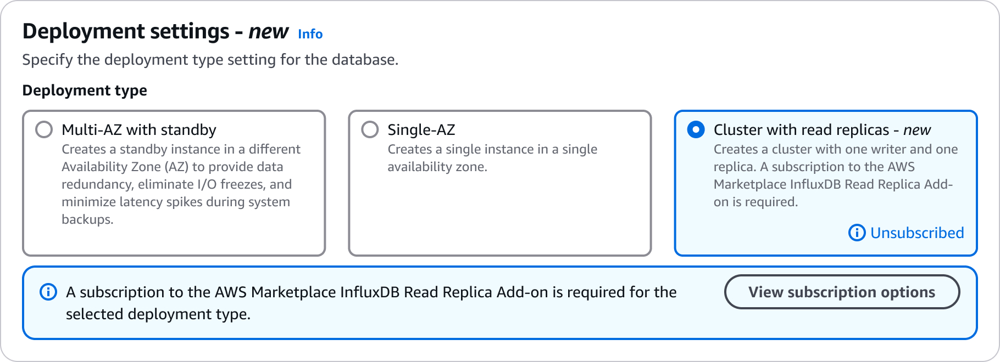
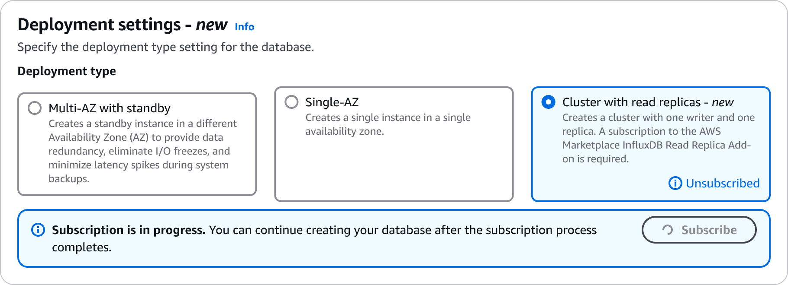
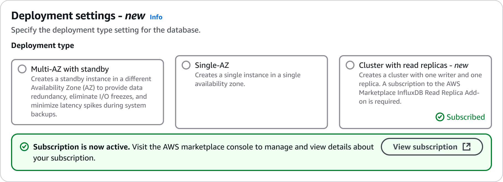
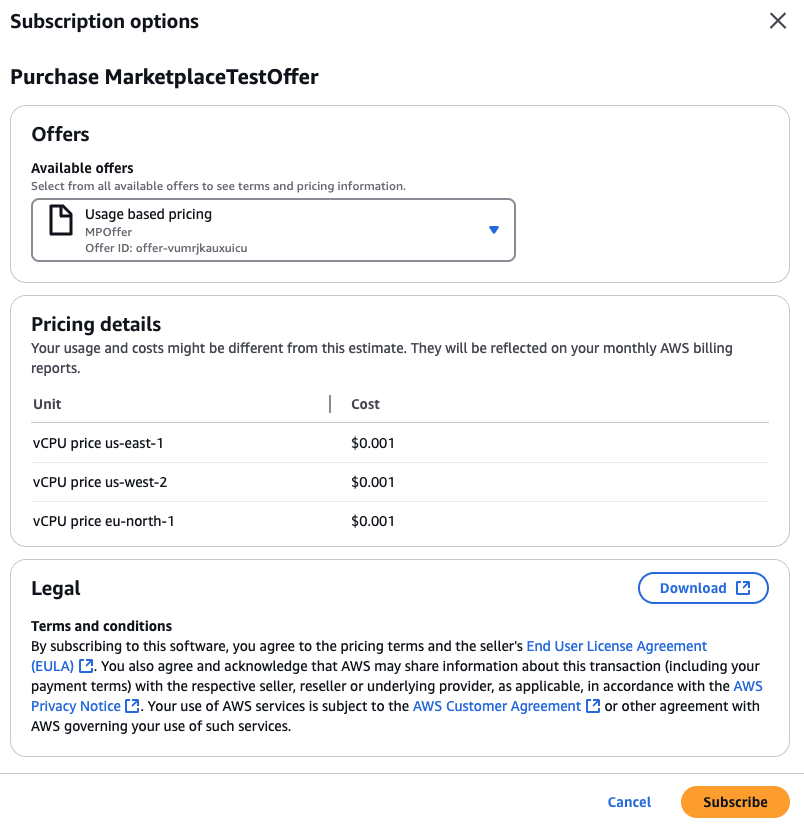
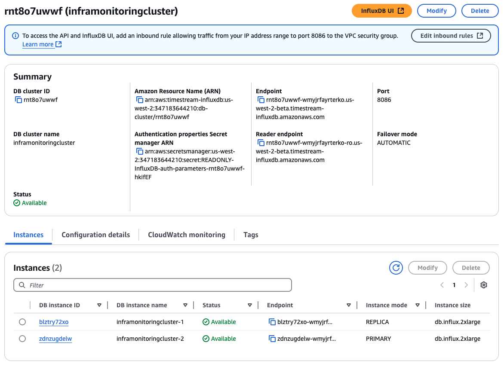

For similar capabilities to Amazon Timestream for LiveAnalytics, consider Amazon Timestream for InfluxDB. It offers simplified
data ingestion and single-digit millisecond query response times for real-time analytics. Learn more [here](timestream-for-influxdb.md "timestream-for-influxdb.md").

# Creating a Timestream for InfluxDB read replica

cluster

A Timestream for InfluxDB read replica cluster has a writer DB instance and a reader DB
instance in separate Availability Zones. Timestream for InfluxDB read replica clusters provide high availability, increased capacity for read workloads, and faster failover when failover to replica is configured.

## DB cluster prerequisites

###### Important

The following are prerequisites to complete before creating a read replica
cluster.

###### Topics

- [Configure the network
  for the DB cluster](#timestream-for-influx-config-network "#timestream-for-influx-config-network")
- [Additional prerequisites](#timestream-for-influx-addl-prereqs "#timestream-for-influx-addl-prereqs")

### Configure the network

for the DB cluster

You can only create a Timestream for InfluxDB read replica DB cluster in a virtual private cloud
(VPC) based on the Amazon VPC service. It must be in an AWS Region that has at least three Availability Zones. The DB subnet group that you choose for the DB cluster must cover at least three Availability Zones. This configuration ensures that each DB instance in the DB cluster is in a different Availability Zone.

To connect to your DB cluster from resources other than EC2 instances in the same VPC, configure the network connections manually.

### Additional prerequisites

**Before you create your read replica cluster, consider the following additional prerequisites:**

To tailor the configuration parameters for your DB cluster, specify a DB
cluster parameter group with the required parameter settings. For information
about creating or modifying a DB cluster parameter group, see [Parameter groups for read replica
clusters](timestream-for-influx-working-read-replica.md#timestream-for-influx-rr-param-groups "timestream-for-influx-working-read-replica.md#timestream-for-influx-rr-param-groups").

Determine the TCP/IP port number to specify for your DB cluster. The firewalls at some companies block connections to the default ports. If your company firewall blocks the default port, choose another port for your DB cluster. All DB instances in a DB cluster use the same port.

## Create a DB cluster

You can create a Timestream for InfluxDB read replica DB cluster using the AWS Management Console, the AWS CLI, or
the Amazon Timestream for InfluxDB API.

Using the AWS Management Console
You can create a Timestream for InfluxDB read replica DB cluster by choosing
**Cluster with read replicas** in the
**Deployment settings** section.

To create a read replica DB cluster using the console:

1. Sign in to the [AWS Management Console](https://console.aws.amazon.com/timestream "https://console.aws.amazon.com/timestream") and open the Amazon Timestream console.
2. In the upper-right corner of the AWS Management Console, choose the
   AWS Region in which you want to create the read replica DB
   cluster.
3. In the navigation pane, choose **InfluxDB
   databases**.
4. Choose **Create InfluxDB database**.
5. In **Deployment settings**, choose
   **Cluster with read replicas**.

Once you select that option, a message will appear indicating
you need to activate your subscription via the AWS Marketplace widget.
Click on **View subscription options**. Note
that it can take 1–2 minutes for the subscription to become
active.



 6. Once the subscription is active, click **View
subscription**.

 7. A window will appear presenting information on the cost per
vCPU per instance hour for each Region. This follows the same
compute pricing model where you are charged for the number of
hours your instance is active based on the instance type you
have selected. You will only need to subscribe to the add-on
once, and that will allow you to create instances in all
Regions where Timestream for InfluxDB is available.



###### Important

To subscribe to the offer, you will need to have either
AWSMarketplaceManageSubscriptions or AWSMarketplaceFullAccess
permissions. For more information about these permissions, check
[Controlling
access to AWS Marketplace subscriptions](../../../marketplace/latest/buyerguide/buyer-iam-users-groups-policies.md "../../../marketplace/latest/buyerguide/buyer-iam-users-groups-policies.md"). 8. Once you confirm your subscription, the service will
automatically select the Region based on the Region of your instance. 9. In **Database credentials**, complete the
following fields:

    1. For **DB cluster name**, enter the identifier for your DB cluster.
    2. Provide the InfluxDB basic initial configuration
     parameters: **username**,
     **organization name**,
     **bucket name**, and **password**.

10. In **Instance configuration**, specify the
    **DB instance class**. Select an instance size
    that best fits your workload needs. Keep in mind that this instance type will be used for all instances in your read replica DB cluster.
11. In **Storage configuration**, select a
    **Storage type** that fits your needs. In all
    cases, you will only need to configure the allocated storage.
    Keep in mind that this storage type will be used for all instances in your read replica DB cluster.
12. In the **Connectivity configuration**
    section, make sure your InfluxDB cluster is in the same subnet
    as the clients that require connectivity to your Timestream for InfluxDB DB
    instance. You could also choose to make your DB instance
    publicly available in the **Public access**
    subsection.
13. Choose **Create InfluxDB database**.
14. In the **InfluxDB databases** list, choose the name
    of your new InfluxDB cluster to show its details. The DB
    cluster will have a status of **Creating** until it
    is ready to use.
15. When the status changes to **Available**,
    you can connect to the DB cluster. Depending on the DB instance
    class and the amount of storage, it can take up to 20 minutes
    before the new instance is available.

 16. Once created, you can click on your DB cluster identifier to
retrieve information about your newly created cluster. The
endpoint showing an instance mode of
**PRIMARY** is the one you will need to use for
writes and engine administration.

Using the AWS CLI
To create a DB instance using the AWS Command Line Interface, call the
`create-db-cluster` command with the following parameters.
Replace each `user input placeholder` with your own information.

```
aws timestream-influxdb create-db-cluster \
      --region `region` \
      --vpc-subnet-ids `subnet-ids` \
      --vpc-security-group-ids `security-group-ids` \
      --db-instance-type db.influx.large \
      --db-storage-type InfluxIOIncludedT2 \
      --allocated-storage 400 \
      --password `password` \
      --name `cluster-name` \
      --deployment-type MULTI_NODE_READ_REPLICAS \
      --publicly-accessible
      //--failover-mode is optional and defaults to AUTOMATIC.

```

### Settings for

creating read replica clusters

For details about settings that you choose when you create a read
replica cluster, see the following table. For more information about
the AWS CLI options, see [create-db-cluster](https://awscli.amazonaws.com/v2/documentation/api/latest/reference/timestream-influxdb/create-db-cluster.html "https://awscli.amazonaws.com/v2/documentation/api/latest/reference/timestream-influxdb/create-db-cluster.html").
For more information about the Amazon Timestream for InfluxDB API parameters, see [CreateDbCluster](../../../ts-influxdb/latest/ts-influxdb-api/API_CreateDbCluster.md "../../../ts-influxdb/latest/ts-influxdb-api/API_CreateDbCluster.md").

| Console setting            | Setting description                                                                                                                                                                                                                                                                                                                                                                                                                                      | CLI option and Timestream for InfluxDB API parameter                                                           |
| -------------------------- | -------------------------------------------------------------------------------------------------------------------------------------------------------------------------------------------------------------------------------------------------------------------------------------------------------------------------------------------------------------------------------------------------------------------------------------------------------- | -------------------------------------------------------------------------------------------------------------- | ------------------------------------------------------------------------------------------------------------------------------------------------------------------------------------------------------------------------------------------------------------------------------------------------------------------------------------------------------------------------------------------------------------------------------------------------------------------------------------------------------------------------------------------------------------------------------------- |
| Allocated storage          | The amount of storage to allocate for each DB instance in your DB cluster (in gibibytes). For more information, see [InfluxDB instance storage](timestream-for-influxdb.md#timestream-for-influx-dbi-storage "timestream-for-influxdb.md#timestream-for-influx-dbi-storage").                                                                                                                                                                            | **CLI option:** `--allocated-storage` **API parameter:** `allocatedStorage`                                    |
| Database port              | The port number on which InfluxDB accepts connections. Valid Values: 1024-65535 Default: 8086 Constraints: The value can't be 2375-2376, 7788-7799, 8090, or 51678-51680.                                                                                                                                                                                                                                                                                | **CLI option:** `--port` **API parameter:** `port`                                                             |
| DB cluster name            | The name that uniquely identifies the DB cluster. DB instance names must be unique per customer and per region.                                                                                                                                                                                                                                                                                                                                          | **CLI option:** `--name` **API parameter:** `name`                                                             |
| DB instance type           | The compute and memory capacity of each DB instance in your Timestream for InfluxDB DB cluster, for example `db.influx.xlarge`. If possible, choose a DB instance class large enough that a typical query working set can be held in memory. When working sets are held in memory, the system can avoid writing to disk, which improves performance.                                                                                                     | **CLI option:** `--db-instance-type` **API parameter:** `dbInstanceType`                                       |
| DB cluster parameter group | The ID of the DB parameter group to assign to your DB cluster. DB parameter groups specify how the database is configured. For example, DB parameter groups can specify the limit for query concurrency.                                                                                                                                                                                                                                                 | **CLI option:** `--db-parameter-group-identifier` **API parameter:** `dbParameterGroupIdentifier`              |
| Deployment type            | Specifies whether the DB cluster will be deployed as a multinode read replica or a Multi-AZ multinode read replica. Possible values: `MULTI_NODE_READ_REPLICAS`                                                                                                                                                                                                                                                                                          | **CLI option:** `--deployment-type` **API parameter:** `deploymentType`                                        |
| VPC subnet ID              | The DB subnet ID you want to use for the DB cluster. Select **Choose existing** to use an existing DB subnet group, then choose the required subnet group from the **Existing DB subnet groups** dropdown list. Choose **Automatic setup** to let Timestream for InfluxDB select a compatible DB subnet group.                                                                                                                                           | **CLI option:** `--vpc-subnet-ids` **API parameter:** `vpcSubnetIds`                                           |
| Organization               | The name of the initial organization for the initial admin user in InfluxDB. An InfluxDB organization is a workspace for a group of users.                                                                                                                                                                                                                                                                                                               | **CLI option:** `--organization` **API parameter:** `organization`                                             |
| Bucket                     | The name of the initial InfluxDB bucket. All InfluxDB data is stored in a bucket. A bucket combines the concept of a database and a retention period (the duration of time that each data point persists). A bucket belongs to an organization.                                                                                                                                                                                                          | **CLI option:** `--bucket` **API parameter:** `bucket`                                                         |
| Log exports                | Configuration for sending InfluxDB engine logs to a specified S3 bucket. Configuration for S3 bucket log delivery: `s3Configuration -> (structure)` The name of the S3 bucket to deliver logs to: `bucketName -> (string)` Indicates whether log delivery to the S3 bucket is enabled: `enabled -> (boolean)` Shorthand syntax: `s3Configuration={bucketName=string, enabled=boolean}`                                                                   | **CLI option:** `--log-delivery-configuration` **API parameter:** `logDeliveryConfiguration`                   |
| Password                   | The password of the initial admin user you created in InfluxDB. This password will allow you to access the InfluxDB UI to perform various administrative tasks and also use the InfluxDB CLI to create an operator token. These attributes will be stored in a secret created in AWS Secrets Manager in your account.                                                                                                                                    | **CLI option:** `--password` **API parameter:** `password`                                                     |
| Username                   | The username of the initial admin user created in InfluxDB. Must start with a letter and can't end with a hyphen or contain two consecutive hyphens. For example, my-user1. This username will allow you to access the InfluxDB UI to perform various administrative tasks and also use the InfluxDB CLI to create an operator token. These attributes will be stored in a secret created in AWS Secrets Manager in your account.                        | **CLI option:** `--username` **API parameter:** `username`                                                     |
| Public access              | Indicates whether the DB cluster is accessible from outside the VPC. **Publicly accessible** gives the DB cluster a public IP address, meaning it's accessible outside the VPC. To be publicly accessible, the DB cluster also has to be in a public subnet in the VPC. **Not publicly accessible** makes the DB cluster accessible only from inside the VPC.                                                                                            | **CLI options:** `--publicly-accessible``--no-publicly-accessible` **API parameter:** `publiclyAccessible`     |
| DB storage type            | InfluxDB data. You can choose between three different types of provisioned Influx IOPS Included storage according to your workload's requirements. Possible values: <br>• InfluxIOIncludedT1 <br>• InfluxIOIncludedT2 <br>• InfluxIOIncludedT3                                                                                                                                                                                                           | **CLI options:** `--db-storage-type``--no-publicly-accessible` **API parameter:** `dbStorageType`              |
| VPC security group         | A list of VPC security group IDs to associate with the DB instance.                                                                                                                                                                                                                                                                                                                                                                                      | **CLI options:** `--vpc-security-group-ids``--no-publicly-accessible` **API parameter:** `vpcSecurityGroupIds` |
| VPC subnet IDs             | A list of VPC subnet IDs to associate with the DB instance. Provide at least two VPC subnet IDs in different Availability Zones when deploying with a Timestream for InfluxDB DB cluster.                                                                                                                                                                                                                                                                | **CLI options:** `--vpc-subnet-ids` **API parameter:** `vpcSubnetIds`                                          |
| Failover mode              | How your cluster responds to a primary instance failure. You can configure this with the following options: `AUTOMATIC`: If the primary instance fails, the system automatically promotes a read replica to become the new primary instance. `NO_FAILOVER`: If the primary instance fails, the system attempts to restore the primary instance without promoting a read replica. The cluster remains unavailable until the primary instance is restored. | **CLI options:** `--failover-mode` **API parameter:** `failoverMode`                                           | ###### Important As part of the DB cluster response object, you will receive an `influxAuthParametersSecretArn`. This will hold an ARN to a Secrets Manager secret in your account. It will only be populated after your InfluxDB DB instances are available. The secret contains Influx authentication parameters provided during the `CreateDbInstance` process. This is a **read-only** copy as any updates/modifications/deletions to this secret doesn't impact the created DB instance. If you delete this secret, our API response will still refer to the deleted secret ARN. |
