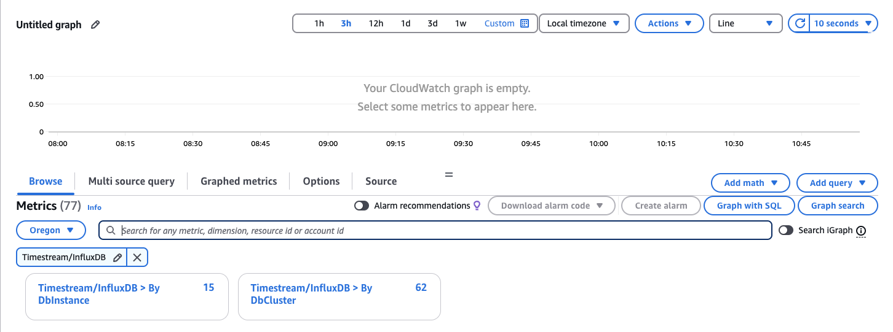
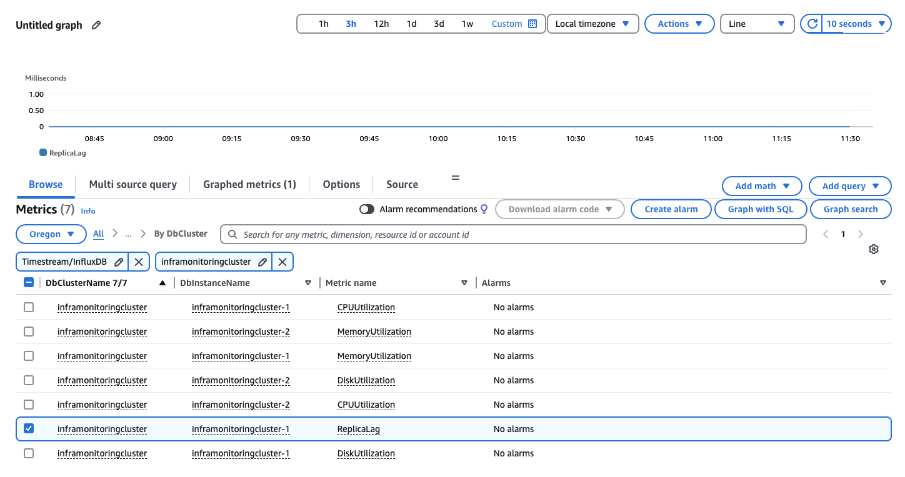
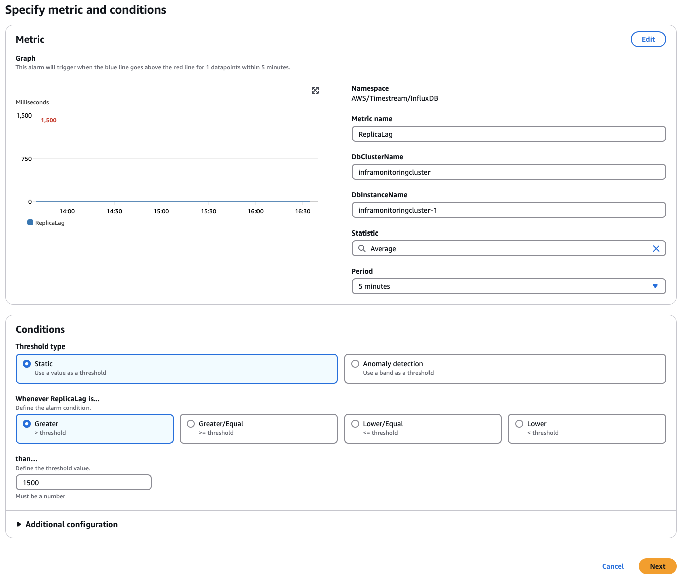
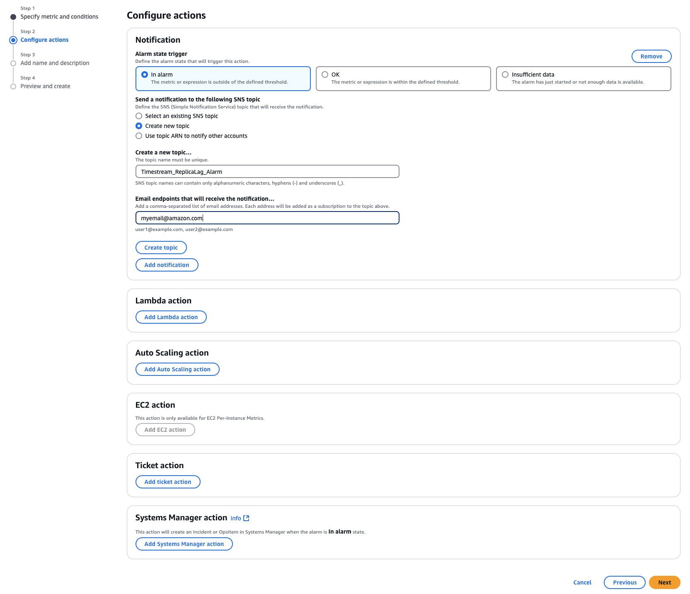
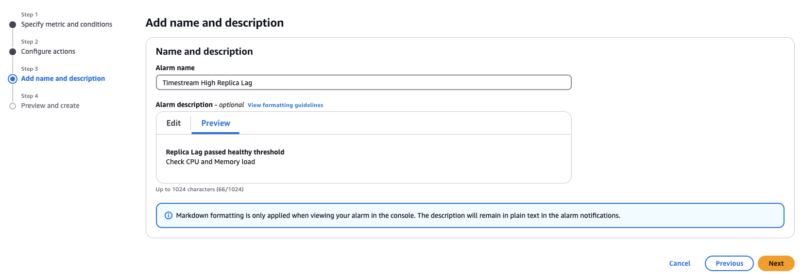

For similar capabilities to Amazon Timestream for LiveAnalytics, consider Amazon Timestream for InfluxDB. It offers simplified
data ingestion and single-digit millisecond query response times for real-time analytics. Learn more [here](timestream-for-influxdb.md "timestream-for-influxdb.md").

# Creating CloudWatch alarms to monitor Amazon Timestream for InfluxDB

You can create a CloudWatch alarm that sends an Amazon SNS message when the alarm changes state.
An alarm watches a single metric over a time period that you specify. The alarm can
also perform one or more actions based on the value of the metric relative to a given
threshold over a number of time periods. The action is a notification sent to an Amazon SNS topic or Amazon EC2 Auto Scaling policy.

Alarms invoke actions for sustained state changes only. CloudWatch alarms don't invoke actions simply because they are in a particular state. The state must have changed and have been maintained for a specified number of time periods.

You can set CloudWatch alarms on any of the available metrics for Timestream for InfluxDB, including
`CPUUtilization`, `MemoryUtilization`,
`DiskUtilization`, and `ReplicaLag`.

We recommend to start creating `DiskUtilization`-related alarms for your
Timestream for InfluxDB databases, since out-of-storage space issues can turn out to be fairly problematic
to InfluxDB. We recommend setting alerts to be sent whenever
`DiskUtilization` goes over approximately 75–80 percent.

## To set an alarm using the AWS CLI

Call `put-metric-alarm`. For more information, see [put-metric-alarm](https://awscli.amazonaws.com/v2/documentation/api/latest/reference/cloudwatch/put-metric-alarm.html "https://awscli.amazonaws.com/v2/documentation/api/latest/reference/cloudwatch/put-metric-alarm.html")
in the _AWS CLI Command Reference_.

## To set an alarm using the CloudWatch

API

Call `PutMetricAlarm`. For more information, see [PutMetricAlarm](../../../AmazonCloudWatch/latest/APIReference/API_PutMetricAlarm.md "../../../AmazonCloudWatch/latest/APIReference/API_PutMetricAlarm.md")
in the _Amazon CloudWatch API Reference_. For more information about setting up Amazon SNS topics
and creating alarms, see [Using Amazon CloudWatch alarms](../../../AmazonCloudWatch/latest/monitoring/AlarmThatSendsEmail.md "../../../AmazonCloudWatch/latest/monitoring/AlarmThatSendsEmail.md").

## Tutorial: Create an Amazon CloudWatch

alarm for Multi-AZ cluster replica lag for Amazon Timestream for InfluxDB

You can create an Amazon CloudWatch alarm that sends an Amazon SNS message when replica lag for
a Multi-AZ DB cluster has exceeded a threshold. An alarm watches the
`ReplicaLag` metric over a time period that you specify. The action is a
notification sent to an Amazon SNS topic or Amazon EC2 Auto Scaling policy.

### To set a CloudWatch

alarm for Multi-AZ DB cluster replica lag

1. Sign in to the AWS Management Console and open the CloudWatch console at [https://console.aws.amazon.com/cloudwatch/](https://console.aws.amazon.com/cloudwatch "https://console.aws.amazon.com/cloudwatch").
2. In the navigation pane, choose **Alarms**, then
   **All alarms**.
3. Choose **Create alarm**.
4. On the **Specify metric and conditions** page,
   choose **Select metric**.
5. In the search box, enter the name of your DB cluster, select
   **Timestream/InfluxDB**, **By DbCluster**, and then
   select your cluster.

 6. The following image shows the **Select metric** page
with a read replica cluster named `inframonitoringcluster`
selected. Choose the metric you want to create an alarm for, in this case
`ReplicaLag`. Click **Select metric**.

 7. On the **Specify metric and conditions**
page, customize the following fields:

    1. Select a period of time for your calculations in the
     **Period** section.
    2. Set up the conditions related to your alarm. For
     **Threshold type**, you can choose between
     **Static** and **Anomaly
     detection**.

    In this case, we will use **Static** since
     we know how our workload behaves. Each workload might have
     different requirements when it comes to what is considered
     "healthy."
    3. Select your threshold value. In the case of **Static** threshold values, these will be
     in milliseconds.
    4. Choose **Next**.

8. On the **Configure actions** page, in the
   **Notification** section, customize the
   following settings:

    1. For **Alarm state trigger**, select **In alarm**.
    2. Choose **Create new topic** in
     **Send a notification to the following SNS topic**.
    3. Enter a unique topic name and a valid email address that will
     receive the notification.
    4. Choose **Create topic**. Scroll down and choose
     **Next**.

9. On the **Add name and description** page, enter an
   **Alarm name** and **Alarm
   description**. Choose
   **Next**.

 10. Review your alarm settings on the
**Preview and create** page, and then choose
**Create alarm**.

###### Important

To keep your Timestream for InfluxDB cluster in a healthy state, we also recommend
monitoring and creating alarms for `CPUUtilization` and
`MemoryUtilization` that consistently exceed a
healthy 85 percent usage and `DiskUtilization` that exceeds 75 percent.
