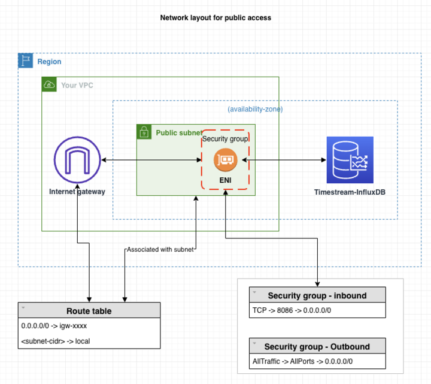
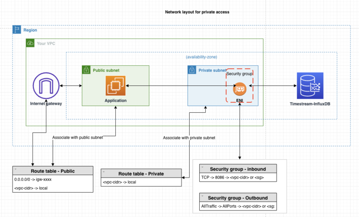
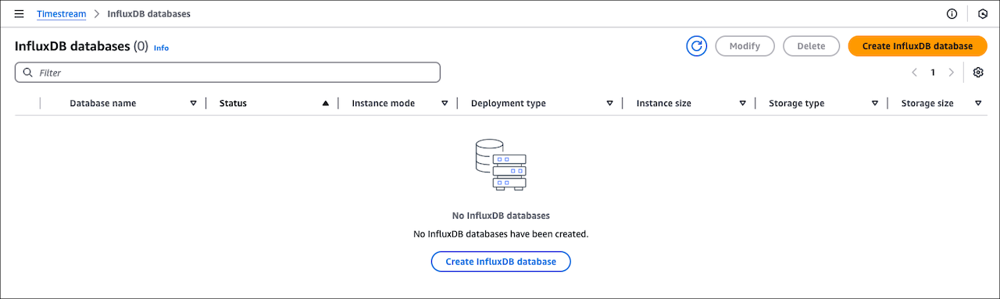
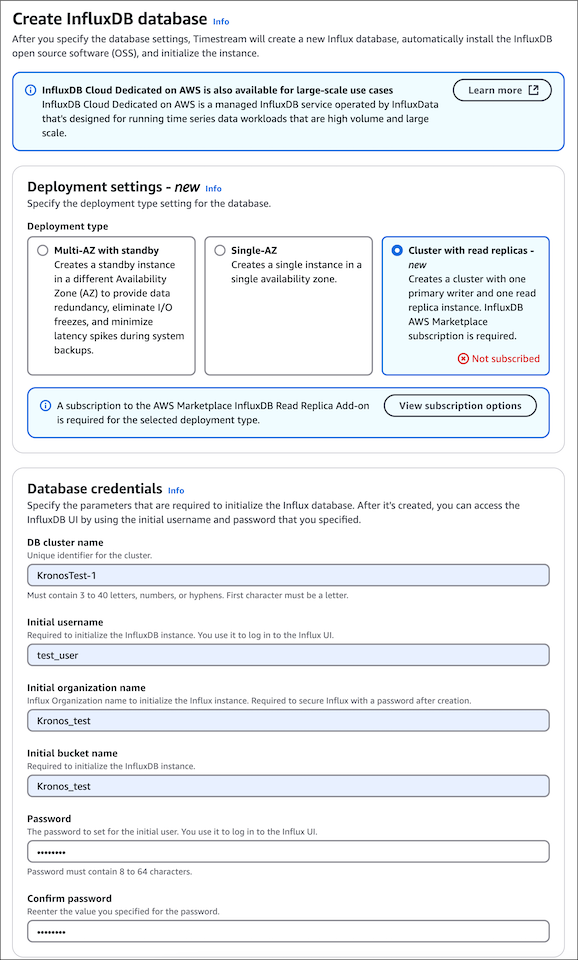
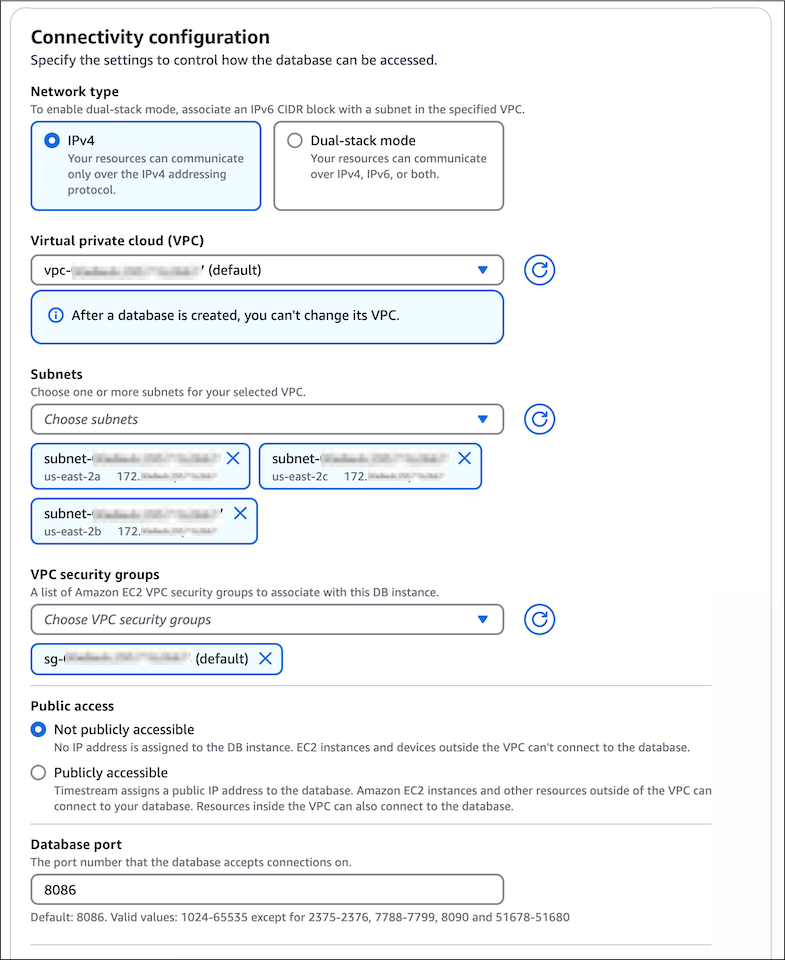
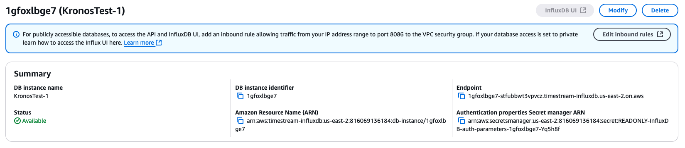
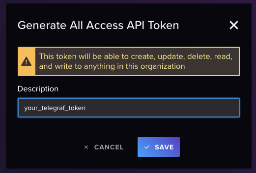

For similar capabilities to Amazon Timestream for LiveAnalytics, consider Amazon Timestream for InfluxDB. It offers simplified
data ingestion and single-digit millisecond query response times for real-time analytics. Learn more [here](timestream-for-influxdb.md "timestream-for-influxdb.md").

# Creating and connecting to

a Timestream for InfluxDB instance

This tutorial creates an Amazon EC2 instance and an Amazon Timestream for InfluxDB DB instance.
The tutorial shows you how to write data to the DB instance from the EC2 instance using the
Telegraf client. As a best practice, this tutorial creates a private DB instance in a virtual
private cloud (VPC). In most cases, other resources in the same VPC, such as EC2 instances, can
access the DB instance, but resources outside of the VPC can't access it.

After you complete the tutorial, there will be a public and private subnet in each Availability
Zone in your VPC. In one Availability Zone, the EC2 instance will be in the public subnet, and the DB
instance will be in the private subnet.

###### Note

There's no charge for creating an AWS account. However, by completing this tutorial, you
might incur costs for the AWS resources you use. You can delete these resources after you
complete the tutorial if they are no longer needed.

The following diagram shows the configuration when accessibility is public.



###### Warning

We don't recommend using 0.0.0.0/0 for HTTP access, since you would make it
possible for all IP addresses to access your public InfluxDB instance via HTTP. This
approach is not acceptable even for a short time in a test environment. Authorize only
a specific IP address or range of addresses to access your InfluxDB instances using
HTTP for web UI or API access.

This tutorial creates a DB instance running InfluxDB with the AWS Management Console. We will focus only
on the DB instance size and DB instance identifier. We will use the default settings for the
other configuration options. The DB instance created by this example will be private.

Other settings that you could configure include availability, security, and logging. To
create a public DB instance, you must choose to make your instance **Publicly accessible** on the
**Connectivity configuration** section. For information about
creating DB instances, see [Creating a DB instance](timestream-for-influx-configuring.md#timestream-for-influx-configuring-create-db "timestream-for-influx-configuring.md#timestream-for-influx-configuring-create-db").

If your instance is not publicly accessible, do the following:

- Create a host on the VPC of the instance through which you can tunnel traffic.
- Set up SSH tunneling to the instance.
  For more information,
  see [Amazon EC2
  instance port forwarding with AWS Systems Manager](https://aws.amazon.com/blogs/mt/amazon-ec2-instance-port-forwarding-with-aws-systems-manager/ "https://aws.amazon.com/blogs/mt/amazon-ec2-instance-port-forwarding-with-aws-systems-manager/").
- In order for the certificate to work, add the following line to the `/etc/hosts`
  file of your client machine: `127.0.0.1`. This is the DNS address of your instance.
- Connect to your instance using the fully qualified domain name,
  for example, _https://<DNS>:8086_.

###### Note

Localhost is unable to validate the certificate because localhost is not part of the certificate SAN.
The following diagram shows the configuration when accessibility is private:



## Prerequisites

Before you begin, complete the steps in the following sections:

- Sign up for an AWS account.
- Create an administrative user.

## Step 1: Create an

Amazon EC2 instance

Create an Amazon EC2 instance that you will use to connect to your database.

1. Sign in to the AWS Management Console and open the Amazon EC2 console at
   [https://console.aws.amazon.com/ec2/](https://console.aws.amazon.com/ec2/ "https://console.aws.amazon.com/ec2/").
2. In the upper-right corner of the AWS Management Console, choose the AWS Region in which you want to
   create the EC2 instance.
3. Choose **EC2 Dashboard**, and then choose **Launch instance**.
4. When the **Launch an instance** page opens, choose the following
   settings:
   1. Under **Name and tags**, enter `ec2-database-connect` for
      **Name**.
   2. Under **Application and OS Images (Amazon Machine Image)**, choose
      **Amazon Linux**, and then select **Amazon Linux 2023
      AMI**. Keep the default selections for the other choices.
   3. Under **Instance type**, choose **t2.micro**.
   4. Under **Key pair (login)**, choose a **Key pair name** to use an existing key pair. To create a new key pair
      for the Amazon EC2 instance, choose **Create new key pair**
      and then use the **Create key pair** window to create it. For
      more information about creating a new key pair, see [Create a
      key pair for your Amazon EC2 instance](../../../AWSEC2/latest/UserGuide/create-key-pairs.md "../../../AWSEC2/latest/UserGuide/create-key-pairs.md") in the _Amazon Elastic Compute Cloud User Guide_.
   5. For **Allow SSH traffic from** in **Network settings**, choose the source of SSH connections to the
      EC2 instance. You can choose **My IP** if the displayed IP address is correct for SSH
      connections. Otherwise, you can determine the IP address to use to connect to EC2 instances
      in your VPC using Secure Shell (SSH). To determine your public IP address, in a different
      browser window or tab, you can use the service at [checkip.amazonaws.com/](https://checkip.amazonaws.com "https://checkip.amazonaws.com"). An example
      of an IP address is `192.0.2.1/32`. In many cases, you might connect through an internet
      service provider (ISP) or from behind your firewall without a static IP address. If so,
      make sure to determine the range of IP addresses used by client computers.

   ###### Warning

   We do not recommend using 0.0.0.0/0 for SSH access, since you would make it possible
   for all IP addresses to access your public EC2 instances using SSH. This approach
   is not acceptable even for a short time in a test environment. Authorize only a specific IP address or range of addresses to access your EC2 instances using SSH.

## Step 2: Create an

InfluxDB DB instance

The basic building block of Amazon Timestream for InfluxDB is the DB instance. This
environment is where you run your InfluxDB databases.

In this example, you will create a DB instance running the InfluxDB database engine with a
db.influx.large DB instance class.

1. Sign in to the AWS Management Console and open the Amazon Timestream for InfluxDB console at
   [https://console.aws.amazon.com/timestream/.](https://console.aws.amazon.com/timestream/ "https://console.aws.amazon.com/timestream/")
2. In the upper-right corner of the Amazon Timestream for InfluxDB console, choose the
   AWS Region in which you want to create the DB instance.
3. In the navigation pane, choose **InfluxDB
   Databases**.
4. Choose **Create InfluxDB database**.

 5. In the **Deployment settings** section, select **Cluster
with read replicas**. Choose **View subscription
options** to start a subscription for the read replica add-on. For
more information, see [Read replica licensing through AWS Marketplace](timestream-for-influx-rr-licensing.md "timestream-for-influx-rr-licensing.md"). 6. In the **Database credentials** section, enter KronosTest-1 for
**DB cluster name**. 7. Provide the InfluxDB basic configuration parameters: **Initial
username**, **Initial organization name**, **Initial
bucket name** and **Password**.

###### Important

You won't be able to view the user password again. You won't be able to access your
instance and obtain an operator token without your password. If you don't record it, you
might have to change it. See [Creating a new operator
token for your InfluxDB instance](timestream-for-influx-getting-started-operator-token.md "timestream-for-influx-getting-started-operator-token.md").

If you need to change the user password after the DB instance is available, you can
modify the DB instance to do so. For more information about modifying a DB instance, see
[Updating DB instances](timestream-for-influx-managing-modifying-db.md "timestream-for-influx-managing-modifying-db.md").

 8. In the **Instance configuration** section, select the
**db.influx.large** DB instance class. 9. In the **Storage configuration** section, select **Influx IO
Included (3K)** for **Storage type**. 10. In the **Connectivity configuration** section, select
**IPv4** for the **Network type**. Make sure
your InfluxDB instance is in the same subnet as your newly created EC2 instance. Under
**Public access**, select **Not publicly accessible** to
make your DB instance private.

 11. In the **Failover settings** and **Parameter group
settings** sections, keep the default values. 12. Configure your logs in **Log delivery settings** and create tags
(optional). For more information about logs, see [Setup to view InfluxDB logs on Timestream Influxdb Instances](timestream-for-influx-managing-view-influx-logs.md "timestream-for-influx-managing-view-influx-logs.md"). For more
details about adding tags, see [Adding tags and labels to resources](tagging-keyspaces-influxdb.md "tagging-keyspaces-influxdb.md"). 13. Choose **Create InfluxDB database**. 14. In the **Databases** list, chose the name of your new
InfluxDB instance to show its details. The DB instance has a status of **Creating** until it is ready to use.

You can connect to the DB instance when the status changes to **Available**. Depending on the DB instance class and the amount of storage, it can
take up to 20 minutes before the new instance is available.

###### Important

At this time, you can't modify compute (instance types) and storage (storage types)
configurations of existing instances.

## Step

3: Access the InfluxDB UI

To access the InfluxDB UI from a private Timestream for InfluxDB DB instance, you must connect from
within the same subnet and security group. One way to facilitate this connection is to create a bastion host within the private subnet.

A bastion host is a special-purpose server that acts as a secure entry point to
critical systems, protecting your network from external access. It serves as a gateway between your secure internal network and the outside world.

###### Note

For publicly accessible Timestream for InfluxDB DB instances, you can access the InfluxDB UI via
the **InfluxDB UI** button on the instance details page in the
console. Note that this button will be disabled for instances that are not publicly accessible.

If you have a public DB instance, connect to the InfluxDB UI via the console and
proceed to [Step 4: Send
Telegraf data to your InfluxDB instance](#timestream-for-influx-getting-started-creating-db-instance-step4 "#timestream-for-influx-getting-started-creating-db-instance-step4").



Follow these steps to create and configure your bastion host:

1. **Create a bastion host:** To create a bastion host, you can launch a new EC2 instance or use an existing one. Ensure that the instance has the necessary network setup to access the security group you used to create the private Timestream for InfluxDB instance you are trying to access.
2. **Connect to the InfluxDB UI:** Once you have
   created a bastion host, you can use the endpoint displayed in the console to
   connect to the InfluxDB UI. The endpoint will be in the format
   `<db-identifier>-<*>.timestream-influxdb.<region>.on.aws`.
   In China, it will be `<db-identifier>-<*>.timestream-influxdb.<region>.on.amazonwebservices.com.cn`.
3. **Configure your bastion host for local forwarding:** To set up local forwarding, use the AWS Systems Manager (SSM) session manager. Run the following command, replacing `bastion-ec2-instance-id` with the ID of your bastion host instance, `endpoint` with the endpoint displayed in the above console, and `port-number` with the port number you want to use:

```
aws ssm start-session --target `bastion-ec2-instance-id` \
--document-name AWS-StartPortForwardingSessionToRemoteHost \
--parameters '{"host":["`endpoint`"], "portNumber":["`port-number`"], "localPortNumber":["`port-number`"]}'
```

You may be prompted to install the SessionManagerPlugin. For more details,
see [Install
the Session Manager plugin for the AWS CLI](../../../systems-manager/latest/userguide/session-manager-working-with-install-plugin.md "../../../systems-manager/latest/userguide/session-manager-working-with-install-plugin.md"). 4. **Access the InfluxDB UI:** After completing
the above steps, you can access the InfluxDB UI at http://localhost:`port-number`. You will need to acknowledge the "not secure" message. 5. **Enable domain name validation:** To enable domain name validation, add the following line to your `/etc/hosts` file (Linux), `/private/etc/hosts` (Mac), or `C:\Windows\System32\drivers\etc` (Windows).

```
127.0.0.1    `endpoint`
```

6. You can now access the InfluxDB UI using https://`endpoint`:`port-number`.

## Step 4: Send

Telegraf data to your InfluxDB instance

You can now start sending telemetry data to your InfluxDB DB instance using the Telegraf
agent. In this example, you'll install and configure a Telegraf agent to send performance
metrics to you InfluxDB DB instance.

1. After you connect to the InfluxDB UI, you should see a new browser window with a login prompt. Enter the
   credentials you used earlier to create your InfluxDB DB instance.
2. In the left navigation pane, click on the arrow icon and select **API
   Tokens**.
3. For this test, choose **Generate API Token**. Select **All
   Access API Token** from the dropdown list.

###### Note

For production scenarios, we recommend creating tokens with specific access to the
required buckets that are built for specific Telegraf needs.

 4. Your token will appear on the screen.

###### Important

Make sure to copy and save the token since it will not be displayed again. 5. Connect to the EC2 instance that you created earlier by following the steps in [Connect to
your Linux instance using SSH](../../../AWSEC2/latest/UserGuide/connect-to-linux-instance.md "../../../AWSEC2/latest/UserGuide/connect-to-linux-instance.md") in the _Amazon Elastic Compute Cloud User Guide_.

We recommend that you connect to your EC2 instance using SSH. If the SSH client utility
is installed on Windows, Linux, or Mac, you can connect to the instance using the following
command format:

```
ssh -i location_of_pem_file ec2-user@ec2-instance-public-dns-name
```

For example, assume that `ec2-database-connect-key-pair.pem` is stored in
`/dir1` on Linux, and the public IPv4 DNS for your EC2 instance is
`ec2-12-345-678-90.compute-1.amazonaws.com`. Your SSH command would look as
follows:

```
ssh -i /dir1/ec2-database-connect-key-pair.pem ec2-user@ec2-12-345-678-90.compute-1.amazonaws.com
```

6. Get the latest version of Telegraf installed on your instance. To do this, use the following command:

```
cat <<EOF | sudo tee /etc/yum.repos.d/influxdata.repo
[influxdata]
name = InfluxData Repository - Stable
baseurl = https://repos.influxdata.com/stable/\$basearch/main
enabled = 1
gpgcheck = 1
gpgkey = https://repos.influxdata.com/influxdata-archive_compat.key
EOF

sudo yum install telegraf
```

7. Configure your Telegraf instance.

###### Note

If telegraf.conf does not exist or it does not contain a `timestream` section, you can
generate one with:

```
telegraf —section-filter agent:inputs:outputs —input-filter cpu:mem —output-filter timestream config > telegraf.conf
```

    1. Edit the configuration file usually located at `/etc/telegraf`.


    ```
    sudo nano /etc/telegraf/telegraf.conf
    ```
    2. Configure the input plugins for CPUs, memory metrics, and disk usage.


    ```
    [[inputs.cpu]]
      percpu = true
      totalcpu = true
      collect_cpu_time = false
      report_active = false

    [[inputs.mem]]

    [[inputs.disk]]
      ignore_fs = ["tmpfs", "devtmpfs", "devfs"]
    ```
    3. Configure the output plugin to send data to your InfluxDB DB instance and save your
     changes.


    ```
    [[outputs.influxdb_v2]]
       urls = ["https://us-west-2-1.aws.cloud2.influxdata.com"]
       token = "<your_telegraf_token"
       organization = "your_org"
       bucket = "your_bucket"
       timeout = "5s"
    ```
    4. Configure the Timestream target.


    ```
    # Configuration for sending metrics to Amazon Timestream.
    [[outputs.timestream]]

      ## Amazon Region and credentials
      region = "us-east-1"
      access_key = "<AWS key here>"
      secret_key = "<AWS secret key here>"
      database_name = "<timestream database name>" # needs to exist

      ## Specifies if the plugin should describe on start.
      describe_database_on_start = false
      mapping_mode = "multi-table" # allows multiple tables for each input metrics

      create_table_if_not_exists = true
      create_table_magnetic_store_retention_period_in_days = 365
      create_table_memory_store_retention_period_in_hours = 24

      use_multi_measure_records = true # Important to use multi-measure records
      measure_name_for_multi_measure_records = "telegraf_measure"
      max_write_go_routines = 25

    ```

8. Enable and start the Telegraf service.

```
$ sudo systemctl enable telegraf
$ sudo systemctl start telegraf
```

## Step 5: Delete the

Amazon EC2 instance and the InfluxDB DB instance

After you explore the Telegraf-generated data using your your InfluxDB DB instance with
the InfluxDB UI, delete both your EC2 and your InfluxDB DB instances so you are no longer charged
for them.

**To delete the EC2 instance:**

1. Sign in to the AWS Management Console and open the Amazon EC2 console at
   [https://console.aws.amazon.com/ec2/](https://console.aws.amazon.com/ec2/ "https://console.aws.amazon.com/ec2/").
2. In the navigation pane, choose **Instances**.
3. Select the checkbox next to the EC2 instance's name, and then select **Instance
   state**. Choose **Terminate (delete) instance**.
4. Choose **Terminate (delete)** when prompted for confirmation.

For more information about deleting an EC2 instance, see [Terminate Amazon EC2 instances](../../../AWSEC2/latest/UserGuide/terminating-instances.md "../../../AWSEC2/latest/UserGuide/terminating-instances.md") in
the _Amazon Elastic Compute Cloud User Guide_.

**To delete the DB instance with no final DB
snapshot:**

1. Sign in to the AWS Management Console and open the Amazon Timestream for InfluxDB console at [https://console.aws.amazon.com/timestream/.](https://console.aws.amazon.com/timestream/ "https://console.aws.amazon.com/timestream/")
2. In the navigation pane, choose **InfluxDB
   databases**.
3. Select the DB instance you want to delete. Choose **Delete**
4. Confirm the deletion and choose **Delete**.
