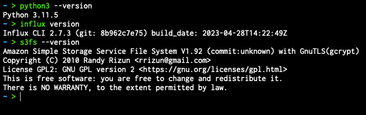
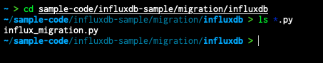
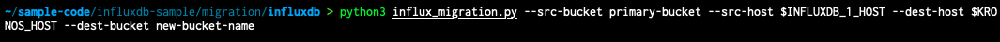

For similar capabilities to Amazon Timestream for LiveAnalytics, consider Amazon Timestream for InfluxDB. It offers simplified
data ingestion and single-digit millisecond query response times for real-time analytics. Learn more [here](timestream-for-influxdb.md "timestream-for-influxdb.md").

# Migration Overview

After meeting the prerequisites:

1. Run Migration Script: Using a terminal app of your choice, run the Python script to transfer data from the source InfluxDB instance to the destination InfluxDB instance.
2. Provide Credentials: Provide host addresses and ports as CLI options.
3. Verify Data: Ensure the data is correctly transferred by:
   1. Using the InfluxDB UI and inspecting buckets.
   2. Listing buckets with `influx bucket list -t <destination token> --host <destination host address> --skip-verify`.
   3. Using `influx v1 shell -t <destination token> --host <destination host address> --skip-verify` and running `SELECT * FROM <migrated bucket>.<retention period>.<measurement name> LIMIT 100 to view contents of a bucket or SELECT COUNT(*) FROM <migrated bucket>.<retention period>.<measurment name>`
      to verify the correct number of records have been migrated.

###### Example run

1. Open a terminal app of your choice and make sure the required prerequisites are properly installed:

 2. Navigate to the migration script:

 3. Prepare the following information:

    1. Name of the source bucket to be migrated.
    2. (Optional) Choose a new bucket name for the migrated bucket in the destination server.
    3. Root token for source and destination influx instances.
    4. Host address of source and destination influx instances.
    5. (Optional) S3 bucket name and credentials; AWS Command Line Interface credentials should be set in the OS environment variables.


    ```
    # AWS credentials (for timestream testing)
        export AWS_ACCESS_KEY_ID="xxx"
        export AWS_SECRET_ACCESS_KEY="xxx"
    ```
    6. Construct the command as:


    ```
    python3 influx_migration.py --src-bucket [amzn-s3-demo-source-bucket]  --dest-bucket [amzn-s3-demo-destination-bucket] --src-host [source host] --dest-host [dest host] --s3-bucket [amzn-s3-demo-bucket2](optional) --log-level debug
    ```
    7. Execute the script:


    
    8. Wait for the script to finish executing.
    9. Check the newly migrated bucket for data integrity, `performance.txt`. This file, located under the same directory
     where the script was run, contains some basic information on how long each step took.

## Migration scenarios

###### Example 1: Simple Migration Using Local Storage

You want to migrate a single bucket, amzn-s3-demo-primary-bucket, from the source server `(http://localhost:8086)` to a destination server
`(http://dest-server-address:8086)`.

After ensuring you have TCP access (for HTTP access) to both machines hosting the InfluxDB instances on port 8086 and you have both source and destination tokens and have stored them as the environment variables `INFLUX_SRC_TOKEN` and
`INFLUX_DEST_TOKEN`, respectively, for added security:

```
python3 influx_migration.py --src-bucket amzn-s3-demo-primary-bucket --src-host http://localhost:8086 --dest-host http://dest-server-address:8086

```

The output should look similar to the following:

```
INFO: influx_migration.py: Backing up bucket data and metadata using the InfluxDB CLI
2023/10/26 10:47:15 INFO: Downloading metadata snapshot
2023/10/26 10:47:15 INFO: Backing up TSM for shard 1
2023/10/26 10:47:15 INFO: Backing up TSM for shard 8245
2023/10/26 10:47:15 INFO: Backing up TSM for shard 8263
[More shard backups . . .]
2023/10/26 10:47:20 INFO: Backing up TSM for shard 8240
2023/10/26 10:47:20 INFO: Backing up TSM for shard 8268
2023/10/26 10:47:20 INFO: Backing up TSM for shard 2
INFO: influx_migration.py: Restoring bucket data and metadata using the InfluxDB CLI
2023/10/26 10:47:20 INFO: Restoring bucket "96c11c8876b3c016" as "amzn-s3-demo-primary-bucket"
2023/10/26 10:47:21 INFO: Restoring TSM snapshot for shard 12772
2023/10/26 10:47:22 INFO: Restoring TSM snapshot for shard 12773
[More shard restores . . .]
2023/10/26 10:47:28 INFO: Restoring TSM snapshot for shard 12825
2023/10/26 10:47:28 INFO: Restoring TSM snapshot for shard 12826
INFO: influx_migration.py: Migration complete

```

The directory `influxdb-backup-<timestamp>` will be created and stored in the directory from where the script was run,
containing backup files.

###### Example 2: Full Migration Using Local Storage and Debug Logging

Same as above except you want to migrate all buckets, tokens, users, and dashboards, deleting the buckets

in the destination server, and proceeding without user confirmation of a complete database migration by using the
`--confirm-full` option. You also want to see what the performance measurements
are so you enable debug logging.

```
python3 influx_migration.py --full --confirm-full --src-host http://localhost:8086 --dest-host http://dest-server-address:8086 --log-level debug

```

The output should look similar to the following:

```
INFO: influx_migration.py: Backing up bucket data and metadata using the InfluxDB CLI
2023/10/26 10:55:27 INFO: Downloading metadata snapshot
2023/10/26 10:55:27 INFO: Backing up TSM for shard 6952
2023/10/26 10:55:27 INFO: Backing up TSM for shard 6953
[More shard backups . . .]
2023/10/26 10:55:36 INFO: Backing up TSM for shard 8268
2023/10/26 10:55:36 INFO: Backing up TSM for shard 2
DEBUG: influx_migration.py: backup started at 2023-10-26 10:55:27 and took 9.41 seconds to run.
INFO: influx_migration.py: Restoring bucket data and metadata using the InfluxDB CLI
2023/10/26 10:55:36 INFO: Restoring KV snapshot
2023/10/26 10:55:38 WARN: Restoring KV snapshot overwrote the operator token, ensure following commands use the correct token
2023/10/26 10:55:38 INFO: Restoring SQL snapshot
2023/10/26 10:55:39 INFO: Restoring TSM snapshot for shard 6952
2023/10/26 10:55:39 INFO: Restoring TSM snapshot for shard 6953
[More shard restores . . .]
2023/10/26 10:55:49 INFO: Restoring TSM snapshot for shard 8268
2023/10/26 10:55:49 INFO: Restoring TSM snapshot for shard 2
DEBUG: influx_migration.py: restore started at 2023-10-26 10:55:36 and took 13.51 seconds to run.
INFO: influx_migration.py: Migration complete

```

###### Example 3: Full Migration Using CSV, Destination Organization, and S3 Bucket

Same as the previous example but using Linux or Mac and storing the files in
the S3 bucket, `amzn-s3-demo-bucket`.
This avoids backup files overloading the local storage capacity.

```
python3 influx_migration.py --full --src-host http://localhost:8086 --dest-host http://dest-server-address:8086 --csv --dest-org MyOrg --s3-bucket amzn-s3-demo-bucket

```

The output should look similar to the following:

```
INFO: influx_migration.py: Creating directory influxdb-backups
INFO: influx_migration.py: Mounting amzn-s3-demo-influxdb-migration-bucket
INFO: influx_migration.py: Creating directory influxdb-backups/amzn-s3-demo-bucket/influxdb-backup-1698352128323
INFO: influx_migration.py: Backing up bucket data and metadata using the InfluxDB v2 API
INFO: influx_migration.py: Restoring bucket data and metadata from csv
INFO: influx_migration.py: Restoring bucket amzn-s3-demo-some-bucket
INFO: influx_migration.py: Restoring bucket amzn-s3-demo-another-bucket
INFO: influx_migration.py: Restoring bucket amzn-s3-demo-primary-bucket
INFO: influx_migration.py: Migration complete
INFO: influx_migration.py: Unmounting influxdb-backups
INFO: influx_migration.py: Removing temporary mount directory

```
