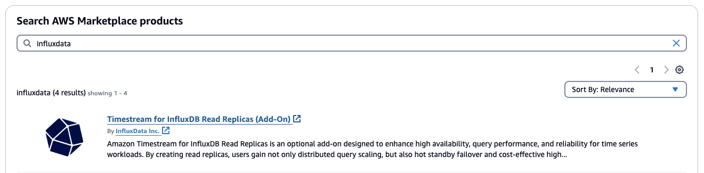
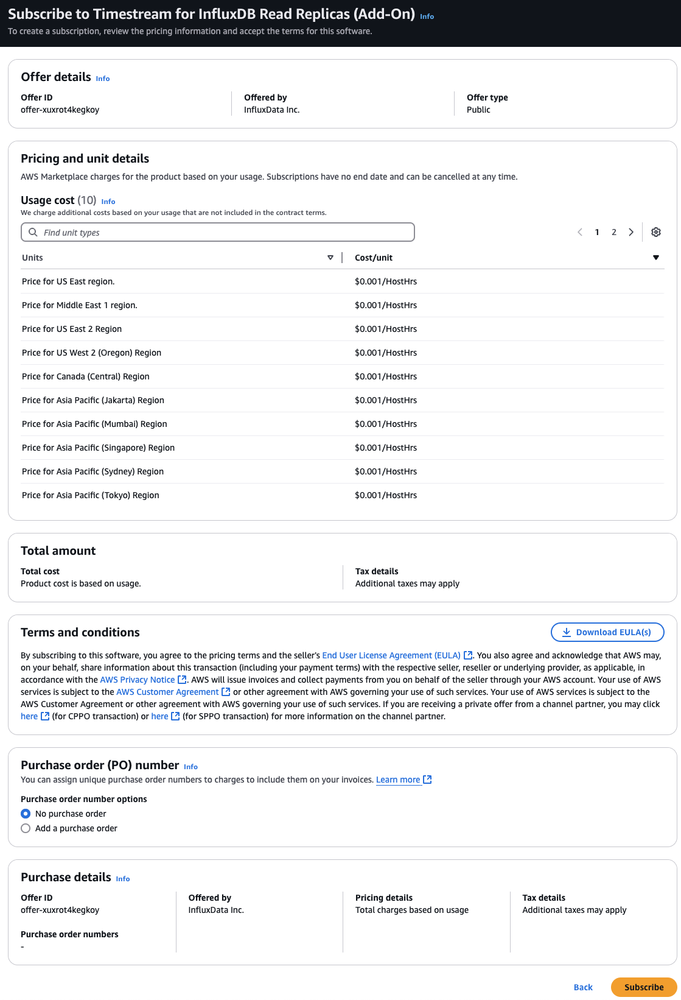

For similar capabilities to Amazon Timestream for LiveAnalytics, consider Amazon Timestream for InfluxDB. It offers simplified
data ingestion and single-digit millisecond query response times for real-time analytics. Learn more [here](timestream-for-influxdb.md "timestream-for-influxdb.md").

# Read replica licensing through AWS Marketplace

To use Timestream for InfluxDB read replicas, you will need to activate the Timestream for InfluxDB read replicas add-on
license through AWS Marketplace. Once the license is active, you will pay an hourly rate to use
read replica clusters. You will only pay for the hours your read replica cluster is
active. If you subscribe to the license but have no active Timestream for InfluxDB read replica clusters, you will not be charged.

###### Topics

- [Read replica licensing
  terminology](#timestream-for-influx-rr-licensing-terminology "#timestream-for-influx-rr-licensing-terminology")
- [Payments and billing](#timestream-for-influx-rr-license-billing "#timestream-for-influx-rr-license-billing")
- [Subscribing to the InfluxDB
  read replica add-on on Marketplace listings](#timestream-for-influx-subscribe-rr-add-on "#timestream-for-influx-subscribe-rr-add-on")

## Read replica licensing

terminology

This page uses the following terminology when discussing the Amazon Timestream for InfluxDB integration
with AWS Marketplace.

**SaaS subscription**

In AWS Marketplace, software-as-a-service (SaaS) products such as the
pay-as-you-go license model adopt a usage-based subscription model.
InfluxData, the software seller for the read replica add-on, tracks your usage and you pay only for what you use.

**InfluxData Marketplace fees**

Fees charged for the InfluxDB read replica add-on software license
usage by InfluxData. These service fees are metered through AWS Marketplace and
appear on your AWS bill under the AWS Marketplace section.

**Amazon Timestream for InfluxDB fees**

Fees that AWS charges for the Amazon Timestream for InfluxDB services, which excludes
licenses when using Timestream for InfluxDB read replica clusters. Fees are metered
through the Amazon Timestream for InfluxDB service being used and appear on your AWS bill.

## Payments and billing

Timestream for InfluxDB integrates with AWS Marketplace to offer hourly, pay-as-you-go licenses for the read
replica add-on. The read replica Marketplace fees cover the license costs of the
read replica add-on software, and the Amazon Timestream fees cover the costs of your Timestream for InfluxDB
read replica cluster usage. For information about pricing, see [Amazon Timestream pricing](https://aws.amazon.com/timestream/pricing "https://aws.amazon.com/timestream/pricing").

To stop these fees, you must delete any Timestream for InfluxDB read replica clusters. In addition,
you can remove your subscriptions to AWS Marketplace for read replica add-on license. If you
remove your subscriptions without deleting your read replica clusters, Amazon Timestream
will continue to bill you for the use of the read replica clusters. For more
information, see [Considerations when deleting replicas](timestream-for-influx-read-replica-overview.md#timestream-for-influx-rr-deletion "timestream-for-influx-read-replica-overview.md#timestream-for-influx-rr-deletion").

You can view bills and manage payments for your Timestream for InfluxDB read replica cluster in the
AWS Billing console. Your bills includes two charges: one for your usage of
InfluxData's licensed add-on through AWS Marketplace, and one for your usage of Amazon Timestream.
For more information about billing, see [Understanding your bill](../../../awsaccountbilling/latest/aboutv2/getting-viewing-bill.md "../../../awsaccountbilling/latest/aboutv2/getting-viewing-bill.md") in the _AWS Billing and Cost Management User Guide_.

## Subscribing to the InfluxDB

read replica add-on on Marketplace listings

To use the read replica add-on license through AWS Marketplace, you must use the Amazon Timestream
AWS Management Console to subscribe to the InfluxDB read replica add-on. You cannot complete
these tasks through the AWS CLI or the Timestream for InfluxDB API.

###### Topics

- [Subscribe from
  Amazon Timestream AWS Management Console](#timestream-for-influx-subscribe-console "#timestream-for-influx-subscribe-console")
- [Subscribe to the
  InfluxDB read replica add-on in AWS Marketplace](#timestream-for-influx-subscribe-marketplace "#timestream-for-influx-subscribe-marketplace")

###### Note

If you want to create your read replica cluster by using the AWS CLI or the Timestream for InfluxDB API, you must complete this step first.

### Subscribe from

Amazon Timestream AWS Management Console

You can subscribe to the InfluxDB read replica add-on using the Timestream
Management Console. Start the **Create InfluxDB
Database** flow and follow the steps. For more information, see
[Creating a Timestream for InfluxDB read replica
cluster](timestream-for-influx-create-rr-cluster.md "timestream-for-influx-create-rr-cluster.md").

### Subscribe to the

InfluxDB read replica add-on in AWS Marketplace

To use the InfluxDB add-on license with AWS Marketplace, you need to have an active
AWS Marketplace subscription for the InfluxDB read replica add-on. You will need to
subscribe to a single add-on offer and that will allow you to create any
instance type you need in any of the available regions. For information about
AWS Marketplace subscriptions, see [SaaS
products through AWS Marketplace](../../../marketplace/latest/buyerguide/buyer-saas-products.md#saas-pricing-models "../../../marketplace/latest/buyerguide/buyer-saas-products.md#saas-pricing-models") in the _AWS Marketplace Buyer Guide_.

We recommend that you subscribe to InfluxDB in AWS Marketplace
_before_ you start creating a DB instance.

1. Navigate to the [AWS Marketplace](https://console.aws.amazon.com/marketplace "https://console.aws.amazon.com/marketplace") and search for InfluxData.

 2. Select **Timestream for InfluxDB Read Replicas (Add-On)**. 3. Select **View purchase options**. 4. Review the End User License Agreement and choose
**Subscribe**.

 5. You can now create your Timestream for InfluxDB read replica cluster using the Timestream Management Console,
CLI, or API.
