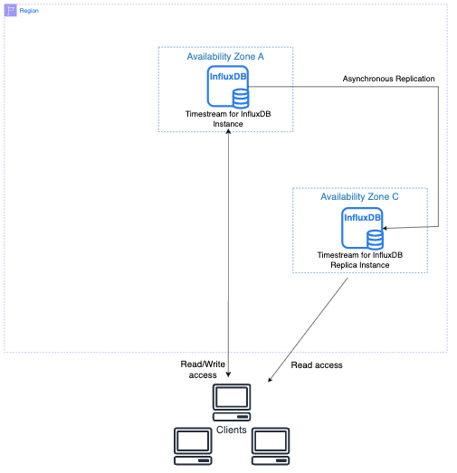

For similar capabilities to Amazon Timestream for LiveAnalytics, consider Amazon Timestream for InfluxDB. It offers simplified
data ingestion and single-digit millisecond query response times for real-time analytics. Learn more [here](timestream-for-influxdb.md "timestream-for-influxdb.md").

# Working with Multi-AZ read

replica clusters for Amazon Timestream for InfluxDB

A read replica cluster deployment is an asynchronous deployment mode of Amazon Timestream for InfluxDB that allows you to configure read replicas attached to a primary DB instance. A read replica cluster has a writer DB instance and a reader DB instance in separate Availability Zones within the same AWS Region. Read replica clusters provide high availability and increased capacity for read workloads when compared to Multi-AZ DB instance deployments.

## Instance class availability for read replica clusters

Read replica cluster deployments are supported for the same instance types as regular Timestream for InfluxDB instances.

| Instance class     | vCPU | Memory (GiB) | Storage type         | Network bandwidth (Gbps) |
| ------------------ | ---- | ------------ | -------------------- | ------------------------ |
| db.influx.medium   | 1    | 8            | Influx IOPS Included | 10                       |
| db.influx.large    | 2    | 16           | Influx IOPS Included | 10                       |
| db.influx.xlarge   | 4    | 32           | Influx IOPS Included | 10                       |
| db.influx.2xlarge  | 8    | 64           | Influx IOPS Included | 10                       |
| db.influx.4xlarge  | 16   | 128          | Influx IOPS Included | 10                       |
| db.influx.8xlarge  | 32   | 256          | Influx IOPS Included | 12                       |
| db.influx.12xlarge | 48   | 384          | Influx IOPS Included | 20                       |
| db.influx.16xlarge | 64   | 512          | Influx IOPS Included | 25                       |
| db.influx.24xlarge | 96   | 768          | Influx IOPS Included | 40                       |

## Read replica cluster architecture

With a read replica cluster, Amazon Timestream for InfluxDB automatically replicates all writes made to the
writer DB instance to all reader DB instances using InfluxData’s licensed read replica
add-on. This replication is asynchronous and all writes are acknowledged as soon as they
are committed by the writer node. Writes do not require acknowledgement from all reader
nodes to be considered as a successful write. Once data is committed by the writer DB
instance, it is replicated to the read replica instance almost instantaneously.
In case of unrecoverable writer failure, any data that has not been replicated over to at
least one of the readers will be lost.

A read replica instance is a read-only copy of a writer DB instance. You can reduce
the load on your writer DB instance by routing some or all of the queries from your applications to the read replica. In this way, you can elastically scale out beyond the capacity constraints of a single DB instance for read-heavy database workloads.

The following diagram shows a primary DB instance replicating to a read replica in a different Availability Zone. Clients have read/write access to the primary DB instance and read-only access to the replica.

## Parameter groups for read replica

clusters

In a read replica cluster, a _DB parameter group_ acts as a
container for engine configuration values that are applied to every DB instance in the
read replica cluster. A default DB parameter group is set based on the DB engine and DB engine version. The settings in the DB parameter group are used for all of the DB instances in the cluster.

When passing a specific DB parameter group using [CreateDbCluster](../../../ts-influxdb/latest/ts-influxdb-api/API_CreateDbCluster.md "../../../ts-influxdb/latest/ts-influxdb-api/API_CreateDbCluster.md") or [UpdateDbCluster](../../../ts-influxdb/latest/ts-influxdb-api/API_UpdateDbCluster.md "../../../ts-influxdb/latest/ts-influxdb-api/API_UpdateDbCluster.md")
for Multi-AZ DB read replica, ensure the `storage-wal-max-write-delay` is set to a
duration of 1 hour minimum. If no DB parameter group is specified, `storage-wal-max-write-delay` will default to 1 hour.

## Replica lag in read replica

clusters

Although Timestream for InfluxDB read replica clusters allow for high write performance, replica lag can
still occur due to the nature of engine-based asynchronous replication. This lag can
lead to potential data loss in the event of a failover, making it essential to monitor.

You can track the replica lag from CloudWatch by selecting
**All metrics** in the AWS Management Console navigation pane. Choose
**Timestream/InfluxDB**, then **By DbCluster**.
Select your **DbClusterName** and then your **DbReaderInstanceName**. Here, besides
the normal set of metrics tracked for all Timestream for InfluxDB instances (see below list), you will
also see ReplicaLag, expressed in milliseconds.

- CPUUtilization
- MemoryUtilization
- DiskUtilization
- ReplicaLag (only for replica instance mode DB instances)

### Common causes of replica lag

In general, replica lag occurs when the write and read workloads are too high for the reader DB instances to apply the transactions efficiently. Various workloads can incur temporary or continuous replica lag. Some examples of common causes are the following:

- High write concurrency or heavy batch updating on the writer DB instance, causing the apply process on the reader DB instances to fall behind.
- Heavy read workload that is using resources on one or more reader DB instances. Running slow or large queries can affect the apply process and can cause replica lag.
- Transactions that modify large amounts of data or DDL statements
  can sometimes cause a temporary increase in replica lag because the database must preserve commit order.

For a tutorial that shows you how to create a CloudWatch alarm when replica lag exceeds
a set amount of time, see [Tutorial: Create an Amazon CloudWatch
alarm for Multi-AZ cluster replica lag for Amazon Timestream for InfluxDB](timestream-for-influx-creating-cw-alarms.md#timestream-for-influx-tutorial-alarm "timestream-for-influx-creating-cw-alarms.md#timestream-for-influx-tutorial-alarm").

### Mitigating replica lag

For Timestream for InfluxDB read replica clusters, you can mitigate replica lag by reducing the load on your writer DB instance.

## Availability and durability

Read replica clusters can be configured to either automatically fail over to one of
the reader instances in case of writer failure to prioritize write availability or to
avoid failing over to minimize tip data loss. Tip data refers to the replication gap of
data not yet replicated to at least one of the reader nodes (see
[Replica lag in read replica
clusters](#timestream-for-influx-replica-lag "#timestream-for-influx-replica-lag")). The default and recommended behavior for read replica clusters is to automatically fail over in case of writer failures. However, if tip data loss is more important than write availability for your use cases, you can override the default by updating the cluster.

Read replica clusters ensure that all DB instances of the cluster are distributed
across at least two Availability Zones to ensure increased write availability and data durability in case of an Availability Zone outage.

###### Topics

- [Overview of Amazon Timestream for InfluxDB read replica clusters](timestream-for-influx-read-replica-overview.md "timestream-for-influx-read-replica-overview.md")
- [Creating a Timestream for InfluxDB read replica
  cluster](timestream-for-influx-create-rr-cluster.md "timestream-for-influx-create-rr-cluster.md")
- [Connecting to a Timestream for InfluxDB read
  replica DB cluster](timestream-for-influx-connecting-cluster.md "timestream-for-influx-connecting-cluster.md")
- [Modifying a read replica cluster
  for Amazon Timestream for InfluxDB](timestream-for-influx-modifying-rr-cluster.md "timestream-for-influx-modifying-rr-cluster.md")
- [Creating CloudWatch alarms to monitor Amazon Timestream for InfluxDB](timestream-for-influx-creating-cw-alarms.md "timestream-for-influx-creating-cw-alarms.md")
- [Read replica licensing through AWS Marketplace](timestream-for-influx-rr-licensing.md "timestream-for-influx-rr-licensing.md")
