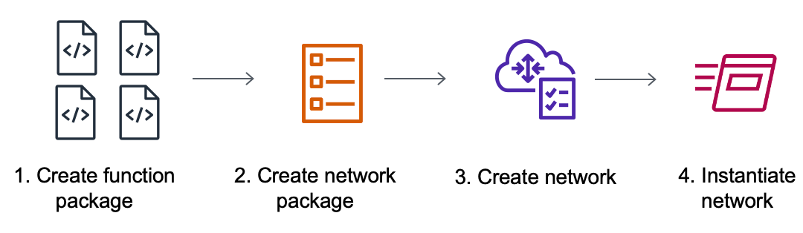

# Getting started with AWS TNB

This tutorial demonstrates how you use AWS TNB to deploy a network function, for example,
the Centralized Unit (CU), Access and Mobility Management Function (AMF), or 5G User Plane
Function (UPF).

The following diagram illustrates the deployment process:

###### Tasks

- [Prerequisites](#prerequisites "#prerequisites")
- [Create a function package](#create-function-package "#create-function-package")
- [Create a network package](#create-network-package "#create-network-package")
- [Create and instantiate a network instance](#create-network-instance "#create-network-instance")
- [Clean up](#clean-up "#clean-up")

## Prerequisites

Before you can perform a successful deployment, you must have the following:

- An AWS Business Support plan.
- Permissions through IAM roles.
- A [Network Function (NF) package](tnb-concepts.md#nf-packages "tnb-concepts.md#nf-packages") that complies
  with ETSI SOL001/SOL004.
- [Network Service Descriptor (NSD) templates](tnb-concepts.md#network-package "tnb-concepts.md#network-package")
  that comply with ETSI SOL007.

You can use a sample function package or network package from the [Sample packages for
AWS TNB](https://github.com/aws-samples/sample-packages-for-aws-tnb "https://github.com/aws-samples/sample-packages-for-aws-tnb") GitHub site.

## Create a function package

A network function package is a Cloud Service Archive (CSAR) file. The CSAR file
contains Helm charts, software images, and a Network Function Descriptor (NFD).

###### To create a function package

1. Open the AWS TNB console at [https://console.aws.amazon.com/tnb/](https://console.aws.amazon.com/tnb/ "https://console.aws.amazon.com/tnb/").
2. In the navigation pane, choose **Function packages**.
3. Choose **Create function package**.
4. Under **Upload function package**, choose **Choose
   files**, and upload each CSAR package as a `.zip` file. You
   can upload a maximum of 10 files.
5. (Optional) Under **Tags**, choose **Add new
   tag** and enter a key and value. You can use tags to search and filter
   your resources or track your AWS costs.
6. Choose **Next**.
7. Review the package details, and then choose **Create function
   package**.

## Create a network package

A network package specifies the network functions that you want to deploy and how you
want to deploy them into the catalog.

###### To create a network package

1. In the navigation pane, choose **Network packages**.
2. Choose **Create network package**.
3. Under **Upload network package**, choose **Choose
   files**, and upload each NSD as a `.zip` file. You can upload
   a maximum of 10 files.
4. (Optional) Under **Tags**, choose **Add new
   tag** and enter a key and value. You can use tags to search and filter
   your resources or track your AWS costs.
5. Choose **Next**.
6. Choose **Create network package**.

## Create and instantiate a network instance

A network instance is a single network created in AWS TNB that can be deployed. You
must create a network instance and instantiate it. When you instantiate a network instance,
AWS TNB provisions the necessary AWS infrastructure, deploys containerized network
functions, and configures networking and access management to create a fully operational
network service.

###### To create and instantiate a network instance

1. In the navigation pane, choose **Networks**.
2. Choose **Create network instance**.
3. Enter a name and description for the network, and then choose
   **Next**.
4. Choose a network package. Verify the details and choose
   **Next**.
5. Choose **Create network instance**. The initial state is
   `Created`.

The **Networks** page appears showing the new network instance in
the `Not instantiated` state. 6. Select the network instance, choose **Actions** and
**Instantiate**.

The **Network instantiate** page appears. 7. Review details and update parameter values. Updates to the parameter values apply
only to this network instance. The parameters in the NSD and VNFD packages do not
change. 8. Choose **Instantiate network**.

The **Deployment status** page appears. 9. Use the **Refresh** icon to track the deployment status of your
network instance. You can also enable **Auto refresh** in the
**Deployment tasks** section to track the progress of each
task.

## Clean up

You can now delete the resources that you created for this tutorial.

###### To clean up your resources

1. In the navigation pane, choose **Networks**.
2. Chose the ID of the network, and then choose
   **Terminate**.
3. When prompted for confirmation, enter the network ID, and then choose
   **Terminate**.
4. Use the **Refresh** icon to track the status of your network
   instance.
5. (Optional) Select the network, and choose **Delete**.
