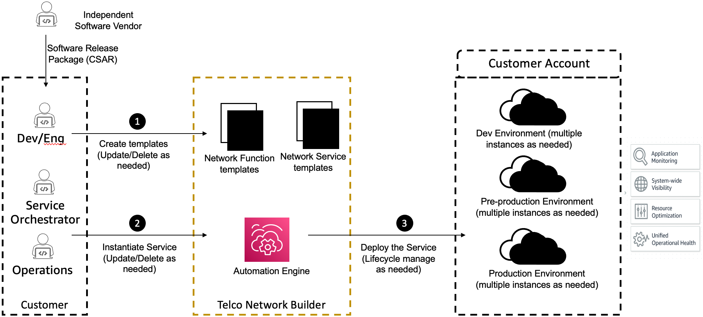

# How AWS TNB works

AWS TNB integrates with standardized end-to-end orchestrators and AWS resources to
operate full 5G networks.

AWS TNB allows you to ingest network function packages and network service descriptors
(NSDs)
and provides you with the automation engine to operate your networks. You can use your end-to-end
orchestrator and integrate with AWS TNB APIs, or use AWS TNB SDKs to build your own automation
flow. For more information, see [AWS TNB architecture](#tnb-architecture "#tnb-architecture") .

###### Topics

- [AWS TNB architecture](#tnb-architecture "#tnb-architecture")
- [Integration with AWS services](#integration-aws-services "#integration-aws-services")
- [AWS TNB resource quotas](#tnb-resource-quotas "#tnb-resource-quotas")

## AWS TNB architecture

AWS TNB provides you with the ability to perform lifecycle management operations through
the AWS Management Console, AWS CLI, AWS TNB REST API, and SDKs. This allows the different CSP personas, such
as members of the Engineering, Operations, and Programmatic System teams, to take advantage of
AWS TNB. You create and upload a network function package as a Cloud Service Archive (CSAR)
file. The CSAR file contains Helm charts, software images, and a Network Function Descriptor
(NFD). You can use templates to repeatedly deploy multiple configurations of that package. You
create network service templates defining the infrastructure and the network functions that you
want to deploy. You can use parameter overrides to deploy different configurations in different
locations. You can then instantiate a network, using the templates and deploy your network
functions on AWS infrastructure. AWS TNB provides you with the visibility of your
deployments.

## Integration with AWS services

A 5G network is made up of a set of interconnected containerized network functions deployed
across thousands of Kubernetes clusters. AWS TNB integrates with the following AWS services
as telecom-specific APIs to create a fully operational network service:

- Amazon Elastic Container Registry (Amazon ECR) to store Independent Software Vendors (ISVs) network functions
  artifacts.
- Amazon Elastic Kubernetes Service (Amazon EKS) to set up clusters.
- Amazon VPC for networking constructs.
- Security groups using AWS CloudFormation.
- AWS CodePipeline for deployment targets across AWS Regions, AWS Local Zones, and
  AWS Outposts.
- IAM to define roles.
- AWS Organizations to control access to AWS TNB APIs.
- AWS Health Dashboard and AWS CloudTrail to monitor health and post metrics.

## AWS TNB resource quotas

Your AWS account has default quotas, formerly referred to as limits, for each
AWS service. Unless otherwise noted, each quota is specific to an AWS Region. You can request
increases for some quotas, but not for all quotas.

To view the quotas for AWS TNB, open the [Service Quotas console](https://console.aws.amazon.com/servicequotas/home "https://console.aws.amazon.com/servicequotas/home"). In the navigation pane, choose **AWS services**, and
select **AWS TNB**.

To request a quota increase, see [Requesting a quota
increase](../../../servicequotas/latest/userguide/request-quota-increase.md "../../../servicequotas/latest/userguide/request-quota-increase.md") in the _Service Quotas User Guide_.

Your AWS account has the following quotas related to AWS TNB.

| Resource quota                                | Description                                                                           | Default value | Adjustable? |
| --------------------------------------------- | ------------------------------------------------------------------------------------- | ------------- | ----------- |
| Network service instances                     | The maximum number of network service instances in one Region.                        | 800           | Yes         |
| Concurrent ongoing network service operations | The maximum number of concurrent ongoing network service operations in one Region. | 40            | Yes         |
| Network packages                              | The maximum number of network packages in one Region.                                 | 40            | Yes         |
| Function packages                             | The maximum number of function packages in one Region.                                | 200           | Yes         |
