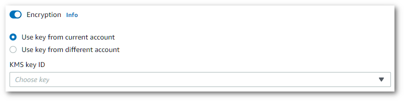

# Data encryption

Data encryption refers to protecting data while in transit and at rest. You can protect your data by using
Amazon S3-managed keys or KMS keys at rest, alongside standard Transport Layer
Security (TLS) while in transit.

## Encryption at rest

Amazon Transcribe uses the default Amazon S3 key (SSE-S3) for server-side encryption of
transcripts placed in your Amazon S3 bucket.

When you use the [`StartTranscriptionJob`](../APIReference/API_StartTranscriptionJob.md "../APIReference/API_StartTranscriptionJob.md")
operation, you can specify your own KMS key to encrypt the output from a transcription
job.

Amazon Transcribe uses an Amazon EBS volume encrypted with the default key.

## Encryption in transit

Amazon Transcribe uses TLS 1.2 with AWS certificates to encrypt data in transit. This
includes streaming transcriptions.

## Key management

Amazon Transcribe works with KMS keys to provide enhanced encryption for your
data. With Amazon S3, you can encrypt your input media when creating a transcription job.
Integration with AWS KMS allows encryption of the output from a [`StartTranscriptionJob`](../APIReference/API_StartTranscriptionJob.md "../APIReference/API_StartTranscriptionJob.md")
request.

If you don't specify a KMS key, the output of the transcription job is encrypted with the
default Amazon S3 key (SSE-S3).

For more information on AWS KMS, see the
[_AWS Key Management Service Developer
Guide_](../../../kms/latest/developerguide/concepts.md "../../../kms/latest/developerguide/concepts.md").

To encrypt the output of your transcription job, you can choose between using a
KMS key for the AWS account that is making the request, or
a KMS key from another AWS account.

If you don't specify a KMS key, the output of the transcription job is encrypted with
the default Amazon S3 key (SSE-S3).

###### To enable output encryption:

1. Under **Output data** choose **Encryption**.

 2. Choose whether the KMS key is from the AWS account
you're currently using or from a different AWS account. If you want to
use a key from the current AWS account, choose the key from
**KMS key ID**. If you're using a key from a
different AWS account, you must enter the key's ARN. To use a key from
a different AWS account, the caller must have `kms:Encrypt`
permissions for the KMS key. Refer to [Creating a key policy](../../../kms/latest/developerguide/key-policy-overview.md "../../../kms/latest/developerguide/key-policy-overview.md") for more information.
To use output encryption with the API, you must specify your KMS key using the
`OutputEncryptionKMSKeyId` parameter of the [`StartCallAnalyticsJob`](../APIReference/API_StartCallAnalyticsJob.md "../APIReference/API_StartCallAnalyticsJob.md"),
[`StartMedicalTranscriptionJob`](../APIReference/API_StartMedicalTranscriptionJob.md "../APIReference/API_StartMedicalTranscriptionJob.md"),
or [`StartTranscriptionJob`](../APIReference/API_StartTranscriptionJob.md "../APIReference/API_StartTranscriptionJob.md")
operation.

If using a key located in the **current** AWS account, you can specify
your KMS key in one of four ways:

1. Use the KMS key ID itself. For example,
   `1234abcd-12ab-34cd-56ef-1234567890ab`.
2. Use an alias for the KMS key ID. For example, `alias/ExampleAlias`.
3. Use the Amazon Resource Name (ARN) for the KMS key ID. For example,
   `arn:aws:kms:region:account-ID:key/1234abcd-12ab-34cd-56ef-1234567890ab`.
4. Use the ARN for the KMS key alias. For example,
   `arn:aws:kms:region:account-ID:alias/ExampleAlias`.
   If using a key located in a **different** AWS account than the
   current AWS account, you can specify your KMS key in one of two
   ways:

5. Use the ARN for the KMS key ID. For example,
   `arn:aws:kms:region:account-ID:key/1234abcd-12ab-34cd-56ef-1234567890ab`.
6. Use the ARN for the KMS key alias. For example,
   `arn:aws:kms:region:account-ID:alias/ExampleAlias`.
   Note that the entity making the request must have permission to use the specified
   KMS key.

## AWS KMS encryption context

AWS KMS encryption context is a map of plain text, non-secret key:value pairs. This map
represents additional authenticated data, known as encryption context pairs, which provide an added layer of
security for your data. Amazon Transcribe requires a symmetric encryption key to encrypt transcription
output into a customer-specified Amazon S3 bucket. To learn more, see [Asymmetric keys in
AWS KMS](../../../kms/latest/developerguide/symmetric-asymmetric.md "../../../kms/latest/developerguide/symmetric-asymmetric.md").

When creating your encryption context pairs, **do not** include
sensitive information. Encryption context is not secret—it's visible in plain text
within your CloudTrail logs (so you can use it to identify and categorize your
cryptographic operations).

Your encryption context pair can include special characters, such as underscores (`_`),
dashes (`-`), slashes (`/`, `\`) and colons
(`:`).

###### Tip

It can be useful to relate the values in your encryption context pair to the data being encrypted.
Although not required, we recommend you use non-sensitive metadata related to your encrypted content,
such as file names, header values, or unencrypted database fields.

To use output encryption with the API, set the `KMSEncryptionContext` parameter in the
[`StartTranscriptionJob`](../APIReference/API_StartTranscriptionJob.md "../APIReference/API_StartTranscriptionJob.md")
operation. In order to provide encryption context for the output encryption operation, the
`OutputEncryptionKMSKeyId` parameter must reference a symmetric KMS key
ID.

You can use [AWS KMS condition
keys](../../../kms/latest/developerguide/policy-conditions.md#conditions-kms "../../../kms/latest/developerguide/policy-conditions.md#conditions-kms") with IAM policies to control access to a symmetric encryption
KMS key based on the encryption context that was used in the request for a
[cryptographic
operation](../../../kms/latest/developerguide/concepts.md#cryptographic-operations "../../../kms/latest/developerguide/concepts.md#cryptographic-operations"). For an example encryption context policy, see
[AWS KMS encryption context policy](security_iam_id-based-policy-examples.md#kms-context-policy "security_iam_id-based-policy-examples.md#kms-context-policy").

Using encryption context is optional, but recommended. For more information, see
[Encryption context](../../../kms/latest/developerguide/concepts.md#encrypt_context "../../../kms/latest/developerguide/concepts.md#encrypt_context").
