# Transcribing with the AWS Management Console

You can use the AWS console for batch and streaming transcriptions. If
you're transcribing a media file located in an Amazon S3 bucket, you're performing a
batch transcription. If you're transcribing a real-time stream of audio data, you're
performing a streaming transcription.

Before starting a batch transcription, you must first upload your media file to an Amazon S3 bucket. For streaming transcriptions using the AWS Management Console, you
must use your computer microphone.

To view supported media formats and other media requirements and constraints, see
[Data input and output](how-input.md "how-input.md").

Expand the following sections for short walkthroughs of each transcription method.

First make sure that you've uploaded the media file you want to transcribe into an
Amazon S3 bucket. If you're unsure how to do this, refer to the _Amazon S3
User Guide_: [Upload an object
to your bucket](../../../AmazonS3/latest/userguide/uploading-an-object-bucket.md "../../../AmazonS3/latest/userguide/uploading-an-object-bucket.md").

1. From the [AWS Management Console](https://console.aws.amazon.com/transcribe "https://console.aws.amazon.com/transcribe"),
   select **Transcription jobs** in the left navigation pane. This takes you to
   a list of your transcription jobs.

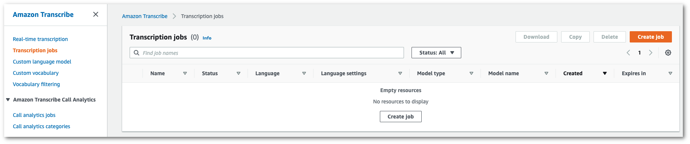

Select **Create job**. 2. Complete the fields on the **Specify job details**
page.

The input location _must_ be an object within an Amazon S3 bucket. For
output location, you can choose a secure Amazon S3 service-managed bucket or you can specify
your own Amazon S3 bucket.

If you choose a service-managed bucket, you can view a transcript preview in the
AWS Management Console and you can download your transcript from the job details page (see
below).

If you choose your own Amazon S3 bucket, you cannot see a preview in the
AWS Management Console and must go to the Amazon S3 bucket to download your transcript.

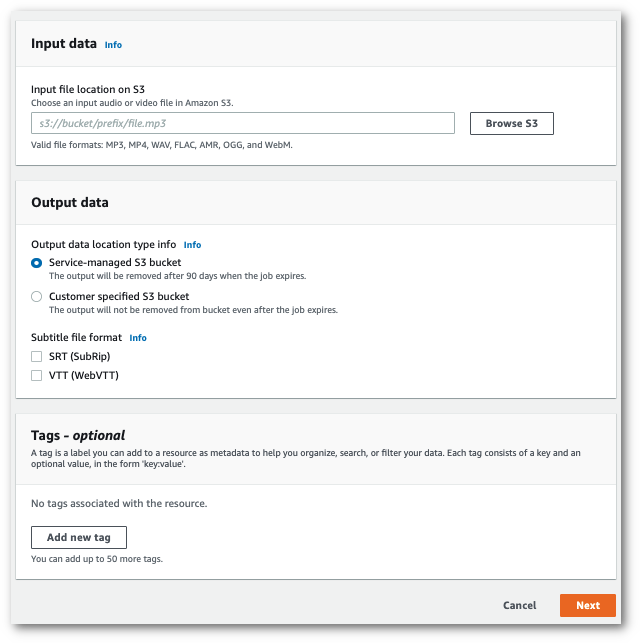

Select **Next**. 3. Select any desired options on the **Configure job**
page. If you want to use
[Custom vocabularies](custom-vocabulary.md "custom-vocabulary.md") or
[Custom language models](custom-language-models.md "custom-language-models.md")
with your transcription, you must create these before starting your
transcription job.

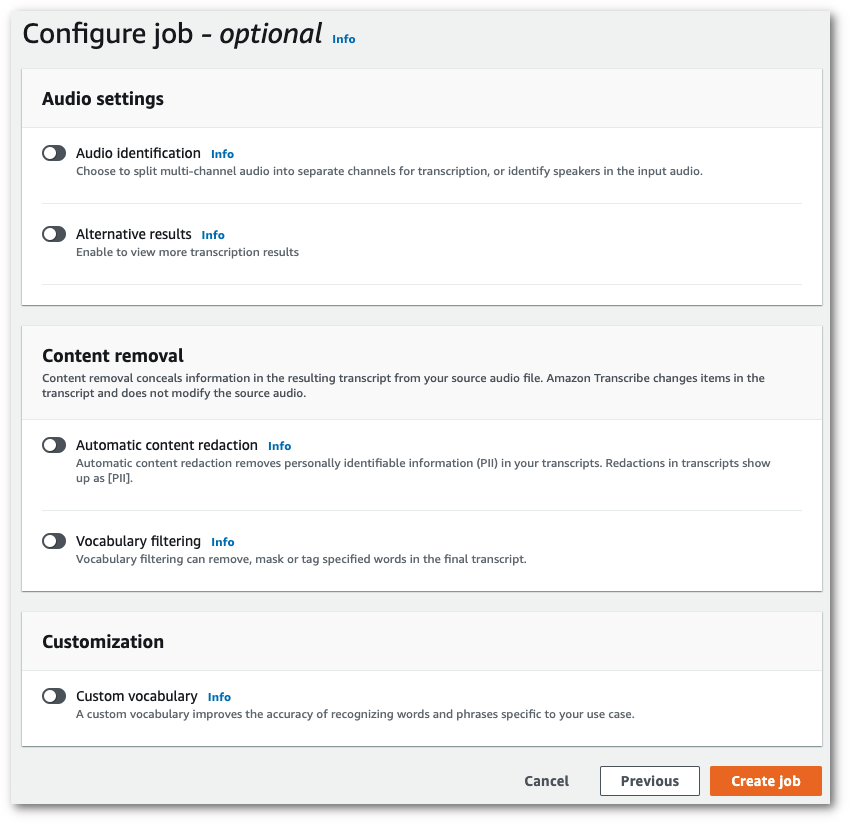

Select **Create job**. 4. You're now on the **Transcription jobs** page. Here you can
see the status of the transcription job. Once complete, select your
transcription.

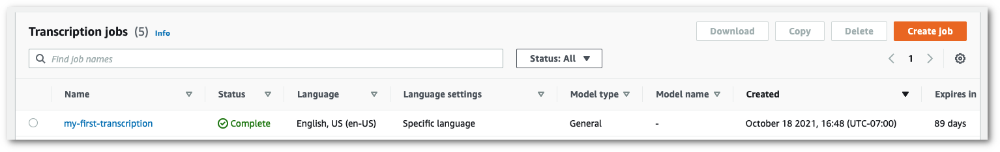 5. You're now viewing the **Job details** page for your
transcription. Here you can view all of the options you specified when setting up
your transcription job.

To view your transcript, select the linked filepath in the right column under
**Output data location**. This takes you to the Amazon S3 output folder you specified. Select your output file, which now has a .json
extension.

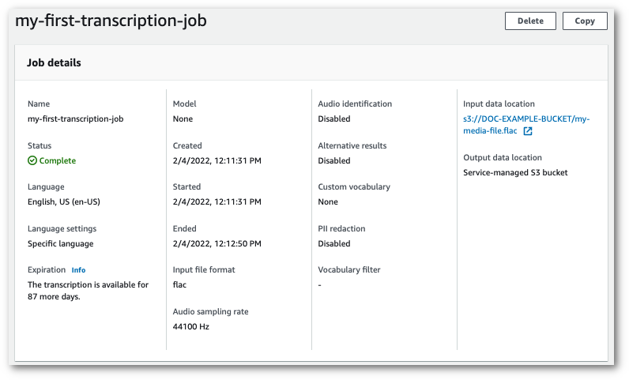 6. How you download your transcript depends on whether you chose a
service-managed Amazon S3 bucket or your own Amazon S3 bucket.

    1. If you chose a service-managed bucket, you can see a
     **Transcription preview** pane on your transcription job's information
     page, along with a **Download** button.

    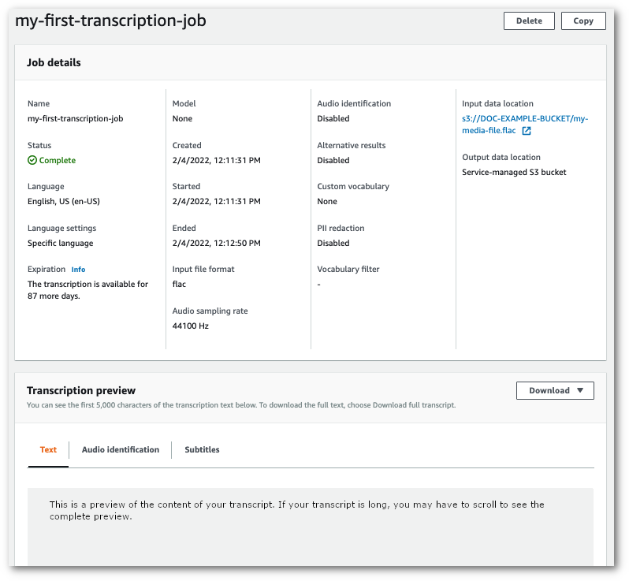

    Select **Download** and choose
     **Download transcript**.
    2. If you chose your own Amazon S3 bucket, you don't see any text in the
     **Transcription preview** pane on your transcription job's
     information page. Instead, you see a blue information box with a link to the Amazon S3 bucket
     you chose.

    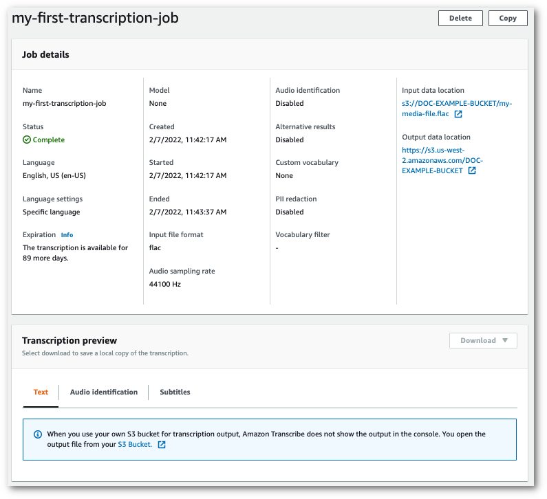

    To access your transcript, go to the specified Amazon S3 bucket using the
     link under **Output data location** in the **Job
     details** pane or the **S3 Bucket** link within the blue
     information box in the **Transcription preview** pane.

1. From the [AWS Management Console](https://console.aws.amazon.com/transcribe "https://console.aws.amazon.com/transcribe"),
   select **Real-time transcription** in the left navigation pane. This takes you
   to the main streaming page where you can select options before starting your stream.

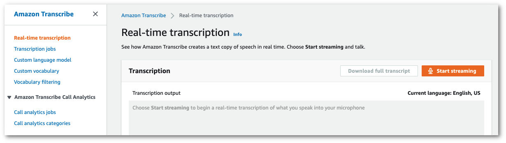 2. Below the **Transcription output** box, you have the
option to select various language and audio settings.

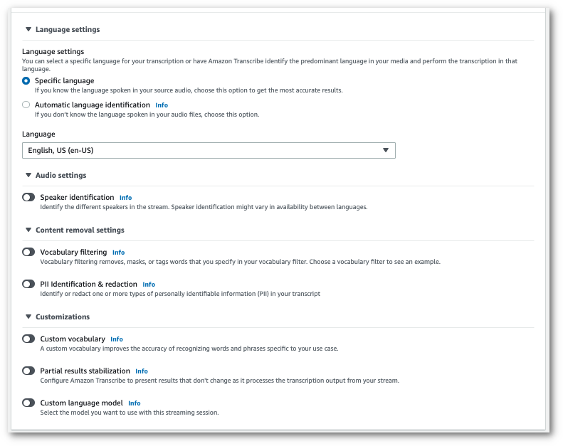 3. After you've selected the appropriate settings, scroll to the top of the page
and choose **Start streaming**, then begin speaking into your
computer microphone. You can see your speech transcribed in real time.

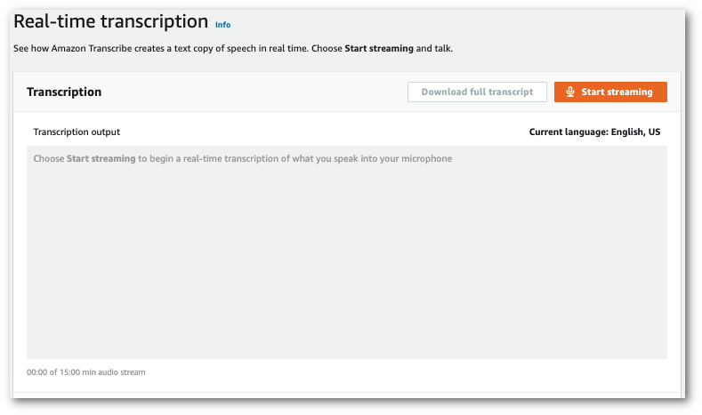 4. When you're finished, select **Stop streaming**.

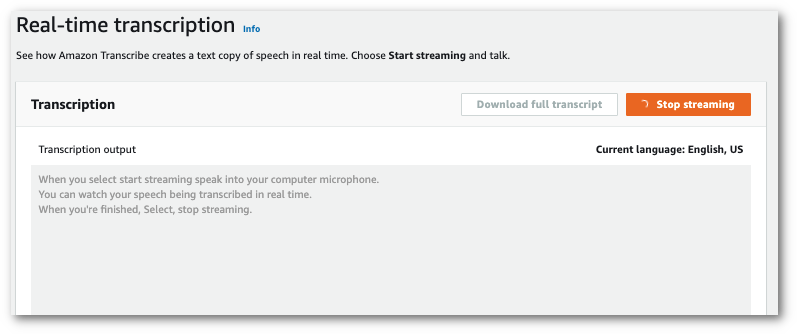

You can now download your transcript by selecting **Download full
transcript**.
