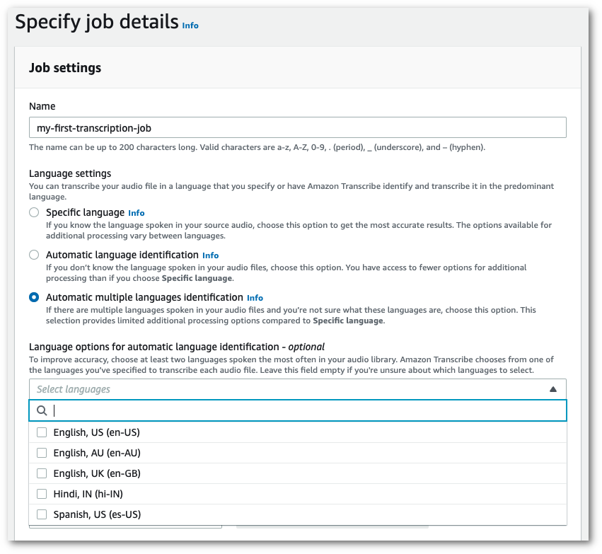
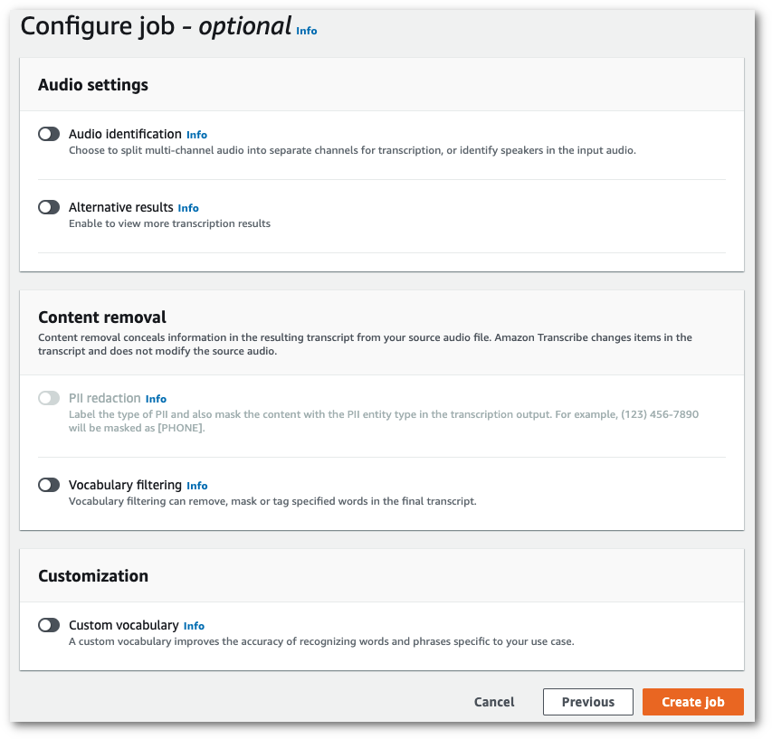

# Language identification with batch transcription jobs

Use batch language identification to automatically identify the language, or languages, in your
media file.

If your media contains only one language, you can enable [single-language identification](../APIReference/API_StartTranscriptionJob.md#transcribe-StartTranscriptionJob-request-IdentifyLanguage "../APIReference/API_StartTranscriptionJob.md#transcribe-StartTranscriptionJob-request-IdentifyLanguage"), which identifies the dominant language
spoken in your media file and creates your transcript using only this language.

If your media contains more than one language, you can enable [multi-language identification](../APIReference/API_StartTranscriptionJob.md#transcribe-StartTranscriptionJob-request-IdentifyMultipleLanguages "../APIReference/API_StartTranscriptionJob.md#transcribe-StartTranscriptionJob-request-IdentifyMultipleLanguages"), which identifies all languages spoken
in your media file and creates your transcript using each identified language. Note that a
multi-lingual transcript is produced. You can use other services, such as Amazon Translate, to
translate your transcript.

Refer to the [supported languages](supported-languages.md "supported-languages.md") table for a
complete list of supported languages and associated language codes.

For best results, ensure that your media file contains at least 30 seconds
of speech.

For usage examples with the AWS Management Console, AWS CLI, and
AWS Python SDK, see [Using language identification with batch
transcriptions](#lang-id-batch-examples "#lang-id-batch-examples").

## Identifying languages in multi-language audio

Multi-language identification is intended for multi-lingual media files, and provides
you with a transcript that reflects all [supported
languages](supported-languages.md "supported-languages.md") spoken in your media. This means that if speakers change languages
mid-conversation, or if each participant is speaking a different language, your
transcription output detects and transcribes each language correctly. For example, if
your media contains a bilingual speaker who is alternating between US English
(`en-US`) and Hindi (`hi-IN`), multi-language identification
can identify and transcribe spoken US English as `en-US` and
spoken Hindi as `hi-IN`.

This differs from single-language identification, where only one dominant language is used to
create a transcript. In this case, any spoken language that is not the dominant language is
transcribed incorrectly.

###### Note

Redaction and custom language models are not currently supported with multi-language
identification.

###### Note

The following languages are currently supported with multi-language identification: en-AB,
en-AU, en-GB, en-IE, en-IN, en-NZ, en-US, en-WL, en-ZA, es-ES, es-US, fr-CA, fr-FR, zh-CN,
zh-TW, pt-BR, pt-PT, de-CH, de-DE, af-ZA, ar-AE, da-DK, he-IL, hi-IN, id-ID, fa-IR, it-IT,
ja-JP, ko-KR, ms-MY, nl-NL, ru-RU, ta-IN, te-IN, th-TH, tr-TR

Multi-language transcripts provide a summary of detected languages and the total time
that each language is spoken in your media. Here's an example:

```
"results": {
        "transcripts": [
            {
                "transcript": "welcome to Amazon transcribe. ये तो उदाहरण हैं क्या कैसे कर सकते हैं ।一つのファイルに複数の言語を書き写す"
            }
        ],

    `...`

        "language_codes": [
            {
                "language_code": "en-US",
                "duration_in_seconds": 2.45
            },
            {
                "language_code": "hi-IN",
                "duration_in_seconds": 5.325
            },
            {
                "language_code": "ja-JP",
                "duration_in_seconds": 4.15
            }
        ]
}
```

## Improving language identification accuracy

With language identification, you have the option to include a list of languages you
think may be present in your media. Including language options
(`LanguageOptions`) restricts Amazon Transcribe to using only the
languages that you specify when matching your audio to the correct language, which can
speed up language identification and improve the accuracy associated with assigning the
correct language dialect.

If you choose to include language codes, you must include at least two. There's no
limit on the number of language codes you can include, but we recommend using between
two and five for optimal efficiency and accuracy.

###### Note

If you include language codes with your request and none of the language codes you
provide match the language, or languages, identified in your audio, Amazon Transcribe selects
the closest language match from your specified language codes. It then produces a transcript
in that language. For example, if your media is in US English (`en-US`) and you
provide Amazon Transcribe with the language codes `zh-CN`,
`fr-FR`, and `de-DE`, Amazon Transcribe is likely to match your
media to German (`de-DE`) and produce a German-language transcription.
Mismatching language codes and spoken languages can result in an inaccurate transcript, so
we recommend caution when including language codes.

## Combining language identification with other

Amazon Transcribe features

You can use batch language identification in combination with any other Amazon Transcribe
feature. If combining language identification with other features, you are limited to the languages
supported with those features. For example, if using language identification with content redaction,
you are limited to US English (`en-US`) or US Spanish (`es-US`), as this is only language available for redaction.
Refer to [Supported languages and language-specific features](supported-languages.md "supported-languages.md") for more
information.

###### Important

If you're using automatic language identification with content redaction enabled and your
audio contains languages other than US English (`en-US`) or US Spanish (`es-US`), only the US English or US Spanish
content is redacted in your transcript. Other languages cannot be redacted and there are no
warnings or job failures.

**Custom language models, custom vocabularies, and custom vocabulary filters**

If you want to add one or more custom language models, custom vocabularies, or custom
vocabulary filters to your language identification request, you must include the
[`LanguageIdSettings`](../APIReference/API_LanguageIdSettings.md "../APIReference/API_LanguageIdSettings.md")
parameter. You can then specify a language code with a corresponding custom language model,
custom vocabulary, and custom vocabulary filter. Note that multi-language identification doesn't
support custom language models.

It's recommended that you include `LanguageOptions` when using
[`LanguageIdSettings`](../APIReference/API_LanguageIdSettings.md "../APIReference/API_LanguageIdSettings.md")
to ensure that the correct language dialect is identified. For example, if you specify an
`en-US` custom vocabulary, but Amazon Transcribe determines that the language
spoken in your media is `en-AU`, your custom vocabulary _is not_
applied to your transcription. If you include `LanguageOptions` and specify
`en-US` as the only English language dialect, your custom vocabulary
_is_ applied to your transcription.

For examples of [`LanguageIdSettings`](../APIReference/API_LanguageIdSettings.md "../APIReference/API_LanguageIdSettings.md")
in a request, refer to Option 2 in the **AWS CLI** and
**AWS SDKs** dropdown panels in the
[Using language identification with batch
transcriptions](#lang-id-batch-examples "#lang-id-batch-examples") section.

## Using language identification with batch

transcriptions

You can use automatic language identification in a batch transcription job using the
**AWS Management Console**, **AWS CLI**,
or **AWS SDKs**; see the following for
examples:

1. Sign in to the [AWS Management Console](https://console.aws.amazon.com/transcribe/ "https://console.aws.amazon.com/transcribe/").
2. In the navigation pane, choose **Transcription jobs**, then select
   **Create job** (top right). This opens the **Specify job
   details** page.
3. In the **Job settings** panel, find the **Language
   settings** section and select **Automatic language identification**
   or **Automatic multiple languages identification**.

You have the option to select multiple language options (from the _Select
languages_ dropdown box) if you know which languages are present in your
audio file. Providing language options can improve accuracy, but is not required.

 4. Fill in any other fields you want to include on the **Specify job details**
page, then select **Next**. This takes you to the
**Configure job - _optional_** page.

 5. Select **Create job** to run your transcription job.
This example uses the [start-transcription-job](https://awscli.amazonaws.com/v2/documentation/api/latest/reference/transcribe/start-transcription-job.html "https://awscli.amazonaws.com/v2/documentation/api/latest/reference/transcribe/start-transcription-job.html") command and `IdentifyLanguage` parameter.
For more information, see [`StartTranscriptionJob`](../APIReference/API_StartTranscriptionJob.md "../APIReference/API_StartTranscriptionJob.md") and
[`LanguageIdSettings`](../APIReference/API_LanguageIdSettings.md "../APIReference/API_LanguageIdSettings.md").

**Option 1**: Without the `language-id-settings` parameter. Use this option if you are **not** including a custom language model, custom vocabulary, or custom vocabulary filter in your request. `language-options` is optional, but recommended.

```
aws transcribe start-transcription-job \
--region `us-west-2` \
--transcription-job-name `my-first-transcription-job` \
--media MediaFileUri=s3://`amzn-s3-demo-bucket`/`my-input-files`/`my-media-file`.`flac` \
--output-bucket-name `amzn-s3-demo-bucket` \
--output-key `my-output-files`/ \
--identify-language \  (or --identify-multiple-languages) \
--language-options "`en-US`" "`hi-IN`"
```

**Option 2**: With the `language-id-settings` parameter. Use this option if you **are** including a custom language model, custom vocabulary, or custom vocabulary filter in your request.

```
aws transcribe start-transcription-job \
--region `us-west-2` \
--transcription-job-name `my-first-transcription-job` \
--media MediaFileUri=s3://`amzn-s3-demo-bucket`/`my-input-files`/`my-media-file`.`flac` \
--output-bucket-name `amzn-s3-demo-bucket` \
--output-key `my-output-files`/ \
--identify-language \  (or --identify-multiple-languages)
--language-options "`en-US`" "`hi-IN`" \
--language-id-settings `en-US`=VocabularyName=`my-en-US-vocabulary`,`en-US`=VocabularyFilterName=`my-en-US-vocabulary-filter`,`en-US`=LanguageModelName=`my-en-US-language-model`,`hi-IN`=VocabularyName=`my-hi-IN-vocabulary`,`hi-IN`=VocabularyFilterName=`my-hi-IN-vocabulary-filter`
```

Here's another example using the [start-transcription-job](https://awscli.amazonaws.com/v2/documentation/api/latest/reference/transcribe/start-transcription-job.html "https://awscli.amazonaws.com/v2/documentation/api/latest/reference/transcribe/start-transcription-job.html") command, and a request body that identifies the language.

```
aws transcribe start-transcription-job \
--region `us-west-2` \
--cli-input-json file://`filepath`/`my-first-language-id-job.json`
```

The file _my-first-language-id-job.json_ contains the following request body.

**Option 1**: Without the `LanguageIdSettings` parameter. Use this option if you are **not** including a custom language model, custom vocabulary, or custom vocabulary filter in your request. `LanguageOptions` is optional, but recommended.

```
{
  "TranscriptionJobName": "`my-first-transcription-job`",
  "Media": {
        "MediaFileUri": "s3://`amzn-s3-demo-bucket`/`my-input-files`/`my-media-file`.`flac`"
   },
  "OutputBucketName": "`amzn-s3-demo-bucket`",
  "OutputKey": "`my-output-files`/",
  "IdentifyLanguage": `true`,  (or "IdentifyMultipleLanguages": `true`),
  "LanguageOptions": [
        "`en-US`", "`hi-IN`"
  ]
}
```

**Option 2**: With the `LanguageIdSettings` parameter. Use this option if you **are** including a custom language model, custom vocabulary, or custom vocabulary filter in your request.

```
{
   "TranscriptionJobName": "`my-first-transcription-job`",
   "Media": {
        "MediaFileUri": "s3://`amzn-s3-demo-bucket`/`my-input-files`/`my-media-file`.`flac`"
   },
   "OutputBucketName": "`amzn-s3-demo-bucket`",
   "OutputKey": "`my-output-files`/",
   "IdentifyLanguage": `true`,  (or "IdentifyMultipleLanguages": `true`)
   "LanguageOptions": [
        "`en-US`", "`hi-IN`"
   ],
   "LanguageIdSettings": {
         "`en-US`" : {
            "LanguageModelName": "`my-en-US-language-model`",
            "VocabularyFilterName": "`my-en-US-vocabulary-filter`",
            "VocabularyName": "`my-en-US-vocabulary`"
         },
         "`hi-IN`": {
             "VocabularyName": "`my-hi-IN-vocabulary`",
             "VocabularyFilterName": "`my-hi-IN-vocabulary-filter`"
         }
    }
}
```

This example uses the AWS SDK for Python (Boto3) to identify your file's language using
the `IdentifyLanguage` argument for the [start_transcription_job](https://boto3.amazonaws.com/v1/documentation/api/latest/reference/services/transcribe.html#TranscribeService.Client.start_transcription_job "https://boto3.amazonaws.com/v1/documentation/api/latest/reference/services/transcribe.html#TranscribeService.Client.start_transcription_job") method. For more information, see
[`StartTranscriptionJob`](../APIReference/API_StartTranscriptionJob.md "../APIReference/API_StartTranscriptionJob.md") and
[`LanguageIdSettings`](../APIReference/API_LanguageIdSettings.md "../APIReference/API_LanguageIdSettings.md").

For additional examples using the AWS SDKs, including feature-specific, scenario, and
cross-service examples, refer to the [Code examples for Amazon Transcribe using AWS SDKs](service_code_examples.md "service_code_examples.md") chapter.

**Option 1**: Without the `LanguageIdSettings` parameter. Use this option if you are **not** including a custom language model, custom vocabulary, or custom vocabulary filter in your request. `LanguageOptions` is optional, but recommended.

```
from __future__ import print_function
import time
import boto3
transcribe = boto3.client('transcribe', '`us-west-2`')
job_name = "`my-first-transcription-job`"
job_uri = "s3://`amzn-s3-demo-bucket`/`my-input-files`/`my-media-file`.`flac`"
transcribe.start_transcription_job(
    TranscriptionJobName = job_name,
    Media = {
        'MediaFileUri': job_uri
    },
    OutputBucketName = '`amzn-s3-demo-bucket`',
    OutputKey = '`my-output-files`/',
    MediaFormat = '`flac`',
    IdentifyLanguage = `True`,  (or IdentifyMultipleLanguages = `True`),
    LanguageOptions = [
        '`en-US`', '`hi-IN`'
    ]
)

while True:
    status = transcribe.get_transcription_job(TranscriptionJobName = job_name)
    if status['TranscriptionJob']['TranscriptionJobStatus'] in ['COMPLETED', 'FAILED']:
        break
    print("Not ready yet...")
    time.sleep(5)
print(status)
```

**Option 2**: With the `LanguageIdSettings` parameter. Use this option if you **are** including a custom language model, custom vocabulary, or custom vocabulary filter in your request.

```
from __future__ import print_function
import time
import boto3
transcribe = boto3.client('transcribe')
job_name = "`my-first-transcription-job`"
job_uri = "s3://`amzn-s3-demo-bucket`/`my-input-files`/`my-media-file`.`flac`"
transcribe.start_transcription_job(
    TranscriptionJobName = job_name,
    Media = {
        'MediaFileUri': job_uri
    },
    OutputBucketName = '`amzn-s3-demo-bucket`',
    OutputKey = '`my-output-files`/',
    MediaFormat='`flac`',
    IdentifyLanguage=`True`,  (or IdentifyMultipleLanguages=`True`)
    LanguageOptions = [
        '`en-US`', '`hi-IN`'
    ],
    LanguageIdSettings={
        'en-US': {
            'VocabularyName': '`my-en-US-vocabulary`',
            'VocabularyFilterName': '`my-en-US-vocabulary-filter`',
            'LanguageModelName': '`my-en-US-language-model`'
        },
        'hi-IN': {
            'VocabularyName': '`my-hi-IN-vocabulary`',
            'VocabularyFilterName': '`my-hi-IN-vocabulary-filter`'
        }
    }
)

while True:
    status = transcribe.get_transcription_job(TranscriptionJobName = job_name)
    if status['TranscriptionJob']['TranscriptionJobStatus'] in ['COMPLETED', 'FAILED']:
        break
    print("Not ready yet...")
    time.sleep(5)
print(status)
```
