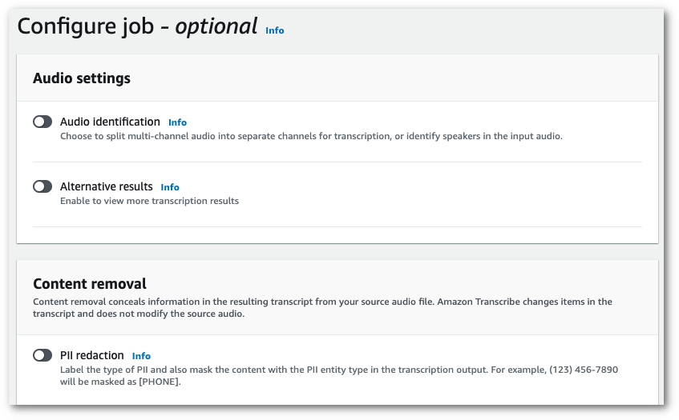
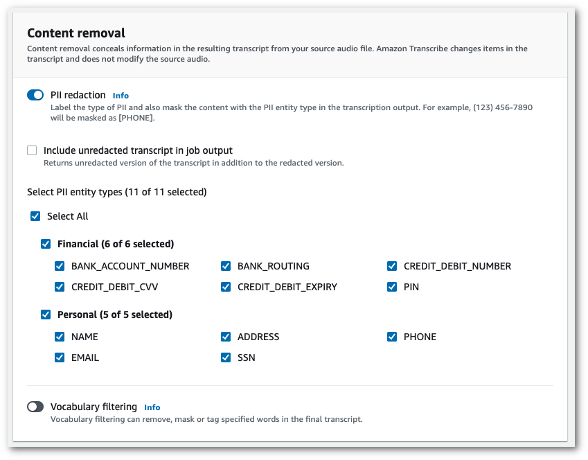

# Redacting PII in your batch job

When redacting personally identifiable information (PII) from a transcript during a batch
transcription job, Amazon Transcribe replaces each identified instance of PII with
`[PII]` in the main text body of your transcript. You can also view the type of PII
that is redacted in the word-for-word portion of the transcription output. For an output sample,
see [Example redacted output (batch)](pii-redaction-output.md#pii-redaction-output-batch "pii-redaction-output.md#pii-redaction-output-batch").

Redaction with batch transcriptions is available with US English (`en-US`) and US Spanish (`es-US`).
Redaction is not compatible with [language identification](lang-id-batch.md "lang-id-batch.md").

Both redacted and unredacted transcripts are stored in the same output Amazon S3
bucket. Amazon Transcribe stores them in a bucket you specify or in the default
Amazon S3 bucket managed by the service.

Types of PII Amazon Transcribe can recognize for batch
transcriptions| PII type | Description |
| --- | --- |
| `ADDRESS` | A physical address, such as *100 Main Street, Anytown, USA<br>• or<br>*Suite #12, Building 123*. An address can include a street, building, location, city,<br>state, country, county, zip, precinct, neighborhood, and more. |
| `ALL` | Redact or identify all PII types listed in this table. |
| `BANK_ACCOUNT_NUMBER` | A US bank account number. These are typically between 10<br>• 12 digits long, but<br>Amazon Transcribe also recognizes bank account numbers when only the last 4 digits are<br>present. |
| `BANK_ROUTING` | A US bank account routing number. These are typically 9 digits long, but<br>Amazon Transcribe also recognizes routing numbers when only the last 4 digits are<br>present. |
| `CREDIT_DEBIT_CVV` | A 3-digit card verification code (CVV) that is present on VISA, MasterCard, and<br>Discover credit and debit cards. In American Express credit or debit cards, it is a 4-digit numeric<br>code. |
| `CREDIT_DEBIT_EXPIRY` | The expiration date for a credit or debit card. This number is usually 4 digits long and<br>formatted as month/year or MM/YY. For example, Amazon Transcribe can recognize expiration<br>dates such as *01/21*, *01/2021*, and<br>*Jan 2021*. |
| `CREDIT_DEBIT_NUMBER` | The number for a credit or debit card. These numbers can vary from 13 to 16 digits in<br>length, but Amazon Transcribe also recognizes credit or debit card numbers when only the last 4<br>digits are present. |
| `EMAIL` | An email address, such as *efua.owusu@email.com*. |
| `NAME` | An individual's name. This entity type does not include titles, such as Mr., Mrs., Miss,<br>or Dr. Amazon Transcribe does not apply this entity type to names that are part of organizations<br>or addresses. For example, Amazon Transcribe recognizes the *John Doe<br>Organization<br>• as an organization, and \*Jane Doe Street<br>• as an<br>address. |
| `PHONE` | A phone number. This entity type also includes fax and pager numbers. |
| `PIN` | A 4-digit personal identification number (PIN) that allows someone to access their<br>bank account information. |
| `SSN` | A Social Security Number (SSN) is a 9-digit number that is issued to US citizens,<br>permanent residents, and temporary working residents. Amazon Transcribe also recognizes Social<br>Security Numbers when only the last 4 digits are present. |

You can start a batch transcription job using the AWS Management Console, AWS CLI,
or AWS SDK.

1. Sign in to the [AWS Management Console](https://console.aws.amazon.com/transcribe/ "https://console.aws.amazon.com/transcribe/").
2. In the navigation pane, choose **Transcription jobs**, then select
   **Create job** (top right). This will open the **Specify job
   details** page.
3. After filling in your desired fields on the **Specify job details** page, select
   **Next** to go to the **Configure job -
   _optional_** page. Here you'll find the **Content
   removal** panel with the **PII redaction** toggle.

 4. Once you select **PII redaction**, you have the option to select all
PII types you want to redact. You can also choose to have an unredacted transcript if you
select **Include unredacted transcript in job output** box.

 5. Select **Create job** to run your transcription job.
This example uses the [start-transcription-job](https://awscli.amazonaws.com/v2/documentation/api/latest/reference/transcribe/start-transcription-job.html "https://awscli.amazonaws.com/v2/documentation/api/latest/reference/transcribe/start-transcription-job.html") command and `content-redaction` parameter. For more information, see [`StartTranscriptionJob`](../APIReference/API_StartTranscriptionJob.md "../APIReference/API_StartTranscriptionJob.md") and
[`ContentRedaction`](../APIReference/API_ContentRedaction.md "../APIReference/API_ContentRedaction.md").

```
aws transcribe start-transcription-job \
--region `us-west-2` \
--transcription-job-name `my-first-transcription-job` \
--media MediaFileUri=s3://`amzn-s3-demo-bucket`/`my-input-files`/`my-media-file`.`flac` \
--output-bucket-name `amzn-s3-demo-bucket` \
--output-key `my-output-files`/ \
--language-code `en-US` \
--content-redaction  RedactionType=`PII`,RedactionOutput=`redacted`,PiiEntityTypes=`NAME`,`ADDRESS`,`BANK_ACCOUNT_NUMBER`
```

Here's another example using the [start-transcription-job](https://awscli.amazonaws.com/v2/documentation/api/latest/reference/transcribe/start-transcription-job.html "https://awscli.amazonaws.com/v2/documentation/api/latest/reference/transcribe/start-transcription-job.html") method, and the request body redacts PII for that job.

```
aws transcribe start-transcription-job \
--region `us-west-2` \
--cli-input-json file://`filepath`/`my-first-redaction-job`.json
```

The file _my-first-redaction-job.json_ contains the following request body.

```
{
  "TranscriptionJobName": "`my-first-transcription-job`",
  "Media": {
      "MediaFileUri":  "s3://`amzn-s3-demo-bucket`/`my-input-files`/`my-media-file`.`flac`"
  },
  "OutputBucketName": "`amzn-s3-demo-bucket`",
  "OutputKey": "`my-output-files`/",
  "LanguageCode": "`en-US`",
  "ContentRedaction": {
      "RedactionOutput":"`redacted`",
      "RedactionType":"PII",
      "PiiEntityTypes": [
           "`NAME`",
           "`ADDRESS`",
           "`BANK_ACCOUNT_NUMBER`"
      ]
  }
}
```

This example uses the AWS SDK for Python (Boto3) to redact content using the `ContentRedaction`
argument for the
[start_transcription_job](https://boto3.amazonaws.com/v1/documentation/api/latest/reference/services/transcribe.html#TranscribeService.Client.start_transcription_job "https://boto3.amazonaws.com/v1/documentation/api/latest/reference/services/transcribe.html#TranscribeService.Client.start_transcription_job") method. For more information, see
[`StartTranscriptionJob`](../APIReference/API_StartTranscriptionJob.md "../APIReference/API_StartTranscriptionJob.md") and
[`ContentRedaction`](../APIReference/API_ContentRedaction.md "../APIReference/API_ContentRedaction.md").

For additional examples using the AWS SDKs, including feature-specific, scenario, and
cross-service examples, refer to the [Code examples for Amazon Transcribe using AWS SDKs](service_code_examples.md "service_code_examples.md") chapter.

```
from __future__ import print_function
import time
import boto3
transcribe = boto3.client('transcribe', '`us-west-2`')
job_name = "`my-first-transcription-job`"
job_uri = "s3://`amzn-s3-demo-bucket`/`my-input-files`/`my-media-file`.`flac`"
transcribe.start_transcription_job(
    TranscriptionJobName = job_name,
    Media = {
        'MediaFileUri': job_uri
    },
    OutputBucketName = '`amzn-s3-demo-bucket`',
    OutputKey = '`my-output-files`/',
    LanguageCode = '`en-US`',
    ContentRedaction = {
        'RedactionOutput':'`redacted`',
        'RedactionType':'PII',
        'PiiEntityTypes': [
            '`NAME`','`ADDRESS`','`BANK_ACCOUNT_NUMBER`'
        ]
    }
)

while True:
    status = transcribe.get_transcription_job(TranscriptionJobName = job_name)
    if status['TranscriptionJob']['TranscriptionJobStatus'] in ['COMPLETED', 'FAILED']:
        break
    print("Not ready yet...")
    time.sleep(5)
print(status)
```

###### Note

PII redaction for batch jobs is only supported in these AWS Regions: Asia Pacific
(Hong Kong), Asia Pacific (Mumbai), Asia Pacific (Seoul), Asia Pacific (Singapore), Asia
Pacific (Sydney), Asia Pacific (Tokyo), GovCloud (US-West), Canada (Central), EU
(Frankfurt), EU (Ireland), EU (London), EU (Paris), Middle East (Bahrain), South America
(Sao Paulo), US East (N. Virginia), US East (Ohio), US West (Oregon), and US West (N.
California).
