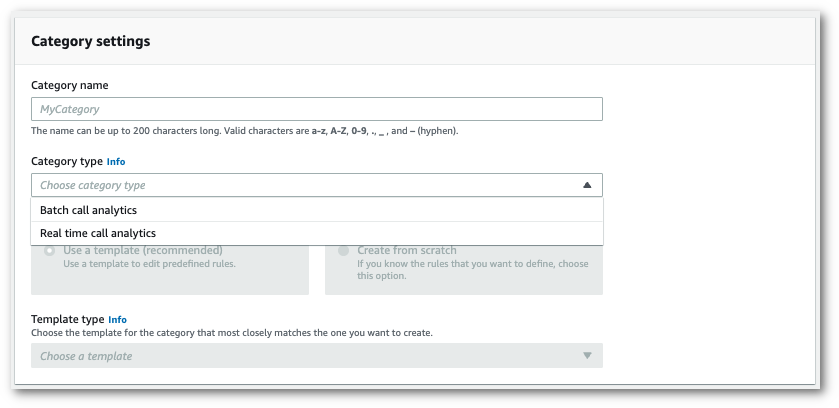
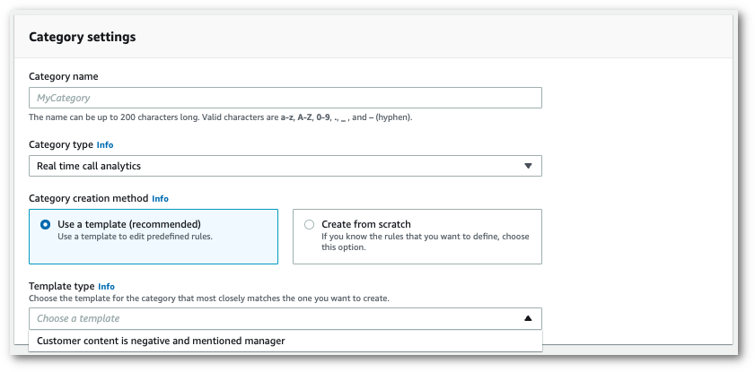
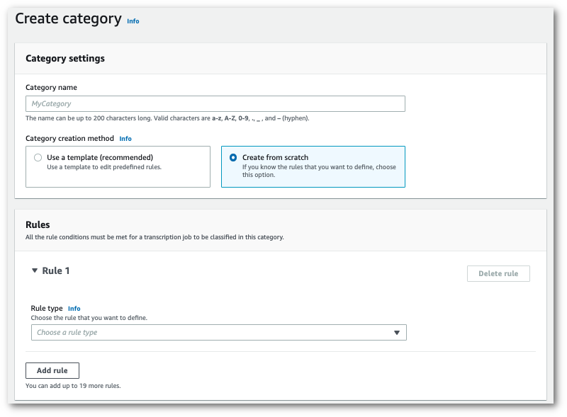
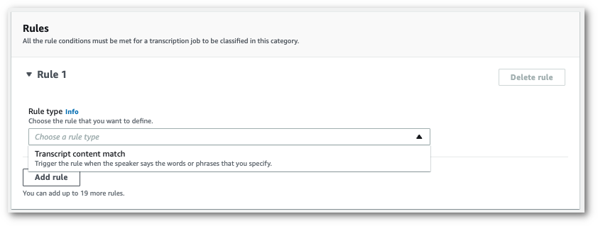
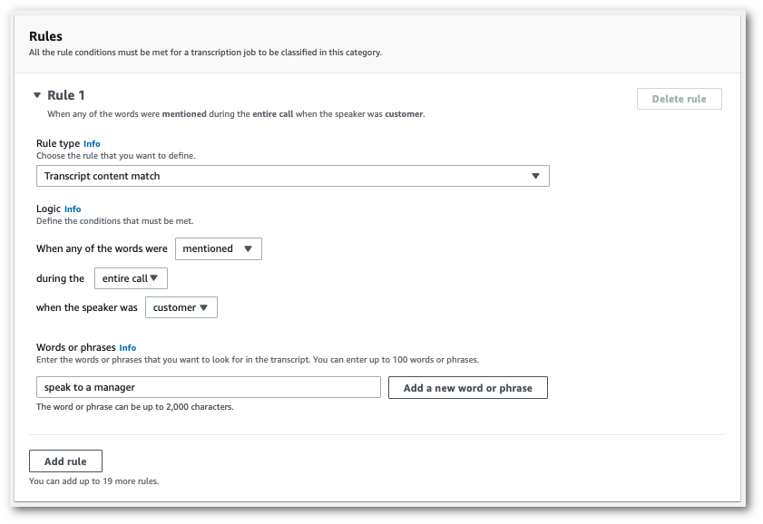

# Creating categories for real-time transcriptions

Real-time Call Analytics supports the creation of custom categories, which you can use to
tailor your transcript analyses to best suit your specific business needs.

You can create as many categories as you like to cover a range of different scenarios. For
each category you create, you must create between 1 and 20 rules. Real-time Call Analytics transcriptions
only support rules that use [`TranscriptFilter`](../APIReference/API_TranscriptFilter.md "../APIReference/API_TranscriptFilter.md") (keyword
matches). For more detail on using rules with the [`CreateCallAnalyticsCategory`](../APIReference/API_CreateCallAnalyticsCategory.md "../APIReference/API_CreateCallAnalyticsCategory.md")
operation, refer to the [Rule criteria for real-time Call Analytics categories](#tca-rules-stream "#tca-rules-stream") section.

If the content in your media matches all the rules you've specified in a given category,
Amazon Transcribe labels your output with that category. See
[category event output](tca-output-streaming.md#tca-output-category-event-stream "tca-output-streaming.md#tca-output-category-event-stream") for an example of
a category match in JSON output format.

Here are a few examples of what you can do with custom categories:

- Identify issues that warrant immediate attention by flagging and tracking specific sets of
  keywords
- Monitor compliance, such as an agent speaking (or omitting) a specific phrase
- Flag specific words and phrases in real time; you can then set your category match to set
  an immediate alert. For example, if you create a real-time Call Analytics category for a customer saying
  "_speak to a manager_," you can set an
  [event alert](tca-start-stream.md#tca-create-alert-stream "tca-start-stream.md#tca-create-alert-stream") for this real-time category match
  that notifies the on-duty manager.
  **Post-call versus real-time categories**

When creating a new category, you can specify whether you want it created as a post-call
category (`POST_CALL`) or as a real-time category (`REAL_TIME`). If you
don't specify an option, your category is created as a post-call category by default. Real-time category
matches can be used to create real-time alerts. For more information, see
[Creating real-time alerts for category
matches](tca-start-stream.md#tca-create-alert-stream "tca-start-stream.md#tca-create-alert-stream").

To create a new category for real-time Call Analytics, you can use the
**AWS Management Console**, **AWS CLI**, or
**AWS SDKs**; see the following for examples:

1. In the navigation pane, under Amazon Transcribe, choose **Amazon Transcribe Call
   Analytics**.
2. Choose **Call analytics categories**, which takes you to the
   **Call analytics categories** page. Select the
   **Create category** button.

 3. You're now on the **Create category page**. Enter a name for your
category, then choose 'Real time call analytics' in the **Category type**
dropdown menu.

 4. You can choose a template to create your category or you can make one from scratch.

If using a template: select **Use a template (recommended)**, choose
the template you want, then select **Create category**.

 5. If creating a custom category: select **Create from scratch**.

 6. Add rules to your category using the dropdown menu. You can add up to 20 rules per
category. With real-time Call Analytics transcriptions, you can only include rules that involve transcript
content matches. Any matches are flagged in real time.

 7. Here's an example of a category with one rule: a customer who says "speak to a manager"
at any point in the call.

 8. When you're finished adding rules to your category, choose **Create
category**.
This example uses the [create-call-analytics-category](https://awscli.amazonaws.com/v2/documentation/api/latest/reference/transcribe/create-call-analytics-category.html "https://awscli.amazonaws.com/v2/documentation/api/latest/reference/transcribe/create-call-analytics-category.html") command. For more information, see
[`CreateCallAnalyticsCategory`](../APIReference/API_CreateCallAnalyticsCategory.md "../APIReference/API_CreateCallAnalyticsCategory.md"),
[`CategoryProperties`](../APIReference/API_CategoryProperties.md "../APIReference/API_CategoryProperties.md"), and
[`Rule`](../APIReference/API_Rule.md "../APIReference/API_Rule.md").

The following example creates a category with the rule:

- The customer spoke the phrase "speak to the manager" at any point in the call.
  This example uses the [create-call-analytics-category](https://awscli.amazonaws.com/v2/documentation/api/latest/reference/transcribe/create-call-analytics-category.html "https://awscli.amazonaws.com/v2/documentation/api/latest/reference/transcribe/create-call-analytics-category.html") command, and a request body that adds a rule to your category.

```
aws transcribe create-call-analytics-category \
--cli-input-json file://`filepath`/`my-first-analytics-category`.json
```

The file _my-first-analytics-category.json_ contains the following request
body.

```
{
  "CategoryName": "`my-new-real-time-category`",
  "InputType": "`REAL_TIME`",
  "Rules": [
        {
            "TranscriptFilter": {
                "Negate": `false`,
                "Targets": [
                    "`speak to the manager`"
                ],
                "TranscriptFilterType": "`EXACT`"
            }
        }
    ]
}
```

This example uses the AWS SDK for Python (Boto3) to create a category using the
`CategoryName` and `Rules` arguments for the
[create_call_analytics_category](https://boto3.amazonaws.com/v1/documentation/api/latest/reference/services/transcribe.html#TranscribeService.Client.create_call_analytics_category "https://boto3.amazonaws.com/v1/documentation/api/latest/reference/services/transcribe.html#TranscribeService.Client.create_call_analytics_category")
method. For more information, see [`CreateCallAnalyticsCategory`](../APIReference/API_CreateCallAnalyticsCategory.md "../APIReference/API_CreateCallAnalyticsCategory.md"),
[`CategoryProperties`](../APIReference/API_CategoryProperties.md "../APIReference/API_CategoryProperties.md"), and
[`Rule`](../APIReference/API_Rule.md "../APIReference/API_Rule.md").

For additional examples using the AWS SDKs, including feature-specific, scenario, and
cross-service examples, refer to the [Code examples for Amazon Transcribe using AWS SDKs](service_code_examples.md "service_code_examples.md") chapter.

The following example creates a category with the rule:

- The customer spoke the phrase "speak to the manager" at any point in the call.

```
from __future__ import print_function
import time
import boto3
transcribe = boto3.client('transcribe', '`us-west-2`')
category_name = "`my-new-real-time-category`"
transcribe.create_call_analytics_category(
    CategoryName = category_name,
    InputType = "`REAL_TIME`",
    Rules = [
        {
            'TranscriptFilter': {
                'Negate': `False`,
                'Targets': [
                    '`speak to the manager`'
                ],
                'TranscriptFilterType': '`EXACT`'
            }
        }
    ]
)

result = transcribe.get_call_analytics_category(CategoryName = category_name)
print(result)
```

## Rule criteria for real-time Call Analytics categories

This section outlines the types of custom `REAL_TIME` rules that you can create
using the [`CreateCallAnalyticsCategory`](../APIReference/API_CreateCallAnalyticsCategory.md "../APIReference/API_CreateCallAnalyticsCategory.md") API operation.

Issue detection occurs automatically, so you don't need to create any rules or categories to
flag issues.

Note that only keyword matches are supported for real-time Call Analytics transcriptions. If you want to
create categories that include interruptions, silence, or sentiment, refer to
[Rule criteria for post-call analytics categories](tca-categories-batch.md#tca-rules-batch "tca-categories-batch.md#tca-rules-batch").

### Keyword match

Rules using keywords ([`TranscriptFilter`](../APIReference/API_TranscriptFilter.md "../APIReference/API_TranscriptFilter.md") data type) are designed
to match:

- Custom words or phrases spoken by the agent, the customer, or both
- Custom words or phrases **not** spoken by the agent, the
  customer, or both
- Custom words or phrases that occur in a specific time frame

Here's an example of the parameters available with [`TranscriptFilter`](../APIReference/API_TranscriptFilter.md "../APIReference/API_TranscriptFilter.md"):

```
"TranscriptFilter": {
    "AbsoluteTimeRange": {
       `Specify the time frame, in milliseconds, when the match should occur`
    },
    "RelativeTimeRange": {
       `Specify the time frame, in percentage, when the match should occur`
    },
    "Negate": `Specify if you want to match the presence or absence of your custom keywords`,
    "ParticipantRole": `Specify if you want to match speech from the agent, the customer, or both`,
    "Targets": [ `The custom words and phrases you want to match` ],
    "TranscriptFilterType": `Use this parameter to specify an exact match for the specified targets`
}
```

Refer to [`CreateCallAnalyticsCategory`](../APIReference/API_CreateCallAnalyticsCategory.md "../APIReference/API_CreateCallAnalyticsCategory.md")
and [`TranscriptFilter`](../APIReference/API_TranscriptFilter.md "../APIReference/API_TranscriptFilter.md") for more
information on these parameters and the valid values associated with each.
