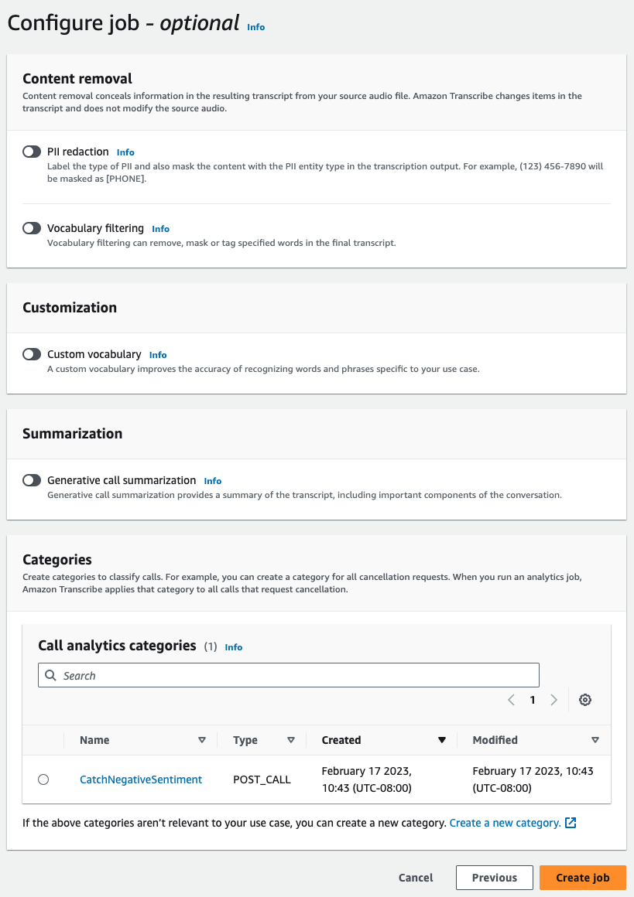

# Enabling generative call summarization

###### Note

**Powered by Amazon Bedrock:** AWS implements [automated abuse detection](../../../bedrock/latest/userguide/abuse-detection.md "../../../bedrock/latest/userguide/abuse-detection.md").
Because post-contact summarization powered by generative AI is built on Amazon Bedrock, users can take
full advantage of the controls implemented in Amazon Bedrock to enforce safety, security, and the
responsible use of artificial intelligence (AI).

To use generative call summarization with a post call analytics job, see the following for examples:

In the Summarization panel, enable Generative call summarization to receive summary in the output.


This example uses the [start-call-analytics-job](https://awscli.amazonaws.com/v2/documentation/api/latest/reference/transcribe/start-call-analytics-job.html "https://awscli.amazonaws.com/v2/documentation/api/latest/reference/transcribe/start-call-analytics-job.html") command and `Settings` parameter with the `Summarization` sub-parameters. For more information, see
[`StartCallAnalyticsJob`](../APIReference/API_StartCallAnalyticsJob.md "../APIReference/API_StartCallAnalyticsJob.md").

```

aws transcribe start-call-analytics-job \
--region `us-west-2` \
--call-analytics-job-name `my-first-call-analytics-job` \
--media MediaFileUri=`s3://amzn-s3-demo-bucket/my-input-files/my-media-file.flac` \
--output-location `s3://amzn-s3-demo-bucket/my-output-files/` \
--data-access-role-arn `arn:aws:iam::111122223333:role/ExampleRole` \
--channel-definitions ChannelId=0,ParticipantRole=AGENT ChannelId=1,ParticipantRole=CUSTOMER
--settings '{"Summarization":{"GenerateAbstractiveSummary":true}}'

```

Here's another example using the [start-call-analytics-job](https://awscli.amazonaws.com/v2/documentation/api/latest/reference/transcribe/start-call-analytics-job.html "https://awscli.amazonaws.com/v2/documentation/api/latest/reference/transcribe/start-call-analytics-job.html") command, and a request body that enables summarization for that job.

```

aws transcribe start-call-analytics-job \
--region `us-west-2` \
--cli-input-json `file://filepath/my-call-analytics-job.json`

```

The file _my-call-analytics-job.json_ contains the following request body.

```

{
  "CallAnalyticsJobName": `"my-first-call-analytics-job"`,
  "DataAccessRoleArn": `"arn:aws:iam::111122223333:role/ExampleRole"`,
  "Media": {
    "MediaFileUri": `"s3://amzn-s3-demo-bucket/my-input-files/my-media-file.flac"`
  },
  "OutputLocation": `"s3://amzn-s3-demo-bucket/my-output-files/"`,
  "ChannelDefinitions": [
    {
      "ChannelId": 0,
      "ParticipantRole": "AGENT"
    },
    {
      "ChannelId": 1,
      "ParticipantRole": "CUSTOMER"
    }
  ],
  "Settings": {
    "Summarization":{
      "GenerateAbstractiveSummary": true
    }
  }
}

```

This example uses the AWS SDK for Python (Boto3) to start a Call Analytics with summarization enabled using the
[start_call_analytics_job](https://boto3.amazonaws.com/v1/documentation/api/latest/reference/services/transcribe.html#TranscribeService.Client.start_call_analytics_job "https://boto3.amazonaws.com/v1/documentation/api/latest/reference/services/transcribe.html#TranscribeService.Client.start_call_analytics_job") method. For more
information, see [`StartCallAnalyticsJob`](../APIReference/API_StartCallAnalyticsJob.md "../APIReference/API_StartCallAnalyticsJob.md").

For additional examples using the AWS SDKs, including feature-specific, scenario, and
cross-service examples, refer to the [Code examples for Amazon Transcribe using AWS SDKs](service_code_examples.md "service_code_examples.md") chapter.

```

from __future__ import print_function
from __future__ import print_function
import time
import boto3
transcribe = boto3.client('transcribe', `'us-west-2'`)
job_name = `"my-first-call-analytics-job"`
job_uri = `"s3://amzn-s3-demo-bucket/my-input-files/my-media-file.flac"`
output_location = `"s3://amzn-s3-demo-bucket/my-output-files/"`
data_access_role = `"arn:aws:iam::111122223333:role/ExampleRole"`
transcribe.start_call_analytics_job(
  CallAnalyticsJobName = job_name,
  Media = {
    'MediaFileUri': job_uri
  },
  DataAccessRoleArn = data_access_role,
  OutputLocation = output_location,
  ChannelDefinitions = [
    {
      'ChannelId': 0,
      'ParticipantRole': 'AGENT'
    },
    {
      'ChannelId': 1,
      'ParticipantRole': 'CUSTOMER'
    }
  ],
  Settings = {
    "Summarization":
      {
        "GenerateAbstractiveSummary": true
      }
  }
)

while True:
  status = transcribe.get_call_analytics_job(CallAnalyticsJobName = job_name)
  if status['CallAnalyticsJob']['CallAnalyticsJobStatus'] in ['COMPLETED', 'FAILED']:
    break
  print("Not ready yet...")
  time.sleep(5)
print(status)

```
