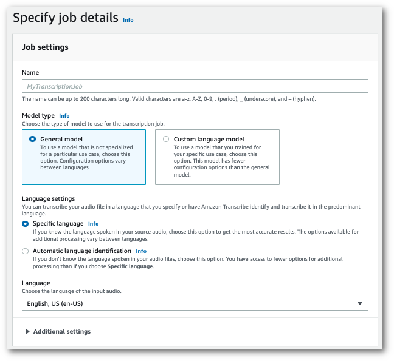
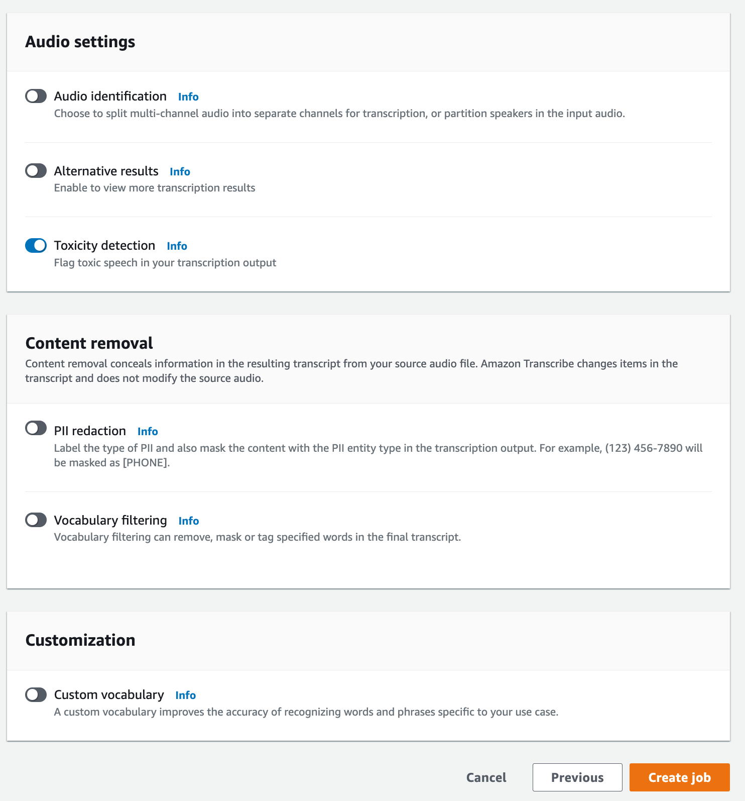

# Using toxic speech detection

## Using toxic speech detection in a batch transcription

To use toxic speech detection with a batch transcription, see the following for examples:

1. Sign in to the [AWS Management Console](https://console.aws.amazon.com/transcribe/ "https://console.aws.amazon.com/transcribe/").
2. In the navigation pane, choose **Transcription jobs**, then select
   **Create job** (top right). This opens the **Specify job
   details** page.

 3. On the **Specify job details** page, you can also enable PII redaction if you want. Note that the other listed options are not supported with Toxicity detection. Select **Next**. This takes you to the **Configure job - optional** page.
In the **Audio settings** panel, select **Toxicity detection**.

 4. Select **Create job** to run your transcription job. 5. Once your transcription job is complete, you can download your transcript from the **Download** drop-down menu in the transcription job's detail page.
This example uses the [start-transcription-job](https://awscli.amazonaws.com/v2/documentation/api/latest/reference/transcribe/start-transcription-job.html "https://awscli.amazonaws.com/v2/documentation/api/latest/reference/transcribe/start-transcription-job.html") command and `ToxicityDetection` parameter. For more information, see
[`StartTranscriptionJob`](../APIReference/API_StartTranscriptionJob.md "../APIReference/API_StartTranscriptionJob.md") and
[`ToxicityDetection`](../APIReference/API_ToxicityDetection.md "../APIReference/API_ToxicityDetection.md").

```

aws transcribe start-transcription-job \
--region `us-west-2` \
--transcription-job-name `my-first-transcription-job` \
--media MediaFileUri=`s3://amzn-s3-demo-bucket/my-input-files/my-media-file.flac` \
--output-bucket-name `amzn-s3-demo-bucket` \
--output-key `my-output-files/` \
--language-code en-US \
--toxicity-detection ToxicityCategories=ALL

```

Here's another example using the [start-transcription-job](https://awscli.amazonaws.com/v2/documentation/api/latest/reference/transcribe/start-transcription-job.html "https://awscli.amazonaws.com/v2/documentation/api/latest/reference/transcribe/start-transcription-job.html") command, and a request body that includes toxicity detection.

```

aws transcribe start-transcription-job \
--region `us-west-2` \
--cli-input-json `file://filepath/my-first-toxicity-job.json`

```

The file _my-first-toxicity-job.json_ contains the following request body.

```

{
  "TranscriptionJobName": "`my-first-transcription-job`",
  "Media": {
        "MediaFileUri": "`s3://amzn-s3-demo-bucket/my-input-files/my-media-file.flac`"
  },
  "OutputBucketName": "`amzn-s3-demo-bucket`",
  "OutputKey": "`my-output-files/`",
  "LanguageCode": "en-US",
  "ToxicityDetection": [
      {
         "ToxicityCategories": [ "ALL" ]
      }
   ]
}

```

This example uses the AWS SDK for Python (Boto3) to enable `ToxicityDetection` for the [start_transcription_job](https://boto3.amazonaws.com/v1/documentation/api/latest/reference/services/transcribe.html#TranscribeService.Client.start_transcription_job "https://boto3.amazonaws.com/v1/documentation/api/latest/reference/services/transcribe.html#TranscribeService.Client.start_transcription_job") method. For more information, see [`StartTranscriptionJob`](../APIReference/API_StartTranscriptionJob.md "../APIReference/API_StartTranscriptionJob.md") and [`ToxicityDetection`](../APIReference/Welcome.md "../APIReference/Welcome.md").

For additional examples using the AWS SDKs, including feature-specific, scenario, and cross-service examples, refer to the [Code examples for Amazon Transcribe using AWS SDKs](service_code_examples.md "service_code_examples.md") chapter.

```

from __future__ import print_function
import time
import boto3
transcribe = boto3.client('transcribe', '`us-west-2`')
job_name = "`my-first-transcription-job`"
job_uri = "`s3://amzn-s3-demo-bucket/my-input-files/my-media-file.flac`"
transcribe.start_transcription_job(
    TranscriptionJobName = job_name,
    Media = {
        'MediaFileUri': job_uri
    },
    OutputBucketName = '`amzn-s3-demo-bucket`',
    OutputKey = '`my-output-files/`',
    LanguageCode = 'en-US',
    ToxicityDetection = [
        {
            'ToxicityCategories': ['ALL']
        }
    ]
)

while True:
    status = transcribe.get_transcription_job(TranscriptionJobName = job_name)
    if status['TranscriptionJob']['TranscriptionJobStatus'] in ['COMPLETED', 'FAILED']:
        break
    print("Not ready yet...")
    time.sleep(5)
print(status)

```

## Example output

Toxic speech is tagged and categorized in your transcription output. Each instance of toxic
speech is categorized and assigned a confidence score (a value between 0 and 1). A larger
confidence value indicates a greater likelihood that the content is toxic speech within the
specified category.

The following is an example output in JSON format showing categorized toxic speech with
associated confidence scores.

```

{
    "jobName": "`my-toxicity-job`",
    "accountId": "`111122223333`",
    "results": {
        "transcripts": [...],
        "items":[...],
        "toxicity_detection": [
            {
                "text": "What the * are you doing man? That's why I didn't want to play with your * .  man it was a no, no I'm not calming down * man. I well I spent I spent too much * money on this game.",
                "toxicity": 0.7638,
                "categories": {
                    "profanity": 0.9913,
                    "hate_speech": 0.0382,
                    "sexual": 0.0016,
                    "insult": 0.6572,
                    "violence_or_threat": 0.0024,
                    "graphic": 0.0013,
                    "harassment_or_abuse": 0.0249
                },
                "start_time": 8.92,
                "end_time": 21.45
            },
            Items removed for brevity
            {
                "text": "What? Who? What the * did you just say to me? What's your address? What is your * address? I will pull up right now on your * * man. Take your * back to , tired of this **.",
                "toxicity": 0.9816,
                "categories": {
                    "profanity": 0.9865,
                    "hate_speech": 0.9123,
                    "sexual": 0.0037,
                    "insult": 0.5447,
                    "violence_or_threat": 0.5078,
                    "graphic": 0.0037,
                    "harassment_or_abuse": 0.0613
                },
                "start_time": 43.459,
                "end_time": 54.639
            },
        ]
    },
    ...
    "status": "COMPLETED"
}

```
