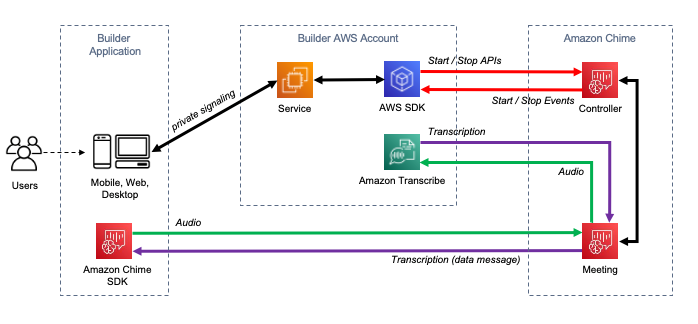

# Transcribing your Amazon Chime calls in real time

Amazon Transcribe is integrated with the Amazon Chime SDK, facilitating
real-time transcriptions of your Amazon Chime calls.

When you request a transcription using the Amazon Chime
SDK API, Amazon Chime begins streaming audio to Amazon Transcribe and continues
to do so for the duration of the call.

The Amazon Chime SDK uses its 'active talker' algorithm to select the top two active
talkers, and then sends their audio to Amazon Transcribe as two separate channels via a single
stream. Meeting participants receive user-attributed transcriptions via Amazon Chime SDK
data messages. You can view delivery examples in the _[Amazon Chime SDK Developer
Guide](../../../chime-sdk/latest/dg/delivery-examples.md "../../../chime-sdk/latest/dg/delivery-examples.md")_.

The data flow of an Amazon Chime transcription is depicted in the following diagram:

For additional information and detailed instructions on how to set up real-time Amazon Chime
transcriptions, refer to [Using Amazon Chime SDK live
transcription](../../../chime-sdk/latest/dg/meeting-transcription.md "../../../chime-sdk/latest/dg/meeting-transcription.md") in the _Amazon Chime SDK Developer Guide_.
For API operations, refer to the [_Amazon Chime
SDK API Reference_](../../../chime-sdk/latest/APIReference/API_meeting-chime_StartMeetingTranscription.md "../../../chime-sdk/latest/APIReference/API_meeting-chime_StartMeetingTranscription.md").

###### Dive deeper with the AWS Machine Learning Blog

To learn more about improving accuracy with real-time transcriptions, see:

- [Amazon Chime
  SDK meetings now support live transcription with Amazon Transcribe and
  Amazon Transcribe Medical](https://aws.amazon.com/about-aws/whats-new/2021/08/amazon-chime-sdk-amazon-transcribe-amazon-transcribe-medical/ "https://aws.amazon.com/about-aws/whats-new/2021/08/amazon-chime-sdk-amazon-transcribe-amazon-transcribe-medical/")
- [Amazon Chime
  SDK for Telemedicine Solution](https://aws.amazon.com/blogs/industries/chime-sdk-for-telemedicine-solution/ "https://aws.amazon.com/blogs/industries/chime-sdk-for-telemedicine-solution/")
