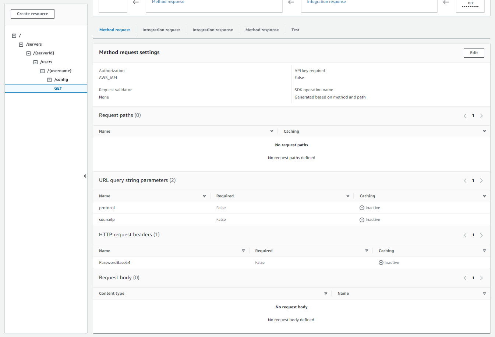
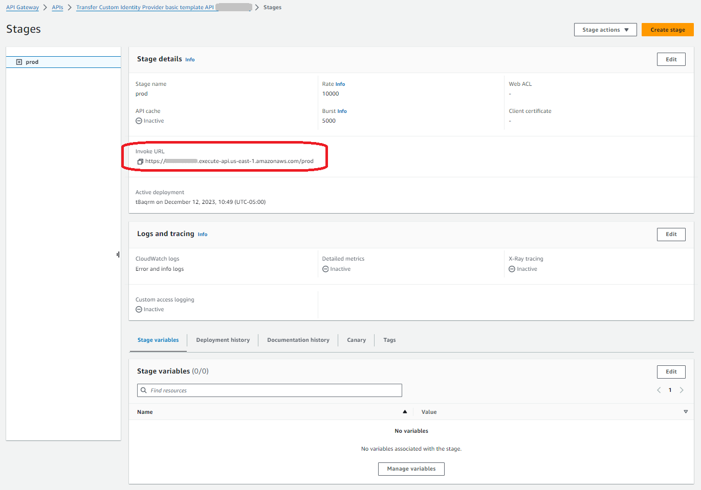
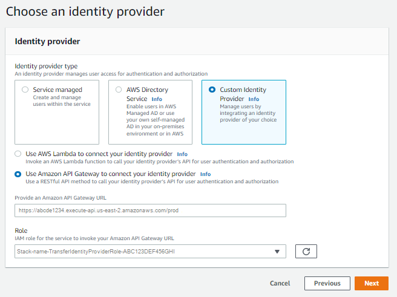
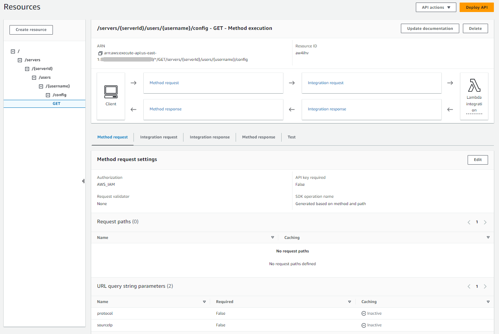

# Using Amazon API Gateway to integrate your identity

provider

This topic describes how to use an AWS Lambda function to back an API Gateway method. Use
this option if you need a RESTful API to integrate your identity provider or if you want
to use AWS WAF to leverage its capabilities for geo-blocking or rate-limiting
requests.

For most use cases, the recommended way to configure a custom identity provider is to
use the [Custom identity provider solution](custom-idp-toolkit.md "custom-idp-toolkit.md").

Limitations if using an API Gateway to integrate your identity
provider

- This configuration does not support custom domains.
- This configuration does not support a private API Gateway URL.
  If you need either of these, you can use Lambda as an identity provider, without API Gateway.
  For details, see [Using AWS Lambda to integrate your identity
  provider](custom-lambda-idp.md "custom-lambda-idp.md").

## Authenticating using an API Gateway

method

You can create an API Gateway method for use as an identity provider for Transfer Family. This
approach provides a highly secure way for you to create and provide APIs. With
API Gateway, you can create an HTTPS endpoint so that all incoming API operations are
transmitted with greater security. For more details about the API Gateway service, see the
[API Gateway Developer Guide](../../../apigateway/latest/developerguide/welcome.md "../../../apigateway/latest/developerguide/welcome.md").

API Gateway offers an authorization method named `AWS_IAM`, which gives you
the same authentication based on AWS Identity and Access Management (IAM) that AWS uses internally. If
you enable authentication with `AWS_IAM`, only callers with explicit
permissions to call an API can reach that API's API Gateway method.

To use your API Gateway method as a custom identity provider for Transfer Family, enable IAM for
your API Gateway method. As part of this process, you provide an IAM role with
permissions for Transfer Family to use your gateway.

###### Note

To improve security, you can configure a web application firewall.
AWS WAF is a web application firewall that lets you monitor the HTTP and
HTTPS requests that are forwarded to an Amazon API Gateway. For details, see [Add a web application firewall](web-application-firewall.md "web-application-firewall.md").

###### Do not enable API Gateway caching

Do not enable caching for your API Gateway method when using it as a custom identity provider for Transfer Family.
Caching is inappropriate and invalid for authentication requests because:

- Each authentication request is unique and requires a live response, not a cached response
- Caching provides no benefits since Transfer Family never sends duplicate or repeated requests to the API Gateway
- Enabling caching will cause the API Gateway to respond with mismatched data, resulting in invalid responses to authentication requests

###### To use your API Gateway method for custom authentication with Transfer Family

1. Create an CloudFormation stack. To do this:

###### Note

The stack templates have been updated to use BASE64-encoded passwords:
for details, see [Improvements to the CloudFormation templates](#base64-templates "#base64-templates").

    1. Open the CloudFormation console at
     [https://console.aws.amazon.com/cloudformation](https://console.aws.amazon.com/cloudformation/ "https://console.aws.amazon.com/cloudformation/").
    2. Follow the instructions for deploying an CloudFormation stack from an
     existing template in [Selecting a stack template](../../../AWSCloudFormation/latest/UserGuide/cfn-using-console-create-stack-template.md "../../../AWSCloudFormation/latest/UserGuide/cfn-using-console-create-stack-template.md") in the
     *AWS CloudFormation User Guide*.
    3. Use one of the following basic templates to create an
     AWS Lambda-backed API Gateway method for use as a custom identity provider
     in Transfer Family.


    	* [Basic stack template](https://s3.amazonaws.com/aws-transfer-resources/custom-idp-templates/aws-transfer-custom-idp-basic-apig.template.yml "https://s3.amazonaws.com/aws-transfer-resources/custom-idp-templates/aws-transfer-custom-idp-basic-apig.template.yml")


    	By default, your API Gateway method is used as a custom identity
    	 provider to authenticate a single user in a single server
    	 using a hard-coded SSH (Secure Shell) key or password. After
    	 deployment, you can modify the Lambda function code to do
    	 something different.
    	* [AWS Secrets Manager stack template](https://s3.amazonaws.com/aws-transfer-resources/custom-idp-templates/aws-transfer-custom-idp-secrets-manager-apig.template.yml "https://s3.amazonaws.com/aws-transfer-resources/custom-idp-templates/aws-transfer-custom-idp-secrets-manager-apig.template.yml")


    	By default, your API Gateway method authenticates against an
    	 entry in Secrets Manager of the format
    	 `aws/transfer/`server-id`/`username``.
    	 Additionally, the secret must hold the key-value pairs for
    	 all user properties returned to Transfer Family. After deployment, you
    	 can modify the Lambda function code to do something
    	 different. For more information, see the blog post[Enable password authentication for AWS Transfer Family using
    	 AWS Secrets Manager](https://aws.amazon.com/blogs/storage/enable-password-authentication-for-aws-transfer-family-using-aws-secrets-manager-updated/ "https://aws.amazon.com/blogs/storage/enable-password-authentication-for-aws-transfer-family-using-aws-secrets-manager-updated/").
    	* [Okta stack template](https://s3.amazonaws.com/aws-transfer-resources/custom-idp-templates/aws-transfer-custom-idp-okta-apig.template.yml "https://s3.amazonaws.com/aws-transfer-resources/custom-idp-templates/aws-transfer-custom-idp-okta-apig.template.yml")


    	Your API Gateway method integrates with Okta as a custom
    	 identity provider in Transfer Family. For more information, see the
    	 blog post [Using Okta as an identity provider with
    	 AWS Transfer Family](https://aws.amazon.com/blogs/storage/using-okta-as-an-identity-provider-with-aws-transfer-for-sftp/ "https://aws.amazon.com/blogs/storage/using-okta-as-an-identity-provider-with-aws-transfer-for-sftp/").Deploying one of these stacks is the easiest way to integrate a custom

identity provider into the Transfer Family workflow. Each stack uses the Lambda function
to support your API method based on API Gateway. You can then use your API method
as a custom identity provider in Transfer Family. By default, the Lambda function
authenticates a single user called `myuser` with a password of
`MySuperSecretPassword`. After deployment, you can edit these
credentials or update the Lambda function code to do something
different.

###### Important

We recommend that you edit the default user and password
credentials.

After the stack has been deployed, you can view details about it on the
**Outputs** tab in the CloudFormation console. These
details include the stack's Amazon Resource Name (ARN), the ARN of the IAM
role that the stack created, and the URL for your new gateway.

###### Note

If you are using the custom identity provider option to enable
password–based authentication for your users, and you enable the
request and response logging provided by API Gateway, API Gateway logs your
users' passwords to your Amazon CloudWatch Logs. We don't recommend using
this log in your production environment. For more information, see
[Set up
CloudWatch API logging in API Gateway](../../../apigateway/latest/developerguide/set-up-logging.md "../../../apigateway/latest/developerguide/set-up-logging.md") in the
_API Gateway Developer Guide_. 2. Check the API Gateway method configuration for your server. To do this:

    1. Open the API Gateway console at
     [https://console.aws.amazon.com/apigateway/](https://console.aws.amazon.com/apigateway/ "https://console.aws.amazon.com/apigateway/").
    2. Choose the **Transfer Custom Identity Provider basic
     template API** that the CloudFormation template generated. You
     might need to select your region to see your gateways.
    3. In the **Resources** pane, choose
     **GET**. The following screenshot shows the
     correct method configuration.


    At this point, your API gateway is ready to be deployed.

3. For **Actions**, choose **Deploy API**.
   For **Deployment stage**, choose **prod**,
   and then choose **Deploy**.

After the API Gateway method is successfully deployed, view its performance in
**Stages** > **Stage details**, as
shown in the following screenshot.

###### Note

Copy the **Invoke URL** address that appears at the
top of the screen. You might need it for the next step.

 4. Open the AWS Transfer Family console at [https://console.aws.amazon.com/transfer/](https://console.aws.amazon.com/transfer/ "https://console.aws.amazon.com/transfer/"). 5. A Transfer Family should have been created for you, when you created the stack. If
not, configure your server using these steps.

    1. Choose **Create server** to open the
     **Create server** page. For **Choose an
     identity provider**, choose
     **Custom**, then select **Use Amazon API Gateway to
     connect to your identity provider**, as shown in the
     following screenshot.


    
    2. In the **Provide an Amazon API Gateway URL** text box,
     paste the **Invoke URL** address of the API Gateway
     endpoint that you created in step 3 of this procedure.
    3. For **Role**, choose the IAM role that was
     created by the CloudFormation template. This role allows Transfer Family to invoke your
     API gateway method.


    The invocation role contains the CloudFormation stack name that you
     selected for the stack that you created in step 1. It has the
     following format:
     ``CloudFormation-stack-name`-TransferIdentityProviderRole-`ABC123DEF456GHI``.
    4. Fill in the remaining boxes, and then choose **Create
     server**. For details on the remaining steps for
     creating a server, see [Configuring an SFTP, FTPS, or FTP server
     endpoint](tf-server-endpoint.md "tf-server-endpoint.md").

## Implementing your API Gateway method

To create a custom identity provider for Transfer Family, your API Gateway method must implement a
single method that has a resource path of
`/servers/`serverId`/users/`username`/config`.
The `serverId` and
`username` values come from the
RESTful resource path. Also, add `sourceIp` and `protocol` as
**URL Query String Parameters** in the **Method
Request**, as shown in the following image.



###### Note

The username must be a minimum of 3 and a maximum of 100 characters. You can use the following
characters in the username: a–z, A-Z, 0–9, underscore '\_',
hyphen '-', period '.' and at sign '@'. The username can't start with
a hyphen '-', period '.' or at sign '@'.

If Transfer Family attempts password authentication for your user, the service supplies a
`Password:` header field. In the absence of a `Password:`
header, Transfer Family attempts public key authentication to authenticate your user.

When you are using an identity provider to authenticate and authorize end users,
in addition to validating their credentials, you can allow or deny access requests
based on the IP addresses of the clients used by your end users. You can use this
feature to ensure that data stored in your S3 buckets or your Amazon EFS file system can
be accessed over the supported protocols only from IP addresses that you have
specified as trusted. To enable this feature, you must include `sourceIp`
in the Query string.

If you have multiple protocols enabled for your server and want to provide access
using the same username over multiple protocols, you can do so as long as the
credentials specific to each protocol have been set up in your identity provider. To
enable this feature, you must include the
`protocol` value in the RESTful resource
path.

Your API Gateway method should always return HTTP status code `200`. Any
other HTTP status code means that there was an error accessing the API.

###### Amazon S3 example response

The example response body is a JSON document of the following form for
Amazon S3.

```
{
 "Role": "IAM role with configured S3 permissions",
 "PublicKeys": [
     "ssh-rsa `public-key1`",
     "ssh-rsa `public-key2`"
  ],
 "Policy": "STS Assume role session policy",
 "HomeDirectory": "/amzn-s3-demo-bucket/`path`/`to`/`home`/`directory`"
}
```

###### Note

The policy is escaped JSON as a string. For example:

```
`"Policy":
"{
 \"Version\": \"2012-10-17\",
 \"Statement\":
 [
 {\"Condition\":
 {\"StringLike\":
 {\"s3:prefix\":
 [\"user/*\", \"user/\"]}},
 \"Resource\": \"arn:aws:s3:::amzn-s3-demo-bucket\",
 \"Action\": \"s3:ListBucket\",
 \"Effect\": \"Allow\",
 \"Sid\": \"ListHomeDir\"},
 {\"Resource\": \"arn:aws:s3:::*\",
 \"Action\": [\"s3:PutObject\",
 \"s3:GetObject\",
 \"s3:DeleteObjectVersion\",
 \"s3:DeleteObject\",
 \"s3:GetObjectVersion\",
 \"s3:GetObjectACL\",
 \"s3:PutObjectACL\"],
 \"Effect\": \"Allow\",
 \"Sid\": \"HomeDirObjectAccess\"}]
}"`

```

The following example response shows that a user has a logical home directory
type.

```
{
   "Role": "arn:aws:iam::`123456789012`:role/`transfer-access-role-s3`",
   "HomeDirectoryType":"LOGICAL",
   "HomeDirectoryDetails":"[{\"Entry\":\"/\",\"Target\":\"/amzn-s3-demo-bucket1\"}]",
   "PublicKeys":[""]
}
```

###### Amazon EFS example response

The example response body is a JSON document of the following form for
Amazon EFS.

```
{
 "Role": "`IAM role with configured EFS permissions`",
 "PublicKeys": [
     "ssh-rsa `public-key1`",
     "ssh-rsa `public-key2`"
  ],
 "PosixProfile": {
   "Uid": "`POSIX user ID`",
   "Gid": "`POSIX group ID`",
   "SecondaryGids": [`Optional list of secondary Group IDs`],
 },
 "HomeDirectory": "/fs-`id`/`path`/`to`/`home`/`directory`"
}
```

The `Role` field shows that successful authentication occurred. When
doing password authentication (when you supply a `Password:` header), you
don't need to provide SSH public keys. If a user can't be authenticated,
for example, if the password is incorrect, your method should return a response
without `Role` set. An example of such a response is an empty JSON
object.

The following example response shows a user that has a logical home directory
type.

```
{
    "Role": "arn:aws:iam::`123456789012`:role/`transfer-access-role-efs`",
    "HomeDirectoryType": "LOGICAL",
    "HomeDirectoryDetails":"[{\"Entry\":\"/\",\"Target\":\"/`faa1a123`\"}]",
    "PublicKeys":[""],
    "PosixProfile":{"Uid":`65534`,"Gid":`65534`}
}
```

You can include user policies in the Lambda function in JSON format. For more
information about configuring user policies in Transfer Family, see [Managing access controls](users-policies.md "users-policies.md").

## Default Lambda

function

To implement different authentication strategies, edit the Lambda function that
your gateway uses. To help you meet your application's needs, you can use the
following example Lambda functions in Node.js. For more information about Lambda, see
the [AWS Lambda Developer Guide](../../../lambda/latest/dg/welcome.md "../../../lambda/latest/dg/welcome.md") or [Building Lambda functions with
Node.js](../../../lambda/latest/dg/lambda-nodejs.md "../../../lambda/latest/dg/lambda-nodejs.md").

The following example Lambda function takes your username, password (if you're
performing password authentication), server ID, protocol, and client IP address. You
can use a combination of these inputs to look up your identity provider and
determine if the login should be accepted.

###### Note

If you have multiple protocols enabled for your server and want to provide
access using the same username over multiple protocols, you can do so as long as
the credentials specific to the protocol have been set up in your identity
provider.

For File Transfer Protocol (FTP), we recommend maintaining separate
credentials from Secure Shell (SSH) File Transfer Protocol (SFTP) and File
Transfer Protocol over SSL (FTPS). We recommend maintaining separate credentials
for FTP because, unlike SFTP and FTPS, FTP transmits credentials in clear text.
By isolating FTP credentials from SFTP or FTPS, if FTP credentials are shared or
exposed, your workloads using SFTP or FTPS remain secure.

This example function returns the role and logical home directory details, along
with the public keys (if it performs public key authentication).

When you create service-managed users, you set their home directory, either
logical or physical. Similarly, we need the Lambda function results to convey the
desired user physical or logical directory structure. The parameters you set depend
on the value for the [HomeDirectoryType](../APIReference/API_CreateUser.md#TransferFamily-CreateUser-request-HomeDirectoryType "../APIReference/API_CreateUser.md#TransferFamily-CreateUser-request-HomeDirectoryType") field.

- `HomeDirectoryType` set to `PATH` – the
  `HomeDirectory` field must then be an absolute Amazon S3 bucket
  prefix or Amazon EFS absolute path that is visible to your users.
- `HomeDirectoryType` set to `LOGICAL` – Do
  _not_ set a `HomeDirectory` field.
  Instead, we set a `HomeDirectoryDetails` field that provides the
  desired Entry/Target mappings, similar to the described values in the [HomeDirectoryDetails](../APIReference/API_CreateUser.md#TransferFamily-CreateUser-request-HomeDirectoryMappings "../APIReference/API_CreateUser.md#TransferFamily-CreateUser-request-HomeDirectoryMappings") parameter for
  service-managed users.

The example functions are listed in [Example Lambda functions](custom-lambda-idp.md#lambda-auth-examples "custom-lambda-idp.md#lambda-auth-examples").

## Lambda function for use

with AWS Secrets Manager

To use AWS Secrets Manager as your identity provider, you can work with the Lambda function
in the sample CloudFormation template. The Lambda function queries the Secrets Manager service with your
credentials and, if successful, returns a designated secret. For more information
about Secrets Manager, see the [AWS Secrets Manager User Guide](../../../secretsmanager/latest/userguide/intro.md "../../../secretsmanager/latest/userguide/intro.md").

To download a sample CloudFormation template that uses this Lambda function, go to the
[Amazon S3 bucket provided by AWS Transfer Family](https://s3.amazonaws.com/aws-transfer-resources/custom-idp-templates/aws-transfer-custom-idp-secrets-manager-apig.template.yml "https://s3.amazonaws.com/aws-transfer-resources/custom-idp-templates/aws-transfer-custom-idp-secrets-manager-apig.template.yml").

## Improvements to the CloudFormation templates

Improvements to the API Gateway interface have been made to the published CloudFormation
templates. The templates now use BASE64-encoded passwords with the API Gateway. Your
existing deployments continue to work without this enhancement, but don't allow for
passwords with characters outside the basic US-ASCII character set.

The changes in the template that enable this capability are as follows:

- The `GetUserConfigRequest AWS::ApiGateway::Method` resource has
  to have this `RequestTemplates` code (the line in italics is the
  updated line)

```
RequestTemplates:
   application/json: |
   {
      "username": "$util.urlDecode($input.params('username'))",
      *"password": "$util.escapeJavaScript($util.base64Decode($input.params('PasswordBase64'))).replaceAll("\\'","'")",*
      "protocol": "$input.params('protocol')",
      "serverId": "$input.params('serverId')",
      "sourceIp": "$input.params('sourceIp')"
}
```

- The `RequestParameters` for the `GetUserConfig`
  resource must change to use the `PasswordBase64` header (the line
  in italics is the updated line):

```
RequestParameters:
   *method.request.header.PasswordBase64: false*
   method.request.querystring.protocol: false
   method.request.querystring.sourceIp: false
```

###### To check if the template for your stack is the latest

1. Open the CloudFormation console at
   [https://console.aws.amazon.com/cloudformation](https://console.aws.amazon.com/cloudformation/ "https://console.aws.amazon.com/cloudformation/").
2. From the list of stacks, choose your stack.
3. From the details panel, choose the **Template**
   tab.
4. Look for the following:
   - Search for `RequestTemplates`, and make sure you have
     this line:

   ```
   "password": "$util.escapeJavaScript($util.base64Decode($input.params('PasswordBase64'))).replaceAll("\\'","'")",
   ```

   - Search for `RequestParameters`, and make sure you have
     this line:

   ```
   method.request.header.PasswordBase64: false
   ```

If you don't see the updated lines, edit your stack. For details on how to update
your CloudFormation stack, see [Modifying a stack template](../../../AWSCloudFormation/latest/UserGuide/using-cfn-updating-stacks-get-template.md "../../../AWSCloudFormation/latest/UserGuide/using-cfn-updating-stacks-get-template.md") in the _AWS CloudFormation; User
Guide_.
