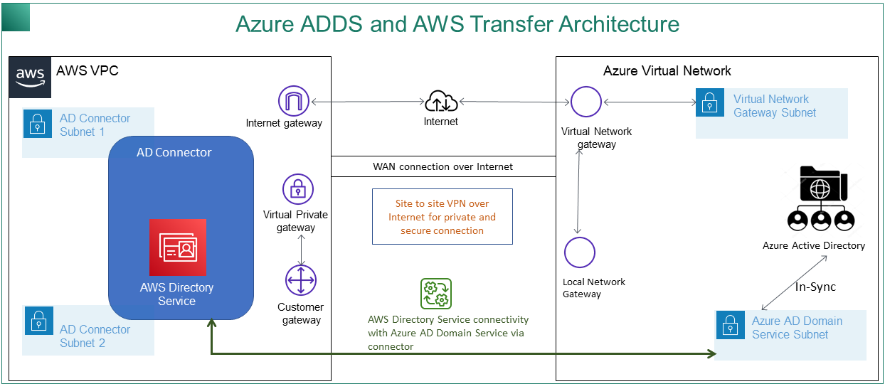
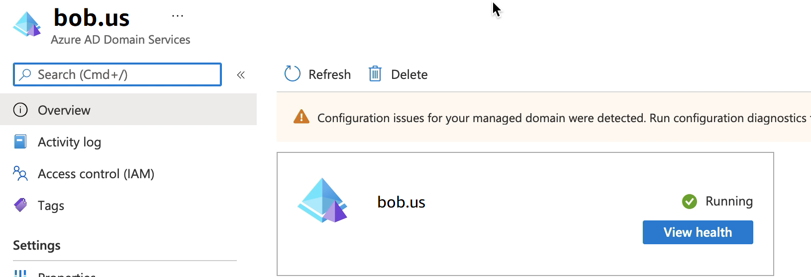
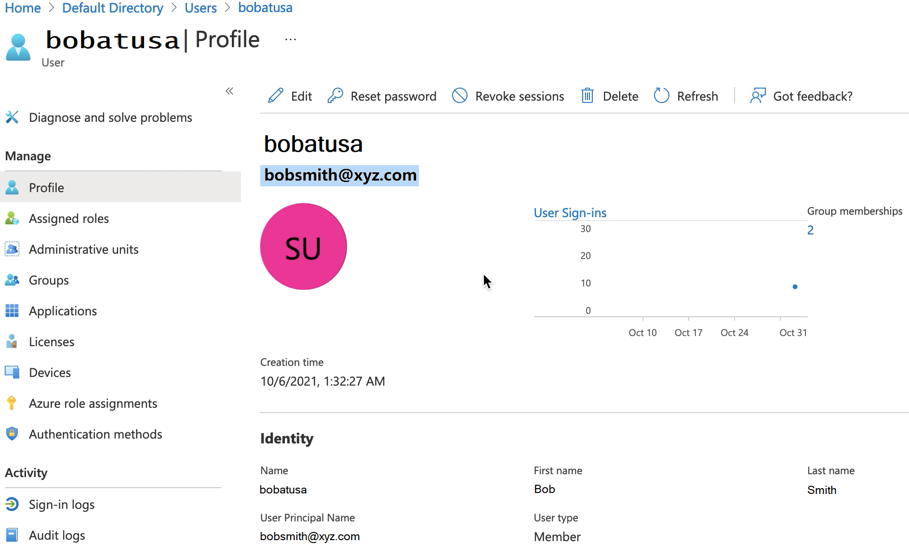
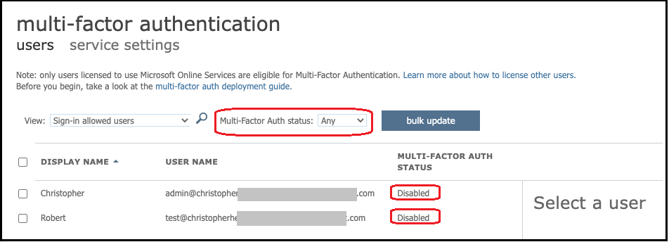
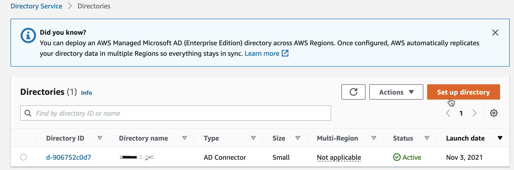
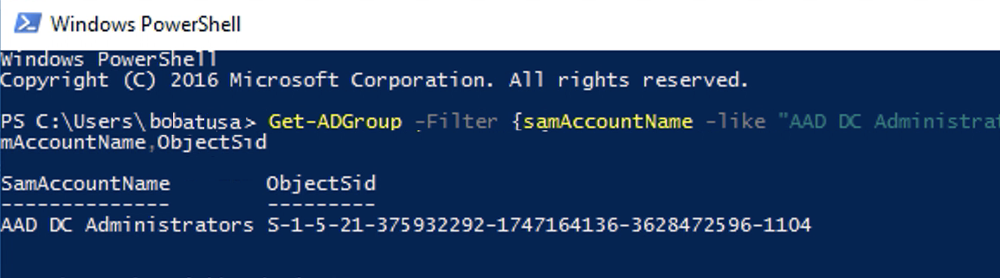
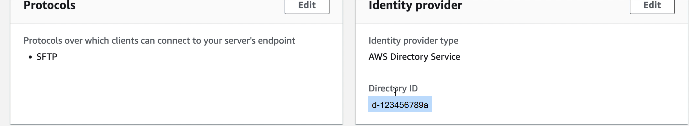
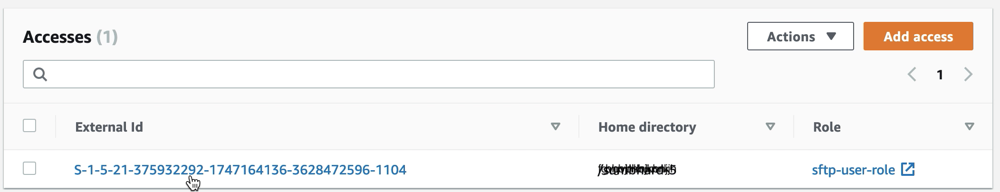

# Using AWS Directory Service for Entra ID Domain

Services

For customers that need SFTP Transfer only, and do not want to manage a domain,
there is Simple Active Directory. Alternatively, customers who want the benefits of
Active Directory and high availability in a fully managed service can use AWS
Managed Microsoft AD. Finally, for customers who want to take advantage of their
existing Active Directory forest for their SFTP Transfer, there is Active Directory
Connector.

Note the following:

- To take advantage of your existing Active Directory forest for your SFTP Transfer
  needs, you can use [Active
  Directory Connector](../../../directoryservice/latest/admin-guide/directory_ad_connector.md "../../../directoryservice/latest/admin-guide/directory_ad_connector.md").
- If you want the benefits of Active Directory and high availability in a fully
  managed service, you can use AWS Directory Service for Microsoft Active Directory. For details, see [Using AWS Directory Service for Microsoft
  Active Directory](directory-services-users.md "directory-services-users.md").
  This topic describes how to use an Active Directory Connector and [Entra ID (formerly
  Azure AD) Domain Services](https://azure.microsoft.com/en-us/services/active-directory-ds/ "https://azure.microsoft.com/en-us/services/active-directory-ds/") to authenticate SFTP Transfer users with Entra ID.

###### Topics

- [Before you start using AWS Directory Service for Entra
  ID Domain Services](#azure-prereq "#azure-prereq")
- [Step 1: Adding Entra ID Domain Services](#azure-add-adds "#azure-add-adds")
- [Step 2: Creating a service account](#azure-create-service-acct "#azure-create-service-acct")
- [Step 3: Setting up AWS Directory using AD
  Connector](#azure-setup-directory "#azure-setup-directory")
- [Step 4: Setting up AWS Transfer Family server](#azure-setup-transfer-server "#azure-setup-transfer-server")
- [Step 5: Granting access to groups](#azure-grant-access "#azure-grant-access")
- [Step 6: Testing users](#azure-test "#azure-test")

## Before you start using AWS Directory Service for Entra

ID Domain Services

###### Note

AWS Transfer Family has a default limit of 100 Active Directory groups per server. If your
use case requires more than 100 groups, consider using a custom identity provider
solution as described in [Simplify Active Directory authentication with a custom identity provider for
AWS Transfer Family](https://aws.amazon.com/blogs/storage/simplify-active-directory-authentication-with-a-custom-identity-provider-for-aws-transfer-family/ "https://aws.amazon.com/blogs/storage/simplify-active-directory-authentication-with-a-custom-identity-provider-for-aws-transfer-family/").

For AWS, you need the following:

- A virtual private cloud (VPC) in an AWS region where you are using your Transfer Family
  servers
- At least two private subnets in your VPC
- The VPC must have internet connectivity
- A customer gateway and Virtual private gateway for site-to-site VPN connection
  with Microsoft Entra

For Microsoft Entra, you need the following:

- An Entra ID and Active directory domain service
- An Entra resource group
- An Entra virtual network
- VPN connectivity between your Amazon VPC and your Entra resource group

###### Note

This can be through native IPSEC tunnels or using VPN appliances. In this
topic, we use IPSEC tunnels between an Entra Virtual network gateway and
local network gateway. The tunnels must be configured to allow traffic
between your Entra Domain Service endpoints and the subnets that house your
AWS VPC.

- A customer gateway and Virtual private gateway for site-to-site VPN connection
  with Microsoft Entra

The following diagram shows the configuration needed before you begin.



## Step 1: Adding Entra ID Domain Services

Entra ID does not support Domain joining instances by default. To perform actions
like Domain Join, and to use tools such as Group Policy, administrators must enable
Entra ID Domain Services. If you have not already added Entra DS, or your existing
implementation is not associated with the domain that you want your SFTP Transfer server
to use, you must add a new instance.

For information about enabling Entra ID Domain Services, see [Tutorial: Create and configure a Microsoft Entra Domain Services managed
domain](https://docs.microsoft.com/en-us/azure/active-directory-domain-services/active-directory-ds-getting-started "https://docs.microsoft.com/en-us/azure/active-directory-domain-services/active-directory-ds-getting-started").

###### Note

When you enable Entra DS, make sure it is configured for the resource group and
the Entra domain to which you are connecting your SFTP Transfer server.



## Step 2: Creating a service account

Entra must have one service account that is part of an Admin group in Entra DS. This
account is used with the AWS Active Directory connector. Make sure this account is in
sync with Entra DS.



###### Tip

Multi-factor authentication for Entra ID is not supported for Transfer Family servers that
use the SFTP protocol. The Transfer Family server cannot provide the MFA token after a user
authenticates to SFTP. Make sure to disable MFA before you attempt to
connect.



## Step 3: Setting up AWS Directory using AD

Connector

After you have configured Entra DS, and created a service account with IPSEC VPN
tunnels between your AWS VPC and Entra Virtual network, you can test the connectivity
by pinging the Entra DS DNS IP address from any AWS EC2 instance.

After you verify the connection is active, you can continue below.

###### To set up your AWS Directory using AD Connector

1. Open the [Directory Service](https://console.aws.amazon.com/directoryservicev2/ "https://console.aws.amazon.com/directoryservicev2/") console and
   select **Directories**.
2. Select **Set up directory**.
3. For directory type, choose **AD Connector**.
4. Select a directory size, select **Next**, then select your
   VPC and Subnets.
5. Select **Next**, then fill in the fields as follows:
   - **Directory DNS name**: enter the domain name you are
     using for your Entra DS.
   - **DNS IP addresses**: enter your Entra DS IP
     addresses.
   - **Server account username** and
     **password**: enter the details for the service
     account you created in _Step 2: Create a service
     account_.

6. Complete the screens to create the directory service.

Now the directory status should be **Active**, and it is ready to be
used with an SFTP Transfer server.



## Step 4: Setting up AWS Transfer Family server

Create a Transfer Family server with the SFTP protocol, and the identity provider type of
**AWS Directory Service**. From **Directory**
drop down list, select the directory you added in _Step 3: Setup AWS
Directory using AD Connector_.

###### Note

You can't delete a Microsoft AD directory in AWS Directory Service if you used
it in a Transfer Family server. You must delete the server first, and then you can delete the
directory.

## Step 5: Granting access to groups

After you create the server, you must choose which groups in the directory should
have access to upload and download files over the enabled protocols using AWS Transfer Family. You
do this by creating an _access_.

###### Note

Users must belong _directly_ to the group to
which you are granting access. For example, assume that Bob is a user and belongs
to groupA, and groupA itself is included in groupB.

- If you grant access to groupA, Bob is granted access.
- If you grant access to groupB (and not to groupA), Bob does not have
  access.

In order to grant access you need to retrieve the SID for the group.

Use the following Windows PowerShell command to retrieve the SID for a group,
replacing `YourGroupName` with the name of the group.

```
Get-ADGroup -Filter {samAccountName -like "`YourGroupName`*"} -Properties * | Select SamAccountName,ObjectSid
```



###### Grant access to groups

1. Open [https://console.aws.amazon.com/transfer/](https://console.aws.amazon.com/transfer/ "https://console.aws.amazon.com/transfer/").
2. Navigate to your server details page and in the **Accesses**
   section, choose **Add access**.
3. Enter the SID you received from the output of the previous procedure.
4. For **Access**, choose an AWS Identity and Access Management role for the
   group.
5. In the **Policy** section, choose a policy. The default value
   is **None**.
6. For **Home directory**, choose an Amazon S3 bucket that
   corresponds to the group's home directory.
7. Choose **Add** to create the association.

The details from your Transfer server should look similar to the following:





## Step 6: Testing users

You can test ([Testing users](directory-services-users.md#directory-services-test-user "directory-services-users.md#directory-services-test-user")) whether a user has access to the
AWS Managed Microsoft AD directory for your server. A user must be in exactly one group (an external
ID) that is listed in the **Access** section of the **Endpoint
configuration** page. If the user is in no groups, or is in more than a
single group, that user is not granted access.
