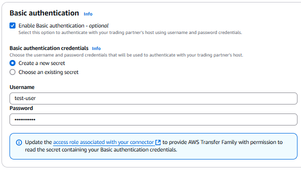
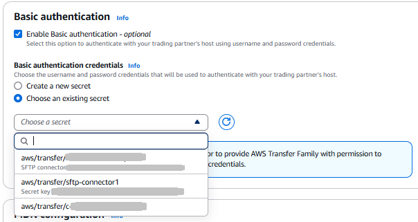
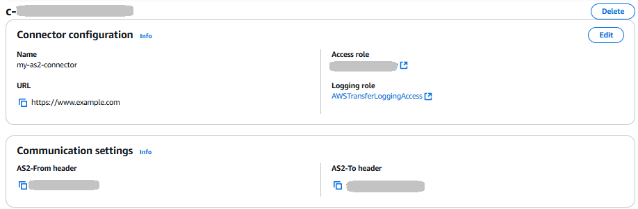
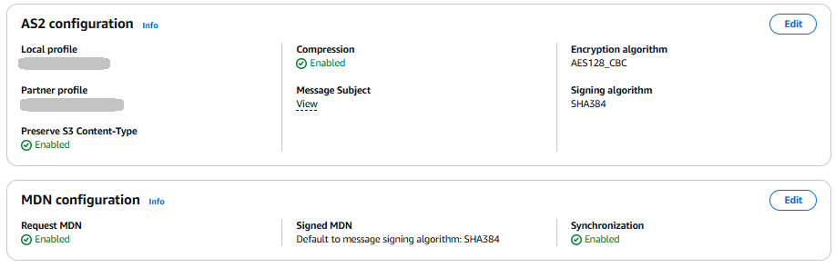
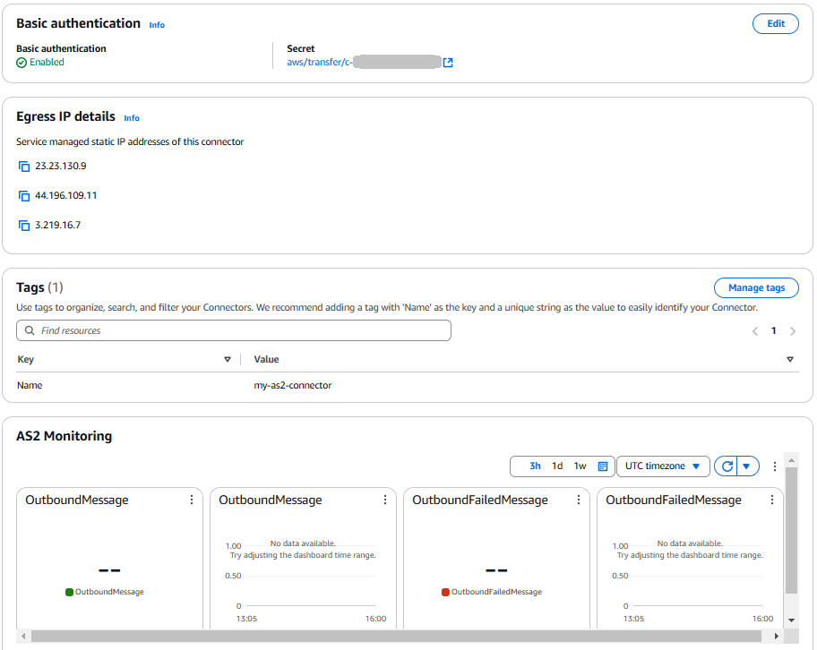

# Configure AS2 connectors

The purpose of a connector is to establish a relationship between trading partners for
_outbound_ transfers—sending AS2 files from a Transfer Family server
to an external, partner-owned destination. For the connector, you specify the local
party, the remote partner, and their certificates (by creating local and partner
profiles).

After you have a connector in place, you can transfer information to your trading
partners. Each AS2 server is assigned three static IP addresses. AS2 connectors use
these IP addresses for sending asynchronous MDNs to your trading partners over
AS2.

###### Note

The message size received by a trading partner will not match the object size in
Amazon S3. This discrepancy occurs because the AS2 message wraps the file in an envelope
prior to sending. So, the file size might increase, even if the file is sent with
compression. Therefore, make sure that the trading partner's maximum file size is
greater than the size of the file that you are sending.

1. [Import AS2 certificates](managing-as2-partners.md#configure-as2-certificate "managing-as2-partners.md#configure-as2-certificate")
2. [Create AS2 profiles](configure-as2-profile.md "configure-as2-profile.md")
3. [Create an AS2 server](create-as2-transfer-server.md "create-as2-transfer-server.md")
4. [Create an AS2 agreement](create-as2-transfer-server.md#as2-agreements "create-as2-transfer-server.md#as2-agreements")
5. Create an AS2 connector

## Create an AS2 connector

This procedure explains how to create AS2 connectors by using the AWS Transfer Family
console. If you want to use the AWS CLI instead, see [Step 6: Create a connector between
you and your partner](as2-example-tutorial.md#as2-create-connector-example "as2-example-tutorial.md#as2-create-connector-example").

###### To create an AS2 connector

1. Open the AWS Transfer Family console at [https://console.aws.amazon.com/transfer/](https://console.aws.amazon.com/transfer/ "https://console.aws.amazon.com/transfer/").
2. In the left navigation pane, choose **Connectors to send
   messages**, from the **AS2 Trading Partners**
   menu, and then choose **Create AS2 connector**.
3. In the **Connector configuration** section, specify the
   following information:
   - **URL** – Enter the URL for outbound
     connections.
   - **Access role** – Choose the Amazon
     Resource Name (ARN) of the AWS Identity and Access Management (IAM) role to use. Make sure
     that this role provides read and write access to the parent
     directory of the file location that's used in the
     `StartFileTransfer` request. Additionally, make sure
     that the role provides read and write access to the parent directory
     of the files that you intend to send with
     `StartFileTransfer`.

   ###### Note

   If you're using Basic authentication for your connector,
   the access role requires the
   `secretsmanager:GetSecretValue` permission for
   the secret. If the secret is encrypted by using a customer managed key
   instead of the AWS managed key in AWS Secrets Manager, then the role
   also needs the `kms:Decrypt` permission for that key.
   If you name your secret with the prefix
   `aws/transfer/`, you can add the necessary
   permission with a wildcard character (`*`), as shown
   in [Example permission to create secrets](../../../secretsmanager/latest/userguide/auth-and-access_examples.md#auth-and-access_examples_wildcard "../../../secretsmanager/latest/userguide/auth-and-access_examples.md#auth-and-access_examples_wildcard").
   - **Logging role** (optional) – Choose the
     IAM role for the connector to use to push events to your CloudWatch
     logs.

4. In the **AS2 configuration** section, choose the local
   and partner profiles, the encryption and signing algorithms, and whether to
   compress the transferred information. Note the following:
   - The **Preserve S3 Content-Type** parameter is
     enabled by default.

   When set, Transfer Family uses the Amazon S3 `Content-Type` that is
   associated with objects in S3 instead of having the content type
   mapped based on the file extension. Clear this setting if you want
   the service to map content type for your AS2 messages based on file
   extension, rather than using the content type from the S3
   object.
   - For the encryption algorithm, do not choose
     `DES_EDE3_CBC` unless you must support a legacy
     client that requires it, as it is a weak encryption
     algorithm.
   - The **Subject** is used as the
     `subject` HTTP header attribute in AS2 messages that
     are being sent with the connector.
   - If you choose to create a connector without an encryption
     algorithm, you must specify `HTTPS` as your
     protocol.

5. In the **Basic authentication** section, specify the
   following information.
   - To send sign-on credentials along with outbound messages, select
     **Enable Basic authentication**. If you
     don't want to send any credentials with outbound messages, keep
     **Enable Basic authentication** cleared.
   - If you're using authentication, choose or create a
     secret.
     - To create a new secret, choose **Create a new
       secret** and then enter a username and
       password. These credentials must match the user that
       connects to the partner's endpoint.

     
     - To use an existing secret, choose **Choose an
       existing secret**, and then choose a secret
       from the dropdown menu. For the details of creating a
       correctly formatted secret in Secrets Manager, see [Enable Basic authentication for AS2
       connectors](#as2-secret-create "#as2-secret-create").

     

6. In the **MDN configuration** section, specify the
   following information:
   - **Request MDN** – You have the option to
     require your trading partner to send you an MDN after they have
     successfully received your message over AS2.
   - **Signed MDN** – You have the option to
     require that MDNs be signed. This option is available only if you
     have selected **Request MDN**.

7. After you've confirmed all of your settings, choose **Create
   AS2 connector** to create the connector.

The **Connectors** page appears, with the ID of your new
connector added to the list. To view the details for your connectors, see [View AS2 connector details](#connectors-view-info "#connectors-view-info").

## AS2 connector algorithms

When you create an AS2 connector, the following security algorithms are attached to the
connector.

| Type       | Algorithm                                                                                                                                                                                                                                                                                                               |
| ---------- | ----------------------------------------------------------------------------------------------------------------------------------------------------------------------------------------------------------------------------------------------------------------------------------------------------------------------- | --------------------------------------------------------------------------------------------------------------------------------------------------------------------------------------------------------------------------------------------------------------------------------------------------------------------------------------------------------------------------------------------------------------------------------------------------------------------------------------------------------------------------------------------------------------------------------------------------------------------------------------------------------------------------------------------------------------------------------------------------------------------------------------------------------------------------------------------------------------------------------------------------------------------------------------------------------------------------------------------------------------------------------------------------------------------------------------------------------------------------------------------------------------------------------------------------------------------------------------------------------------------------------------------------------------------------------------------------------------------------------------------------------------------------------------------------------------------------------------------------------------------------------------------------------------------------------------------------------------------------------------------------------------------------------------------------------------------------------------------------------------------------------------------------------------------------------------------------------------------------------------------------------------------------------------------------------------------------------------------------------------------------------------------------------------------------------------------------------------------------------------------------------------------------------------------------------------------------------------------------------------------------------------------------------------------------------------------------------------------------------------------------------------------------------------------------------------------------------------------------------------------------------------------------------------------------------------------------------------------------------------------------------------------------------------------------------------------------------------------------------------------------------------------------------------------------------------------------------------------------------------------------------------------------------------------------------------------------------------------------------------------------------------------------------------------------------------------------------------------------------------------------------------------------------------------------------------------------------------------------------------------------------------------------------------------------------------------------------------------------------------------------------------------------------------------------------------------------------------------------------------------------------------------------------------------------------------------------------------------------------------------------------------------------------------------------------------------------------------------------------------------------------------------------------------------------------------------------------------------------------------------------------------------------------------------------------------------------------------------------------------------------------------------------------------------------------------------------------------------------------------------------------------------------------------------------------------------------------------------------------------------------------------------------------------------------------------------------------------------------------------------------------------------------------------------------------------------------------------------------------------------------------------------------------------------------------------------------------------------------------------------------------------------------------------------------------------------------------------------------------------------------------------------------------------------------------------------------------------------------------------------------------------------------------------------------------------------------------------------------------------------------------------------------------------------------------------------------------------------------------------------------------------------------------------------------------------------------------------------------------------------------------------------------------------------------------------------------------------------------------------------------------------------------------------------------------------------------------------------------------------------------------------------------------------------------------------------------------------------------------------------------------------------------------------------------------------------------------------------------------------------------------------------------------------------------------------------------------------------------------------------------------------------------------------------------------------------------------------------------------------------------------------------------------------------------------------------------------------------------------------------------------------------------------------------------------------------------------------------------------------------------------------------------------------------------------------------------------------------------------------------------------------------------------------------------------------------------------------------------------------------------------------------------------------------------------------------------------------------------------------------------------------------------------------------------------------------------------------------------------------------------------------------------------------------------------------------------------------------------------------------------------------------------------------------------------------------------------------------------------------------------------------------------------------------------------------------------------------------------------------------------------------------------------------------------------------------------------------------------------------------------------------------------------------------------------------------------------------------------------------------------------------------------------------------------------------------------------------------------------------------------------------------------------------------------------------------------------------------------------------------------------------------------------------------------------------------------------------------------------------------------------------------------------------------------------------------------------------------------------------------------------------------------------------------------------------- |
| TLS Cipher | TLS_ECDHE_ECDSA_WITH_AES_128_GCM_SHA256 TLS_ECDHE_RSA_WITH_AES_128_GCM_SHA256 TLS_ECDHE_ECDSA_WITH_AES_128_CBC_SHA256 TLS_ECDHE_RSA_WITH_AES_128_CBC_SHA256 TLS_ECDHE_ECDSA_WITH_AES_256_GCM_SHA384 TLS_ECDHE_RSA_WITH_AES_256_GCM_SHA384 TLS_ECDHE_ECDSA_WITH_AES_256_CBC_SHA384 TLS_ECDHE_RSA_WITH_AES_256_CBC_SHA384 | ## Basic authentication for AS2 connectors When you create or update a Transfer Family server that uses the AS2 protocol, you can add Basic authentication for outbound messages. You do this by adding authentication information to a connector. ###### Note Basic authentication is available only if you're using HTTPS. To use authentication for your connector, select **Enable Basic authentication** in the **Basic authentication** section. After you enable Basic authentication, you can choose to create a new secret, or use an existing one. In either case, the credentials in the secret are sent with outbound messages that use this connector. The credentials must match the user that is attempting to connect to the trading partner's remote endpoint. The following screenshot shows **Enable Basic authentication** selected, and **Create a new secret** chosen. After making these choices, you can enter a username and password for the secret.  The following screenshot shows **Enable Basic authentication** selected, and **Choose an existing secret** chosen. Your secret must be in the correct format, as described in [Enable Basic authentication for AS2 connectors](#as2-secret-create "#as2-secret-create").  ## Enable Basic authentication for AS2 connectors When you enable Basic authentication for AS2 connectors, you can either create a new secret in the Transfer Family console, or you can use a secret that you create in AWS Secrets Manager. In either case, your secret is stored in Secrets Manager. ###### Topics <br>• [Create a new secret in the console](#as2-secret-details-console "#as2-secret-details-console") <br>• [Use an existing secret](#use-existing-secret "#use-existing-secret") <br>• [Create a secret in AWS Secrets Manager](#as2-secret-details-asm "#as2-secret-details-asm") ### Create a new secret in the console When you're creating a connector in the console, you can create a new secret. To create a new secret, choose **Create a new secret** and then enter a username and password. These credentials must match the user that connects to the partner's endpoint.  ###### Note When you create a new secret in the console, the name of the secret follows this naming convention: `/aws/transfer/`connector-id``, where `connector-id`is the ID of the connector that you're creating. Consider this when you are trying to locate the secret in AWS Secrets Manager. ### Use an existing secret When you're creating a connector in the console, you can specify an existing secret. To use an existing secret, choose **Choose an existing secret**, and then choose a secret from the dropdown menu. For the details of creating a correctly formatted secret in Secrets Manager, see [Create a secret in AWS Secrets Manager](#as2-secret-details-asm "#as2-secret-details-asm").  ### Create a secret in AWS Secrets Manager The following procedure describes how to create an appropriate secret for use with your AS2 connector. ###### Note Basic authentication is available only if you're using HTTPS. ###### To store user credentials in Secrets Manager for AS2 Basic authentication 1. Sign in to the AWS Management Console and open the AWS Secrets Manager console at [https://console.aws.amazon.com/secretsmanager/](https://console.aws.amazon.com/secretsmanager/ "https://console.aws.amazon.com/secretsmanager/"). 2. In the left navigation pane, choose **Secrets**. 3. On the **Secrets** page, choose **Store a new secret**. 4. On the **Choose secret type** page, for **Secret type**, choose **Other type of secret**. 5. In the **Key/value pairs** section, choose the **Key/value** tab. <br>• **Key** – Enter`Username`. <br>• **value** – Enter the name of the user that is authorized to connect to the partner' server. 6. If you want to provide a password, choose **Add row**, and in the **Key/value pairs** section, choose the **Key/value** tab. Choose **Add row**, and in the **Key/value pairs** section, choose the **Key/value** tab. <br>• **Key** – Enter `Password`. <br>• **value** – Enter the password for the user. 7. If you want to provide a private key, choose **Add row**, and in the **Key/value pairs** section, choose the **Key/value** tab. <br>• **Key** – Enter `PrivateKey`. <br>• **value** – Enter a private key for the user. This value must be stored in OpenSSH format, and must correspond to the public key that is stored for this user in the remote server. 8. Choose **Next**. 9. On the **Configure secret** page, enter a name and description for your secret. We recommend that you use a prefix of `aws/transfer/`for the name. For example, you could name your secret`aws/transfer/connector-1`. 10. Choose **Next**, and then accept the defaults on the **Configure rotation** page. Then choose **Next**. 11. On the **Review** page, choose **Store** to create and store the secret. After you create the secret, you can choose it when you are creating a connector (see [Configure AS2 connectors](configure-as2-connector.md "configure-as2-connector.md")). In the step where you enable Basic authentication, choose the secret from the dropdown list of available secrets. ## View AS2 connector details You can find a list of details and properties for an AS2 AWS Transfer Family connector in the AWS Transfer Family console. An AS2 connector's properties include its URL, roles, profiles, MDNs, tags, and monitoring metrics. This is the procedure for viewing connector details. ###### To view connector details 1. Open the AWS Transfer Family console at [https://console.aws.amazon.com/transfer/](https://console.aws.amazon.com/transfer/ "https://console.aws.amazon.com/transfer/"). 2. In the left navigation pane, choose **Connectors**. 3. Choose the identifier in the **Connector ID** column to see the details page for the selected connector. You can change the properties for the AS2 connector on the connector's details page by choosing **Edit**.    ###### Note You can get much of this information, albeit in a different format, by running the following AWS Command Line Interface (AWS CLI command: ``` aws transfer describe-connector --connector-id `your-connector-id` ``` For more information, see [DescribeConnector](../APIReference/API_DescribeConnector.md "../APIReference/API_DescribeConnector.md") in the API reference. |
