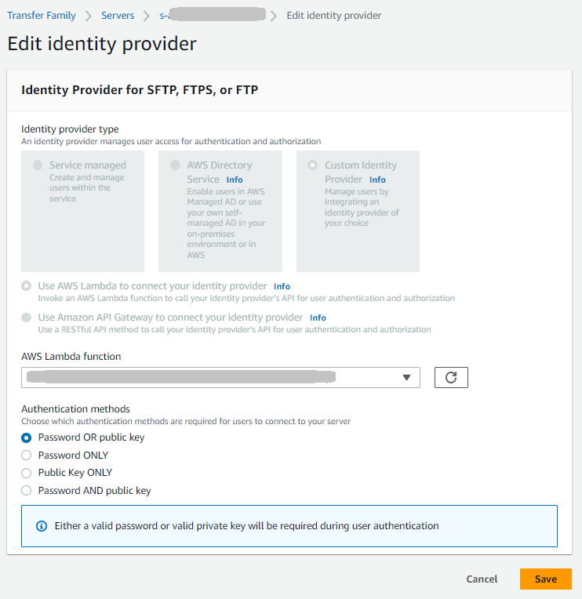
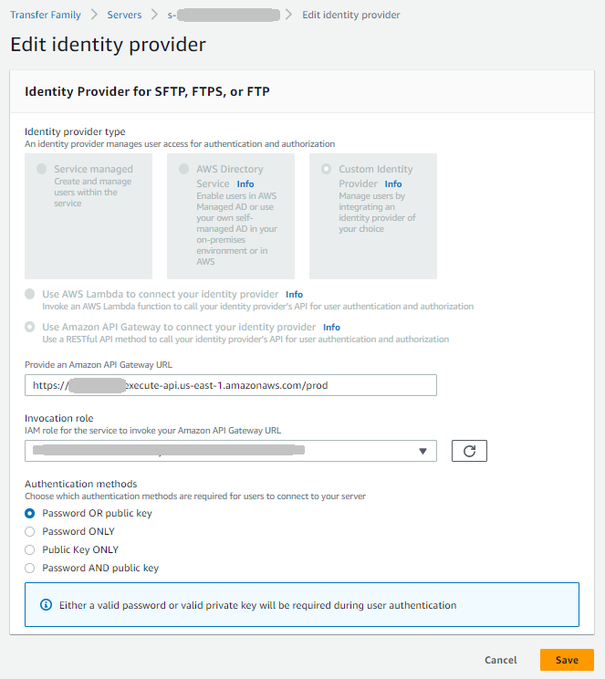

# Edit identity provider

configuration

You can change your server's identity provider type from any type to any other type. The
available identity provider types are:

- **Service managed** – Store user credentials within the
  service
- **AWS Directory Service** – Use AWS Managed Microsoft
  AD or AWS Directory Service for Entra ID Domain Services
- **Custom** – Use Lambda function or Amazon API Gateway to integrate
  with your existing identity provider
  When changing identity provider types, you need to provide specific information depending
  on the transition you're making. The following sections describe the required information
  for each type of change.

###### Important

Considerations when changing identity providers:

- **User migration** – When changing
  identity provider types, existing user configurations are not automatically
  migrated. You'll need to set up users in the new identity provider
  system.
- **Testing** – Test the new identity
  provider configuration thoroughly before making the change in production
  environments.
- **Permissions** – Ensure that the new
  identity provider has the necessary IAM permissions and roles configured
  before making the change.

## Changing to service-managed identity

provider

When changing from any other identity provider type to service-managed, you need
to:

- Select **Service managed** as the identity provider
  type
- Create new users directly in AWS Transfer Family after the change is complete, as
  existing user configurations from other identity providers won't be
  transferred

Example: If you're changing from a custom identity provider to service-managed, you'll
need to recreate all user accounts and their associated permissions within the AWS Transfer Family
service.

## Changing to AWS Directory

Service

When changing from any other identity provider type to AWS Directory Service, you
need to provide:

- **Directory** – Select an existing AWS Managed
  Microsoft AD or AWS Directory Service for Entra ID Domain Services
  directory
- **Access** – Choose whether to restrict access to a
  specific group or allow access to all users in the directory
- **Access role** – An IAM role that allows AWS Transfer Family
  to access your directory

Example: If you're changing from service-managed to AWS Directory Service, you would
select your existing `d-1234567890` directory, choose to restrict access to
the `TransferUsers` group, and specify the
`TransferDirectoryAccessRole` IAM role.

## Changing to custom identity provider

When changing from any other identity provider type to a custom identity provider, you
need to choose between Lambda function or Amazon API Gateway and provide the required
configuration:

### Using Lambda function

For Lambda function integration, provide:

- **Function** – Select an existing Lambda function
  that handles authentication
- **Authentication method** (for SFTP protocol) –
  Choose password, public key, or both

Example: If you're changing from AWS Directory Service to a custom Lambda
identity provider, you would select your `TransferCustomAuth` function
and choose **Password** as the authentication method.



### Using Amazon API Gateway

For Amazon API Gateway integration, provide:

- **API Gateway URL** – The invoke URL of your API Gateway
  endpoint
- **Invocation role** – An IAM role that allows
  AWS Transfer Family to invoke your API Gateway
- **Authentication method** (for SFTP protocol) –
  Choose password, public key, or both

Example: If you're changing from service-managed to API Gateway, you would provide the
URL `https://abcdef123.execute-api.us-east-1.amazonaws.com/prod`, specify
the `TransferApiGatewayInvocationRole` IAM role, and choose
**Public key** as the authentication method.



### Changing from Amazon API Gateway to Lambda

function

A common transition is changing from Amazon API Gateway to Lambda function for custom
identity provider integration. This change allows you to simplify your architecture
while maintaining the same authentication logic.

Key considerations for this transition:

- **Same function, different permissions**
  – You can use the same Lambda function for both API Gateway and direct Lambda
  integration, but the resource policy must be updated.
- **Resource policy requirements** –
  When changing to direct Lambda integration, the function's resource policy
  must grant `transfer.amazonaws.com` permission to invoke the
  function, in addition to `apigateway.amazonaws.com`.

###### To make this change

1. Update your Lambda function's resource policy to allow
   `transfer.amazonaws.com` to invoke the function.
2. In the AWS Transfer Family console, change the identity provider from API Gateway to Lambda
   function.
3. Select your existing Lambda function.
4. Test the configuration to ensure authentication works correctly.

Example resource policy for direct Lambda integration:

```
`{
 "Version":"2012-10-17",
 "Statement": [{
 "Effect": "Allow",
 "Principal": {
 "Service": [
 "transfer.amazonaws.com",
 "apigateway.amazonaws.com"
 ]
 },
 "Action": "lambda:InvokeFunction",
 "Resource": "arn:aws:lambda:us-east-1:123456789012:function:`function-name`"
 }]
}`

```

## User preservation during identity

provider transitions

When changing between identity provider types, existing user configurations are
preserved in specific scenarios to enable efficient rollback in case of issues:

- **Service-managed to custom identity provider and
  back** – If you change from service-managed to a custom
  identity provider and then back to service-managed, all users are preserved in
  their last known configuration.
- **AWS Directory Service to custom identity provider and
  back** – If you change from AWS Directory Service to a custom identity
  provider and then back to AWS Directory Service, all definitions for Delegated Access groups
  are retained in their last known configuration.

This preservation behavior allows you to safely test custom identity provider
configurations and roll back to your previous setup without losing user access
configurations.

## Important considerations when

changing identity providers

- **User migration** – When changing
  identity provider types, existing user configurations are not automatically
  migrated. You'll need to set up users in the new identity provider
  system.
- **Testing** – Test the new identity
  provider configuration thoroughly before making the change in production
  environments.
- **Permissions** – Ensure that the new
  identity provider has the necessary IAM permissions and roles configured
  before making the change.
