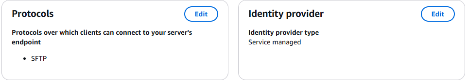
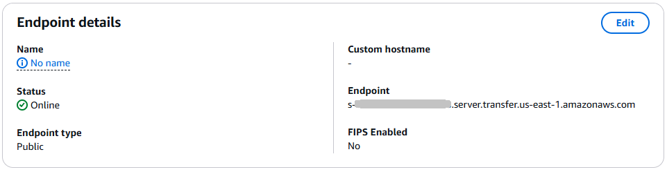
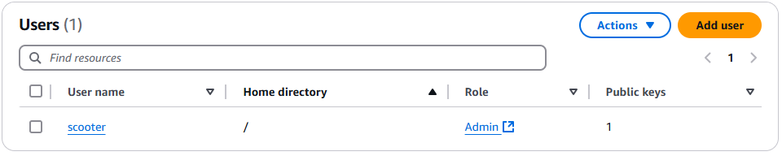
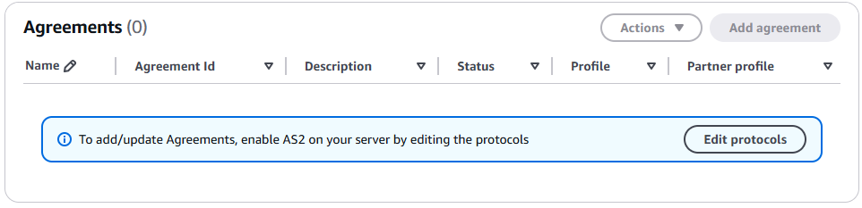
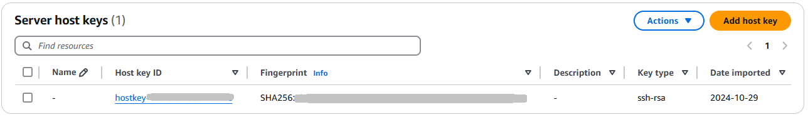
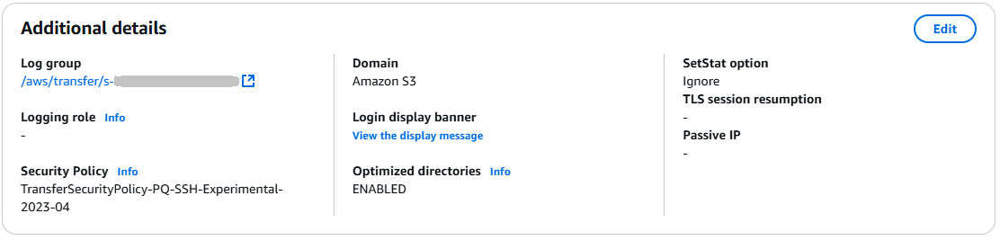
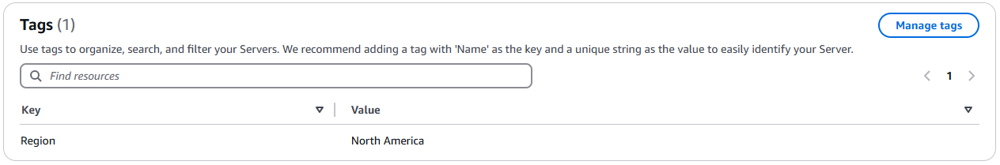

# View SFTP, FTPS, and FTP server

details

You can find a list of details and properties for an individual AWS Transfer Family server.
Server properties include protocols, identity provider, status, endpoint type, custom
hostname, endpoint, users, logging role, server host key, and tags.

###### To view server details

1. Open the AWS Transfer Family console at [https://console.aws.amazon.com/transfer/](https://console.aws.amazon.com/transfer/ "https://console.aws.amazon.com/transfer/").
2. In the navigation pane, choose **Servers**.
3. Choose the identifier in the **Server ID** column to see the
   **Server details** page, shown following.

You can change the server's properties on this page by choosing
**Edit**. For more information about editing server
details, see [Edit server details](edit-server-config.md "edit-server-config.md"). The details page for AS2 servers
differs slightly. For AS2 servers, see [View AS2 server details](view-as2-server-details.md "view-as2-server-details.md").

###### Note

The server host key **Description** and **Date imported**
values are new as of September 2022. These values were introduced to support the multiple
host keys feature. This feature required migration of any single host keys that were in use before
the introduction of multiple host keys.

The **Date imported** value
for a migrated server host key is set to the last modified date for the server.
That is, the date that you see for your migrated host key corresponds to the date that you
last modified the server in any way, before the server host key migration.

The only key that was migrated is your oldest or only server host key. Any additional keys
have their actual date from when you imported them. Additionally, the migrated key
has a description that makes it easy to identify it as having been migrated.

The migration occurred between September 2 and September 13. The actual migration date
within this range depends on the Region of your server.

