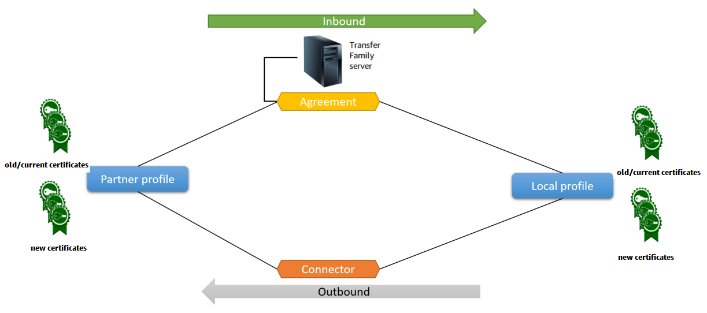

# Configuring AS2

To create an AS2-enabled server, you must also specify the following components:

- **Agreements** – Bilateral trading partner
  _agreements_, or partnerships, define the
  relationship between the two parties that are exchanging messages (files). To define
  an agreement, Transfer Family combines server, local profile, partner profile, and certificate
  information. Transfer Family AS2-inbound processes use agreements.
- **Certificates** – _Public key (X.509) certificates_ are used in AS2 communication for
  message encryption and verification. Certificates are also used for connector
  endpoints.
- **Local profiles and partner profiles** –
  A _local profile_ defines the local (AS2-enabled
  Transfer Family server) organization or "party." Similarly, a _partner
  profile_ defines the remote partner organization, external to Transfer Family.
  While not required for all AS2-enabled servers, for outbound transfers, you need a
  **connector**. A connector captures the parameters for an
  outbound connection. The connector is required for sending files to a customer's external,
  non AWS server.

The following diagram shows the relationship between the AS2 objects involved in the
inbound and outbound processes.

For an end-to-end example AS2 configuration, see [Setting up an AS2 configuration](as2-example-tutorial.md "as2-example-tutorial.md").

###### Topics

- [AS2 configurations](#as2-supported-configurations "#as2-supported-configurations")
- [AS2 quotas and limitations](#as2-limitations "#as2-limitations")
- [AS2 features and capabilities](#as2-capabilities "#as2-capabilities")

## AS2 configurations

This topic describes the supported configurations, features, and capabilities for
transfers that use the Applicability Statement 2 (AS2) protocol, including the accepted
ciphers and digests.

Signing, encryption, compression, MDN

For both inbound and outbound transfers, the following items are either required or
optional:

- **Encryption** – Required (for HTTP
  transport, which is the only transport method currently supported). Unencrypted
  messages are only accepted if forwarded by a TLS-terminating proxy such as an
  Application Load Balancer (ALB) and the `X-Forwarded-Proto: https`
  header is present.
- **Signing** – Optional
- **Compression** – Optional (the only
  currently supported compression algorithm is ZLIB)
- **Message Disposition Notice (MDN)** –
  Optional

Ciphers

The following ciphers are supported for both inbound and outbound transfers:

- AES128_CBC
- AES192_CBC
- AES256_CBC
- 3DES (for backward compatibility only)

Digests

The following digests are supported:

- **Inbound signing and MDN** – SHA1,
  SHA256, SHA384, SHA512
- **Outbound signing and MDN** – SHA1,
  SHA256, SHA384, SHA512

MDN

For MDN responses, certain types are supported, as follows:

- **Inbound transfers** – Synchronous and
  asynchronous
- **Outbound transfers** – Synchronous
  only
- **Simple Mail Transfer Protocol (SMTP) (email
  MDN)** – Not supported

Transports

- **Inbound transfers** – HTTP is the only
  currently supported transport, and you must specify it explicitly.

###### Note

If you need to use HTTPS for inbound transfers, you can terminate TLS on
an Application Load Balancer or a Network Load Balancer. This is described in [Receive AS2 messages over HTTPS](send-as2-messages.md#receive-https "send-as2-messages.md#receive-https").

- **Outbound transfers** –
  If you provide an HTTP URL, you must also specify an encryption algorithm. If you provide an HTTPS URL, you have the option of specifying **NONE** for your encryption algorithm.

## AS2 quotas and limitations

This section discusses quotas and limitations for AS2

###### Topics

- [AS2 quotas](#as2-quotas "#as2-quotas")
- [Quotas for handling secrets](#as2-quotas-secrets "#as2-quotas-secrets")
- [Known limitations](#as2-known-limitations "#as2-known-limitations")

### AS2 quotas

The following quotas are in place for AS2 file transfers. To request an increase for a
quota that's adjustable, see [AWS service quotas](../../../general/latest/gr/aws_service_limits.md "../../../general/latest/gr/aws_service_limits.md") in the
_AWS General Reference_.

| AS2 quotas                                                                                                                                                                                                                                    | Name                                                                                                | Default                                                                                                                                                                                                                                                                                                                                                                       | Adjustable                                                                                                                                                                                                                                                                                                                                                                                                                                                                                                                                                                                                                                                                                                                                                                                                                                                                                                                                                                                                                                                                                                                                                                                                                                                                                                                                                                                                                                                                                                                                                                                                                                                                                                                                                                                                                                                                                                                                                                                                                                                                   |
| --------------------------------------------------------------------------------------------------------------------------------------------------------------------------------------------------------------------------------------------- | --------------------------------------------------------------------------------------------------- | ----------------------------------------------------------------------------------------------------------------------------------------------------------------------------------------------------------------------------------------------------------------------------------------------------------------------------------------------------------------------------- | ---------------------------------------------------------------------------------------------------------------------------------------------------------------------------------------------------------------------------------------------------------------------------------------------------------------------------------------------------------------------------------------------------------------------------------------------------------------------------------------------------------------------------------------------------------------------------------------------------------------------------------------------------------------------------------------------------------------------------------------------------------------------------------------------------------------------------------------------------------------------------------------------------------------------------------------------------------------------------------------------------------------------------------------------------------------------------------------------------------------------------------------------------------------------------------------------------------------------------------------------------------------------------------------------------------------------------------------------------------------------------------------------------------------------------------------------------------------------------------------------------------------------------------------------------------------------------------------------------------------------------------------------------------------------------------------------------------------------------------------------------------------------------------------------------------------------------------------------------------------------------------------------------------------------------------------------------------------------------------------------------------------------------------------------------------------------------- | ---------------------------------------------------------------------------------------------------------------------------------------------------------------------------------------------------------------------------------------------------------------------------------------------------------------------------------------------------------------------------------------------------------------------------------------------------------------------------------------------------------------------------------------------------------------------------- | ----------------------------------- | ----------- |
| Maximum number of inbound files received per second                                                                                                                                                                                           | 100                                                                                                 | No                                                                                                                                                                                                                                                                                                                                                                            |
| Maximum number of outbound files sent per second                                                                                                                                                                                              | 100                                                                                                 | No                                                                                                                                                                                                                                                                                                                                                                            |
| Maximum number of concurrent inbound files                                                                                                                                                                                                    | 400                                                                                                 | No                                                                                                                                                                                                                                                                                                                                                                            |
| Maximum number of concurrent outbound files                                                                                                                                                                                                   | 400                                                                                                 | No                                                                                                                                                                                                                                                                                                                                                                            |
| Maximum size of inbound file (uncompressed)                                                                                                                                                                                                   | 1 GB                                                                                                | No                                                                                                                                                                                                                                                                                                                                                                            |
| Maximum size of outbound file (uncompressed)                                                                                                                                                                                                  | 1 GB                                                                                                | No                                                                                                                                                                                                                                                                                                                                                                            |
| Maximum number of files per outbound request                                                                                                                                                                                                  | 10                                                                                                  | No                                                                                                                                                                                                                                                                                                                                                                            |
| Maximum number of outbound requests per second                                                                                                                                                                                                | 100                                                                                                 | No                                                                                                                                                                                                                                                                                                                                                                            |
| Maximum number of inbound requests per second                                                                                                                                                                                                 | 100                                                                                                 | No                                                                                                                                                                                                                                                                                                                                                                            |
| Maximum outbound bandwidth per account (outbound SFTP and AS2 requests both contribute to this value)                                                                                                                                         | 50 MB per second                                                                                    | No                                                                                                                                                                                                                                                                                                                                                                            |
| Maximum number of agreements per account                                                                                                                                                                                                      | 100                                                                                                 | Yes                                                                                                                                                                                                                                                                                                                                                                           |
| Maximum number of connectors per account (SFTP and AS2 connectors both contribute to this limit)                                                                                                                                              | 100                                                                                                 | Yes                                                                                                                                                                                                                                                                                                                                                                           |
| Maximum number of certificates per partner profile                                                                                                                                                                                            | 10                                                                                                  | No                                                                                                                                                                                                                                                                                                                                                                            |
| Maximum number of certificates per account                                                                                                                                                                                                    | 1000                                                                                                | Yes                                                                                                                                                                                                                                                                                                                                                                           |
| Maximum number of partner profiles per account                                                                                                                                                                                                | 1000                                                                                                | Yes                                                                                                                                                                                                                                                                                                                                                                           | ### Quotas for handling secrets AWS Transfer Family makes calls to AWS Secrets Manager on behalf of AS2 customers that are using Basic authentication. Additionally Secrets Manager makes calls to AWS KMS. ###### Note These quotas aren't specific to your use of secrets for Transfer Family: they're shared among all the services in your AWS account. For Secrets Manager `GetSecretValue`, the quota that applies is **Combined rate of DescribeSecret and GetSecretValue API requests**, as described in [AWS Secrets Manager quotas](../../../secretsmanager/latest/userguide/reference_limits.md#quotas "../../../secretsmanager/latest/userguide/reference_limits.md#quotas"). Secrets Manager `GetSecretValue`                                                                                                                                                                                                                                                                                                                                                                                                                                                                                                                                                                                                                                                                                                                                                                                                                                                                                                                                                                                                                                                                                                                                                                                                                                                                                                                                                   | Name                                                                                                                                                                                                                                                                                                                                                                                                                                                                                                                                                                         | Value                               | Description |
| ---                                                                                                                                                                                                                                           | ---                                                                                                 | ---                                                                                                                                                                                                                                                                                                                                                                           |
| Combined rate of DescribeSecret and GetSecretValue API requests                                                                                                                                                                               | Each supported Region: 10,000 per second                                                            | The maximum transactions per second for `DescribeSecret` and `GetSecretValue` API operations combined.                                                                                                                                                                                                                                                                        | For AWS KMS, the following quotas apply for `Decrypt`. For details, see [Request quotas for each AWS KMS API operation](../../../kms/latest/developerguide/requests-per-second.md#rps-table "../../../kms/latest/developerguide/requests-per-second.md#rps-table") AWS KMS `Decrypt`                                                                                                                                                                                                                                                                                                                                                                                                                                                                                                                                                                                                                                                                                                                                                                                                                                                                                                                                                                                                                                                                                                                                                                                                                                                                                                                                                                                                                                                                                                                                                                                                                                                                                                                                                                                         | Quota name                                                                                                                                                                                                                                                                                                                                                                                                                                                                                                                                                                   | Default value (requests per second) |
| ---                                                                                                                                                                                                                                           | ---                                                                                                 |                                                                                                                                                                                                                                                                                                                                                                               | Cryptographic operations (symmetric) request rate                                                                                                                                                                                                                                                                                                                                                                                                                                                                                                                                                                                                                                                                                                                                                                                                                                                                                                                                                                                                                                                                                                                                                                                                                                                                                                                                                                                                                                                                                                                                                                                                                                                                                                                                                                                                                                                                                                                                                                                                                            | These shared quotas vary with the AWS Region and the type of AWS KMS key used in the request. Each quota is calculated separately.  • 5,500 (shared)  • 10,000 (shared) in the following Regions: + US East (Ohio), us-east-2 + Asia Pacific (Singapore), ap-southeast-1 + Asia Pacific (Sydney), ap-southeast-2 + Asia Pacific (Tokyo), ap-northeast-1 + Europe (Frankfurt), eu-central-1 + Europe (London), eu-west-2  • 50,000 (shared) in the following Regions: + US East (N. Virginia), us-east-1 + US West (Oregon), us-west-2 + Europe (Ireland), eu-west-1 |
|                                                                                                                                                                                                                                               | Custom key store request quotas NoteThis quota only applies if you are using an external key store. | Custom key store request quotas are calculated separately for each custom key store.  • 1,800 (shared) for each AWS CloudHSM key store  • 1,800 (shared) for each external key store                                                                                                                                                                                    | ### Known limitations  • Server-side TCP keep-alive is not supported. The connection times out after 350 seconds of inactivity unless the client sends keep-alive packets.  • For an active agreement to be accepted by the service and appear in Amazon CloudWatch logs, messages must contain valid AS2 headers.  • The server that's receiving messages from AWS Transfer Family for AS2 must support the Cryptographic Message Syntax (CMS) algorithm protection attribute for validating message signatures, as defined in [RFC 6211](https://datatracker.ietf.org/doc/html/rfc6211 "https://datatracker.ietf.org/doc/html/rfc6211"). This attribute is not supported in some older IBM Sterling products.  • Duplicate message IDs result in a **`processed/Warning: duplicate-document`** message.  • The key length for AS2 certificates must be at least 2048 bits, and at most 4096.  • When sending AS2 messages or asynchronous MDNs to a trading partner's HTTPS endpoint, the messages or MDNs must use a valid SSL certificate that's signed by a publicly trusted certificate authority (CA). Self-signed certificates are currently supported for outbound transfers only.  • The endpoint must support the TLS version 1.2 protocol and a cryptographic algorithm that's permitted by the security policy (as described in [Security policies for AWS Transfer Family servers](security-policies.md "security-policies.md")).  • Multiple attachments and certificate exchange messaging (CEM) from AS2 version 1.2 is not currently supported.  • Basic authentication is currently supported for outbound messages only.  • You can attach a file-processing workflow to a Transfer Family server that uses the AS2 protocol: however, AS2 messages don't execute workflows attached to the server. ## AS2 features and capabilities The following tables list the features and capabilities available for Transfer Family resources that use AS2. ### AS2 features Transfer Family offers the following features for AS2. |
| Feature                                                                                                                                                                                                                                       | Supported by AWS Transfer Family                                                                    |                                                                                                                                                                                                                                                                                                                                                                               | ---                                                                                                                                                                                                                                                                                                                                                                                                                                                                                                                                                                                                                                                                                                                                                                                                                                                                                                                                                                                                                                                                                                                                                                                                                                                                                                                                                                                                                                                                                                                                                                                                                                                                                                                                                                                                                                                                                                                                                                                                                                                                          | ---                                                                                                                                                                                                                                                                                                                                                                                                                                                                                                                                                                          |
| [Drummond certification](https://aws.amazon.com/about-aws/whats-new/2023/06/aws-transfer-family-drummond-group-as2-certification/ "https://aws.amazon.com/about-aws/whats-new/2023/06/aws-transfer-family-drummond-group-as2-certification/") | Yes                                                                                                 |                                                                                                                                                                                                                                                                                                                                                                               | [AWS CloudFormation support](as2-cfn-demo-template.md "as2-cfn-demo-template.md")                                                                                                                                                                                                                                                                                                                                                                                                                                                                                                                                                                                                                                                                                                                                                                                                                                                                                                                                                                                                                                                                                                                                                                                                                                                                                                                                                                                                                                                                                                                                                                                                                                                                                                                                                                                                                                                                                                                                                                                            | Yes                                                                                                                                                                                                                                                                                                                                                                                                                                                                                                                                                                          |
| [Amazon CloudWatch metrics](as2-monitoring.md "as2-monitoring.md")                                                                                                                                                                            | Yes                                                                                                 |                                                                                                                                                                                                                                                                                                                                                                               | [SHA-2 cryptographic algorithms](security-policies.md#cryptographic-algorithms "security-policies.md#cryptographic-algorithms")                                                                                                                                                                                                                                                                                                                                                                                                                                                                                                                                                                                                                                                                                                                                                                                                                                                                                                                                                                                                                                                                                                                                                                                                                                                                                                                                                                                                                                                                                                                                                                                                                                                                                                                                                                                                                                                                                                                                              | Yes                                                                                                                                                                                                                                                                                                                                                                                                                                                                                                                                                                          |
| Support for Amazon S3                                                                                                                                                                                                                         | Yes                                                                                                 |                                                                                                                                                                                                                                                                                                                                                                               | Support for Amazon EFS                                                                                                                                                                                                                                                                                                                                                                                                                                                                                                                                                                                                                                                                                                                                                                                                                                                                                                                                                                                                                                                                                                                                                                                                                                                                                                                                                                                                                                                                                                                                                                                                                                                                                                                                                                                                                                                                                                                                                                                                                                                       | No                                                                                                                                                                                                                                                                                                                                                                                                                                                                                                                                                                           |
| Scheduled Messages                                                                                                                                                                                                                            | Yes 1                                                                                               |                                                                                                                                                                                                                                                                                                                                                                               | AWS Transfer Family Managed Workflows                                                                                                                                                                                                                                                                                                                                                                                                                                                                                                                                                                                                                                                                                                                                                                                                                                                                                                                                                                                                                                                                                                                                                                                                                                                                                                                                                                                                                                                                                                                                                                                                                                                                                                                                                                                                                                                                                                                                                                                                                                        | No                                                                                                                                                                                                                                                                                                                                                                                                                                                                                                                                                                           |
| Certificate Exchange Messaging (CEM)                                                                                                                                                                                                          | No                                                                                                  |                                                                                                                                                                                                                                                                                                                                                                               | Mutual TLS (mTLS)                                                                                                                                                                                                                                                                                                                                                                                                                                                                                                                                                                                                                                                                                                                                                                                                                                                                                                                                                                                                                                                                                                                                                                                                                                                                                                                                                                                                                                                                                                                                                                                                                                                                                                                                                                                                                                                                                                                                                                                                                                                            | No                                                                                                                                                                                                                                                                                                                                                                                                                                                                                                                                                                           |
| Support for self-signed certificates                                                                                                                                                                                                          | Yes                                                                                                 | 1. Outbound Scheduled Messages available by [scheduling AWS Lambda functions using Amazon EventBridge](../../../eventbridge/latest/userguide/eb-run-lambda-schedule.md "../../../eventbridge/latest/userguide/eb-run-lambda-schedule.md") ### AS2 send and receive capabilities The following table provides a list of AWS Transfer Family AS2 send and receive capabilities. |
| Capability                                                                                                                                                                                                                                    | Inbound: Receiving with server                                                                      | Outbound: Sending with connector                                                                                                                                                                                                                                                                                                                                              |
| ---                                                                                                                                                                                                                                           | ---                                                                                                 | ---                                                                                                                                                                                                                                                                                                                                                                           |
| [TLS Encrypted Transport (HTTPS)](send-as2-messages.md#as2-https-process "send-as2-messages.md#as2-https-process")                                                                                                                            | Yes 1                                                                                               | Yes                                                                                                                                                                                                                                                                                                                                                                           |
| Non-TLS Transport (HTTP)                                                                                                                                                                                                                      | Yes                                                                                                 | Yes 2                                                                                                                                                                                                                                                                                                                                                                         |
| Synchronous MDN                                                                                                                                                                                                                               | Yes                                                                                                 | Yes                                                                                                                                                                                                                                                                                                                                                                           |
| Message Compression                                                                                                                                                                                                                           | Yes                                                                                                 | Yes                                                                                                                                                                                                                                                                                                                                                                           |
| Asynchronous MDN                                                                                                                                                                                                                              | Yes                                                                                                 | No                                                                                                                                                                                                                                                                                                                                                                            |
| Static IP Address                                                                                                                                                                                                                             | Yes                                                                                                 | Yes                                                                                                                                                                                                                                                                                                                                                                           |
| Bring Your Own IP Address                                                                                                                                                                                                                     | Yes                                                                                                 | No                                                                                                                                                                                                                                                                                                                                                                            |
| Multiple File Attachments                                                                                                                                                                                                                     | No                                                                                                  | No                                                                                                                                                                                                                                                                                                                                                                            |
| Basic Authentication                                                                                                                                                                                                                          | No                                                                                                  | Yes                                                                                                                                                                                                                                                                                                                                                                           |
| AS2 Restart                                                                                                                                                                                                                                   | Not applicable                                                                                      | No                                                                                                                                                                                                                                                                                                                                                                            |
| AS2 Reliability                                                                                                                                                                                                                               | No                                                                                                  | No                                                                                                                                                                                                                                                                                                                                                                            |
| Custom Subject per Message                                                                                                                                                                                                                    | Not applicable                                                                                      | No                                                                                                                                                                                                                                                                                                                                                                            | 1. Inbound TLS Encrypted Transport available with Network Load Balancer (NLB) or Application Load Balancer (ALB) 2. Outbound non-TLS Transport available only when encryption is enabled                                                                                                                                                                                                                                                                                                                                                                                                                                                                                                                                                                                                                                                                                                                                                                                                                                                                                                                                                                                                                                                                                                                                                                                                                                                                                                                                                                                                                                                                                                                                                                                                                                                                                                                                                                                                                                                                                     |
