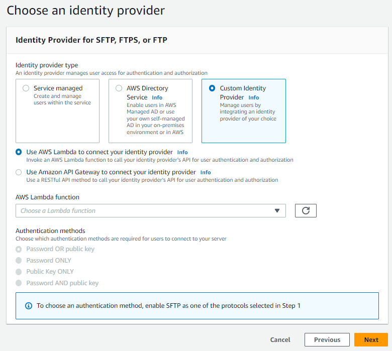
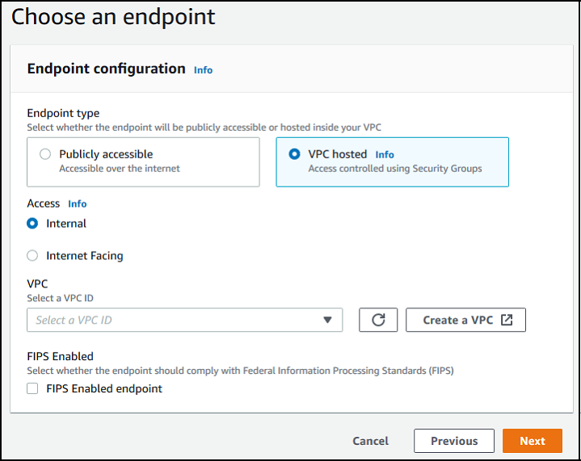
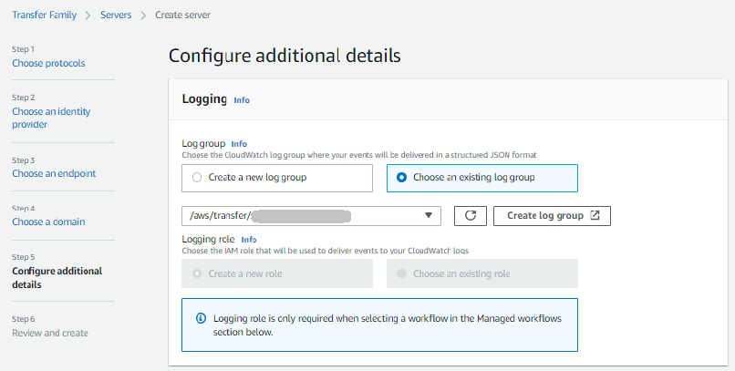
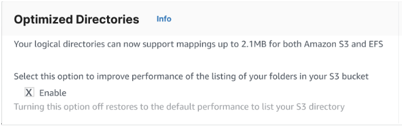
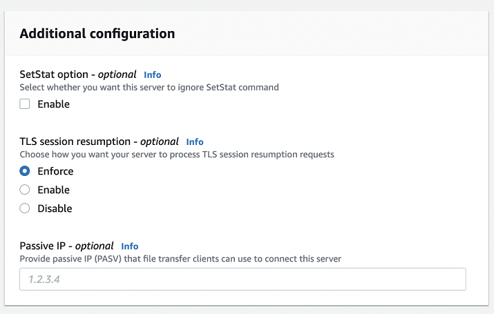

# Create an FTP-enabled server

File Transfer Protocol (FTP) is a network protocol used for the transfer of data.
FTP uses a separate channel for control and data transfers. The control channel is
open until terminated or inactivity timeout. The data channel is active for the
duration of the transfer. FTP uses clear text and does not support encryption of
traffic.

###### Note

When you enable FTP, you must choose the internal access option for the
VPC-hosted endpoint. If you need your server to have data traverse the public
network, you must use secure protocols, such as SFTP or FTPS.

###### Note

For important considerations about Network Load Balancers, see [Avoid placing NLBs and NATs in front of AWS Transfer Family
servers](infrastructure-security.md#nlb-considerations "infrastructure-security.md#nlb-considerations").

###### To create an FTP-enabled server

1.  Open the AWS Transfer Family console at [https://console.aws.amazon.com/transfer/](https://console.aws.amazon.com/transfer/ "https://console.aws.amazon.com/transfer/") and select
    **Servers** from the navigation pane, then choose
    **Create server**.
2.  In **Choose protocols**, select **FTP**,
    and then choose **Next**.
3.  In **Choose an identity provider**, choose the identity
    provider that you want to use to manage user access. You have the following
    options:
    - **AWS Directory Service for Microsoft Active Directory** – You
      provide an Directory Service directory to access the endpoint. By doing so, you can
      use credentials stored in your Active Directory to authenticate your
      users. To learn more about working with AWS Managed Microsoft AD identity providers,
      see [Using AWS Directory Service for Microsoft
      Active Directory](directory-services-users.md "directory-services-users.md").

    ###### Note

        + Cross-Account and Shared directories are not supported for AWS Managed Microsoft AD.
        + To set up a server with Directory Service as your identity provider, you need to add some Directory Service permissions.
         For details, see [Before you start using AWS Directory Service for Microsoft Active Directory](directory-services-users.md#managed-ad-prereq "directory-services-users.md#managed-ad-prereq").

    - **Custom identity provider** – Choose either of the following options:
      - **Use AWS Lambda to connect your identity provider** – You can use an existing identity provider, backed by a Lambda function. You provide
        the name of the Lambda function. For more information, see [Using AWS Lambda to integrate your identity
        provider](custom-lambda-idp.md "custom-lambda-idp.md").
      - **Use Amazon API Gateway to connect your identity provider** – You can create an API Gateway method backed by a Lambda function for use as an identity provider.
        You provide an Amazon API Gateway URL and an invocation role. For more information, see [Using Amazon API Gateway to integrate your identity
        provider](authentication-api-gateway.md "authentication-api-gateway.md").

    

4.  Choose **Next**.
5.  In **Choose an endpoint**, do the following:

###### Note

FTP servers for Transfer Family operate over Port 21 (Control Channel) and Port
Range 8192–8200 (Data Channel).

    1. For **Endpoint type**, choose **VPC
     hosted** to host your server's endpoint. For
     information about setting up your VPC hosted endpoint, see [Create a server in a virtual private cloud](create-server-in-vpc.md "create-server-in-vpc.md").

    ###### Note

    Publicly accessible endpoints are not supported.
    2. For **FIPS Enabled**, keep the **FIPS
     Enabled endpoint** check box cleared.

    ###### Note

    FIPS-enabled endpoints are not supported for FTP
     servers.
    3. Choose **Next**.

 6. On the **Choose domain** page, choose the AWS storage
service that you want to use to store and access your data over the selected
protocol.

    * Choose **Amazon S3** to store and access your files as
     objects over the selected protocol.
    * Choose **Amazon EFS** to store and access your files
     in your Amazon EFS file system over the selected protocol.

Choose **Next**. 7. In **Configure additional details**, do the
following:

    1. For logging, specify an existing log group or create a new one
     (the default option).

    

    If you choose **Create log group**, the CloudWatch console
     ([https://console.aws.amazon.com/cloudwatch/](https://console.aws.amazon.com/cloudwatch/ "https://console.aws.amazon.com/cloudwatch/")) opens to the **Create log
     group** page. For details, see [Create a log group in CloudWatch Logs](../../../AmazonCloudWatch/latest/logs/Working-with-log-groups-and-streams.md#Create-Log-Group "../../../AmazonCloudWatch/latest/logs/Working-with-log-groups-and-streams.md#Create-Log-Group").
    2. (Optional) For **Managed workflows**, choose workflow IDs (and a corresponding role) that
     Transfer Family should assume when executing the workflow. You can choose one workflow to execute upon a complete upload, and another to execute upon a partial upload. To learn more about processing your files by using managed workflows, see
     [AWS Transfer Family managed workflows](transfer-workflows.md "transfer-workflows.md").

    
    3. For **Cryptographic algorithm options**, choose a
     security policy that contains the cryptographic algorithms enabled
     for use by your server.

    ###### Note

    Transfer Family assigns the latest security policy to your FTP server.
     However, since the FTP protocol doesn't use any encryption, FTP
     servers do not use any of the security policy algorithms. Unless
     your server also uses the FTPS or SFTP protocol, the security
     policy remains unused.
    4. For **Server Host Key**, keep it blank.
    5. (Optional) For **Tags**, for
     **Key** and **Value**, enter
     one or more tags as key-value pairs, and then choose **Add
     tag**.
    6. You can optimize performance for your Amazon S3 directories. For example, suppose that you go into
     your home directory, and you have 10,000 subdirectories. In other words, your Amazon S3 bucket has 10,000 folders.
     In this scenario, if you run the `ls` (list) command, the list operation takes between six and
     eight minutes. However, if you optimize your directories, this operation takes only a few seconds.

    When you create your server using the console, optimized directories is enabled by default. If you create your server
     using the API, this behavior is not enabled by default.

    
    7. Choose **Next**.
    8. (Optional) You can configure AWS Transfer Family servers to display customized
     messages such as organizational policies or terms and conditions to your
     end users.
     You can also display customized Message of The Day (MOTD) to users who
     have successfully authenticated.

    For **Display banner**, in the
     **Pre-authentication display banner** text box,
     enter the text message that you want to display to your users before
     they authenticate, and in the **Post-authentication display
     banner** text box, enter the text that you want to display
     to your users after they successfully authenticate.
    9. (Optional) You can configure the following additional options.

    	* **SetStat option**: enable this option to ignore the error that is generated when a client attempts to use `SETSTAT` on a file you are uploading to an Amazon S3 bucket. For additional details,
    	 see the `SetStatOption` documentation in the [ProtocolDetails](../APIReference/API_ProtocolDetails.md "../APIReference/API_ProtocolDetails.md") topic.
    	* **TLS session resumption**: provides a mechanism to resume or share a negotiated secret key between the control and data connection for an FTPS session.
    	 For additional details,
    	 see the `TlsSessionResumptionMode` documentation in the [ProtocolDetails](../APIReference/API_ProtocolDetails.md "../APIReference/API_ProtocolDetails.md") topic.
    	* **Passive IP**: indicates passive mode, for FTP and FTPS protocols. Enter a single IPv4 address, such as the public IP address of a firewall, router, or load balancer.
    	 For additional details,
    	 see the `PassiveIp` documentation in the [ProtocolDetails](../APIReference/API_ProtocolDetails.md "../APIReference/API_ProtocolDetails.md") topic.

    

8.  In **Review and create**, review your choices.

        * If you want to edit any of them, choose **Edit**
         next to the step.

        ###### Note

        You must review each step after the step that you chose to
         edit.
        * If you have no changes, choose **Create server**
         to create your server. You are taken to the
         **Servers** page, shown following, where your
         new server is listed.

    It can take a couple of minutes before the status for your new server changes to
    **Online**. At that point, your server can perform file
    operations for your users.

**Next steps** – For the next step, continue
on to [Working with custom identity providers](custom-idp-intro.md "custom-idp-intro.md") to set up
users.
