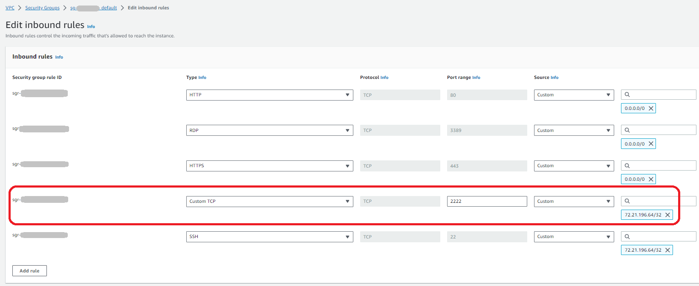

# Create a server in a virtual private cloud

You can host your server's endpoint inside a virtual private cloud (VPC) to use for
transferring data to and from an Amazon S3 bucket or Amazon EFS file system without going over the
public internet.

###### Note

After May 19, 2021, you won't be able to create a server using
`EndpointType=VPC_ENDPOINT` in your AWS account if your account hasn't
already done so before May 19, 2021. If you have already created servers with
`EndpointType=VPC_ENDPOINT` in your AWS account on or before February
21, 2021, you will not be affected. After this date, use
`EndpointType`=`VPC`. For more information, see
[Discontinuing the use of VPC_ENDPOINT](#deprecate-vpc-endpoint "#deprecate-vpc-endpoint").

If you use Amazon Virtual Private Cloud (Amazon VPC) to host your AWS resources, you can establish a private
connection between your VPC and a server. You can then use this server to transfer data over
your client to and from your Amazon S3 bucket without using public IP addressing or requiring an
internet gateway.

Using Amazon VPC, you can launch AWS resources in a custom virtual network. You can use a VPC
to control your network settings, such as the IP address range, subnets, route tables, and
network gateways. For more information about VPCs, see [What Is Amazon VPC?](../../../vpc/latest/userguide/what-is-amazon-vpc.md "../../../vpc/latest/userguide/what-is-amazon-vpc.md") in the
_Amazon VPC User Guide_.

In the next sections, find instructions on how to create and connect your VPC to a server.
As an overview, you do this as follows:

1. Set up a server using a VPC endpoint.
2. Connect to your server using a client that is inside your VPC through the VPC
   endpoint. Doing this enables you to transfer data that is stored in your Amazon S3 bucket
   over your client using AWS Transfer Family. You can perform this transfer even though the
   network is disconnected from the public internet.
3. In addition, if you choose to make your server's endpoint internet-facing,
   you can associate Elastic IP addresses with your endpoint. Doing this lets clients
   outside of your VPC connect to your server. You can use VPC security groups to
   control access to authenticated users whose requests originate only from allowed
   addresses.

###### Note

AWS Transfer Family supports dual-stack endpoints, allowing your server to communicate over both
IPv4 and IPv6. To enable dual-stack support, select the **Enable DNS dual-stack
endpoint** option when creating your VPC endpoint. Note that both your VPC
and subnets must be configured to support IPv6 before you can use this feature.
Dual-stack support is particularly useful when you have clients that need to connect
using either protocol.

For information about dual-stack (IPv4 and IPv6) server endpoints, see [IPv6 support for Transfer Family servers](ipv6-support.md "ipv6-support.md").

###### Topics

- [Create a server endpoint that can be
  accessed only within your VPC](#create-server-endpoint-in-vpc "#create-server-endpoint-in-vpc")
- [Create an internet-facing endpoint for
  your server](#create-internet-facing-endpoint "#create-internet-facing-endpoint")
- [Change the endpoint type for your
  server](#change-server-endpoint-type "#change-server-endpoint-type")
- [Discontinuing the use of VPC_ENDPOINT](#deprecate-vpc-endpoint "#deprecate-vpc-endpoint")
- [Limiting VPC endpoint access for Transfer Family
  servers](#limit-vpc-endpoint-access "#limit-vpc-endpoint-access")
- [Additional networking features](#additional-networking-features "#additional-networking-features")
- [Updating the AWS Transfer Family server endpoint type
  from VPC_ENDPOINT to VPC](update-endpoint-type-vpc.md "update-endpoint-type-vpc.md")

## Create a server endpoint that can be

accessed only within your VPC

In the following procedure, you create a server endpoint that is accessible only to
resources within your VPC.

###### To create a server endpoint inside a VPC

1. Open the AWS Transfer Family console at [https://console.aws.amazon.com/transfer/](https://console.aws.amazon.com/transfer/ "https://console.aws.amazon.com/transfer/").
2. From the navigation pane, select **Servers**, then choose
   **Create server**.
3. In **Choose protocols**, select one or more protocols, and
   then choose **Next**. For more information about protocols, see
   [Step 2: Create an SFTP-enabled
   server](getting-started.md#getting-started-server "getting-started.md#getting-started-server").
4. In **Choose an identity provider**, choose **Service
   managed** to store user identities and keys in AWS Transfer Family, and then
   choose **Next**.

This procedure uses the service-managed option. If you choose
**Custom**, you provide an Amazon API Gateway endpoint and an
AWS Identity and Access Management (IAM) role to access the endpoint. By doing so, you can integrate
your directory service to authenticate and authorize your users. To learn more
about working with custom identity providers, see [Working with custom identity providers](custom-idp-intro.md "custom-idp-intro.md"). 5. In **Choose an endpoint**, do the following:

    1. For **Endpoint type**, choose the **VPC
     hosted** endpoint type to host your server's
     endpoint.
    2. For **Access**, choose **Internal**
     to make your endpoint only accessible to clients using the
     endpoint's private IP addresses.


    For details on the **Internet Facing** option, see
     [Create an internet-facing endpoint for
     your server](#create-internet-facing-endpoint "#create-internet-facing-endpoint"). A server that is
     created in a VPC for internal access only doesn't support custom
     hostnames.
    3. For **VPC**, choose an existing VPC ID or choose
     **Create a VPC** to create a new VPC.
    4. In the **Availability Zones** section, choose up to
     three Availability Zones and associated subnets.
    5. In the **Security Groups** section, choose an
     existing security group ID or IDs or choose **Create a security
     group** to create a new security group. For more
     information about security groups, see [Security groups
     for your VPC](../../../vpc/latest/userguide/VPC_SecurityGroups.md "../../../vpc/latest/userguide/VPC_SecurityGroups.md") in the *Amazon Virtual Private Cloud User
     Guide*. To create a security group, see [Creating a security group](../../../vpc/latest/userguide/VPC_SecurityGroups.md#CreatingSecurityGroups "../../../vpc/latest/userguide/VPC_SecurityGroups.md#CreatingSecurityGroups") in the *Amazon Virtual Private Cloud User
     Guide*.


    ###### Note

    Your VPC automatically comes with a default security group. If you
     don't specify a different security group or groups when you
     launch the server, we associate the default security group with your
     server.


    	* For the inbound rules for the security group, you can
    	 configure SSH traffic to use port 22, 2222, 22000, or any
    	 combination. Port 22 is configured by default. To use port 2222
    	 or port 22000, you add an inbound rule to your security group.
    	 For the type, choose **Custom TCP**, then enter
    	 either `2222` or
    	 `22000` for **Port
    	 range**, and for the source, enter the same CIDR
    	 range that you have for your SSH port 22 rule.
    	* For the inbound rules for the security group, configure FTP
    	 and FTPS traffic to use **Port range**
    	`21` for the control channel and
    	 `8192-8200` for the data
    	 channel.
    ###### Note

    You can also use port 2223 for clients that require TCP "piggy-back" ACKs, or the ability for
     the final ack of the TCP 3-way handshake to also contain data.

    Some client software may be incompatible with port 2223: for example, a client that requires the server
     to send the SFTP Identification String before the client does.


    
    6. (Optional) For **FIPS Enabled**, select the
     **FIPS Enabled endpoint** check box to ensure the
     endpoint complies with Federal Information Processing Standards
     (FIPS).


    ###### Note

    FIPS-enabled endpoints are only available in North American AWS
     Regions. For available Regions, see [AWS Transfer Family endpoints
     and quotas](../../../general/latest/gr/transfer-service.md "../../../general/latest/gr/transfer-service.md") in the *AWS General Reference*.
     For more information about FIPS, see  [Federal Information Processing Standard
     (FIPS) 140-2](https://aws.amazon.com/compliance/fips/ "https://aws.amazon.com/compliance/fips/") .
    7. Choose **Next**.

6.  In **Configure additional details**, do the following:
    1. For **CloudWatch logging**, choose one of the following to
       enable Amazon CloudWatch logging of your user activity:
       - **Create a new role** to allow Transfer Family to
         automatically create the IAM role, as long as you have the
         right permissions to create a new role. The IAM role that is
         created is called `AWSTransferLoggingAccess`.
       - **Choose an existing role** to choose an
         existing IAM role from your account. Under **Logging
         role**, choose the role. This IAM role should
         include a trust policy with **Service** set to
         `transfer.amazonaws.com`.

       For more information about CloudWatch logging, see [Configure CloudWatch logging role](configure-cw-logging-role.md "configure-cw-logging-role.md").

    ###### Note

        * You can't view end-user activity in CloudWatch if you
         don't specify a logging role.
        * If you don't want to set up a CloudWatch logging role,
         select **Choose an existing role**, but
         don't select a logging role.

    2. For **Cryptographic algorithm options**, choose a
       security policy that contains the cryptographic algorithms enabled for
       use by your server.

    ###### Note

    By default, the `TransferSecurityPolicy-2024-01`
    security policy is attached to your server unless you choose a
    different one.

    For more information about security policies, see [Security policies for AWS Transfer Family servers](security-policies.md "security-policies.md"). 3. (Optional: this section is only for migrating users from an existing
    SFTP-enabled server.) For **Server Host Key**, enter an
    RSA, ED25519, or ECDSA private key that will be used to identify your
    server when clients connect to it over SFTP. 4. (Optional) For **Tags**, for **Key**
    and **Value**, enter one or more tags as key-value
    pairs, and then choose **Add tag**. 5. Choose **Next**.

7.  In **Review and create**, review your choices. If you:
    - Want to edit any of them, choose **Edit** next to the
      step.

    ###### Note

    You will need to review each step after the step that you chose to
    edit.
    - Have no changes, choose **Create server** to create
      your server. You are taken to the **Servers** page,
      shown following, where your new server is listed.

It can take a couple of minutes before the status for your new server changes to
**Online**. At that point, your server can perform file operations,
but you'll need to create a user first. For details on creating users, see
[Managing users for server endpoints](create-user.md "create-user.md").

## Create an internet-facing endpoint for

your server

In the following procedure, you create a server endpoint. This endpoint is accessible
over the internet only to clients whose source IP addresses are allowed in your
VPC's default security group. Additionally, by using Elastic IP addresses to make
your endpoint internet-facing, your clients can use the Elastic IP address to allow
access to your endpoint in their firewalls.

###### Note

Only SFTP and FTPS can be used on an internet-facing VPC hosted endpoint.

###### To create an internet-facing endpoint

1. Open the AWS Transfer Family console at [https://console.aws.amazon.com/transfer/](https://console.aws.amazon.com/transfer/ "https://console.aws.amazon.com/transfer/").
2. From the navigation pane, select **Servers**, then choose
   **Create server**.
3. In **Choose protocols**, select one or more protocols, and
   then choose **Next**. For more information about protocols, see
   [Step 2: Create an SFTP-enabled
   server](getting-started.md#getting-started-server "getting-started.md#getting-started-server").
4. In **Choose an identity provider**, choose **Service
   managed** to store user identities and keys in AWS Transfer Family, and then
   choose **Next**.

This procedure uses the service-managed option. If you choose
**Custom**, you provide an Amazon API Gateway endpoint and an
AWS Identity and Access Management (IAM) role to access the endpoint. By doing so, you can integrate
your directory service to authenticate and authorize your users. To learn more
about working with custom identity providers, see [Working with custom identity providers](custom-idp-intro.md "custom-idp-intro.md"). 5. In **Choose an endpoint**, do the following:

    1. For **Endpoint type**, choose the **VPC
     hosted** endpoint type to host your server's
     endpoint.
    2. For **Access**, choose **Internet
     Facing** to make your endpoint accessible to clients over
     the internet.


    ###### Note

    When you choose **Internet Facing**, you can
     choose an existing Elastic IP address in each subnet or subnets. Or
     you can go to the VPC console ([https://console.aws.amazon.com/vpc/](https://console.aws.amazon.com/vpc/ "https://console.aws.amazon.com/vpc/")) to allocate one or
     more new Elastic IP addresses. These addresses can be owned either
     by AWS or by you. You can't associate Elastic IP addresses
     that are already in use with your endpoint.
    3. (Optional) For **Custom hostname**, choose one of the
     following:


    ###### Note

    Customers in AWS GovCloud (US) need to connect via the Elastic IP
     address directly, or create a hostname record within Commercial
     Route 53 that points to their EIP. For more information about using
     Route 53 for GovCloud endpoints, see [Setting up Amazon Route 53 with your AWS GovCloud (US) resources](../../../govcloud-us/latest/UserGuide/setting-up-route53.md "../../../govcloud-us/latest/UserGuide/setting-up-route53.md")
     in the *AWS GovCloud (US) User Guide*.


    	* **Amazon Route 53 DNS alias** – if the
    	 hostname that you want to use is registered with Route 53. You can
    	 then enter the hostname.
    	* **Other DNS** – if the hostname that
    	 you want to use is registered with another DNS provider. You can
    	 then enter the hostname.
    	* **None** – to use the server's
    	 endpoint and not use a custom hostname. The server hostname
    	 takes the form
    	 ``server-id`.server.transfer.`region`.amazonaws.com`.


    	###### Note

    	For customers in AWS GovCloud (US), selecting
    	 **None** does not create a hostname in
    	 this format.
    To learn more about working with custom hostnames, see [Working with custom hostnames](requirements-dns.md "requirements-dns.md").
    4. For **VPC**, choose an existing VPC ID or choose
     **Create a VPC** to create a new VPC.
    5. In the **Availability Zones** section, choose up to
     three Availability Zones and associated subnets. For **IPv4
     Addresses**, choose an **Elastic IP
     address** for each subnet. This is the IP address that your
     clients can use to allow access to your endpoint in their
     firewalls.


    **Tip:** You must use a public subnet for
     your Availability Zones, or first setup an internet gateway if you want
     to use a private subnet.
    6. In the **Security Groups** section, choose an
     existing security group ID or IDs or choose **Create a security
     group** to create a new security group. For more
     information about security groups, see [Security groups
     for your VPC](../../../vpc/latest/userguide/VPC_SecurityGroups.md "../../../vpc/latest/userguide/VPC_SecurityGroups.md") in the *Amazon Virtual Private Cloud User
     Guide*. To create a security group, see [Creating a security group](../../../vpc/latest/userguide/VPC_SecurityGroups.md#CreatingSecurityGroups "../../../vpc/latest/userguide/VPC_SecurityGroups.md#CreatingSecurityGroups") in the *Amazon Virtual Private Cloud User
     Guide*.


    ###### Note

    Your VPC automatically comes with a default security group. If you
     don't specify a different security group or groups when you
     launch the server, we associate the default security group with your
     server.


    	* For the inbound rules for the security group, you can
    	 configure SSH traffic to use port 22, 2222, 22000, or any
    	 combination. Port 22 is configured by default. To use port 2222
    	 or port 22000, you add an inbound rule to your security group.
    	 For the type, choose **Custom TCP**, then enter
    	 either `2222` or
    	 `22000` for **Port
    	 range**, and for the source, enter the same CIDR
    	 range that you have for your SSH port 22 rule.
    	* For the inbound rules for the security group, configure FTPS
    	 traffic to use **Port range**
    	`21` for the control channel and
    	 `8192-8200` for the data
    	 channel.
    ###### Note

    You can also use port 2223 for clients that require TCP "piggy-back" ACKs, or the ability for
     the final ack of the TCP 3-way handshake to also contain data.

    Some client software may be incompatible with port 2223: for example, a client that requires the server
     to send the SFTP Identification String before the client does.


    
    7. (Optional) For **FIPS Enabled**, select the
     **FIPS Enabled endpoint** check box to ensure the
     endpoint complies with Federal Information Processing Standards
     (FIPS).


    ###### Note

    FIPS-enabled endpoints are only available in North American AWS
     Regions. For available Regions, see [AWS Transfer Family endpoints
     and quotas](../../../general/latest/gr/transfer-service.md "../../../general/latest/gr/transfer-service.md") in the *AWS General Reference*.
     For more information about FIPS, see  [Federal Information Processing Standard
     (FIPS) 140-2](https://aws.amazon.com/compliance/fips/ "https://aws.amazon.com/compliance/fips/") .
    8. Choose **Next**.

6.  In **Configure additional details**, do the following:
    1. For **CloudWatch logging**, choose one of the following to
       enable Amazon CloudWatch logging of your user activity:
       - **Create a new role** to allow Transfer Family to
         automatically create the IAM role, as long as you have the
         right permissions to create a new role. The IAM role that is
         created is called `AWSTransferLoggingAccess`.
       - **Choose an existing role** to choose an
         existing IAM role from your account. Under **Logging
         role**, choose the role. This IAM role should
         include a trust policy with **Service** set to
         `transfer.amazonaws.com`.

       For more information about CloudWatch logging, see [Configure CloudWatch logging role](configure-cw-logging-role.md "configure-cw-logging-role.md").

    ###### Note

        * You can't view end-user activity in CloudWatch if you
         don't specify a logging role.
        * If you don't want to set up a CloudWatch logging role,
         select **Choose an existing role**, but
         don't select a logging role.

    2. For **Cryptographic algorithm options**, choose a
       security policy that contains the cryptographic algorithms enabled for
       use by your server.

    ###### Note

    By default, the `TransferSecurityPolicy-2024-01`
    security policy is attached to your server unless you choose a
    different one.

    For more information about security policies, see [Security policies for AWS Transfer Family servers](security-policies.md "security-policies.md"). 3. (Optional: this section is only for migrating users from an existing
    SFTP-enabled server.) For **Server Host Key**, enter an
    RSA, ED25519, or ECDSA private key that will be used to identify your
    server when clients connect to it over SFTP. 4. (Optional) For **Tags**, for **Key**
    and **Value**, enter one or more tags as key-value
    pairs, and then choose **Add tag**. 5. Choose **Next**. 6. (Optional) For **Managed workflows**, choose workflow IDs (and a corresponding role) that
    Transfer Family should assume when executing the workflow. You can choose one workflow to execute upon a complete upload, and another to execute upon a partial upload. To learn more about processing your files by using managed workflows, see
    [AWS Transfer Family managed workflows](transfer-workflows.md "transfer-workflows.md").

    

7.  In **Review and create**, review your choices. If you:
    - Want to edit any of them, choose **Edit** next to the
      step.

    ###### Note

    You will need to review each step after the step that you chose to
    edit.
    - Have no changes, choose **Create server** to create
      your server. You are taken to the **Servers** page,
      shown following, where your new server is listed.

You can choose the server ID to see the detailed settings of the server that you just
created. After the column **Public IPv4 address** has been populated,
the Elastic IP addresses that you provided are successfully associated with your
server's endpoint.

###### Note

When your server in a VPC is online, only the subnets can be modified and only
through the [UpdateServer](../APIReference/API_UpdateServer.md "../APIReference/API_UpdateServer.md")
API. You must [stop the server](edit-server-config.md#edit-online-offline "edit-server-config.md#edit-online-offline") to add or
change the server endpoint's Elastic IP addresses.

## Change the endpoint type for your

server

If you have an existing server that is accessible over the internet (that is, has a
public endpoint type), you can change its endpoint to a VPC endpoint.

###### Note

If you have an existing server in a VPC displayed as `VPC_ENDPOINT`, we
recommend that you modify it to the new VPC endpoint type. With this new endpoint
type, you no longer need to use a Network Load Balancer (NLB) to associate Elastic
IP addresses with your server's endpoint. Also, you can use VPC security groups
to restrict access to your server's endpoint. However, you can continue to use
the `VPC_ENDPOINT` endpoint type as needed.

The following procedure assumes that you have a server that uses either the current
public endpoint type or the older `VPC_ENDPOINT` type.

###### To change the endpoint type for your server

1. Open the AWS Transfer Family console at [https://console.aws.amazon.com/transfer/](https://console.aws.amazon.com/transfer/ "https://console.aws.amazon.com/transfer/").
2. In the navigation pane, choose **Servers**.
3. Select the check box of the server that you want to change the endpoint type
   for.

###### Important

You must stop the server before you can change its endpoint. 4. For **Actions**, choose **Stop**. 5. In the confirmation dialog box that appears, choose **Stop**
to confirm that you want to stop the server.

###### Note

Before proceeding to the next step, in **Endpoint
details**, wait for the **Status** of the
server to change to **Offline**; this can take a couple of
minutes. You might have to choose **Refresh** on the
**Servers** page to see the status change.

You won't be able to make any edits until the server is
**Offline**. 6. In **Endpoint details**, choose
**Edit**. 7. In **Edit endpoint configuration**, do the following:

    1. For **Edit endpoint type**, choose **VPC
     hosted**.
    2. For **Access**, choose one of the following:


    	* **Internal** to make your endpoint only
    	 accessible to clients using the endpoint's private IP
    	 addresses.
    	* **Internet Facing** to make your endpoint
    	 accessible to clients over the public internet.


    	###### Note

    	When you choose **Internet Facing**, you
    	 can choose an existing Elastic IP address in each subnet or
    	 subnets. Or, you can go to the VPC console
    	 ([https://console.aws.amazon.com/vpc/](https://console.aws.amazon.com/vpc/ "https://console.aws.amazon.com/vpc/")) to allocate one or more new Elastic IP
    	 addresses. These addresses can be owned either by AWS or
    	 by you. You can't associate Elastic IP addresses that
    	 are already in use with your endpoint.
    3. (Optional for internet facing access only) For **Custom
     hostname**, choose one of the following:


    	* **Amazon Route 53 DNS alias** – if the
    	 hostname that you want to use is registered with Route 53. You can
    	 then enter the hostname.
    	* **Other DNS** – if the hostname that
    	 you want to use is registered with another DNS provider. You can
    	 then enter the hostname.
    	* **None** – to use the server's
    	 endpoint and not use a custom hostname. The server hostname
    	 takes the form
    	 ``serverId`.server.transfer.`regionId`.amazonaws.com`.


    	To learn more about working with custom hostnames, see [Working with custom hostnames](requirements-dns.md "requirements-dns.md").
    4. For **VPC**, choose an existing VPC ID, or choose
     **Create a VPC** to create a new VPC.
    5. In the **Availability Zones** section, select up to
     three Availability Zones and associated subnets. If **Internet
     Facing** is chosen, also choose an Elastic IP address for
     each subnet.


    ###### Note

    If you want the maximum of three Availability Zones, but there are
     not enough available, create them in the VPC console
     ([https://console.aws.amazon.com/vpc/](https://console.aws.amazon.com/vpc/ "https://console.aws.amazon.com/vpc/")).

    If you modify the subnets or Elastic IP addresses, the server
     takes a few minutes to update. You can't save your changes
     until the server update is complete.
    6. Choose **Save**.

8. For **Actions**, choose **Start** and wait
   for the status of the server to change to **Online**; this can
   take a couple of minutes.

###### Note

If you changed a public endpoint type to a VPC endpoint type, notice that
**Endpoint type** for your server has changed to
**VPC**.

The default security group is attached to the endpoint. To change or add additional
security groups, see [Creating
Security Groups](../../../vpc/latest/userguide/VPC_SecurityGroups.md#CreatingSecurityGroups "../../../vpc/latest/userguide/VPC_SecurityGroups.md#CreatingSecurityGroups").

## Discontinuing the use of VPC_ENDPOINT

AWS Transfer Family has discontinued the ability to create servers with
`EndpointType=VPC_ENDPOINT` for new AWS accounts. As of May 19, 2021,
AWS accounts that don't own AWS Transfer Family servers with an endpoint type of
`VPC_ENDPOINT` will not be able to create new servers with
`EndpointType=VPC_ENDPOINT`. If you already own servers that use the
`VPC_ENDPOINT` endpoint type, we recommend that you start using
`EndpointType=VPC` as soon as possible. For details, see [Update your AWS Transfer Family server endpoint type from VPC_ENDPOINT to VPC](https://aws.amazon.com/blogs/storage/update-your-aws-transfer-family-server-endpoint-type-from-vpc_endpoint-to-vpc/ "https://aws.amazon.com/blogs/storage/update-your-aws-transfer-family-server-endpoint-type-from-vpc_endpoint-to-vpc/").

We launched the new `VPC` endpoint type earlier in 2020. For more
information, see [AWS Transfer Family for SFTP supports VPC Security Groups and Elastic IP
addresses](https://aws.amazon.com/about-aws/whats-new/2020/01/aws-transfer-for-sftp-supports-vpc-security-groups-and-elastic-ip-addresses/ "https://aws.amazon.com/about-aws/whats-new/2020/01/aws-transfer-for-sftp-supports-vpc-security-groups-and-elastic-ip-addresses/"). This new endpoint is more feature rich and cost effective and
there are no PrivateLink charges. For more information, see [AWS PrivateLink pricing](https://aws.amazon.com/privatelink/pricing/ "https://aws.amazon.com/privatelink/pricing/").

This endpoint type is functionally equivalent to the previous endpoint type
(`VPC_ENDPOINT`). You can attach Elastic IP addresses directly to the
endpoint to make it internet facing and use security groups for source IP filtering. For
more information, see the [Use
IP allow listing to secure your AWS Transfer Family for SFTP servers](https://aws.amazon.com/blogs/storage/use-ip-whitelisting-to-secure-your-aws-transfer-for-sftp-servers/ "https://aws.amazon.com/blogs/storage/use-ip-whitelisting-to-secure-your-aws-transfer-for-sftp-servers/") blog post.

You can also host this endpoint in a shared VPC environment. For more information, see
[AWS Transfer Family now supports shared services VPC environments](https://aws.amazon.com/about-aws/whats-new/2020/11/aws-transfer-family-now-supports-shared-services-vpc-environments/ "https://aws.amazon.com/about-aws/whats-new/2020/11/aws-transfer-family-now-supports-shared-services-vpc-environments/").

In addition to SFTP, you can use the VPC `EndpointType` to enable FTPS and
FTP. We don't plan to add these features and FTPS/FTP support to
`EndpointType=VPC_ENDPOINT`. We have also removed this endpoint type as
an option from the AWS Transfer Family console.

You can change the endpoint type for your server
using the Transfer Family console, AWS CLI, API, SDKs, or CloudFormation. To change your server’s endpoint
type, see [Updating the AWS Transfer Family server endpoint type
from VPC_ENDPOINT to VPC](update-endpoint-type-vpc.md "update-endpoint-type-vpc.md").

If you have any questions, contact AWS Support or your AWS account team.

###### Note

We do not plan to add these features and FTPS or FTP support to
EndpointType=VPC_ENDPOINT. We are no longer offering it as an option on the AWS Transfer Family
Console.

If you have additional questions, you can contact us through AWS Support or your account
team.

## Limiting VPC endpoint access for Transfer Family

servers

When creating an AWS Transfer Family server with VPC endpoint type, your IAM users and
principals need permissions to create and delete VPC endpoints. However, your
organization's security policies may restrict these permissions. You can use IAM
policies to allow VPC endpoint creation and deletion specifically for Transfer Family while
maintaining restrictions for other services.

###### Important

The following IAM policy allows users to create and delete VPC endpoints only
for Transfer Family servers while denying these operations for other services:

```
{
    "Effect": "Deny",
    "Action": [
        "ec2:CreateVpcEndpoint",
        "ec2:DeleteVpcEndpoints"
    ],
    "Resource": ["*"],
    "Condition": {
        "ForAnyValue:StringNotLike": {
            "ec2:VpceServiceName": [
                "com.amazonaws.`INPUT-YOUR-REGION`.transfer.server.*"
            ]
        },
        "StringNotLike": {
            "aws:PrincipalArn": [
                "arn:aws:iam::*:role/`INPUT-YOUR-ROLE`"
            ]
        }
    }
}
```

Replace `INPUT-YOUR-REGION` with your AWS Region (for
example, `us-east-1`) and
`INPUT-YOUR-ROLE` with the IAM role you want to grant
these permissions to.

## Additional networking features

AWS Transfer Family provides several advanced networking features that enhance security and
flexibility when using VPC configurations:

- **Shared VPC environment support** - You can host
  your Transfer Family server endpoint in a shared VPC environment. For more information, see
  [Using VPC hosted endpoints in shared VPCs with AWS Transfer Family](https://aws.amazon.com/blogs/storage/using-vpc-hosted-endpoints-in-shared-vpcs-with-aws-transfer-family/ "https://aws.amazon.com/blogs/storage/using-vpc-hosted-endpoints-in-shared-vpcs-with-aws-transfer-family/").
- **Authentication and security** - You can use an
  AWS Web Application Firewall to protect your Amazon API Gateway endpoint. For more
  information, see [Securing AWS Transfer Family with AWS Web Application Firewall and
  Amazon API Gateway](https://aws.amazon.com/blogs/storage/securing-aws-transfer-family-with-aws-web-application-firewall-and-amazon-api-gateway/ "https://aws.amazon.com/blogs/storage/securing-aws-transfer-family-with-aws-web-application-firewall-and-amazon-api-gateway/").
