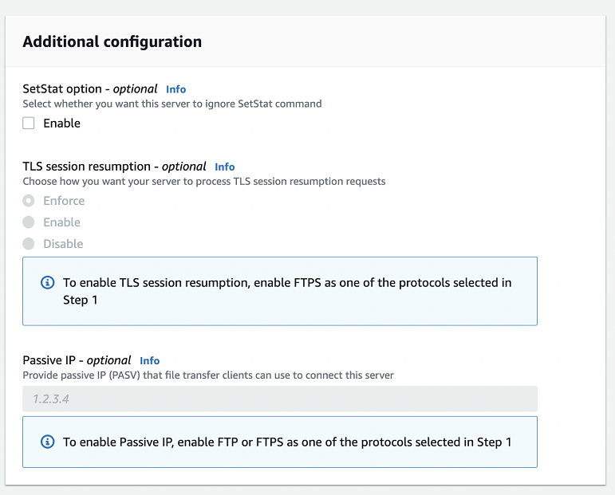

# Create an SFTP-enabled server

Secure Shell (SSH) File Transfer Protocol (SFTP) is a network protocol used for
secure transfer of data over the internet. The protocol supports the full security
and authentication functionality of SSH. It's widely used to exchange data,
including sensitive information between business partners in a variety of industries
such as financial services, healthcare, retail, and advertising.

Note the following

- SFTP servers for Transfer Family operate over port 22. For VPC-hosted endpoints, SFTP
  Transfer Family servers can also operate over port 2222, 2223 or 22000. For details,
  see [Create a server in a virtual private cloud](create-server-in-vpc.md "create-server-in-vpc.md").
- Public endpoints cannot restrict traffic via security groups. To use
  security groups with your Transfer Family server, you must host your server's endpoint
  inside a virtual private cloud (VPC) as described in [Create a server in a virtual private cloud](create-server-in-vpc.md "create-server-in-vpc.md").

See also

- We provide an AWS CDK example for creating an SFTP Transfer Family server. The example uses TypeScript, and is available on GitHub [here](https://github.com/aws-samples/aws-cdk-examples/tree/master/typescript/aws-transfer-sftp-server "https://github.com/aws-samples/aws-cdk-examples/tree/master/typescript/aws-transfer-sftp-server").
- For a walkthrough of how to deploy a Transfer Family server inside of a VPC, see
  [Use IP allow list to secure your AWS Transfer Family servers](https://aws.amazon.com/blogs//storage/use-ip-allow-list-to-secure-your-aws-transfer-for-sftp-servers/ "https://aws.amazon.com/blogs//storage/use-ip-allow-list-to-secure-your-aws-transfer-for-sftp-servers/").

###### To create an SFTP-enabled server

1.  Open the AWS Transfer Family console at [https://console.aws.amazon.com/transfer/](https://console.aws.amazon.com/transfer/ "https://console.aws.amazon.com/transfer/") and select
    **Servers** from the navigation pane, then choose
    **Create server**.
2.  In **Choose protocols**, select
    **SFTP**, and then choose **Next**.
3.  In **Choose an identity provider**, choose the identity
    provider that you want to use to manage user access. You have the following
    options:
    - **Service managed** – You store user
      identities and keys in AWS Transfer Family.
    - **AWS Directory Service for Microsoft Active Directory** – You provide an
      Directory Service directory to access the endpoint. By doing so, you can use
      credentials stored in your Active Directory to authenticate your
      users. To learn more about working with AWS Managed Microsoft AD identity
      providers, see [Using AWS Directory Service for Microsoft
      Active Directory](directory-services-users.md "directory-services-users.md").

    ###### Note

        + Cross-Account and Shared directories are not supported for AWS Managed Microsoft AD.
        + To set up a server with Directory Service as your identity provider, you need to add some Directory Service permissions.
         For details, see [Before you start using AWS Directory Service for Microsoft Active Directory](directory-services-users.md#managed-ad-prereq "directory-services-users.md#managed-ad-prereq").

    - **Custom identity provider** – Choose
      either of the following options:
      - **Use AWS Lambda to connect your identity provider** – You can use an existing identity provider, backed by a Lambda function. You provide
        the name of the Lambda function. For more information, see [Using AWS Lambda to integrate your identity
        provider](custom-lambda-idp.md "custom-lambda-idp.md").
      - **Use Amazon API Gateway to connect your identity provider** – You can create an API Gateway method backed by a Lambda function for use as an identity provider.
        You provide an Amazon API Gateway URL and an invocation role. For more information, see [Using Amazon API Gateway to integrate your identity
        provider](authentication-api-gateway.md "authentication-api-gateway.md").

    

4.  Choose **Next**.
5.  In **Choose an endpoint**, do the following:
    1. For **Endpoint type**, choose the
       **Publicly accessible** endpoint type. For a
       **VPC hosted** endpoint, see [Create a server in a virtual private cloud](create-server-in-vpc.md "create-server-in-vpc.md").
    2. For **IP address type**, choose
       **IPv4** (default) for backwards compatibility
       or **Dual-stack** to enable both IPv4 and IPv6
       connections to your endpoint.

    ###### Note

    Dual-stack mode allows your Transfer Family endpoint to communicate with
    both IPv4 and IPv6 enabled clients. This enables you to
    gradually transition from IPv4 to IPv6 based systems without
    needing to switch all at once. 3. (Optional) For **Custom hostname**, choose
    **None**.

    You get a server hostname provided by AWS Transfer Family. The server
    hostname takes the form
    ``serverId`.server.transfer.`regionId`.amazonaws.com`.

    For a custom hostname, you specify a custom alias for your server
    endpoint. To learn more about working with custom hostnames, see
    [Working with custom hostnames](requirements-dns.md "requirements-dns.md"). 4. (Optional) For **FIPS Enabled**, select the
    **FIPS Enabled endpoint** check box to ensure
    that the endpoint complies with Federal Information Processing
    Standards (FIPS).

    ###### Note

    FIPS-enabled endpoints are only available in North American AWS
    Regions. For available Regions, see [AWS Transfer Family endpoints
    and quotas](../../../general/latest/gr/transfer-service.md "../../../general/latest/gr/transfer-service.md") in the _AWS General Reference_.
    For more information about FIPS, see [Federal Information Processing Standard
    (FIPS) 140-2](https://aws.amazon.com/compliance/fips/ "https://aws.amazon.com/compliance/fips/") . 5. Choose **Next**.

6.  On the **Choose domain** page, choose the AWS storage
    service that you want to use to store and access your data over the selected
    protocol:

        * Choose **Amazon S3** to store and access your files as
         objects over the selected protocol.
        * Choose **Amazon EFS** to store and access your files
         in your Amazon EFS file system over the selected protocol.

    Choose **Next**.

7.  In **Configure additional details**, do the
    following:
    1. For logging, specify an existing log group or create a new one
       (the default option). If you choose an existing log group, you must
       select one that is associated with your AWS account.

    

    If you choose **Create log group**, the CloudWatch console
    ([https://console.aws.amazon.com/cloudwatch/](https://console.aws.amazon.com/cloudwatch/ "https://console.aws.amazon.com/cloudwatch/")) opens to the **Create log
    group** page. For details, see [Create a log group in CloudWatch Logs](../../../AmazonCloudWatch/latest/logs/Working-with-log-groups-and-streams.md#Create-Log-Group "../../../AmazonCloudWatch/latest/logs/Working-with-log-groups-and-streams.md#Create-Log-Group"). 2. (Optional) For **Managed workflows**, choose workflow IDs (and a corresponding role) that
    Transfer Family should assume when executing the workflow. You can choose one workflow to execute upon a complete upload, and another to execute upon a partial upload. To learn more about processing your files by using managed workflows, see
    [AWS Transfer Family managed workflows](transfer-workflows.md "transfer-workflows.md").

     3. For **Cryptographic algorithm options**, choose a
    security policy that contains the cryptographic algorithms enabled
    for use by your server. Our latest security policy is the default: for details, see
    [Security policies for AWS Transfer Family servers](security-policies.md "security-policies.md"). 4. (Optional) For **Server Host Key**, enter an RSA,
    ED25519, or ECDSA private key that will be used to identify your
    server when clients connect to it over SFTP. You can also add a
    description to differentiate among multiple host keys.

    After you create your server, you can add additional host keys.
    Having multiple host keys is useful if you want to rotate keys or if
    you want to have different types of keys, such as an RSA key and
    also an ECDSA key.

    ###### Note

    The **Server Host Key** section is used only
    for migrating users from an existing SFTP-enabled server. 5. (Optional) For **Tags**, for
    **Key** and **Value**, enter
    one or more tags as key-value pairs, and then choose **Add
    tag**. 6. Choose **Next**. 7. You can optimize performance for your Amazon S3 directories. For example, suppose that you go into
    your home directory, and you have 10,000 subdirectories. In other words, your Amazon S3 bucket has 10,000 folders.
    In this scenario, if you run the `ls` (list) command, the list operation takes between six and
    eight minutes. However, if you optimize your directories, this operation takes only a few seconds.

    When you create your server using the console, optimized directories is enabled by default. If you create your server
    using the API, this behavior is not enabled by default.

     8. (Optional) Configure AWS Transfer Family servers to display customized
    messages such as organizational policies or terms and conditions to
    your end users. For **Display banner**, in the
    **Pre-authentication display banner** text box,
    enter the text message that you want to display to your users before
    they authenticate. 9. (Optional) You can configure the following additional
    options.

        * **SetStat option**: enable this option to
         ignore the error that is generated when a client attempts to
         use `SETSTAT` on a file you are uploading to an
         Amazon S3 bucket. For additional details, see the
         `SetStatOption` documentation in the [ProtocolDetails](../APIReference/API_ProtocolDetails.md "../APIReference/API_ProtocolDetails.md").
        * **TLS session resumption**: this option
         is only available if you have enabled FTPS as one of the
         protocols for this server.
        * **Passive IP**: this option is only
         available if you have enabled FTPS or FTP as one of the
         protocols for this server.

    

8.  In **Review and create**, review your choices.

        * If you want to edit any of them, choose **Edit**
         next to the step.

        ###### Note

        You must review each step after the step that you chose to
         edit.
        * If you have no changes, choose **Create server**
         to create your server. You are taken to the
         **Servers** page, shown following, where your
         new server is listed.

    It can take a couple of minutes before the status for your new server changes to
    **Online**. At that point, your server can perform file operations,
    but you'll need to create a user first. For details on creating users, see
    [Managing users for server endpoints](create-user.md "create-user.md").
