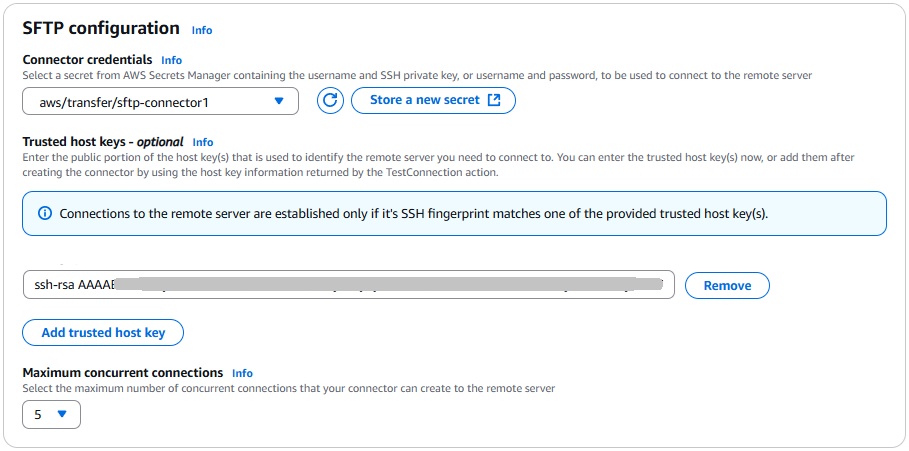
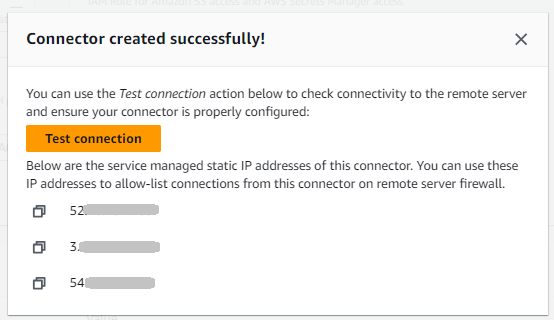

# Create an SFTP connector with

service-managed egress

This procedure explains how to create SFTP connectors by using the AWS Transfer Family console or
AWS CLI.

Console

###### To create an SFTP connector

1. Open the AWS Transfer Family console at [https://console.aws.amazon.com/transfer/](https://console.aws.amazon.com/transfer/ "https://console.aws.amazon.com/transfer/").
2. In the left navigation pane, choose **SFTP
   Connectors**, then choose **Create SFTP
   connector**.
3. In the **Connector configuration** section, for
   **Egress type**, choose **Service
   managed**. This option uses AWS Transfer Family managed egress
   infrastructure. The Transfer Family service provides and manages static IP
   addresses for each SFTP connector.
4. In the **Connector configuration** section, provide
   the following information:


    * For the **URL**, enter the URL for a remote
     SFTP server. This URL must be formatted as `sftp://`partner-SFTP-server-url``,
     for example `sftp://AnyCompany.com`.


    ###### Note

    Optionally, you can provide a port number in your URL. The
     format is
     `sftp://`partner-SFTP-server-url`:`port-number``.
     The default port number (when no port is specified) is port
     22.
    * For the **Access role**, choose the Amazon
     Resource Name (ARN) of the AWS Identity and Access Management (IAM) role to use.


    	+ **Make sure that this role provides
    	 read and write access** to the parent directory of the file location
    	 that's used in the `StartFileTransfer` request.
    	+ **Make sure that this role provides permission** for
    	 `secretsmanager:GetSecretValue` to access the secret.


    	###### Note

    	In the policy, you must specify the ARN for the secret. The ARN contains the secret name,
    	 but appends the name with six, random, alphanumeric characters. An ARN for a secret has the following format.


    	```
    	arn:aws:secretsmanager:`region`:`account-id`:secret:aws/transfer/`SecretName-6RandomCharacters`
    	```
    	+ **Make sure this role contains a trust relationship** that allows the connector to
    	 access your resources when servicing your users' transfer requests. For
    	 details on establishing a trust relationship, see [To establish a trust relationship](requirements-roles.md#establish-trust-transfer "requirements-roles.md#establish-trust-transfer").


    ```
    `{
     "Version":"2012-10-17",
     "Statement": [
     {
     "Sid": "AllowListingOfUserFolder",
     "Action": [
     "s3:ListBucket",
     "s3:GetBucketLocation"
     ],
     "Effect": "Allow",
     "Resource": [
     "arn:aws:s3:::amzn-s3-demo-bucket"
     ]
     },
     {
     "Sid": "HomeDirObjectAccess",
     "Effect": "Allow",
     "Action": [
     "s3:PutObject",
     "s3:GetObject",
     "s3:DeleteObject",
     "s3:DeleteObjectVersion",
     "s3:GetObjectVersion",
     "s3:GetObjectACL",
     "s3:PutObjectACL"
     ],
     "Resource": "arn:aws:s3:::amzn-s3-demo-bucket/*"
     },
     {
     "Sid": "GetConnectorSecretValue",
     "Effect": "Allow",
     "Action": [
     "secretsmanager:GetSecretValue"
     ],
     "Resource": "arn:aws:secretsmanager:`us-west-2`:`111122223333`:secret:aws/transfer/`SecretName-6RandomCharacters`"
     }
     ]
    }`

    ```


    ###### Note

    For the access role, the example grants access to a single secret. However, you can use a wildcard character, which can save work if you want to reuse
     the same IAM role for multiple users and secrets. For example, the following resource statement grants permissions for all secrets that have names beginning
     with `aws/transfer`.


    ```
    "Resource": "arn:aws:secretsmanager:`region`:`account-id`:secret:aws/transfer/*"
    ```
    You can also store secrets containing your SFTP credentials in another AWS account. For details on enabling cross-account secret access, see
     [Permissions to AWS Secrets Manager secrets for users in a
     different account](../../../secretsmanager/latest/userguide/auth-and-access_examples_cross.md "../../../secretsmanager/latest/userguide/auth-and-access_examples_cross.md").

5. Complete the connector configuration:
   - (Optional) For the **Logging role**, choose
     the IAM role for the connector to use to push events to your
     CloudWatch logs. The following example policy lists the necessary
     permissions to log events for SFTP connectors.

   ```
   `{
    "Version":"2012-10-17",
    "Statement": [
    {
    "Sid": "VisualEditor0",
    "Effect": "Allow",
    "Action": [
    "logs:CreateLogStream",
    "logs:DescribeLogStreams",
    "logs:CreateLogGroup",
    "logs:PutLogEvents"
    ],
    "Resource": "arn:aws:logs:*:*:log-group:/aws/transfer/*"
    }
    ]
   }`

   ```

6. In the **SFTP Configuration** section, provide the
   following information:



    * For **Connector credentials**, from the
     dropdown list, choose the name of a secret in AWS Secrets Manager that
     contains the SFTP user's private key or password. You must
     create a secret and store it in a specific manner. For details,
     see [Store authentication credentials
     for SFTP connectors in Secrets Manager](sftp-connector-secret-procedure.md "sftp-connector-secret-procedure.md") .
    * (Optional) You have an option to create your connector while
     leaving the `TrustedHostKeys` parameter empty.
     However, your connector will not be able to transfer files with
     the remote server until you provide this parameter in your
     connector’s configuration. You can enter the Trusted host key(s)
     at the time of creating your connector, or update your connector
     later by using the host key information returned by the
     `TestConnection` console action or API command.
     That is, for the **Trusted host keys** text
     box, you can do either of the following:


    	+ **Provide the Trusted Host Key(s)
    	 at the time of creating your connector.**
    	 Paste in the public portion of the host key that is used
    	 to identify the external server. You can add more than
    	 one key, by choosing **Add trusted host
    	 key** to add an additional key. You can use
    	 the `ssh-keyscan` command against the SFTP
    	 server to retrieve the necessary key. For details about
    	 the format and type of trusted host keys that Transfer Family
    	 supports, see [SFTPConnectorConfig](../APIReference/API_SftpConnectorConfig.md "../APIReference/API_SftpConnectorConfig.md").
    	+ *Leave the Trusted Host Key(s) text box empty
    	 when creating your connector and update your
    	 connector at a later time with this
    	 information.* If you do not have the host
    	 key information at the time of creating your connector,
    	 you can leave this parameter empty for now and proceed
    	 with creating your connector. After the connector is
    	 created, use the new connector's ID to run the
    	 `TestConnection` command, either in the
    	 AWS CLI or from the connector's detail page. If
    	 successful, `TestConnection` will return the
    	 necessary host key information. You can then edit your
    	 connector using the console (or by running the
    	 `UpdateConnector` AWS CLI command) and add
    	 the host key information that was returned when you ran
    	 `TestConnection`.
    ###### Important

    If you retrieve the remote server's host key by running
     `TestConnection`, make sure that you perform
     out-of-band validation on the key that is returned.

    You must accept the new key as trusted, or verify the
     presented fingerprint with a previously known fingerprint
     that you have received from the owner of the remote SFTP
     server you are connecting to.
    * (Optional) For **Maximum concurrent
     connections**, from the dropdown list, choose the
     number of concurrent connections that your connector creates to
     the remote server. The default selection on the console is
     **5**.


    This setting specifies the number of active connections that
     your connector can establish with the remote server at the same
     time. Creating concurrent connections can enhance connector
     performance by enabling parallel operations.

7. In the **Cryptographic algorithm options** section,
   choose a **Security policy** from the dropdown list in
   the **Security Policy** field. The security policy
   enables you to select the cryptographic algorithms that your connector
   supports. For details on the available security policies and algorithms,
   see [Security policies for AWS Transfer Family SFTP
   connectors](security-policies-connectors.md "security-policies-connectors.md").
8. (Optional) In the **Tags** section, for
   **Key** and **Value**, enter one
   or more tags as key-value pairs.
9. After you have confirmed all of your settings, choose **Create
   SFTP connector** to create the SFTP connector. If the
   connector is created successfully, a screen appears with a list of the
   assigned static IP addresses and a **Test connection**
   button. Use the button to test the configuration for your new
   connector.



The **Connectors** page appears, with the ID of your new SFTP
connector added to the list. To view the details for your connectors, see [View SFTP connector details](manage-sftp-connectors.md#sftp-connectors-view-info "manage-sftp-connectors.md#sftp-connectors-view-info").

CLI
You use the [create-connector](../APIReference/API_CreateConnector.md "../APIReference/API_CreateConnector.md") command to create a connector.
To use this command to create an SFTP connector, you must provide the following
information.

- The URL for a remote SFTP server. This URL must be formatted as `sftp://`partner-SFTP-server-url``,
for example `sftp://AnyCompany.com`.
- The access role. Choose the Amazon Resource Name (ARN) of the
  AWS Identity and Access Management (IAM) role to use.
  - **Make sure that this role provides
    read and write access** to the parent directory of the file location
    that's used in the `StartFileTransfer` request.
  - **Make sure that this role provides permission** for
    `secretsmanager:GetSecretValue` to access the secret.

  ###### Note

  In the policy, you must specify the ARN for the secret. The ARN contains the secret name,
  but appends the name with six, random, alphanumeric characters. An ARN for a secret has the following format.

  ```
  arn:aws:secretsmanager:`region`:`account-id`:secret:aws/transfer/`SecretName-6RandomCharacters`
  ```

  - **Make sure this role contains a trust relationship** that allows the connector to
    access your resources when servicing your users' transfer requests. For
    details on establishing a trust relationship, see [To establish a trust relationship](requirements-roles.md#establish-trust-transfer "requirements-roles.md#establish-trust-transfer").

```
`{
 "Version":"2012-10-17",
 "Statement": [
 {
 "Sid": "AllowListingOfUserFolder",
 "Action": [
 "s3:ListBucket",
 "s3:GetBucketLocation"
 ],
 "Effect": "Allow",
 "Resource": [
 "arn:aws:s3:::amzn-s3-demo-bucket"
 ]
 },
 {
 "Sid": "HomeDirObjectAccess",
 "Effect": "Allow",
 "Action": [
 "s3:PutObject",
 "s3:GetObject",
 "s3:DeleteObject",
 "s3:DeleteObjectVersion",
 "s3:GetObjectVersion",
 "s3:GetObjectACL",
 "s3:PutObjectACL"
 ],
 "Resource": "arn:aws:s3:::amzn-s3-demo-bucket/*"
 },
 {
 "Sid": "GetConnectorSecretValue",
 "Effect": "Allow",
 "Action": [
 "secretsmanager:GetSecretValue"
 ],
 "Resource": "arn:aws:secretsmanager:`us-west-2`:`111122223333`:secret:aws/transfer/`SecretName-6RandomCharacters`"
 }
 ]
}`

```

###### Note

For the access role, the example grants access to a single secret. However, you can use a wildcard character, which can save work if you want to reuse
the same IAM role for multiple users and secrets. For example, the following resource statement grants permissions for all secrets that have names beginning
with `aws/transfer`.

```
"Resource": "arn:aws:secretsmanager:`region`:`account-id`:secret:aws/transfer/*"
```

You can also store secrets containing your SFTP credentials in another AWS account. For details on enabling cross-account secret access, see
[Permissions to AWS Secrets Manager secrets for users in a
different account](../../../secretsmanager/latest/userguide/auth-and-access_examples_cross.md "../../../secretsmanager/latest/userguide/auth-and-access_examples_cross.md").

- (Optional) Choose the IAM role for the connector to use to push
  events to your CloudWatch logs. The following example policy lists the
  necessary permissions to log events for SFTP connectors.

```
`{
 "Version":"2012-10-17",
 "Statement": [
 {
 "Sid": "VisualEditor0",
 "Effect": "Allow",
 "Action": [
 "logs:CreateLogStream",
 "logs:DescribeLogStreams",
 "logs:CreateLogGroup",
 "logs:PutLogEvents"
 ],
 "Resource": "arn:aws:logs:*:*:log-group:/aws/transfer/*"
 }
 ]
}`

```

- Provide the following SFTP configuration information.

      + The ARN of a secret in AWS Secrets Manager that contains the SFTP user's
       private key or password.
      + The public portion of the host key that is used to identify
       the external server. You can provide multiple trusted host keys
       if you like.

  The easiest way to provide the SFTP information is to save it to a
  file. For example, copy the following example text to a file named
  `testSFTPConfig.json`.

```
// Listing for testSFTPConfig.json
{
   "UserSecretId": "arn:aws::secretsmanager:`us-east-2`:`123456789012`:secret:aws/transfer/`example-username-key`",
   "TrustedHostKeys": [
      "`sftp.example.com ssh-rsa AAAAbbbb...EEEE=`"
   ]
}
```

- Specify a security policy for your connector, entering the security
  policy name.

###### Note

The `SecretId` can be either the entire ARN or the name of the
secret (`example-username-key` in the previous
listing).

Then run the following command to create the connector:

```
aws transfer create-connector --url "sftp://`partner-SFTP-server-url`" \
--access-role `your-IAM-role-for-bucket-access` \
--logging-role arn:aws:iam::`your-account-id`:role/service-role/AWSTransferLoggingAccess \
--sftp-config file:///`path/to`/testSFTPConfig.json \
--security-policy-name `security-policy-name` \
--maximum-concurrent-connections `integer-from-1-to-5`
```

When you describe a VPC egress type connector, the response includes the new
fields:

```
{
   "Connector": {
      "AccessRole": "arn:aws:iam::123456789012:role/connector-role",
      "Arn": "arn:aws:transfer:us-east-1:123456789012:connector/c-1234567890abcdef0",
      "ConnectorId": "c-1234567890abcdef0",
      "Status": "ACTIVE",
      "EgressConfig": {
        "VpcLattice": {
          "ResourceConfigurationArn": "arn:aws:vpc-lattice:us-east-1:123456789012:resourceconfiguration/rcfg-12345678",
          "PortNumber": 22
        }
      },
      "EgressType": "VPC",
      "ServiceManagedEgressIpAddresses": null,
      "SftpConfig": {
         "TrustedHostKeys": [ "ssh-rsa AAAAB3NzaC..." ],
         "UserSecretId": "aws/transfer/connector-secret"
      },
      "Url": "sftp://my.sftp.server.com:22"
   }
}
```

Note that `ServiceManagedEgressIpAddresses` is null for VPC egress
type connectors since traffic routes through your VPC instead of AWS managed
infrastructure.
