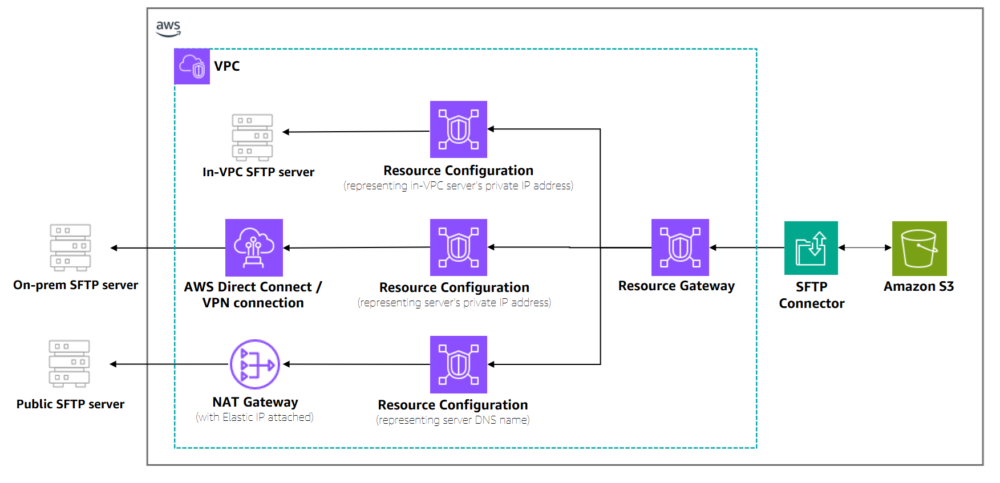

# Create an SFTP connector with

VPC-based egress

This topic provides step-by-step instructions for creating SFTP connectors with VPC
connectivity. VPC_LATTICE-enabled connectors use Amazon VPC Lattice to route traffic through your Virtual
Private Cloud, enabling secure connections to private endpoints or using your own NAT
gateways for internet access.

**When to use VPC connectivity**

Use VPC connectivity for SFTP connectors in these scenarios:

- **Private SFTP servers**: Connect to SFTP servers
  that are only accessible from your VPC.
- **On-premises connectivity**: Connect to on-premises
  SFTP servers through AWS Direct Connect or AWS Site-to-Site VPN
  connections.
- **Custom IP addresses**: Use your own NAT gateways
  and Elastic IP addresses, including BYOIP scenarios.
- **Centralized security controls**: Route file
  transfers through your organization's central ingress/egress controls.



## Prerequisites for VPC_LATTICE-enabled SFTP

connectors

Before creating a VPC_LATTICE-enabled SFTP connector, you must complete the following
prerequisites:

**How VPC-based connectivity works**

VPC Lattice enables you to securely share VPC resources with other AWS services.
AWS Transfer Family uses a service network to simplify the resource sharing process. The key
components are:

- **Resource Gateway**: Serves as the point of
  access into your VPC. You create this in your VPC with a minimum of two
  Availability Zones.
- **Resource Configuration**: Contains the private
  IP address or public DNS name of the SFTP server you want to connect to.

When you create a VPC_LATTICE-enabled connector, AWS Transfer Family uses Forward Access Session (FAS) to
temporarily obtain your credentials and associate your Resource Configuration with our
service network.

**Required setup steps**

1. **VPC infrastructure**: Ensure you have a
   properly configured VPC with the necessary subnets, route tables, and security
   groups for your SFTP server connectivity requirements.
2. **Resource Gateway**: Create a Resource Gateway
   in your VPC using the VPC Lattice `create-resource-gateway` command. The
   Resource Gateway must be associated with subnets in at least two Availability
   Zones. For more information, see [Resource gateways](../../../vpc-lattice/latest/ug/resource-gateway.md "../../../vpc-lattice/latest/ug/resource-gateway.md") in the _Amazon VPC Lattice User
   Guide_.
3. **Resource Configuration**: Create a Resource
   Configuration that represents the target SFTP server using the VPC Lattice
   `create-resource-configuration` command. You can specify
   either:
   - A private IP address for private endpoints
   - A public DNS name for public endpoints (IP addresses are not supported
     for public endpoints)

4. **Authentication credentials**: Store the SFTP
   user credentials in AWS Secrets Manager as described in [Store authentication credentials
   for SFTP connectors in Secrets Manager](sftp-connector-secret-procedure.md "sftp-connector-secret-procedure.md") .

###### Important

The Resource Gateway and Resource Configuration must be created in the same AWS
account. When creating a Resource Configuration, you must first have a Resource
Gateway in place.

For more information on VPC resource configurations, see [Resource configurations](../../../vpc-lattice/latest/ug/resource-configuration.md "../../../vpc-lattice/latest/ug/resource-configuration.md") in the _Amazon VPC Lattice User
Guide_.

###### Note

VPC connectivity for SFTP connectors is available in AWS Regions where
Amazon VPC Lattice resources are available. For more information, see [VPC Lattice FAQs](https://aws.amazon.com/vpc/lattice/faqs/#topic-0 "https://aws.amazon.com/vpc/lattice/faqs/#topic-0").
Availability Zone support varies by region, and Resource Gateways require a minimum
of two Availability Zones.

## Create a VPC_LATTICE-enabled SFTP

connector

After completing the prerequisites, you can create an SFTP connector with VPC
connectivity using the AWS CLI, AWS Management Console, or AWS SDKs.

Console

###### To create a VPC_LATTICE-enabled SFTP

connector

1. Open the AWS Transfer Family console at [https://console.aws.amazon.com/transfer/](https://console.aws.amazon.com/transfer/ "https://console.aws.amazon.com/transfer/").
2. In the left navigation pane, choose **SFTP
   Connectors**, then choose **Create SFTP
   connector**.
3. In the **Connector configuration** section, for
   **Egress type**, choose **VPC
   Lattice**.

This option routes traffic through your VPC using Amazon VPC Lattice for
cross-VPC resource access. You can use this option to connect to
privately hosted server endpoints, route traffic through your VPC's
security controls, or use your own NAT gateways and Elastic IP
addresses. The address of the remote SFTP server is represented as a
Resource Configuration in your VPC. For more information about
Resource Configurations, see [Resource
configurations for VPC resources](../../../vpc-lattice/latest/ug/resource-configuration.md "../../../vpc-lattice/latest/ug/resource-configuration.md") in the Amazon VPC Lattice
User Guide. 4. Complete the connector configuration:

    * For the **Access role**, choose the
     Amazon Resource Name (ARN) of the AWS Identity and Access Management (IAM) role to
     use.


    	+ **Make sure that this role provides
    	 read and write access** to the parent directory of the file location
    	 that's used in the `StartFileTransfer` request.
    	+ **Make sure that this role provides permission** for
    	 `secretsmanager:GetSecretValue` to access the secret.


    	###### Note

    	In the policy, you must specify the ARN for the secret. The ARN contains the secret name,
    	 but appends the name with six, random, alphanumeric characters. An ARN for a secret has the following format.


    	```
    	arn:aws:secretsmanager:`region`:`account-id`:secret:aws/transfer/`SecretName-6RandomCharacters`
    	```
    	+ **Make sure this role contains a trust relationship** that allows the connector to
    	 access your resources when servicing your users' transfer requests. For
    	 details on establishing a trust relationship, see [To establish a trust relationship](requirements-roles.md#establish-trust-transfer "requirements-roles.md#establish-trust-transfer").


    ```
    `{
     "Version":"2012-10-17",
     "Statement": [
     {
     "Sid": "AllowListingOfUserFolder",
     "Action": [
     "s3:ListBucket",
     "s3:GetBucketLocation"
     ],
     "Effect": "Allow",
     "Resource": [
     "arn:aws:s3:::amzn-s3-demo-bucket"
     ]
     },
     {
     "Sid": "HomeDirObjectAccess",
     "Effect": "Allow",
     "Action": [
     "s3:PutObject",
     "s3:GetObject",
     "s3:DeleteObject",
     "s3:DeleteObjectVersion",
     "s3:GetObjectVersion",
     "s3:GetObjectACL",
     "s3:PutObjectACL"
     ],
     "Resource": "arn:aws:s3:::amzn-s3-demo-bucket/*"
     },
     {
     "Sid": "GetConnectorSecretValue",
     "Effect": "Allow",
     "Action": [
     "secretsmanager:GetSecretValue"
     ],
     "Resource": "arn:aws:secretsmanager:`us-west-2`:`111122223333`:secret:aws/transfer/`SecretName-6RandomCharacters`"
     }
     ]
    }`

    ```


    ###### Note

    For the access role, the example grants access to a single secret. However, you can use a wildcard character, which can save work if you want to reuse
     the same IAM role for multiple users and secrets. For example, the following resource statement grants permissions for all secrets that have names beginning
     with `aws/transfer`.


    ```
    "Resource": "arn:aws:secretsmanager:`region`:`account-id`:secret:aws/transfer/*"
    ```
    You can also store secrets containing your SFTP credentials in another AWS account. For details on enabling cross-account secret access, see
     [Permissions to AWS Secrets Manager secrets for users in a
     different account](../../../secretsmanager/latest/userguide/auth-and-access_examples_cross.md "../../../secretsmanager/latest/userguide/auth-and-access_examples_cross.md").
    * For **Resource Configuration ARN**, enter
     the ARN of the VPC Lattice Resource Configuration that points
     to your SFTP server:


    ```
    arn:aws:vpc-lattice:`region`:`account-id`:resourceconfiguration/rcfg-`12345678`
    ```
    * (Optional) For the **Logging role**,
     choose the IAM role for the connector to use to push
     events to your CloudWatch logs.


    ```
    `{
     "Version":"2012-10-17",
     "Statement": [
     {
     "Sid": "VisualEditor0",
     "Effect": "Allow",
     "Action": [
     "logs:CreateLogStream",
     "logs:DescribeLogStreams",
     "logs:CreateLogGroup",
     "logs:PutLogEvents"
     ],
     "Resource": "arn:aws:logs:*:*:log-group:/aws/transfer/*"
     }
     ]
    }`

    ```

5. In the **SFTP Configuration** section, provide
   the following information:
   - For **Connector credentials**, choose the
     name of a secret in AWS Secrets Manager that contains the SFTP user's
     private key or password.
   - For **Trusted host keys**, paste in the
     public portion of the host key that is used to identify the
     external server, or leave empty to configure later using the
     `TestConnection` command.

   Since this host key is for a VPC_LATTICE connector, remove
   the host name in the key
   - (Optional) For **Maximum concurrent
     connections**, choose the number of concurrent
     connections that your connector creates to the remote server
     (default is 5).

6. In the **Cryptographic algorithm options**
   section, choose a **Security policy** from the
   dropdown list.
7. (Optional) In the **Tags** section, add tags as
   key-value pairs.
8. Choose **Create SFTP connector** to create the
   VPC_LATTICE-enabled SFTP connector.

The connector will be created with a status of `PENDING` while
the resource association is being provisioned, which typically takes several
minutes. Once the status changes to `ACTIVE`, the connector is
ready for use.

CLI
Use the following command to create a VPC_LATTICE-enabled SFTP connector:

```
aws transfer create-connector \
    --url "sftp://my.sftp.server.com:22" \
    --access-role arn:aws:iam::123456789012:role/TransferConnectorRole \
    --sftp-config UserSecretId=my-secret-id,TrustedHostKeys="ssh-rsa AAAAB3NzaC..." \
    --egress-config VpcLattice={ResourceConfigurationArn=arn:aws:vpc-lattice:us-east-1:123456789012:resourceconfiguration/rcfg-1234567890abcdef0} \
    --security-policy-name TransferSecurityPolicy-2024-01
```

The key parameter for VPC connectivity is `--egress-config`,
which specifies the Resource Configuration ARN that defines your SFTP server
target.

## Monitoring VPC connector

status

VPC_LATTICE-enabled connectors have an asynchronous setup process. After creation, monitor the
connector status:

- **PENDING**: The connector is being provisioned.
  Service network provisioning is in progress, which typically takes several
  minutes.
- **ACTIVE**: The connector is ready for use and
  can transfer files.
- **ERRORED**: The connector failed to provision.
  Check the error details for troubleshooting information.

Check the connector status using the `describe-connector` command:

```
aws transfer describe-connector --connector-id c-1234567890abcdef0
```

During the PENDING state, the `test-connection` API will return "Connector
not available" until provisioning is complete.

## Limitations and considerations

- **Public endpoints**: When connecting to public
  endpoints through VPC, you must provide a DNS name in the Resource
  Configuration. Public IP addresses are not supported.
- **Regional availability**: VPC connectivity is
  available in select AWS Regions. Cross-region resource sharing is not
  supported.
- **Availability Zone requirements**: Resource
  Gateways must be associated with subnets in at least two Availability Zones. Not
  all Availability Zones support VPC Lattice in every region.
- **Connection limits**: Maximum of 350 connections
  per resource with a 350-second idle timeout for TCP connections.

## Cost considerations

There are no additional charges from AWS Transfer Family beyond regular service charges. However,
customers may be subject to additional charges from Amazon VPC Lattice associated with sharing
their Amazon Virtual Private Cloud resources, and NAT gateway charges if they use their own NAT gateways
for egress to internet.

For complete AWS Transfer Family pricing information, see the [AWS Transfer Family pricing
page](https://aws.amazon.com/aws-transfer-family/pricing/ "https://aws.amazon.com/aws-transfer-family/pricing/").

## VPC connectivity examples for SFTP

connectors

This section provides examples of creating SFTP connectors with VPC connectivity for
various scenarios. Before using these examples, ensure you have completed the VPC
infrastructure setup as described in the VPC connectivity documentation.

### Example: Private endpoint

connection

This example shows how to create an SFTP connector that connects to a private SFTP
server accessible only from your VPC.

###### Prerequisites

1. Create a Resource Gateway in your VPC:

```
aws vpc-lattice create-resource-gateway \
    --name my-private-server-gateway \
    --vpc-identifier vpc-1234567890abcdef0 \
    --subnet-ids subnet-1234567890abcdef0 subnet-0987654321fedcba0
```

2. Create a Resource Configuration for your private SFTP server:

```
aws vpc-lattice create-resource-configuration \
    --name my-private-server-config \
    --resource-gateway-identifier rgw-1234567890abcdef0 \
    --resource-configuration-definition ipResource={ipAddress="10.0.1.100"} \
    --port-ranges 22
```

###### Create the VPC_LATTICE-enabled connector

1. Create the SFTP connector with VPC connectivity:

```
aws transfer create-connector \
    --access-role arn:aws:iam::123456789012:role/TransferConnectorRole \
    --sftp-config UserSecretId=my-private-server-credentials,TrustedHostKeys="ssh-rsa AAAAB3NzaC..." \
    --egress-config VpcLattice={ResourceConfigurationArn=arn:aws:vpc-lattice:us-east-1:123456789012:resourceconfiguration/rcfg-1234567890abcdef0,PortNumber=22}
```

2. Monitor the connector status until it becomes `ACTIVE`:

```
aws transfer describe-connector --connector-id c-1234567890abcdef0
```

The remote SFTP server will see connections coming from the Resource Gateway's IP
address within your VPC CIDR range.

### Example: Public endpoint via

VPC

This example shows how to route connections to a public SFTP server through your VPC
to leverage centralized security controls and use your own NAT Gateway IP
addresses.

###### Prerequisites

1. Create a Resource Gateway in your VPC (same as private endpoint
   example).
2. Create a Resource Configuration for the public SFTP server using its DNS
   name:

```
aws vpc-lattice create-resource-configuration \
    --name my-public-server-config \
    --resource-gateway-identifier rgw-1234567890abcdef0 \
    --resource-configuration-definition dnsResource={domainName="sftp.example.com"} \
    --port-ranges 22
```

###### Note

For public endpoints, you must use a DNS name, not an IP address.

###### Create the connector

- Create the SFTP connector:

```
aws transfer create-connector \
    --access-role arn:aws:iam::123456789012:role/TransferConnectorRole \
    --sftp-config UserSecretId=my-public-server-credentials,TrustedHostKeys="ssh-rsa AAAAB3NzaC..." \
    --egress-config VpcLattice={ResourceConfigurationArn=arn:aws:vpc-lattice:us-east-1:123456789012:resourceconfiguration/rcfg-0987654321fedcba0,PortNumber=22}
```

Traffic will flow from the connector to your Resource Gateway, then through your NAT
Gateway to reach the public SFTP server. The remote server will see your NAT Gateway's
Elastic IP address as the source.

### Example: Cross-account private

endpoint

This example shows how to connect to a private SFTP server in a different AWS
account by using resource sharing.

###### Note

If you already have cross-VPC resource sharing enabled through other mechanisms,
such as AWS Transit Gateway, you don't need to configure the resource sharing described
here. The existing routing mechanisms, such as Transit Gateway route tables, are
automatically used by SFTP connectors. You only need to create a Resource
Configuration in the same account where you're creating the SFTP connector.

###### Account A (Resource Provider) - Share the Resource Configuration

1. Create Resource Gateway and Resource Configuration in Account A (same as
   previous examples).
2. Share the Resource Configuration with Account B using AWS Resource Access
   Manager:

```
aws ram create-resource-share \
    --name cross-account-sftp-share \
    --resource-arns arn:aws:vpc-lattice:us-east-1:111111111111:resourceconfiguration/rcfg-1234567890abcdef0 \
    --principals 222222222222
```

###### Account B (Resource Consumer) - Accept and Use the Share

1. Accept the resource share invitation:

```
aws ram accept-resource-share-invitation \
    --resource-share-invitation-arn arn:aws:ram:us-east-1:111111111111:resource-share-invitation/invitation-id
```

2. Create the SFTP connector in Account B:

```
aws transfer create-connector \
    --access-role arn:aws:iam::222222222222:role/TransferConnectorRole \
    --sftp-config UserSecretId=cross-account-server-credentials,TrustedHostKeys="ssh-rsa AAAAB3NzaC..." \
    --egress-config VpcLattice={ResourceConfigurationArn=arn:aws:vpc-lattice:us-east-1:111111111111:resourceconfiguration/rcfg-1234567890abcdef0,PortNumber=22}
```

The connector in Account B can now access the private SFTP server in Account A through
the shared Resource Configuration.

### Common troubleshooting

scenarios

Here are solutions for common issues when creating VPC_LATTICE-enabled connectors:

- **Connector stuck in PENDING status**: Check that
  your Resource Gateway is ACTIVE and has subnets in supported Availability Zones.
  If the connector is still stuck with a status of PENDING, call
  `UpdateConnector` using the same configuration parameters that
  you used initially. This triggers a new status event that might resolve the
  problem.
- **Connection timeouts**: Verify security group
  rules allow traffic on port 22 and that your VPC routing is correct.
- **DNS resolution issues**: For public endpoints,
  ensure your VPC has internet connectivity through a NAT Gateway or Internet
  Gateway.
- **Cross-account access denied**: Verify the
  resource share is accepted and the Resource Configuration ARN is correct. If the
  proper permission policy is attached to the resource configuration when the
  origin account creates the resource share, these permissions are required:`vpc-lattice:AssociateViaAWSService`,
  `vpc-lattice:AssociateViaAWSService-EventsAndStates`,
  `vpc-lattice:CreateServiceNetworkResourceAssociation`,
  `vpc-lattice:GetResourceConfiguration`.
