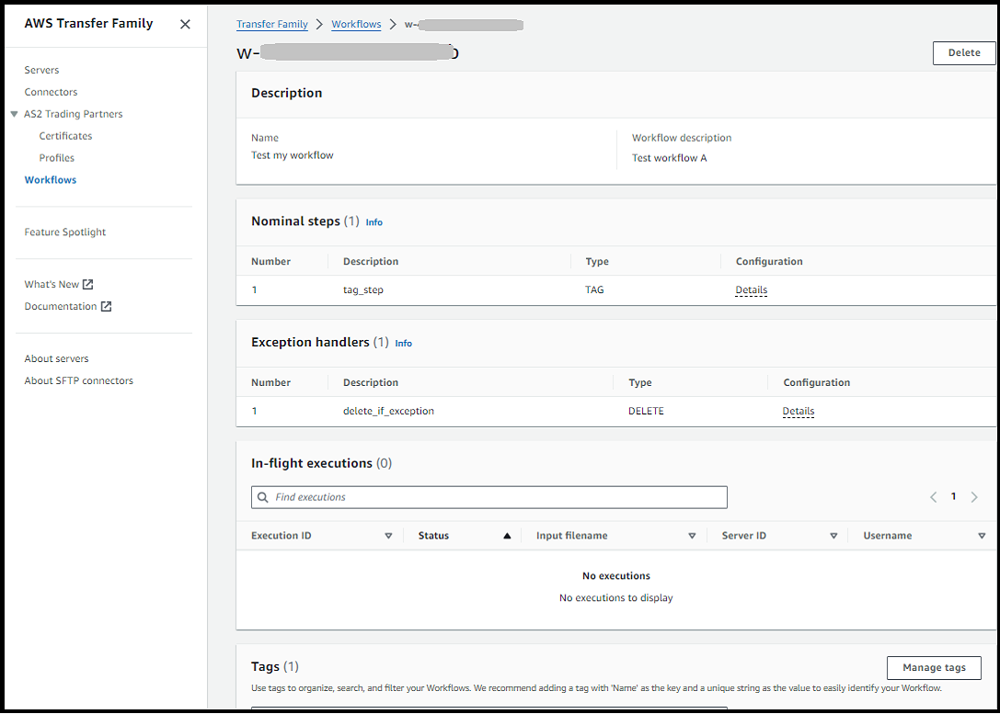
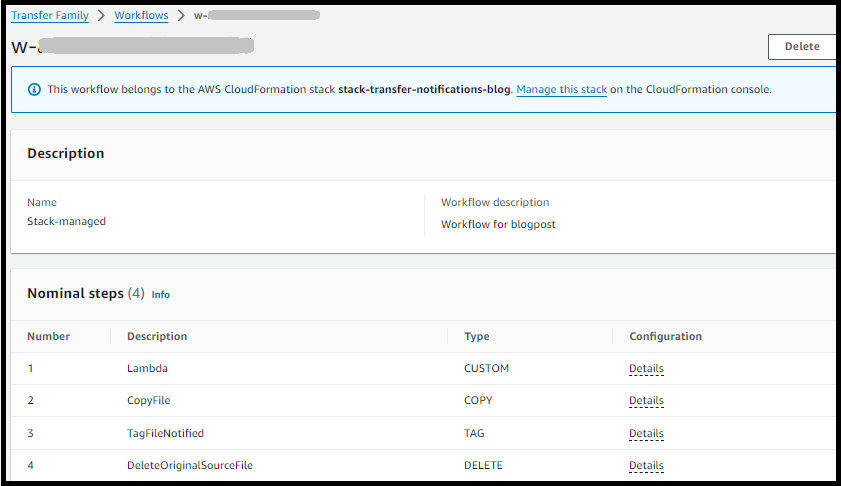

# Create a workflow

You can create a managed workflow by using the AWS Management Console, as described in this topic.
To make the workflow creation process as easy as possible, contextual help panels are
available for most of the sections in the console.

A workflow has two kinds of steps:

- **Nominal steps** – Nominal steps are
  file-processing steps that you want to apply to incoming files. If you select
  more than one nominal step, each step is processed in a linear sequence.
- **Exception-handling steps** – Exception
  handlers are file-processing steps that AWS Transfer Family executes in case any nominal
  steps fail or result in validation errors.

###### Create a workflow

1. Open the AWS Transfer Family console at [https://console.aws.amazon.com/transfer/](https://console.aws.amazon.com/transfer/ "https://console.aws.amazon.com/transfer/").
2. In the left navigation pane, choose **Workflows**.
3. On the **Workflows** page, choose **Create
   workflow**.
4. On the **Create workflow** page, enter a description. This
   description appears on the **Workflows** page.
5. In the **Nominal steps** section, choose **Add
   step**. Add one or more steps.
   1. Choose a step type from the available options. For more information
      about the various step types, see [Use predefined steps](nominal-steps-workflow.md "nominal-steps-workflow.md").
   2. Choose **Next**, then configure parameters for the
      step.
   3. Choose **Next**, then review the details for the
      step.
   4. Choose **Create step** to add the step and
      continue.
   5. Continue adding steps as needed. The maximum number of steps in a
      workflow is 8.
   6. After you have added all of the necessary nominal steps, scroll down
      to the **Exception handlers – _optional_** section, and choose
      **Add step**.

   ###### Note

   So that you are informed of failures in real time, we recommend
   that you set up exception handlers and steps to execute when your
   workflow fails.

6. To configure exception handlers, add steps in the same manner as described
   previously. If a file causes any step to throw an exception, your exception
   handlers are invoked one by one.
7. (Optional) Scroll down to the **Tags** section, and add tags
   for your workflow.
8. Review the configuration, and choose **Create workflow**.

###### Important

After you've created a workflow, you can't edit it, so make sure to review
the configuration carefully.

## Configure and run a workflow

Before you can run a workflow, you need to associate it with a Transfer Family server.

###### To configure Transfer Family to run a workflow on uploaded files

1. Open the AWS Transfer Family console at [https://console.aws.amazon.com/transfer/](https://console.aws.amazon.com/transfer/ "https://console.aws.amazon.com/transfer/").
2. In the left navigation pane, choose **Servers**.
   - To add the workflow to an existing server, choose the server that
     you want to use for your workflow.
   - Alternatively, create a new server and add the workflow to it. For
     more information, see [Configuring an SFTP, FTPS, or FTP server
     endpoint](tf-server-endpoint.md "tf-server-endpoint.md").

3. On the details page for the server, scroll down to the
   **Additional details** section, and then choose
   **Edit**.

###### Note

By default, servers do not have any associated workflows. You use the
**Additional details** section to associate a
workflow with the selected server. 4. On the **Edit additional details** page, in
the **Managed workflows** section, select a workflow to be
run on all uploads.

###### Note

If you do not already have a workflow, choose **Create a new
Workflow** to create one.

    1. Choose the workflow ID to use.
    2. Choose an execution role. This is the role that Transfer Family assumes when
     executing the workflow's steps. For more information, see [IAM policies for workflows](workflow-execution-role.md "workflow-execution-role.md"). Choose
     **Save**.


###### Note

If you no longer want a workflow to be associated with the server, you can
remove the association. For details, see [Remove a workflow from a Transfer Family
server](transfer-workflows.md#remove-workflow-association "transfer-workflows.md#remove-workflow-association").

To execute a workflow

To execute a workflow, you upload a file to a Transfer Family server that you configured with
an associated workflow.

###### Note

Anytime you remove a workflow from a server and replace it with a new one, or
update server configuration (which impacts a workflow's execution role),
you must wait approximately 10 minutes before executing the new workflow. The
Transfer Family server caches the workflow details, and it takes 10 minutes for the server
to refresh its cache.

Additionally, you must log out of any active SFTP sessions, and then log back in after the 10-minute waiting period to see the changes.

```
# Execute a workflow
> sftp bob@s-1234567890abcdef0.server.transfer.us-east-1.amazonaws.com

Connected to s-1234567890abcdef0.server.transfer.us-east-1.amazonaws.com.
sftp> put doc1.pdf
Uploading doc1.pdf to /amzn-s3-demo-bucket/home/users/bob/doc1.pdf
doc1.pdf                                                                    100% 5013KB 601.0KB/s   00:08
sftp> exit
>
```

After your file has been uploaded, the action defined is performed on your file.
For example, if your workflow contains a copy step, the file is copied to the
location that you defined in that step. You can use Amazon CloudWatch Logs to track the steps
that executed and their execution status.

## View workflow details

You can view details about previously created workflows or to workflow executions.
To view these details, you can use the console or the AWS Command Line Interface (AWS CLI).

Console

###### View workflow details

1. Open the AWS Transfer Family console at [https://console.aws.amazon.com/transfer/](https://console.aws.amazon.com/transfer/ "https://console.aws.amazon.com/transfer/").
2. In the left navigation pane, choose
   **Workflows**.
3. On the **Workflows** page, choose
   a workflow.

The workflow details page opens.



CLI
To view the workflow details, use the `describe-workflow`
CLI command, as shown in the following example. Replace the workflow ID
`w-1234567890abcdef0` with
your own value. For more information, see [describe-workflow](https://awscli.amazonaws.com/v2/documentation/api/latest/reference/transfer/describe-workflow.html "https://awscli.amazonaws.com/v2/documentation/api/latest/reference/transfer/describe-workflow.html") in the
_AWS CLI Command Reference_.

```
# View Workflow details
> aws transfer describe-workflow --workflow-id `w-1234567890abcdef0`
{
    "Workflow": {
        "Arn": "arn:aws:transfer:us-east-1:111122223333:workflow/w-1234567890abcdef0",
        "WorkflowId": "w-1234567890abcdef0",
        "Name": "Copy file to shared_files",
        "Steps": [
            {
                "Type": "COPY",
                "CopyStepDetails": {
                "Name": "Copy to shared",
                "FileLocation": {
                    "S3FileLocation": {
                        "Bucket": "amzn-s3-demo-bucket",
                        "Key": "home/shared_files/"
                    }
                }
                }
            }
        ],
        "OnException": {}
    }
}
```

If your workflow was created as part of an AWS CloudFormation stack, you can manage the
workflow using the AWS CloudFormation console ([https://console.aws.amazon.com/cloudformation](https://console.aws.amazon.com/cloudformation/ "https://console.aws.amazon.com/cloudformation/")).


