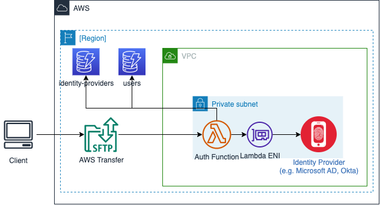

# Custom identity provider solution

The AWS Transfer Family custom identity provider solution is a modular custom identity provider
solution that solves for many common authentication and authorization use cases that
enterprises have when implementing the service. This solution provides a reusable
foundation for implementing custom identity providers with granular per-user session
configuration and separates authentication and authorization logic, offering a flexible
and easy-to-maintain foundation for various use cases.

With the AWS Transfer Family custom identity provider solution, you can address common enterprise
authentication and authorization use cases. This modular solution offers:

- A reusable foundation for implementing custom identity providers
- Granular per-user session configuration
- Separated authentication and authorization logic

## Implementation details for the

custom identity toolkit

The solution provides a flexible and maintainable base for various use cases. To
get started, review the toolkit at [https://github.com/aws-samples/toolkit-for-aws-transfer-family](https://github.com/aws-samples/toolkit-for-aws-transfer-family "https://github.com/aws-samples/toolkit-for-aws-transfer-family"), then
follow the deployment instructions in the [Getting started](https://github.com/aws-samples/toolkit-for-aws-transfer-family/tree/main/solutions/custom-idp#getting-started "https://github.com/aws-samples/toolkit-for-aws-transfer-family/tree/main/solutions/custom-idp#getting-started") section.

###### Note

If you have previously used custom identity provider templates and examples,
consider adopting this solution instead. Moving forward, provider-specific
modules will standardize on this solution. Ongoing maintenance and feature
enhancements will be applied to this solution.

This solution contains standard patterns for implementing a custom provider that
accounts for details including logging and where to store the additional session
metadata needed for AWS Transfer Family, such as the `HomeDirectoryDetails`
parameter. This solution provides a reusable foundation for implementing custom
identity providers with granular per-user session configuration, and decouples the
identity provider authentication logic from the reusable logic that builds a
configuration that is returned to Transfer Family to complete authentication and establish
settings for the session.

The code and supporting resources for this solution are available at [https://github.com/aws-samples/toolkit-for-aws-transfer-family](https://github.com/aws-samples/toolkit-for-aws-transfer-family "https://github.com/aws-samples/toolkit-for-aws-transfer-family").

The toolkit contains the following features:

- An [AWS Serverless Application Model](https://aws.amazon.com/serverless/sam "https://aws.amazon.com/serverless/sam") template
  that provisions the required resources. Optionally, deploy and configure
  Amazon API Gateway to incorporate AWS WAF, as described in the blog post [Securing AWS Transfer Family with AWS Web Application Firewall and
  Amazon API Gateway](https://aws.amazon.com/blogs/storage/securing-aws-transfer-family-with-aws-web-application-firewall-and-amazon-api-gateway/ "https://aws.amazon.com/blogs/storage/securing-aws-transfer-family-with-aws-web-application-firewall-and-amazon-api-gateway/").
- An [Amazon DynamoDB](https://aws.amazon.com/dynamodb "https://aws.amazon.com/dynamodb") schema to
  store configuration metadata about identity providers, including user
  session settings such as `HomeDirectoryDetails`,
  `Role`, and `Policy`.
- A modular approach that enables you to add new identity providers to the
  solution in the future, as modules.
- Attribute retrieval: Optionally retrieve IAM role and POSIX Profile (UID
  and GID) attributes from supported identity providers, including AD, LDAP,
  and Okta.
- Support for multiple identity providers connected to a single Transfer Family server
  and multiple Transfer Family servers using the same deployment of the solution.
- Built-in IP allow-list checking such as IP allow lists that can optionally
  be configured on a per-user or per-identity provider basis.
- Detailed logging with configurable log-level and tracing support to aid in
  troubleshooting.

Before you begin to deploy the custom identity provider solution, you need to have
the following AWS resources.

- An Amazon Virtual Private Cloud (VPC) with private subnets, with internet connectivity
  through either a NAT gateway or a DynamoDB gateway endpoint.
- Appropriate IAM permissions to perform the following tasks:
  - Deploy the `custom-idp.yaml` AWS CloudFormation template,
  - Create AWS CodePipeline projects
  - Create AWS CodeBuild projects
  - Create IAM roles and policies

###### Important

You must deploy the solution to the same AWS account and AWS Region that
contains your target Transfer Family servers.

## Supported identity providers

The following list contains details for identity providers that are supported for
the custom identity provider solution.

| Provider                     | Password flows | Public key flows | Multi-factor | Attribute retrieval | Details                                                                                                       |
| ---------------------------- | -------------- | ---------------- | ------------ | ------------------- | ------------------------------------------------------------------------------------------------------------- |
| Active Directory and LDAP    | Yes            | Yes              | No           | Yes                 | User verification can be performed as part of public key authentication flow.                                 |
| Argon2 (local hash)          | Yes            | No               | No           | No                  | Argon2 hashes are stored in the user record for 'local' password based authentication use cases.              |
| Amazon Cognito               | Yes            | No               | Yes\*        | No                  | Time-based One-Time Password (TOTP)-based multi-factor authentication only. \*SMS-based MFA is not supported. |
| Entra ID (formerly Azure AD) | Yes            | No               | No           | No                  |                                                                                                               |
| Okta                         | Yes            | Yes              | Yes\*        | Yes                 | TOTP-based MFA only.                                                                                          |
| Public key                   | No             | Yes              | No           | No                  | Public keys are stored in the user record in DynamoDB.                                                        |
| Secrets Manager              | Yes            | Yes              | No           | No                  |                                                                                                               |
