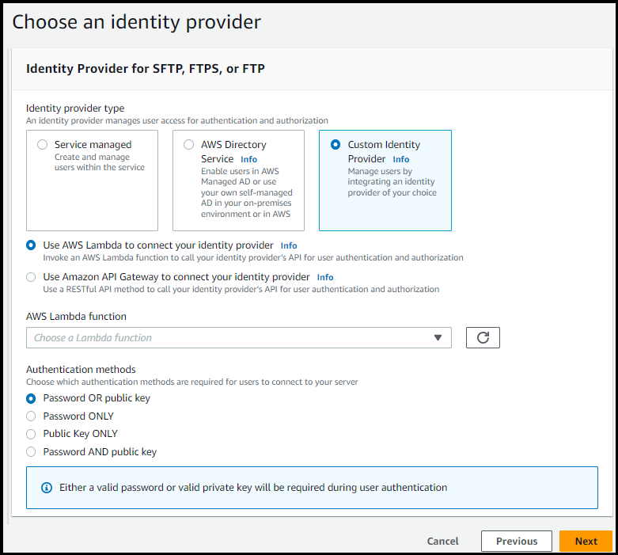

# Using AWS Lambda to integrate your identity

provider

This topic describes how to create an AWS Lambda function that connects to your custom
identity provider. You can use any custom identity provider, such as Okta, Secrets
Manager, OneLogin, or a custom data store that includes authorization and authentication
logic.

For most use cases, the recommended way to configure a custom identity provider is to
use the [Custom identity provider solution](custom-idp-toolkit.md "custom-idp-toolkit.md").

###### Note

Before you create a Transfer Family server that uses Lambda as the identity provider, you must
create the function. For an example Lambda function, see [Example Lambda functions](#lambda-auth-examples "#lambda-auth-examples"). Or, you
can deploy a CloudFormation stack that uses one of the [Lambda function templates](#lambda-idp-templates "#lambda-idp-templates"). Also,
make sure your Lambda function uses a resource-based policy that trusts Transfer Family. For an
example policy, see [Lambda resource-based policy](#lambda-resource-policy "#lambda-resource-policy").

1. Open the [AWS Transfer Family
   console](https://console.aws.amazon.com/transfer/ "https://console.aws.amazon.com/transfer/").
2. Choose **Create server** to open the **Create
   server** page. For **Choose an identity
   provider**, choose **Custom Identity Provider**, as
   shown in the following screenshot.



###### Note

The choice of authentication methods is only available if you enable SFTP
as one of the protocols for your Transfer Family server. 3. Make sure the default value, **Use AWS Lambda to connect your identity
provider**, is selected. 4. For **AWS Lambda function**, choose the name of your Lambda
function. 5. Fill in the remaining boxes, and then choose **Create
server**. For details on the remaining steps for creating a server,
see [Configuring an SFTP, FTPS, or FTP server
endpoint](tf-server-endpoint.md "tf-server-endpoint.md").

## Lambda resource-based policy

You must have a policy that references the Transfer Family server and Lambda ARNs. For
example, you could use the following policy with your Lambda function that connects
to your identity provider. The policy is escaped JSON as a string.

```
`"Policy":
"{\"Version\":\"2012-10-17\",
\"Id\":\"default\",
\"Statement\":[
 {\"Sid\":\"AllowTransferInvocation\",
 \"Effect\":\"Allow\",
 \"Principal\":{\"Service\":\"transfer.amazonaws.com\"},
 \"Action\":\"lambda:InvokeFunction\",
 \"Resource\":\"arn:aws:lambda:`region`:`account-id`:function:`my-lambda-auth-function`\",
 \"Condition\":{\"ArnLike\":{\"AWS:SourceArn\":\"arn:aws:transfer:`region`:`account-id`:server/`server-id`\"}}}
]}"`

```

###### Note

In the example policy above, replace each `user input
 placeholder` with your own information.

## Event message structure

The event message structure from SFTP server sent to the authorizer Lambda function
for a custom IDP is as follows.

```
{
    "username": "value",
    "password": "value",
    "protocol": "SFTP",
    "serverId": "s-abcd123456",
    "sourceIp": "192.168.0.100"
}
```

Where `username` and `password` are the values for the
sign-in credentials that are sent to the server.

For example, you enter the following command to connect:

```
sftp bobusa@server_hostname
```

You are then prompted to enter your password:

```
Enter password:
    mysecretpassword
```

You can check this from your Lambda function by printing the passed event from
within the Lambda function. It should look similar to the following text
block.

```
{
    "username": "bobusa",
    "password": "mysecretpassword",
    "protocol": "SFTP",
    "serverId": "s-abcd123456",
    "sourceIp": "192.168.0.100"
}
```

The event structure is similar for FTP and FTPS: the only difference is those
values are used for the `protocol` parameter, rather than SFTP.

## Lambda functions for

authentication

To implement different authentication strategies, edit the Lambda function. To help
you meet your application's needs, you can deploy a CloudFormation stack. For more
information about Lambda, see the [AWS Lambda Developer Guide](../../../lambda/latest/dg/welcome.md "../../../lambda/latest/dg/welcome.md") or [Building Lambda
functions with Node.js](../../../lambda/latest/dg/lambda-nodejs.md "../../../lambda/latest/dg/lambda-nodejs.md").

###### Topics

- [Valid Lambda values](#lambda-valid-values "#lambda-valid-values")
- [Example Lambda functions](#lambda-auth-examples "#lambda-auth-examples")
- [Testing your
  configuration](#authentication-test-configuration "#authentication-test-configuration")
- [Lambda function templates](#lambda-idp-templates "#lambda-idp-templates")

### Valid Lambda values

The following table describes details for the values that Transfer Family accepts for
Lambda functions that are used for custom identity providers.

| Value                  | Description                                                                                                                                                                                                                                                                                                                                                                                                                                                                                                                                                                                                                                                                                                        | Required                                                    |
| ---------------------- | ------------------------------------------------------------------------------------------------------------------------------------------------------------------------------------------------------------------------------------------------------------------------------------------------------------------------------------------------------------------------------------------------------------------------------------------------------------------------------------------------------------------------------------------------------------------------------------------------------------------------------------------------------------------------------------------------------------------ | ----------------------------------------------------------- |
| `Role`                 | Specifies the Amazon Resource Name (ARN) of the IAM role<br>that controls your users' access to your Amazon S3 bucket or<br>Amazon EFS file system. The policies attached to this role<br>determine the level of access that you want to provide your<br>users when transferring files into and out of your Amazon S3 or<br>Amazon EFS file system. The IAM role should also contain a<br>trust relationship that allows the server to access your<br>resources when servicing your users' transfer<br>requests.<br>For details on establishing a trust relationship, see<br>[To establish a trust relationship](requirements-roles.md#establish-trust-transfer "requirements-roles.md#establish-trust-transfer"). | Required                                                    |
| `PosixProfile`         | The full POSIX identity, including user ID<br>(`Uid`), group ID (`Gid`), and any<br>secondary group IDs (`SecondaryGids`), that<br>controls your users' access to your Amazon EFS file systems. The<br>POSIX permissions that are set on files and directories in<br>your file system determine the level of access your users<br>get when transferring files into and out of your Amazon EFS file<br>systems.                                                                                                                                                                                                                                                                                                     | Required for Amazon EFS backing storage                     |
| `PublicKeys`           | A list of SSH public key values that are valid for this<br>user. An empty list implies that this is not a valid login.<br>Must not be returned during password authentication.                                                                                                                                                                                                                                                                                                                                                                                                                                                                                                                                     | Optional                                                    |
| `Policy`               | A session policy for your user so that you can use the<br>same IAM role across multiple users. This policy scopes<br>down user access to portions of their Amazon S3 bucket. For more<br>information about using session policies with custom<br>identity providers, see the session policy examples in this<br>topic.                                                                                                                                                                                                                                                                                                                                                                                             | Optional                                                    |
| `HomeDirectoryType`    | The type of landing directory (folder) that you want your<br>users' home directory to be when they log in to the<br>server.<br>• If you set it to `PATH`, the user sees<br>the absolute Amazon S3 bucket or Amazon EFS paths as is in<br>their file transfer protocol clients.<br>• If you set it to `LOGICAL`, you must<br>provide mappings in the<br>`HomeDirectoryDetails` parameter to<br>make Amazon S3 or Amazon EFS paths visible to your<br>users.                                                                                                                                                                                                                                                         | Optional                                                    |
| `HomeDirectoryDetails` | Logical directory mappings that specify which Amazon S3 or<br>Amazon EFS paths and keys should be visible to your user and how<br>you want to make them visible. You must specify the<br>`Entry` and `Target` pair, where<br>`Entry` shows how the path is made visible<br>and `Target` is the actual Amazon S3 or Amazon EFS<br>path.                                                                                                                                                                                                                                                                                                                                                                             | Required if `HomeDirectoryType` has a value of<br>`LOGICAL` |
| `HomeDirectory`        | The landing directory for a user when they log in to the<br>server using the client. The format depends on your storage<br>backend:<br>• **For Amazon S3:**<br>`/bucket-name/user-home-directory`<br>Example:<br>`/amzn-s3-demo-bucket/users/john`<br>• **For Amazon EFS:**<br>`/fs-12345/user-home-directory`<br>Example:<br>`/fs-faa1a123/users/john`<br>ImportantThe bucket name or Amazon EFS file system ID must be<br>included in the path. Omitting this information will<br>result in "File not found" errors during file<br>transfers.                                                                                                                                                                    | Optional                                                    |

###### Note

`HomeDirectoryDetails` is a string representation of a JSON
map. This is in contrast to `PosixProfile`, which is an actual
JSON map object, and `PublicKeys` which is a JSON array of
strings. See the code examples for the language-specific details.

###### HomeDirectory Format Requirements

When using the `HomeDirectory` parameter, ensure you include
the complete path format:

- **For Amazon S3 storage:** Always include
  the bucket name in the format `/bucket-name/path`
- **For Amazon EFS storage:** Always include
  the file system ID in the format `/fs-12345/path`
  A common cause of "File not found" errors is omitting the bucket name or
  EFS file system ID from the `HomeDirectory` path. Setting
  `HomeDirectory` to just `/` without the storage
  identifier will cause authentication to succeed but file operations to
  fail.

### Example Lambda functions

This section presents some example Lambda functions, in both NodeJS and
Python.

###### Note

In these examples, the user, role, POSIX profile, password, and home
directory details are all examples, and must be replaced with your actual
values.

Logical home directory, NodeJS
The following NodeJS example function provides the details for a
user that has a [logical home directory](logical-dir-mappings.md "logical-dir-mappings.md").

```
// GetUserConfig Lambda

exports.handler = (event, context, callback) => {
  console.log("Username:", event.username, "ServerId: ", event.serverId);

  var response;
  // Check if the username presented for authentication is correct. This doesn't check the value of the server ID, only that it is provided.
  if (event.serverId !== "" && event.username == '`example-user`') {
    var homeDirectoryDetails = [
      {
        Entry: "/",
        Target: "/`fs-faa1a123`"
      }
    ];
    response = {
      Role: 'arn:aws:iam::`123456789012`:role/`transfer-access-role`', // The user is authenticated if and only if the Role field is not blank
      PosixProfile: {"Gid": `65534`, "Uid": `65534`}, // Required for EFS access, but not needed for S3
      HomeDirectoryDetails: JSON.stringify(homeDirectoryDetails),
      HomeDirectoryType: "LOGICAL",
    };

    // Check if password is provided
    if (!event.password) {
      // If no password provided, return the user's SSH public key
      response['PublicKeys'] = [ "ssh-rsa `abcdef0123456789abcdef0123456789abcdef0123456789abcdef0123456789`" ];
    // Check if password is correct
    } else if (event.password !== 'Password1234') {
      // Return HTTP status 200 but with no role in the response to indicate authentication failure
      response = {};
    }
  } else {
    // Return HTTP status 200 but with no role in the response to indicate authentication failure
    response = {};
  }
  callback(null, response);
};
```

Path-based home directory, NodeJS
The following NodeJS example function provides the details for a
user that has a path-based home directory.

```
// GetUserConfig Lambda

exports.handler = (event, context, callback) => {
  console.log("Username:", event.username, "ServerId: ", event.serverId);

  var response;
  // Check if the username presented for authentication is correct. This doesn't check the value of the server ID, only that it is provided.
  // There is also event.protocol (one of "FTP", "FTPS", "SFTP") and event.sourceIp (e.g., "127.0.0.1") to further restrict logins.
  if (event.serverId !== "" && event.username == '`example-user`') {
    response = {
      Role: 'arn:aws:iam::`123456789012`:role/`transfer-access-role`', // The user is authenticated if and only if the Role field is not blank
      Policy: '', // Optional, JSON stringified blob to further restrict this user's permissions
      // HomeDirectory format depends on your storage backend:
      // For S3: '/bucket-name/user-home-directory' (e.g., '/my-transfer-bucket/users/john')
      // For EFS: '/fs-12345/user-home-directory' (e.g., '/fs-faa1a123/users/john')
      HomeDirectory: '/`my-transfer-bucket/users/example-user`' // S3 example - replace with your bucket name
      // HomeDirectory: '/`fs-faa1a123/users/example-user`' // EFS example - uncomment for EFS
    };

    // Check if password is provided
    if (!event.password) {
      // If no password provided, return the user's SSH public key
     response['PublicKeys'] = [ "ssh-rsa `abcdef0123456789abcdef0123456789abcdef0123456789abcdef0123456789`" ];
    // Check if password is correct
    } else if (event.password !== '`Password1234`') {
      // Return HTTP status 200 but with no role in the response to indicate authentication failure
      response = {};
    }
  } else {
    // Return HTTP status 200 but with no role in the response to indicate authentication failure
    response = {};
  }
  callback(null, response);
};
```

Logical home directory, Python
The following Python example function provides the details for a
user that has a [logical home directory](logical-dir-mappings.md "logical-dir-mappings.md").

```
# GetUserConfig Python Lambda with LOGICAL HomeDirectoryDetails
import json

def lambda_handler(event, context):
  print("Username: {}, ServerId: {}".format(event['username'], event['serverId']))

  response = {}

  # Check if the username presented for authentication is correct. This doesn't check the value of the server ID, only that it is provided.
  if event['serverId'] != '' and event['username'] == '`example-user`':
    homeDirectoryDetails = [
      {
        'Entry': '/',
        'Target': '/`fs-faa1a123`'
      }
    ]
    response = {
      'Role': 'arn:aws:iam::`123456789012`:role/`transfer-access-role`', # The user will be authenticated if and only if the Role field is not blank
      'PosixProfile': {"Gid": `65534`, "Uid": `65534`}, # Required for EFS access, but not needed for S3
      'HomeDirectoryDetails': json.dumps(homeDirectoryDetails),
      'HomeDirectoryType': "LOGICAL"
    }

    # Check if password is provided
    if event.get('password', '') == '':
      # If no password provided, return the user's SSH public key
     response['PublicKeys'] = [ "ssh-rsa `abcdef0123456789abcdef0123456789abcdef0123456789abcdef0123456789`" ]
    # Check if password is correct
    elif event['password'] != '`Password1234`':
      # Return HTTP status 200 but with no role in the response to indicate authentication failure
      response = {}
  else:
    # Return HTTP status 200 but with no role in the response to indicate authentication failure
    response = {}

  return response
```

Path-based home directory, Python
The following Python example function provides the details for a
user that has a path-based home directory.

```
# GetUserConfig Python Lambda with PATH HomeDirectory

def lambda_handler(event, context):
  print("Username: {}, ServerId: {}".format(event['username'], event['serverId']))

  response = {}

  # Check if the username presented for authentication is correct. This doesn't check the value of the server ID, only that it is provided.
  # There is also event.protocol (one of "FTP", "FTPS", "SFTP") and event.sourceIp (e.g., "127.0.0.1") to further restrict logins.
  if event['serverId'] != '' and event['username'] == '`example-user`':
    response = {
      'Role': 'arn:aws:iam::`123456789012`:role/`transfer-access-role`', # The user will be authenticated if and only if the Role field is not blank
      'Policy': '', #  Optional, JSON stringified blob to further restrict this user's permissions
      # HomeDirectory format depends on your storage backend:
      # For S3: '/bucket-name/user-home-directory' (e.g., '/my-transfer-bucket/users/john')
      # For EFS: '/fs-12345/user-home-directory' (e.g., '/fs-faa1a123/users/john')
      'HomeDirectory': '/`my-transfer-bucket/users/example-user`', # S3 example - replace with your bucket name
      # 'HomeDirectory': '/`fs-faa1a123/users/example-user`', # EFS example - uncomment for EFS
      'HomeDirectoryType': "PATH" # Not strictly required, defaults to PATH
    }

    # Check if password is provided
    if event.get('password', '') == '':
      # If no password provided, return the user's SSH public key
     response['PublicKeys'] = [ "ssh-rsa `abcdef0123456789abcdef0123456789abcdef0123456789abcdef0123456789`" ]
    # Check if password is correct
    elif event['password'] != '`Password1234`':
      # Return HTTP status 200 but with no role in the response to indicate authentication failure
      response = {}
  else:
    # Return HTTP status 200 but with no role in the response to indicate authentication failure
    response = {}

  return response
```

### Testing your

configuration

After you create your custom identity provider, you should test your
configuration.

Console

###### To test your configuration by using the AWS Transfer Family

console

1. Open the [AWS Transfer Family
   console](https://console.aws.amazon.com/transfer/ "https://console.aws.amazon.com/transfer/").
2. On the **Servers** page, choose your new
   server, choose **Actions**, and then choose
   **Test**.
3. Enter the text for **Username** and
   **Password** that you set when you
   deployed the CloudFormation stack. If you kept the default options,
   the username is `myuser` and the password is
   `MySuperSecretPassword`.
4. Choose the **Server protocol** and enter
   the IP address for **Source IP**, if you
   set them when you deployed the CloudFormation stack.

CLI

###### To test your configuration by using the AWS CLI

1. Run the [test-identity-provider](../../../cli/latest/reference/transfer/test-identity-provider.md "../../../cli/latest/reference/transfer/test-identity-provider.md") command. Replace each
   `user input
placeholder` with your own
   information, as described in the subsequent steps.

```
`aws transfer test-identity-provider --server-id `s-1234abcd5678efgh` --user-name `myuser` --user-password `MySuperSecretPassword` --server-protocol `FTP` --source-ip `127.0.0.1``
```

2. Enter the server ID.
3. Enter the username and password that you set when you
   deployed the CloudFormation stack. If you kept the default options,
   the username is `myuser` and the password is
   `MySuperSecretPassword`.
4. Enter the server protocol and source IP address, if you
   set them when you deployed the CloudFormation stack.

If user authentication succeeds, the test returns a `StatusCode:
 200` HTTP response, an empty string `Message: ""` (which
would contain a reason for failure otherwise), and a `Response`
field.

###### Note

In the response example below, the `Response` field is a JSON
object that has been "stringified" (converted into a flat JSON string that
can be used inside a program), and contains the details of the user's roles
and permissions.

```
{
    "Response":"{\"Policy\":\"{\\\"Version\\\":\\\"2012-10-17\\\",\\\"Statement\\\":[{\\\"Sid\\\":\\\"ReadAndListAllBuckets\\\",\\\"Effect\\\":\\\"Allow\\\",\\\"Action\\\":[\\\"s3:ListAllMybuckets\\\",\\\"s3:GetBucketLocation\\\",\\\"s3:ListBucket\\\",\\\"s3:GetObjectVersion\\\",\\\"s3:GetObjectVersion\\\"],\\\"Resource\\\":\\\"*\\\"}]}\",\"Role\":\"arn:aws:iam::000000000000:role/MyUserS3AccessRole\",\"HomeDirectory\":\"/\"}",
    "StatusCode": 200,
    "Message": ""
}
```

### Lambda function templates

You can deploy an CloudFormation stack that uses a Lambda function for authentication.
We provide several templates that authenticate and authorize your users using
sign-in credentials. You can modify these templates or AWS Lambda code to further
customize user access.

###### Note

You can create a FIPS-enabled AWS Transfer Family server through CloudFormation by specifying
a FIPS-enabled security policy in your template. Available security policies
are described in [Security policies for AWS Transfer Family servers](security-policies.md "security-policies.md")

###### To create an CloudFormation stack to use for authentication

1.  Open the CloudFormation console at
    [https://console.aws.amazon.com/cloudformation](https://console.aws.amazon.com/cloudformation/ "https://console.aws.amazon.com/cloudformation/").
2.  Follow the instructions for deploying an CloudFormation stack from an existing
    template in [Selecting a stack template](../../../AWSCloudFormation/latest/UserGuide/cfn-using-console-create-stack-template.md "../../../AWSCloudFormation/latest/UserGuide/cfn-using-console-create-stack-template.md") in the
    _AWS CloudFormation User Guide_.
3.  Use one of the following templates to create a Lambda function to use
    for authentication in Transfer Family.

        * [Classic (Amazon Cognito) stack template](https://s3.amazonaws.com/aws-transfer-resources/custom-idp-templates/aws-transfer-custom-idp-basic-lambda-cognito-s3.template.yml "https://s3.amazonaws.com/aws-transfer-resources/custom-idp-templates/aws-transfer-custom-idp-basic-lambda-cognito-s3.template.yml")


        A basic template for creating a AWS Lambda for use as a custom
         identity provider in AWS Transfer Family. It authenticates against Amazon Cognito
         for password-based authentication and public keys are returned
         from an Amazon S3 bucket if public key based authentication is used.
         After deployment, you can modify the Lambda function code to do
         something different.
        * [AWS Secrets Manager stack template](https://s3.amazonaws.com/aws-transfer-resources/custom-idp-templates/aws-transfer-custom-idp-secrets-manager-lambda.template.yml "https://s3.amazonaws.com/aws-transfer-resources/custom-idp-templates/aws-transfer-custom-idp-secrets-manager-lambda.template.yml")


        A basic template that uses AWS Lambda with an AWS Transfer Family server
         to integrate Secrets Manager as an identity provider. It
         authenticates against an entry in AWS Secrets Manager of the format
         `aws/transfer/`server-id`/`username``.
         Additionally, the secret must hold the key-value pairs for all
         user properties returned to Transfer Family. After deployment, you can
         modify the Lambda function code to do something different.
        * [Okta stack template](https://s3.amazonaws.com/aws-transfer-resources/custom-idp-templates/aws-transfer-custom-idp-okta-lambda.template.yml "https://s3.amazonaws.com/aws-transfer-resources/custom-idp-templates/aws-transfer-custom-idp-okta-lambda.template.yml"): A basic template that uses
         AWS Lambda with an AWS Transfer Family server to integrate Okta as a custom
         identity provider.
        * [Okta-mfa stack template](https://s3.amazonaws.com/aws-transfer-resources/custom-idp-templates/aws-transfer-custom-idp-okta-mfa-lambda.template.yml "https://s3.amazonaws.com/aws-transfer-resources/custom-idp-templates/aws-transfer-custom-idp-okta-mfa-lambda.template.yml"): A basic template that uses
         AWS Lambda with an AWS Transfer Family server to integrate Okta, with Multi
         Factor Authentication, as a custom identity provider.
        * [Azure Active Directory template](https://s3.amazonaws.com/aws-transfer-resources/custom-idp-templates/aws-transfer-custom-idp-basic-lambda-azure-ad.template.yml "https://s3.amazonaws.com/aws-transfer-resources/custom-idp-templates/aws-transfer-custom-idp-basic-lambda-azure-ad.template.yml"): details for this
         stack are described in the blog post  [Authenticating to AWS Transfer Family with Azure Active Directory and
         AWS Lambda](https://aws.amazon.com/blogs/storage/authenticating-to-aws-transfer-family-with-azure-active-directory-and-aws-lambda/ "https://aws.amazon.com/blogs/storage/authenticating-to-aws-transfer-family-with-azure-active-directory-and-aws-lambda/").

    After the stack has been deployed, you can view details about it on
    the **Outputs** tab in the CloudFormation console.

Deploying one of these stacks is the easiest way to integrate a custom
identity provider into the Transfer Family workflow.
