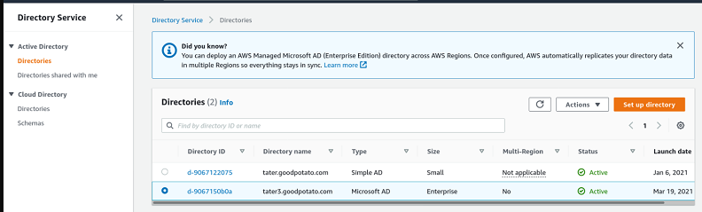
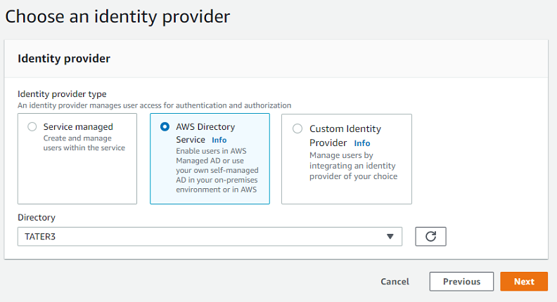
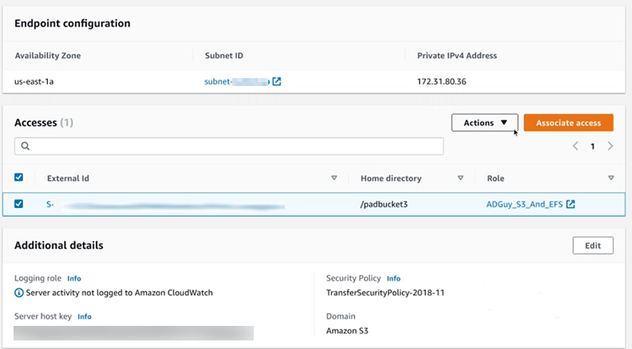
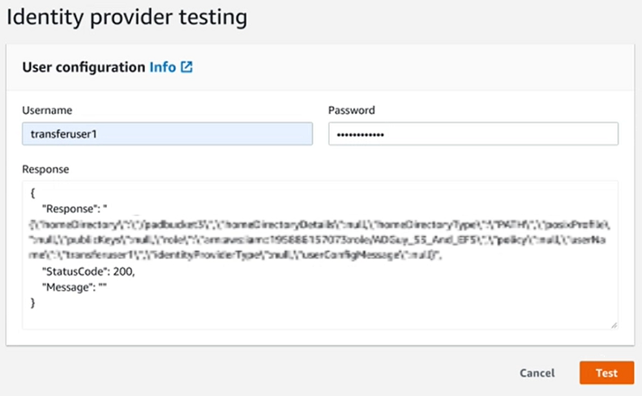

# Using AWS Directory Service for Microsoft

Active Directory

You can use AWS Transfer Family to authenticate your file transfer end users using AWS Directory Service for Microsoft Active Directory.
It enables seamless migration of file transfer workflows that rely on Active Directory
authentication without changing end users’ credentials or needing a custom authorizer.

With AWS Managed Microsoft AD, you can securely provide Directory Service users and groups access over SFTP, FTPS,
and FTP for data stored in Amazon Simple Storage Service (Amazon S3) or Amazon Elastic File System (Amazon EFS). If you use Active Directory
to store your users’ credentials, you now have an easier way to enable file transfers for
these users.

You can provide access to Active Directory groups in AWS Managed Microsoft AD in your on-premises
environment or in the AWS Cloud using Active Directory connectors. You can give users that
are already configured in your Microsoft Windows environment, either in the AWS Cloud or
in their on-premises network, access to an AWS Transfer Family server that uses AWS Managed Microsoft AD for
identity. The AWS storage blog contains a post that details a solution for using Active
Directory with Transfer Family: [Simplify Active Directory authentication with a custom identity provider for
AWS Transfer Family](https://aws.amazon.com/blogs/storage/simplify-active-directory-authentication-with-a-custom-identity-provider-for-aws-transfer-family/ "https://aws.amazon.com/blogs/storage/simplify-active-directory-authentication-with-a-custom-identity-provider-for-aws-transfer-family/").

###### Note

- AWS Transfer Family does not support Simple AD.
- Transfer Family does not support cross-region Active Directory configurations: we only
  support Active Directory integrations that are in the same region as that of the
  Transfer Family server.
- Transfer Family does not support using either AWS Managed Microsoft AD or AD Connector to enable
  multi-factor authentication (MFA) for your existing RADIUS-based MFA
  infrastructure.
- AWS Transfer Family does not support replicated regions of Managed Active
  Directory.
  To use AWS Managed Microsoft AD, you must perform the following steps:

1. Create one or more AWS Managed Microsoft AD directories using the Directory Service console.
2. Use the Transfer Family console to create a server that uses AWS Managed Microsoft AD as its identity
   provider.
3. Set up AWS Directory using an Active Directory Connector.
4. Add access from one or more of your Directory Service groups.
5. Although not required, we recommend that you test and verify user access.

###### Topics

- [Before you start using AWS Directory Service for Microsoft Active Directory](#managed-ad-prereq "#managed-ad-prereq")
- [Working with Active Directory realms](#managed-ad-realms "#managed-ad-realms")
- [Choosing AWS Managed Microsoft AD as your identity
  provider](#managed-ad-identity-provider "#managed-ad-identity-provider")
- [Connecting to on-prem Microsoft Active Directory](#on-prem-ad "#on-prem-ad")
- [Granting access to groups](#directory-services-grant-access "#directory-services-grant-access")
- [Testing users](#directory-services-test-user "#directory-services-test-user")
- [Deleting server access for a group](#directory-services-misc "#directory-services-misc")
- [Connecting to the server using SSH
  (Secure Shell)](#directory-services-ssh-procedure "#directory-services-ssh-procedure")
- [Connecting AWS Transfer Family to a self-managed
  Active Directory using forests and trusts](#directory-services-ad-trust "#directory-services-ad-trust")

## Before you start using AWS Directory Service for Microsoft Active Directory

###### Note

AWS Transfer Family has a default limit of 100 Active Directory groups per server. If your
use case requires more than 100 groups, consider using a custom identity provider
solution as described in [Simplify Active Directory authentication with a custom identity provider for
AWS Transfer Family](https://aws.amazon.com/blogs/storage/simplify-active-directory-authentication-with-a-custom-identity-provider-for-aws-transfer-family/ "https://aws.amazon.com/blogs/storage/simplify-active-directory-authentication-with-a-custom-identity-provider-for-aws-transfer-family/").

### Provide a unique identifier for your AD

groups

Before you can use AWS Managed Microsoft AD, you must provide a unique identifier for each
group in your Microsoft AD directory. You can use the security identifier (SID) for
each group to do this. The users of the group that you associate have access to your
Amazon S3 or Amazon EFS resources over the enabled protocols using AWS Transfer Family.

Use the following Windows PowerShell command to retrieve the SID for a group,
replacing `YourGroupName` with the name of the group.

```
Get-ADGroup -Filter {samAccountName -like "`YourGroupName`*"} -Properties * | Select SamAccountName,ObjectSid
```

###### Note

If you are using AWS Directory Service as your identity provider, and if
`userPrincipalName` and `SamAccountName` have
different values, AWS Transfer Family accepts the value in `SamAccountName`.
Transfer Family does not accept the value specified in
`userPrincipalName`.

### Add Directory Service permissions to your

role

You also need Directory Service API permissions to use AWS Directory Service as your identity provider.
The following permissions are required or suggested:

- `ds:DescribeDirectories` is required for Transfer Family to look up the
  directory
- `ds:AuthorizeApplication` is required to add authorization for
  Transfer Family
- `ds:UnauthorizeApplication` is suggested to remove any
  resources that are provisionally created, in case something goes wrong
  during the server creation process

Add these permissions to the role you are using for creating your Transfer Family servers.
For more details on these permissions, see [Directory Service API permissions: Actions, resources, and conditions
reference](../../../directoryservice/latest/admin-guide/UsingWithDS_IAM_ResourcePermissions.md "../../../directoryservice/latest/admin-guide/UsingWithDS_IAM_ResourcePermissions.md").

## Working with Active Directory realms

When you are considering how to have your Active Directory users access AWS Transfer Family
servers, keep in mind the user's realm, and their group's realm. Ideally, the user's
realm and their group's realm should match. That is, both the user and the group are in
the default realm, or both are in the trusted realm. If this is not the case, the user
cannot be authenticated by Transfer Family.

You can test the user to ensure the configuration is correct. For details, see [Testing users](#directory-services-test-user "#directory-services-test-user"). If there is a problem with the user/group realm, you receive the error,
**`No associated access found for user's groups`**.

## Choosing AWS Managed Microsoft AD as your identity

provider

This section describes how to use AWS Directory Service for Microsoft Active Directory with a server.

###### To use AWS Managed Microsoft AD with Transfer Family

1. Sign in to the AWS Management Console and open the Directory Service console at [https://console.aws.amazon.com/directoryservicev2/](https://console.aws.amazon.com/directoryservicev2/ "https://console.aws.amazon.com/directoryservicev2/").

Use the Directory Service console to configure one or more managed directories. For more
information, see [AWS Managed Microsoft AD](../../../directoryservice/latest/admin-guide/directory_microsoft_ad.md "../../../directoryservice/latest/admin-guide/directory_microsoft_ad.md") in the _Directory Service Admin Guide_.

 2. Open the AWS Transfer Family console at [https://console.aws.amazon.com/transfer/](https://console.aws.amazon.com/transfer/ "https://console.aws.amazon.com/transfer/"), and choose **Create
server**. 3. On the **Choose protocols** page, choose one or more
protocols from the list.

###### Note

If you select **FTPS**, you must provide the AWS Certificate Manager
certificate. 4. For **Choose an identity provider**, choose **AWS
Directory Service**.

 5. The **Directory** list contains all the managed directories
that you have configured. Choose a directory from the list, and choose
**Next**.

###### Note

    * Cross-Account and Shared directories are not supported for AWS Managed Microsoft AD.
    * To set up a server with Directory Service as your identity provider, you need to add some Directory Service permissions.
     For details, see [Before you start using AWS Directory Service for Microsoft Active Directory](#managed-ad-prereq "#managed-ad-prereq").

6.  To finish creating the server, use one of the following procedures:

        * [Create an SFTP-enabled server](create-server-sftp.md "create-server-sftp.md")
        * [Create an FTPS-enabled server](create-server-ftps.md "create-server-ftps.md")
        * [Create an FTP-enabled server](create-server-ftp.md "create-server-ftp.md")

    In those procedures, continue with the step that follows choosing an identity
    provider.

###### Important

You can't delete a Microsoft AD directory in Directory Service if you used it in a Transfer Family
server. You must delete the server first, and then you can delete the directory.

## Connecting to on-prem Microsoft Active Directory

This section describes how to set up an AWS Directory using an AD Connector

###### To set up your AWS Directory using AD Connector

1. Open the [Directory Service](https://console.aws.amazon.com/directoryservicev2/ "https://console.aws.amazon.com/directoryservicev2/") console and
   select **Directories**.
2. Select **Set up directory**.
3. For directory type, choose **AD Connector**.
4. Select a directory size, select **Next**, then select your
   VPC and Subnets.
5. Select **Next**, then fill in the fields as follows:
   - **Directory DNS name**: enter the domain name you are
     using for your Microsoft Active Directory.
   - **DNS IP addresses**: enter you Microsoft Active
     Directory IP addresses.
   - **Server account username** and
     **password**: enter the details for the service
     account to use.

6. Complete the screens to create the directory service.

The next step is to create a Transfer Family server with the SFTP protocol, and the identity
provider type of **AWS Directory Service**. From
**Directory** drop down list, select the directory you added in the
previous procedure.

## Granting access to groups

After you create the server, you must choose which groups in the directory should
have access to upload and download files over the enabled protocols using AWS Transfer Family. You
do this by creating an _access_.

###### Note

AWS Transfer Family has a default limit of 100 Active Directory groups per server. If your
use case requires more than 100 groups, consider using a custom identity provider
solution as described in [Simplify Active Directory authentication with a custom identity provider for
AWS Transfer Family](https://aws.amazon.com/blogs/storage/simplify-active-directory-authentication-with-a-custom-identity-provider-for-aws-transfer-family/ "https://aws.amazon.com/blogs/storage/simplify-active-directory-authentication-with-a-custom-identity-provider-for-aws-transfer-family/").

###### Note

Users must belong _directly_ to the group to
which you are granting access. For example, assume that Bob is a user and belongs
to groupA, and groupA itself is included in groupB.

- If you grant access to groupA, Bob is granted access.
- If you grant access to groupB (and not to groupA), Bob does not have
  access.

###### To grant access to a group

1. Open the AWS Transfer Family console at [https://console.aws.amazon.com/transfer/](https://console.aws.amazon.com/transfer/ "https://console.aws.amazon.com/transfer/").
2. Navigate to your server details page.
3. In the **Accesses** section, choose **Add
   access**.
4. Enter the SID for the AWS Managed Microsoft AD directory that you want to have access to
   this server.

###### Note

For information about how to find the SID for your group, see [Before you start using AWS Directory Service for Microsoft Active Directory](#managed-ad-prereq "#managed-ad-prereq"). 5. For **Access**, choose an AWS Identity and Access Management (IAM) role for the
group. 6. In the **Policy** section, choose a policy. The default
setting is **None**. 7. For **Home directory**, choose an Amazon S3 bucket that
corresponds to the group's home directory.

###### Note

You can limit the portions of the bucket that users see by creating a
session policy. For example, to limit users to their own folder under the
`/filetest` directory, enter the following text in
the box.

```
/filetest/${transfer:UserName}
```

To learn more about creating a session policy, see [Creating a session policy for an Amazon S3
bucket](users-policies-session.md "users-policies-session.md"). 8. Choose **Add** to create the association. 9. Choose your server. 10. Choose **Add access**.

    1. Enter the SID for the group.


    ###### Note

    For information about how to find the SID, see [Before you start using AWS Directory Service for Microsoft Active Directory](#managed-ad-prereq "#managed-ad-prereq").

11. Choose **Add access**.

In the **Accesses** section, the accesses for the server are listed.



## Testing users

You can test whether a user has access to the AWS Managed Microsoft AD directory for your
server.

###### Note

A user must be in exactly one group (an external ID) that is listed in the
**Access** section of the **Endpoint
configuration** page. If the user is in no groups, or is in more than a
single group, that user is not granted access.

###### To test whether a specific user has access

1. On the server details page, choose **Actions**, and then
   choose **Test**.
2. For **Identity provider testing**, enter the sign-in
   credentials for a user that is in one of the groups that has access.
3. Choose **Test**.

You see a successful identity provider test, showing that the selected user has been
granted access to the server.



If the user belongs to more than one group that has access, you receive the following
response.

```
"Response":"",
"StatusCode":200,
"Message":"More than one associated access found for user's groups."
```

## Deleting server access for a group

###### To delete server access for a group

1. On the server details page, choose **Actions**, and then
   choose **Delete Access**.
2. In the dialog box, confirm that you want to remove access for this
   group.

When you return to the server details page, you see that the access for this group is
no longer listed.

## Connecting to the server using SSH

(Secure Shell)

After you configure your server and users, you can connect to the server using SSH and
use the fully qualified username for a user that has access.

```
`sftp `user`@`active-directory-domain`@`vpc-endpoint``
```

For example:
`transferuserexample@mycompany.com@vpce-0123456abcdef-789xyz.vpc-svc-987654zyxabc.us-east-1.vpce.amazonaws.com`.

This format targets the search of the federation, limiting the search of a potentially
large Active Directory.

###### Note

You can specify the simple username. However, in this case, the Active Directory
code has to search all the directories in the federation. This might limit the
search, and authentication might fail even if the user should have access.

After authenticating, the user is located in the home directory that you specified
when you configured the user.

## Connecting AWS Transfer Family to a self-managed

Active Directory using forests and trusts

Directory Service has the following options available to connect to a self-managed Active
Directory:

- One-way forest trust (outgoing from AWS Managed Microsoft AD and incoming for on-premises
  Active Directory) works only for the root domain.
- For child domains, you can use either of the following:
  - Use two-way trust between AWS Managed Microsoft AD and on-premises Active
    Directory
  - Use one-way external trust to each child domain.

When connecting to the server using a trusted domain, the user needs to specify the
trusted domain, for example
`transferuserexample@`mycompany.com``.
