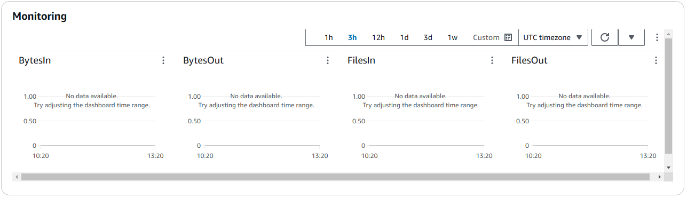
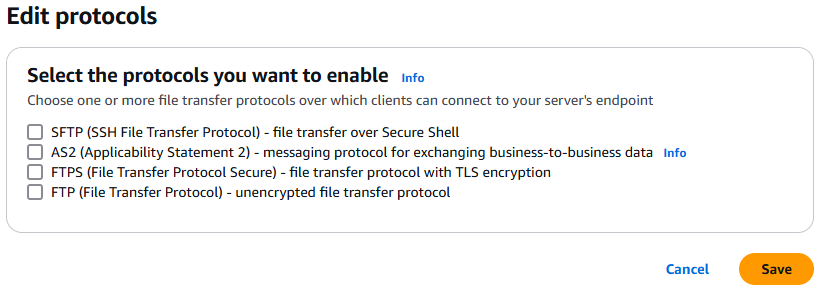
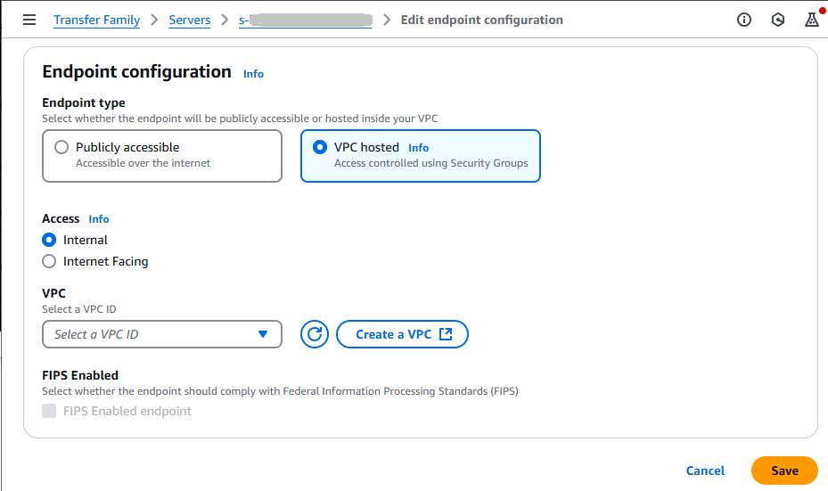
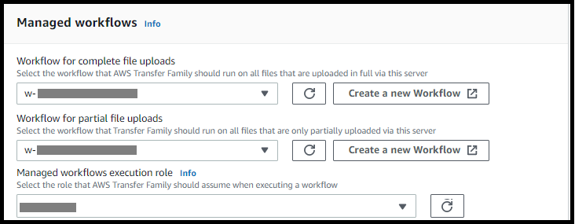

# Edit server details

After you create an AWS Transfer Family server, you can edit the server configuration.

###### Topics

- [Edit the file transfer protocols](#edit-protocols "#edit-protocols")
- [Edit the server endpoint](#edit-endpoint-configuration "#edit-endpoint-configuration")
- [Edit your logging configuration](#edit-CloudWatch-logging "#edit-CloudWatch-logging")
- [Edit the security policy](#edit-cryptographic-algorithm "#edit-cryptographic-algorithm")
- [Change the managed workflow
  for your server](#configuring-servers-change-workflow "#configuring-servers-change-workflow")
- [Change the display banners for
  your server](#configuring-servers-change-banner "#configuring-servers-change-banner")
- [Put your server online or offline](#edit-online-offline "#edit-online-offline")

###### To edit a server's configuration

1. Open the AWS Transfer Family console at [https://console.aws.amazon.com/transfer/](https://console.aws.amazon.com/transfer/ "https://console.aws.amazon.com/transfer/").
2. In the left navigation pane, choose **Servers**.
3. Choose the identifier in the **Server ID** column to see the
   **Server details** page, shown following.

You can change the server's properties on this page by choosing
**Edit**:

    * To change the protocols, see [Edit the file transfer protocols](#edit-protocols "#edit-protocols").
    * For the identity provider, you can now change between any identity
     provider types (service-managed, AWS Directory Service, or custom
     identity provider). For details about changing identity provider types
     and the required information for each transition, see [Edit identity provider
     configuration](configuring-servers-edit-custom-idp.md "configuring-servers-edit-custom-idp.md").
    * To change the endpoint type or custom hostname, see [Edit the server endpoint](#edit-endpoint-configuration "#edit-endpoint-configuration").
    * To add an agreement, you need to first add AS2 as a protocol to your
     server. For details, see [Edit the file transfer protocols](#edit-protocols "#edit-protocols").
    * To manage host keys for your server, see [Manage host keys for your SFTP-enabled
     server](configuring-servers-change-host-key.md "configuring-servers-change-host-key.md").
    * Under **Additional details**, you can edit the
     following information:


    	+ To change the logging role, see [Edit your logging configuration](#edit-CloudWatch-logging "#edit-CloudWatch-logging").
    	+ To change the security policy, see [Edit the security policy](#edit-cryptographic-algorithm "#edit-cryptographic-algorithm").
    	+ To change the server host key, see [Manage host keys for your SFTP-enabled
    	 server](configuring-servers-change-host-key.md "configuring-servers-change-host-key.md").
    	+ To change the managed workflow for your server, see [Change the managed workflow
    	 for your server](#configuring-servers-change-workflow "#configuring-servers-change-workflow").
    	+ To edit the display banners for your server, see [Change the display banners for
    	 your server](#configuring-servers-change-banner "#configuring-servers-change-banner").
    * Under Additional configuration, you can edit the following
     information:


    	+ **SetStat option**: enable this option to
    	 ignore the error that is generated when a client attempts to use
    	 `SETSTAT` on a file you are uploading to an Amazon S3
    	 bucket. For additional details, see the
    	 `SetStatOption` documentation in the [ProtocolDetails](../APIReference/API_ProtocolDetails.md "../APIReference/API_ProtocolDetails.md") topic.
    	+ **TLS session resumption**: provides a
    	 mechanism to resume or share a negotiated secret key between the
    	 control and data connection for an FTPS session. For additional
    	 details, see the `TlsSessionResumptionMode`
    	 documentation in the [ProtocolDetails](../APIReference/API_ProtocolDetails.md "../APIReference/API_ProtocolDetails.md") topic.
    	+ **Passive IP**: indicates passive mode, for
    	 FTP and FTPS protocols. Enter a single IPv4 address, such as the
    	 public IP address of a firewall, router, or load balancer. For
    	 additional details, see the `PassiveIp` documentation
    	 in the [ProtocolDetails](../APIReference/API_ProtocolDetails.md "../APIReference/API_ProtocolDetails.md") topic.


    	###### Note

    	Avoid placing Network Load Balancers (NLBs) or NAT
    	 gateways in front of AWS Transfer Family servers. This configuration
    	 increases costs and can cause performance issues. For more
    	 details, see [Avoid placing NLBs and NATs in front of AWS Transfer Family
    	 servers](infrastructure-security.md#nlb-considerations "infrastructure-security.md#nlb-considerations")
    * To start or stop your server, see [Put your server online or offline](#edit-online-offline "#edit-online-offline").
    * To delete a server, see [Delete a server](configuring-servers.md#delete-server "configuring-servers.md#delete-server").
    * To edit a user's properties, see [Managing access controls](users-policies.md "users-policies.md").


###### Note

The server host key **Description** and **Date imported**
values are new as of September 2022. These values were introduced to support the multiple
host keys feature. This feature required migration of any single host keys that were in use before
the introduction of multiple host keys.

The **Date imported** value
for a migrated server host key is set to the last modified date for the server.
That is, the date that you see for your migrated host key corresponds to the date that you
last modified the server in any way, before the server host key migration.

The only key that was migrated is your oldest or only server host key. Any additional keys
have their actual date from when you imported them. Additionally, the migrated key
has a description that makes it easy to identify it as having been migrated.

The migration occurred between September 2 and September 13. The actual migration date
within this range depends on the Region of your server.





## Edit the file transfer protocols

On the AWS Transfer Family console, you can edit the file transfer protocol. The file
transfer protocol connects the client to your server's endpoint.

###### To edit the protocols

1. On the **Server details** page, choose
   **Edit** next to **Protocols**.
2. On the **Edit protocols** page, select or clear the
   protocol check box or check boxes to add or remove the following file
   transfer protocols:
   - Secure Shell (SSH) File Transfer Protocol (SFTP) – file
     transfer over SSH

   For more information about SFTP, see [Create an SFTP-enabled server](create-server-sftp.md "create-server-sftp.md").
   - File Transfer Protocol Secure (FTPS) – file transfer with
     TLS encryption

   For more information about FTP, see [Create an FTPS-enabled server](create-server-ftps.md "create-server-ftps.md").
   - File Transfer Protocol (FTP) – unencrypted file
     transfer

   For more information about FTPS, see [Create an FTP-enabled server](create-server-ftp.md "create-server-ftp.md").

###### Note

If you have an existing server enabled only for SFTP, and you want to
add FTPS and FTP, you must ensure that you have the right identity
provider and endpoint type settings that are compatible with FTPS and
FTP.



If you select **FTPS**, you must choose a certificate
stored in AWS Certificate Manager (ACM) which will be used to identify your server when
clients connect to it over FTPS.

To request a new public certificate, see [Request a public
certificate](../../../acm/latest/userguide/gs-acm-request-public.md "../../../acm/latest/userguide/gs-acm-request-public.md") in the _AWS Certificate Manager User Guide_.

To import an existing certificate into ACM, see [Importing certificates into ACM](../../../acm/latest/userguide/import-certificate.md "../../../acm/latest/userguide/import-certificate.md") in the
_AWS Certificate Manager User Guide_.

To request a private certificate to use FTPS through private IP addresses,
see [Requesting a
private certificate](../../../acm/latest/userguide/gs-acm-request-private.md "../../../acm/latest/userguide/gs-acm-request-private.md") in the
_AWS Certificate Manager User Guide_.

Certificates with the following cryptographic algorithms and key sizes are
supported:

    * 2048-bit RSA (RSA\_2048)
    * 4096-bit RSA (RSA\_4096)
    * Elliptic Prime Curve 256 bit (EC\_prime256v1)
    * Elliptic Prime Curve 384 bit (EC\_secp384r1)
    * Elliptic Prime Curve 521 bit (EC\_secp521r1)

###### Note

The certificate must be a valid SSL/TLS X.509 version 3 certificate with
FQDN or IP address specified and contain information about the
issuer. 3. Choose **Save**. You are returned to the **Server
details** page.

## Edit the server endpoint

On the AWS Transfer Family console, you can modify the server endpoint type and custom
hostname. Additionally, for VPC endpoints, you can edit the availability zone
information.

###### To edit the server endpoint details

1.  On the **Server details** page, choose
    **Edit** next to **Endpoint
    details**.
2.  Before you can edit the **Endpoint type**, you must first
    stop the server. Then, on the **Edit endpoint
    configuration** page, for **Endpoint type**,
    you can choose either of the following values:
    - **Public** – This option makes your server
      accessible over the internet.
    - **VPC** – This option makes your server
      accessible in your virtual private cloud (VPC). For information
      about VPC, see [Create a server in a virtual private cloud](create-server-in-vpc.md "create-server-in-vpc.md").

3.  For **Custom hostname**, choose one of the
    following:

        * **None** – If you don't want to use a
         custom domain, choose **None**.


        You get a server hostname provided by AWS Transfer Family. The server
         hostname takes the form
         ``serverId`.server.transfer.`regionId`.amazonaws.com`.
        * **Amazon Route 53 DNS alias** – To use a DNS
         alias automatically created for you in Route 53, choose this
         option.
        * **Other DNS** – To use a hostname that you
         already own in an external DNS service choose **Other
         DNS**.

    Choosing **Amazon Route 53 DNS alias** or **Other
    DNS** specifies the name resolution method to associate with
    your server's endpoint.

For example, your custom domain might be
`sftp.inbox.example.com`. A custom hostname uses a DNS name
that you provide and that a DNS service can resolve. You can use Route 53 as
your DNS resolver, or use your own DNS service provider. To learn how
AWS Transfer Family uses Route 53 to route traffic from your custom domain to the server
endpoint, see [Working with custom hostnames](requirements-dns.md "requirements-dns.md").

 4. For VPC endpoints, you can change the information in the
**Availability Zones** pane. 5. Choose **Save**. You are returned to the **Server
details** page.

## Edit your logging configuration

On the AWS Transfer Family console, you can change your logging configuration.

###### Note

If Transfer Family created a CloudWatch logging IAM role for you when you created a server,
the IAM role is called `AWSTransferLoggingAccess`. You can use it
for all your Transfer Family servers.

###### To edit your logging configuration

1. On the **Server details** page, choose
   **Edit** next to **Additional
   details**.
2. Based on your configuration, choose between a logging role, structured
   JSON logging, or both. For more information, see [Updating logging for a server](log-server-manage.md#log-server-update "log-server-manage.md#log-server-update").

## Edit the security policy

This procedure explains how to change a Transfer Family server's security policy by using the
AWS Transfer Family console or AWS CLI.

###### Note

If your endpoint is FIPS-enabled, you can't change the FIPS security
policy to a non-FIPS security policy.

Console

###### To edit the security policy by using the console

1. On the **Server details** page, choose
   **Edit** next to **Additional
   details**.
2. In the **Cryptographic algorithm options**
   section, choose a security policy that contains the
   cryptographic algorithms enabled for use by your server.

For more information about security policies, see [Security policies for AWS Transfer Family servers](security-policies.md "security-policies.md"). 3. Choose **Save**.

You are returned to the **Server details**
page where you can see the updated security policy.

AWS CLI

###### To edit the security policy by using the CLI

1. Run the following command to view the current security policy
   that is attached to your server.

```
aws transfer describe-server --server-id `your-server-id`
```

This `describe-server` command returns all of the
details for your server, including the following line:

```
"SecurityPolicyName": "TransferSecurityPolicy-2018-11"
```

In this case, the security policy for the server is
`TransferSecurityPolicy-2018-11`. 2. Make sure to provide the exact name of the security policy to
the command. For example, run the following command to update
the server to
`TransferSecurityPolicy-2023-05`.

```
aws transfer update-server --server-id `your-server-id` --security-policy-name "TransferSecurityPolicy-2023-05"
```

###### Note

The names of the available security policies are listed in
[Security policies for AWS Transfer Family servers](security-policies.md "security-policies.md").

If successful, the command returns the following code, and updates
your server's security policy.

```
{
    "ServerId": "`your-server-id`"
}

```

## Change the managed workflow

for your server

On the AWS Transfer Family console, you can change the managed workflow associated with the
server.

###### To change the managed workflow

1. On the **Server details** page, choose
   **Edit** next to **Additional
   details**.
2. On the **Edit additional details** page, in
   the **Managed workflows** section, select a workflow to be
   run on all uploads.

###### Note

If you do not already have a workflow, choose **Create a new
workflow** to create one.

    1. Select the workflow ID to use.
    2. Choose an execution role. This is the role that Transfer Family assumes when
     executing the workflow's steps. For more information, see [IAM policies for workflows](workflow-execution-role.md "workflow-execution-role.md"). Choose
     **Save**.

 3. Choose **Save**. You are returned to the **Server
details** page.

## Change the display banners for

your server

On the AWS Transfer Family console, you can change the display banners associated with the
server.

###### To change the display banners

1. On the **Server details** page, choose
   **Edit** next to **Additional
   details**.
2. On the **Edit additional details** page, in
   the **Display banners** section, enter text for the
   available display banners.
3. Choose **Save**. You are returned to the **Server
   details** page.

## Put your server online or offline

On the AWS Transfer Family console, you can bring your server online or take it
offline.

###### To bring your server online

1. Open the AWS Transfer Family console at [https://console.aws.amazon.com/transfer/](https://console.aws.amazon.com/transfer/ "https://console.aws.amazon.com/transfer/").
2. In the navigation pane, choose **Servers**.
3. Select the check box of the server that is offline.
4. For **Actions**, choose
   **Start**.

It can take a couple of minutes for a server to switch from offline to
online.

###### Note

When you stop a server to take it offline, currently you are still accruing
service charges for that server. To eliminate additional server-based charges,
delete that server.

###### To take your server offline

1. Open the AWS Transfer Family console at [https://console.aws.amazon.com/transfer/](https://console.aws.amazon.com/transfer/ "https://console.aws.amazon.com/transfer/").
2. In the navigation pane, choose **Servers**.
3. Select the check box of the server that is online.
4. For **Actions**, choose **Stop**.

While a server is starting up or shutting down, servers aren't available for
file operations. The console doesn't show the starting and stopping
states.

If you find the error condition `START_FAILED` or
`STOP_FAILED`, contact AWS Support to help resolve your issues.
