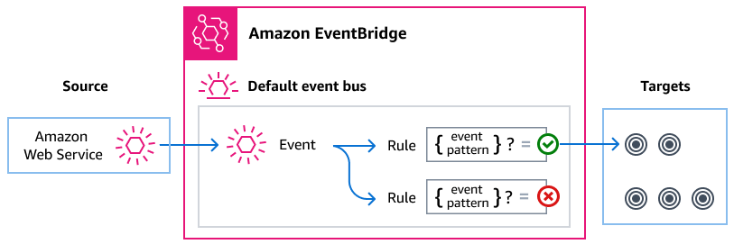

# Managing Transfer Family events using Amazon EventBridge

Amazon EventBridge is a serverless service that uses events to connect application
components together, which can make it easier for you to build scalable event-driven
applications. Event-driven architecture is a style of building loosely coupled software
systems that work together by emitting and responding to events. Events represent a change
in a resource or environment.

As with many AWS services, Transfer Family generates and sends events to the
EventBridge default event bus. Note that the default event bus is automatically
provisioned in every AWS account. An event bus is a router that receives
events and delivers them to zero or more destinations, or _targets_. You
specify rules for the event bus that evaluates events as they arrive. Each rule checks
whether an event matches the rule's _event pattern_. If the event
matches, the event bus sends the event to one or more specified targets.

###### Topics

- [Transfer Family events](#supported-events "#supported-events")
- [Sending Transfer Family events by using
  EventBridge rules](#eventbridge-using-events-rules "#eventbridge-using-events-rules")
- [Amazon EventBridge permissions](#eventbridge-permissions "#eventbridge-permissions")
- [Additional EventBridge
  resources](#eventbridge-additonal-resources "#eventbridge-additonal-resources")
- [Transfer Family events detail reference](events-detail-reference.md "events-detail-reference.md")

## Transfer Family events

Transfer Family automatically sends events to the default EventBridge event bus. You
can create rules on the event bus where each rule includes an event pattern and one or
more targets.

Events that match a rule's event pattern are delivered to the specified targets on
either a _best effort_ or _durable_ basis (note
that some events might be delivered out of order). These delivery levels are described
in [Delivery level for AWS service events](../../../eventbridge/latest/ref/event-delivery-level.md "../../../eventbridge/latest/ref/event-delivery-level.md") in the _Amazon EventBridge Events
Reference_.

- Server-level events for SFTP, FTPS and FTP servers are delivered on a best
  effort basis.
- The SFTP connector events are delivered on a durable basis.
- The AS2 events are delivered on a durable basis.

The following events are generated by Transfer Family. For more information, see [EventBridge events](../../../eventbridge/latest/userguide/eb-events.md "../../../eventbridge/latest/userguide/eb-events.md") in the _Amazon EventBridge User
Guide_.

### SFTP, FTPS, and FTP server events

The following tables list the events for SFTP, FTPS, and FTP servers, organized by
event type.

File upload and download events

| Event detail type                                                                                                                                                           | Description                                                                          |
| --------------------------------------------------------------------------------------------------------------------------------------------------------------------------- | ------------------------------------------------------------------------------------ | ------------------------------------------------------------------------------------------------------------------------------------------------------------------------------------------------------------------------------------------------------------------------------------------------------------------------------------------------------------------------------------------------------------------------------------------------------------------------------------------------------------------------------------------------------------------------------------------------------------------------------------------------------------------------------------------------------------------------------------------------------------------------------------------------------------------------------------------------------------------------------------------------------------------------------------------------------------------------------------------------------------------------------------------------------------------------------------------------------------------------------------------------------------------------------------------------------------------------------------------------------------------------------------------------------------------------------------------------------------------------------------------------------------------------------------------------------------------------------------------------------------------------------------------------------------------------------------------------------------------------------------------------------------------------------------------------------------------------------------------------------------------------------------------------------------------------------------------------------------------------------------------------------------------------------------------------------------------------------------------------------------------------------------------------------------------------------------------------------------------------------------------------------------------------------------------------------------------------------------------------------------------------------------------------------------------------------------------------------------------------------------------------------------------------------------------------------------------------------------------------------------------------------------------------------------------------------------------------------------------------------------------------------------------------------------------------------------------------------------------------------------------------------------------------------------------------------------------------------------------------------------------------------------------------------------------------------------------------------------------------------------------------------------------------------------------------------------------------------------------------------------------------------------------------------------------------------------------------------------------------------------------------------------------------------------------------------------------------------------------------------------------------------------------------------------------------------------------------------------------------------------------------------------------------------------------------------------------------------------------------------------------------------------------------------------------------------------------------------------------------------------------------------------------------------------------------------------------------------------------------------------------------------------------------------------------------------------------------------------------------------------------------------------------------------------------------------------------------------------------------------------------------------------------------------------------------------------------------------------------------------------------------------------------------------------------------------------------------------------------------------------------------------------------------------------------------------------------------------------------------------------------------------------------------------------------------------------------------------------------------------------------------------------------------------------------------------------------------------------------------------------------------------------------------------------------------------------------------------------------------------------------------------------------------------------------------------------------------------------------------------------------------------------------------------------------------------------------------------------------------------------------------------------------------------------------------------------------------------------------------------------------------------------------------------------------------------------------------------------------------------------------------------------------------------------------------------------------------------------------------------------------------------------------------------------------------------------------------------------------------------------------------------------------------------------------------------------------------------------------------------------------------------------------------------------------------------------------------------------------------------------------------------------------------------------------------------------------------------------------------------------------------------------------------------------------------------------------------------------------------------------------------------------------------------------------------------------------------------------------------------------------------------------------------------------------------------------------------------------------------------------------------------------------------------------------------------------------------------------------------------------------------------------------------------------------------------------------------------------------------------------------------------------------------------------------------------------------------------------------------------------------------------------------------------------------------------------------------------------------------------------------------------------------------------------------------------------------------------------------------------------------------------------------------------------------------------------------------------------------------------------------------------------------------------------------------------------------------------------------------------------------------------------------------------------------------------------------------------------------------------------------------------------------------------------------------------------------------------------- |
| [FTP Server File Download Completed](events-detail-reference.md#event-detail-server-events "events-detail-reference.md#event-detail-server-events")                         | A file has been downloaded successfully for the FTP protocol.                        |
| [FTP Server File Download Failed](events-detail-reference.md#event-detail-server-events "events-detail-reference.md#event-detail-server-events")                            | An attempt to download a file has failed for the FTP protocol.                       |
| [FTP Server File Upload Completed](events-detail-reference.md#event-detail-server-events "events-detail-reference.md#event-detail-server-events")                           | A file has been uploaded successfully for the FTP protocol.                          |
| [FTP Server File Upload Failed](events-detail-reference.md#event-detail-server-events "events-detail-reference.md#event-detail-server-events")                              | An attempt to upload a file has failed for the FTP protocol.                         |
| [FTPS Server File Download Completed](events-detail-reference.md#event-detail-server-events "events-detail-reference.md#event-detail-server-events")                        | A file has been downloaded successfully for the FTPS protocol.                       |
| [FTPS Server File Download Failed](events-detail-reference.md#event-detail-server-events "events-detail-reference.md#event-detail-server-events")                           | An attempt to download a file has failed for the FTPS protocol.                      |
| [FTPS Server File Upload Completed](events-detail-reference.md#event-detail-server-events "events-detail-reference.md#event-detail-server-events")                          | A file has been uploaded successfully for the FTPS protocol.                         |
| [FTPS Server File Upload Failed](events-detail-reference.md#event-detail-server-events "events-detail-reference.md#event-detail-server-events")                             | An attempt to upload a file has failed for the FTPS protocol.                        |
| [SFTP Server File Download Completed](events-detail-reference.md#event-detail-server-events "events-detail-reference.md#event-detail-server-events")                        | A file has been downloaded successfully for the SFTP protocol.                       |
| [SFTP Server File Download Failed](events-detail-reference.md#event-detail-server-events "events-detail-reference.md#event-detail-server-events")                           | An attempt to download a file has failed for the SFTP protocol.                      |
| [SFTP Server File Upload Completed](events-detail-reference.md#event-detail-server-events "events-detail-reference.md#event-detail-server-events")                          | A file has been uploaded successfully for the SFTP protocol.                         |
| [SFTP Server File Upload Failed](events-detail-reference.md#event-detail-server-events "events-detail-reference.md#event-detail-server-events")                             | An attempt to upload a file has failed for the SFTP protocol.                        | Other file operations events                                                                                                                                                                                                                                                                                                                                                                                                                                                                                                                                                                                                                                                                                                                                                                                                                                                                                                                                                                                                                                                                                                                                                                                                                                                                                                                                                                                                                                                                                                                                                                                                                                                                                                                                                                                                                                                                                                                                                                                                                                                                                                                                                                                                                                                                                                                                                                                                                                                                                                                                                                                                                                                                                                                                                                                                                                                                                                                                                                                                                                                                                                                                                                                                                                                                                                                                                                                                                                                                                                                                                                                                                                                                                                                                                                                                                                                                                                                                                                                                                                                                                                                                                                                                                                                                                                                                                                                                                                                                                                                                                                                                                                                                                                                                                                                                                                                                                                                                                                                                                                                                                                                                                                                                                                                                                                                                                                                                                                                                                                                                                                                                                                                                                                                                                                                                                                                                                                                                                                                                                                                                                                                                                                                                                                                                                                                                                                                                                                                                                                                                                                                                                                                                                                                                                                                                                                                                                                                                                                                                                                                                                                                                                                                                                                                                                                                                                                                                                                                          |
| Event detail type                                                                                                                                                           | Description                                                                          |
| ---                                                                                                                                                                         | ---                                                                                  |
| [FTP Server Directory Create Completed](events-detail-reference.md#event-detail-server-events "events-detail-reference.md#event-detail-server-events")                      | A directory has been created successfully for the FTP protocol.                      |
| [FTP Server Directory Create Failed](events-detail-reference.md#event-detail-server-events "events-detail-reference.md#event-detail-server-events")                         | An attempt to create a directory has failed for the FTP protocol.                    |
| [FTP Server Directory Delete Completed](events-detail-reference.md#event-detail-server-events "events-detail-reference.md#event-detail-server-events")                      | A directory has been deleted successfully for the FTP protocol.                      |
| [FTP Server Directory Delete Failed](events-detail-reference.md#event-detail-server-events "events-detail-reference.md#event-detail-server-events")                         | An attempt to delete a directory has failed for the FTP protocol.                    |
| [FTP Server File Delete Completed](events-detail-reference.md#event-detail-server-events "events-detail-reference.md#event-detail-server-events")                           | A file has been deleted successfully for the FTP protocol.                           |
| [FTP Server File Delete Failed](events-detail-reference.md#event-detail-server-events "events-detail-reference.md#event-detail-server-events")                              | An attempt to delete a file has failed for the FTP protocol.                         |
| [FTP Server File Rename Completed](events-detail-reference.md#event-detail-server-events "events-detail-reference.md#event-detail-server-events")                           | A file has been renamed successfully for the FTP protocol.                           |
| [FTP Server File Rename Failed](events-detail-reference.md#event-detail-server-events "events-detail-reference.md#event-detail-server-events")                              | An attempt to rename a file has failed for the FTP protocol.                         |
| [FTPS Server Directory Create Completed](events-detail-reference.md#event-detail-server-events "events-detail-reference.md#event-detail-server-events")                     | A directory has been created successfully for the FTPS protocol.                     |
| [FTPS Server Directory Create Failed](events-detail-reference.md#event-detail-server-events "events-detail-reference.md#event-detail-server-events")                        | An attempt to create a directory has failed for the FTPS protocol.                   |
| [FTPS Server Directory Delete Completed](events-detail-reference.md#event-detail-server-events "events-detail-reference.md#event-detail-server-events")                     | A directory has been deleted successfully for the FTPS protocol.                     |
| [FTPS Server Directory Delete Failed](events-detail-reference.md#event-detail-server-events "events-detail-reference.md#event-detail-server-events")                        | An attempt to delete a directory has failed for the FTPS protocol.                   |
| [FTPS Server File Delete Completed](events-detail-reference.md#event-detail-server-events "events-detail-reference.md#event-detail-server-events")                          | A file has been deleted successfully for the FTPS protocol.                          |
| [FTPS Server File Delete Failed](events-detail-reference.md#event-detail-server-events "events-detail-reference.md#event-detail-server-events")                             | An attempt to delete a file has failed for the FTPS protocol.                        |
| [FTPS Server File Rename Completed](events-detail-reference.md#event-detail-server-events "events-detail-reference.md#event-detail-server-events")                          | A file has been renamed successfully for the FTPS protocol.                          |
| [FTPS Server File Rename Failed](events-detail-reference.md#event-detail-server-events "events-detail-reference.md#event-detail-server-events")                             | An attempt to rename a file has failed for the FTPS protocol.                        |
| [SFTP Server Directory Create Completed](events-detail-reference.md#event-detail-server-events "events-detail-reference.md#event-detail-server-events")                     | A directory has been created successfully for the SFTP protocol.                     |
| [SFTP Server Directory Create Failed](events-detail-reference.md#event-detail-server-events "events-detail-reference.md#event-detail-server-events")                        | An attempt to create a directory has failed for the SFTP protocol.                   |
| [SFTP Server Directory Delete Completed](events-detail-reference.md#event-detail-server-events "events-detail-reference.md#event-detail-server-events")                     | A directory has been deleted successfully for the SFTP protocol.                     |
| [SFTP Server Directory Delete Failed](events-detail-reference.md#event-detail-server-events "events-detail-reference.md#event-detail-server-events")                        | An attempt to delete a directory has failed for the SFTP protocol.                   |
| [SFTP Server File Delete Completed](events-detail-reference.md#event-detail-server-events "events-detail-reference.md#event-detail-server-events")                          | A file has been deleted successfully for the SFTP protocol.                          |
| [SFTP Server File Delete Failed](events-detail-reference.md#event-detail-server-events "events-detail-reference.md#event-detail-server-events")                             | An attempt to delete a file has failed for the SFTP protocol.                        |
| [SFTP Server File Rename Completed](events-detail-reference.md#event-detail-server-events "events-detail-reference.md#event-detail-server-events")                          | A file has been renamed successfully for the SFTP protocol.                          |
| [SFTP Server File Rename Failed](events-detail-reference.md#event-detail-server-events "events-detail-reference.md#event-detail-server-events")                             | An attempt to rename a file has failed for the SFTP protocol.                        | ### SFTP connector events ###### Note These events are delivered to EventBridge at a durable level, as described in [Delivery level for AWS service events](../../../eventbridge/latest/ref/event-delivery-level.md "../../../eventbridge/latest/ref/event-delivery-level.md") in the _Amazon EventBridge Events Reference_.                                                                                                                                                                                                                                                                                                                                                                                                                                                                                                                                                                                                                                                                                                                                                                                                                                                                                                                                                                                                                                                                                                                                                                                                                                                                                                                                                                                                                                                                                                                                                                                                                                                                                                                                                                                                                                                                                                                                                                                                                                                                                                                                                                                                                                                                                                                                                                                                                                                                                                                                                                                                                                                                                                                                                                                                                                                                                                                                                                                                                                                                                                                                                                                                                                                                                                                                                                                                                                                                                                                                                                                                                                                                                                                                                                                                                                                                                                                                                                                                                                                                                                                                                                                                                                                                                                                                                                                                                                                                                                                                                                                                                                                                                                                                                                                                                                                                                                                                                                                                                                                                                                                                                                                                                                                                                                                                                                                                                                                                                                                                                                                                                                                                                                                                                                                                                                                                                                                                                                                                                                                                                                                                                                                                                                                                                                                                                                                                                                                                                                                                                                                                                                                                                                                                                                                                                                                                                                                                                                                                                                                                                                                                                          |
| Event detail type                                                                                                                                                           | Description                                                                          |
| ---                                                                                                                                                                         | ---                                                                                  |
| [SFTP Connector File Send Completed](events-detail-reference.md#event-detail-sftp-connector-events "events-detail-reference.md#event-detail-sftp-connector-events")         | A file transfer from a connector to a remote SFTP server has completed successfully. |
| [SFTP Connector File Send Failed](events-detail-reference.md#event-detail-sftp-connector-events "events-detail-reference.md#event-detail-sftp-connector-events")            | A file transfer from a connector to a remote SFTP server has failed.                 |
| [SFTP Connector File Retrieve Completed](events-detail-reference.md#event-detail-sftp-connector-events "events-detail-reference.md#event-detail-sftp-connector-events")     | A file transfer from a remote SFTP server to a connector has completed successfully. |
| [SFTP Connector File Retrieve Failed](events-detail-reference.md#event-detail-sftp-connector-events "events-detail-reference.md#event-detail-sftp-connector-events")        | A file transfer from a remote SFTP server to a connector has failed.                 |
| [SFTP Connector Directory Listing Completed](events-detail-reference.md#event-detail-sftp-connector-events "events-detail-reference.md#event-detail-sftp-connector-events") | A start file directory listing call that has completed successfully.                 |
| [SFTP Connector Directory Listing Failed](events-detail-reference.md#event-detail-sftp-connector-events "events-detail-reference.md#event-detail-sftp-connector-events")    | A start file directory listing that has failed.                                      |
| [SFTP Connector Remote Move Completed](events-detail-reference.md#event-detail-sftp-connector-events "events-detail-reference.md#event-detail-sftp-connector-events")       | Files or directories have been moved or renamed successfully on the remote server.   |
| [SFTP Connector Remote Move Failed](events-detail-reference.md#event-detail-sftp-connector-events "events-detail-reference.md#event-detail-sftp-connector-events")          | Files or directories have been failed to be moved or renamed on the remote server.   |
| [SFTP Connector Remote Delete Completed](events-detail-reference.md#event-detail-sftp-connector-events "events-detail-reference.md#event-detail-sftp-connector-events")     | Files or directories have been successfully deleted on the remote server.            |
| [SFTP Connector Remote Delete Failed](events-detail-reference.md#event-detail-sftp-connector-events "events-detail-reference.md#event-detail-sftp-connector-events")        | Files or directories have failed to be deleted on the remote server.                 | ### AS2 events ###### Note These events are delivered to EventBridge at a durable level, as described in [Delivery level for AWS service events](../../../eventbridge/latest/ref/event-delivery-level.md "../../../eventbridge/latest/ref/event-delivery-level.md") in the _Amazon EventBridge Events Reference_.                                                                                                                                                                                                                                                                                                                                                                                                                                                                                                                                                                                                                                                                                                                                                                                                                                                                                                                                                                                                                                                                                                                                                                                                                                                                                                                                                                                                                                                                                                                                                                                                                                                                                                                                                                                                                                                                                                                                                                                                                                                                                                                                                                                                                                                                                                                                                                                                                                                                                                                                                                                                                                                                                                                                                                                                                                                                                                                                                                                                                                                                                                                                                                                                                                                                                                                                                                                                                                                                                                                                                                                                                                                                                                                                                                                                                                                                                                                                                                                                                                                                                                                                                                                                                                                                                                                                                                                                                                                                                                                                                                                                                                                                                                                                                                                                                                                                                                                                                                                                                                                                                                                                                                                                                                                                                                                                                                                                                                                                                                                                                                                                                                                                                                                                                                                                                                                                                                                                                                                                                                                                                                                                                                                                                                                                                                                                                                                                                                                                                                                                                                                                                                                                                                                                                                                                                                                                                                                                                                                                                                                                                                                                                                     |
| Event detail type                                                                                                                                                           | Description                                                                          |
| ---                                                                                                                                                                         | ---                                                                                  |
| [AS2 Payload Receive Completed](events-detail-reference.md#event-detail-as2-server-events "events-detail-reference.md#event-detail-as2-server-events")                      | The payload for an AS2 message has been received.                                    |
| [AS2 Payload Receive Failed](events-detail-reference.md#event-detail-as2-server-events "events-detail-reference.md#event-detail-as2-server-events")                         | The payload for an AS2 message has not been received.                                |
| [AS2 Payload Send Completed](events-detail-reference.md#event-detail-as2-server-events "events-detail-reference.md#event-detail-as2-server-events")                         | The payload for an AS2 message has been sent successfully.                           |
| [AS2 Payload Send Failed](events-detail-reference.md#event-detail-as2-server-events "events-detail-reference.md#event-detail-as2-server-events")                            | The payload for an AS2 message has failed to send.                                   |
| [AS2 MDN Receive Completed](events-detail-reference.md#event-detail-as2-server-events "events-detail-reference.md#event-detail-as2-server-events")                          | The message disposition notification for an AS2 message has been received.           |
| [AS2 MDN Receive Failed](events-detail-reference.md#event-detail-as2-server-events "events-detail-reference.md#event-detail-as2-server-events")                             | The message disposition notification for an AS2 message has not been received.       |
| [AS2 MDN Send Completed](events-detail-reference.md#event-detail-as2-server-events "events-detail-reference.md#event-detail-as2-server-events")                             | The message disposition notification for an AS2 message has been sent successfully.  |
| [AS2 MDN Send Failed](events-detail-reference.md#event-detail-as2-server-events "events-detail-reference.md#event-detail-as2-server-events")                                | The message disposition notification for an AS2 message has failed to send.          | ## Sending Transfer Family events by using EventBridge rules If you want the EventBridge default event bus to send Transfer Family events to a target, you must create a rule that contains an event pattern that matches the data in your desired Transfer Family events. ###### To capture AWS Transfer Family events in Amazon EventBridge 1. Sign in to the AWS Management Console and open the Amazon EventBridge console at [https://console.aws.amazon.com/events/](https://console.aws.amazon.com/events/ "https://console.aws.amazon.com/events/"). 2. In the navigation pane, choose **Rules**, then choose **Create rule**. 3. Enter a descriptive name for the rule, and optionally enter a description. 4. For **Rule type**, select **Rule with an event pattern** then choose **Next**. 5. In the **Event source** section, select **AWS events or EventBridge partner events**. 6. In the **Creation method** section, choose **Use pattern form**. 7. In the **Event pattern** section, provide the following information. 1. For **Event source**, choose **AWS services**. 2. For **AWS service**, choose **Transfer**. 3. For **Event type**, choose the Transfer Family event type that you want to trigger your rule. Depending upon your **Event type** selection, you may be presented with an **Event Type Specification 1** section. 4. If you see the **Event Type Specification 1** section, select the specific events you want to capture (or select **Any event** to capture all events for your selected event type). 5. (Optional) Use the **Event pattern** editor to specify filters for event details. 6. Choose **Next**. 8. Choose a target from the choices available in **Select targets**. Choose from the following available targets.  • **AWS service**. Popular options are Lambda functions for serverless compute, Amazon SQS queues for message processing, Amazon SNS topics for notifications, and AWS Step Functions for orchestrating workflows.  • **EventBridge API Destination**. If you want to send events to an HTTP endpoint outside of AWS, you can use an API Destination as your target.  • **EventBridge event bus**. You can send events to another event bus, either in the same account and region or in a different account or region. For comprehensive instructions on creating event bus rules, see [Creating rules that react to events](../../../eventbridge/latest/userguide/eb-create-rule.md "../../../eventbridge/latest/userguide/eb-create-rule.md") in the _Amazon EventBridge User Guide_. For help in selecting a target, see [Select targets](../../../eventbridge/latest/userguide/eb-create-rule.md#eb-create-rule-target "../../../eventbridge/latest/userguide/eb-create-rule.md#eb-create-rule-target") in the _Amazon EventBridge User Guide_. 9. Configure any additional options for your target then choose **Next**. 10. (Optional) Add tags to your rule and choose **Next**. 11. In the **Review and create** screen, if everything looks good, choose **Create rule**. ### Creating event patterns for Transfer Family events When Transfer Family delivers an event to the default event bus, EventBridge uses the event pattern defined for each rule to determine if the event should be delivered to the rule's targets. An event pattern matches the data in the desired Transfer Family events. Each event pattern is a JSON object that contains the following:  • A `source` attribute that identifies the service sending the event. For Transfer Family events, the source is `aws.transfer`.  • (Optional) A `detail-type` attribute that contains an array of the event types to match.  • (Optional) A `detail` attribute containing any other event data on which to match. For example, the following event pattern matches against all events from Transfer Family: `{ "source": ["aws.transfer"] }` The following event pattern example matches all of the SFTP connector events: `{ "source": ["aws.transfer"], "detail-type": ["SFTP Connector File Send Completed", "SFTP Connector File Retrieve Completed", "SFTP Connector File Retrieve Failed", "SFTP Connector File Send Failed"] }` The following event pattern example matches all Transfer Family failed events: `{ "source": ["aws.transfer"], "detail-type": [{"wildcard", "*Failed"}] }` The following event pattern example matches successful SFTP downloads for user `username`: ``{ "source": ["aws.transfer"], "detail-type": ["SFTP Server File Download Completed"], "detail": { "username": [`username`] } }`` For more information on writing event patterns, see [Event patterns](../../../eventbridge/latest/userguide/eb-event-patterns.md "../../../eventbridge/latest/userguide/eb-event-patterns.md") in the _EventBridge User Guide_. ### Testing event patterns for Transfer Family events in EventBridge You can use the EventBridge Sandbox to quickly define and test an event pattern, without having to complete the broader process of creating or editing a rule. Using the Sandbox, you can define an event pattern and use a sample event to confirm that the pattern matches the desired events. EventBridge gives you the option of creating a new rule by using that event pattern directly from the sandbox. For more information, see [Testing an event pattern using the EventBridge Sandbox](../../../eventbridge/latest/userguide/eb-event-pattern-sandbox.md "../../../eventbridge/latest/userguide/eb-event-pattern-sandbox.md") in the _EventBridge User Guide_. ## Amazon EventBridge permissions Transfer Family doesn't require any additional permissions to deliver events to Amazon EventBridge. The targets that you specify might require specific permissions or configuration. For more details on using specific services for targets, see [Amazon EventBridge targets](../../../eventbridge/latest/userguide/eb-targets.md "../../../eventbridge/latest/userguide/eb-targets.md") in the _Amazon EventBridge User Guide_. ## Additional EventBridge resources Refer to the following topics in the [_Amazon EventBridge User Guide_](../../../eventbridge/latest/userguide/eb-what-is.md "../../../eventbridge/latest/userguide/eb-what-is.md") for more information on how to use EventBridge to process and manage events.  • For detailed information on how event buses work, see [Amazon EventBridge event bus](../../../eventbridge/latest/userguide/eb-event-bus.md "../../../eventbridge/latest/userguide/eb-event-bus.md").  • For information on event structure, see [Events](../../../eventbridge/latest/userguide/eb-events.md "../../../eventbridge/latest/userguide/eb-events.md").  • For information on constructing event patterns for EventBridge to use when matching events against rules, see [Event patterns](../../../eventbridge/latest/userguide/eb-event-patterns.md "../../../eventbridge/latest/userguide/eb-event-patterns.md").  • For information on creating rules to specify which events EventBridge processes, see [Rules](../../../eventbridge/latest/userguide/eb-rules.md "../../../eventbridge/latest/userguide/eb-rules.md").  • For information on how to specify what services or other destinations to which EventBridge sends matched events, see [Targets](../../../eventbridge/latest/userguide/eb-targets.md "../../../eventbridge/latest/userguide/eb-targets.md"). |
